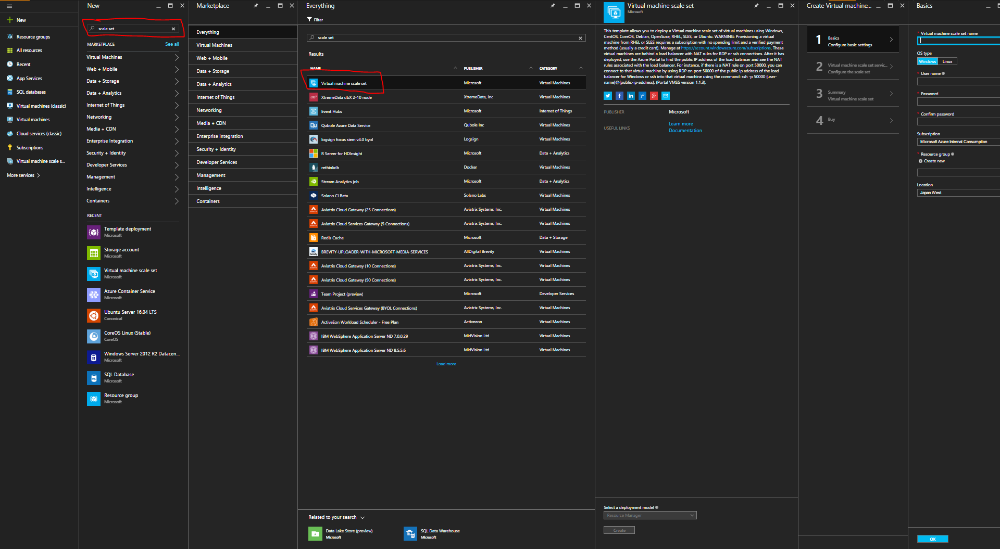
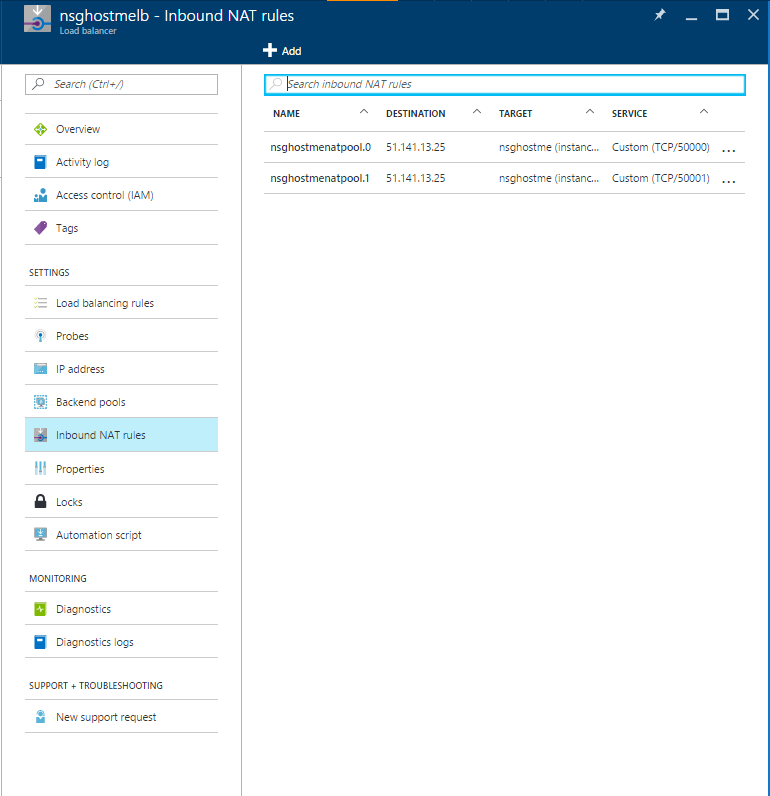

<properties
	pageTitle="Scale sets CLI portal create | Microsoft Azure"
	description="Deploy scale sets using Azure portal."
	keywords="virtual machine scale sets" 
	services="virtual-machine-scale-sets"
	documentationCenter=""
	authors="gatneil"
	manager="madhana"
	editor="tysonn"
	tags="azure-resource-manager" />

<tags
	ms.service="virtual-machine"
	ms.workload="infrastructure-services"
	ms.tgt_pltfrm="vm"
	ms.devlang="na"
	ms.topic="article"
	ms.date="09/15/2016"
	ms.author="gatneil"/>

# Create a scale set using the Azure Portal

This tutorial shows you how easy it is to create a Virtual Machine Scale Set in just a few minutes, by using the Azure portal. If you don't have an Azure subscription, create a [free account](https://azure.microsoft.com/free/) before you begin.

## Choose the VM image from the marketplace

From the portal, you can easily deploy a scale set with CentOS, CoreOS, Debian, Open Suse, Red Hat Enterprise Linux, SUSE Linux Enterprise Server, Ubuntu Server, or Windows Server images.

First, navigate to the [Azure portal](https://portal.azure.com) in a web browser. Click `New`, search for `scale set`, then select the `Virtual machine scale set` entry:

## Create the Windows virtual machine

Now you can use the default settings and quickly create the virtual machine.

* On the `Basics` blade, enter a name for the scale set. This name becomes the base of the FQDN of the load balancer in front of the scale set, so make sure the name is unique across all of Azure.

* Select your desired OS type, enter your desired username, and select which authentication type you prefer. If you choose a password, it must be at least 12 characters long and meet three out of the four following complexity requirements: one lower case character, one upper case character, one number, and one special character. See more about [username and password requirements](../virtual-machines/virtual-machines-windows-faq.md#what-are-the-username-requirements-when-creating-a-vm). If you choose `SSH public key`, be sure to only paste in your public key, NOT your private key:

* Enter your desired resource group name and location, then click `OK`.

* On the `Virtual machine scale set service settings` blade: enter your desired domain name label (the base of the FQDN for the load balancer in front of the scale set). This label must be unique across all of Azure.

* Choose your desired operating system disk image, instance count, and machine size.

* Enable or disable autoscale and configure if enabled:

* On the `Summary` blade, once validation is done, click `OK`.

* Finally, on the `Purchase` blade, click `Purchase` to start the scale set deployment.

## Connect to a VM in the Scale Set

Once your scale set is deployed, navigate to the `Inbound NAT Rules` tab of the load balancer for the scale set:

You can connect to each VM in the scale set using these NAT rules. For instance, for a Windows scale set, if there is a NAT rule on incoming port 50000, you could connect to that machine via RDP on `<load-balancer-ip-address>:50000`. For a Linux scale set, you would connect using the command `ssh -p 50000 <username>@<load-balancer-ip-address>`.

## Next steps

For documentation on how to deploy scale sets from the CLI, see [this documentation](./virtual-machine-scale-sets-cli-quick-create.md).

For documentation on how to deploy scale sets from Powershell, see [this documentation](./virtual-machine-scale-sets-windows-create.md).

For documentation on how to deploy scale sets from Visual Studio, see [this documentation](./virtual-machine-scale-sets-vs-create.md).

For general documentation, check out the [documentation overview page for scale sets](./virtual-machine-scale-sets-overview.md).

For general information, check out the [main landing page for scale sets](https://azure.microsoft.com/services/virtual-machine-scale-sets/).

