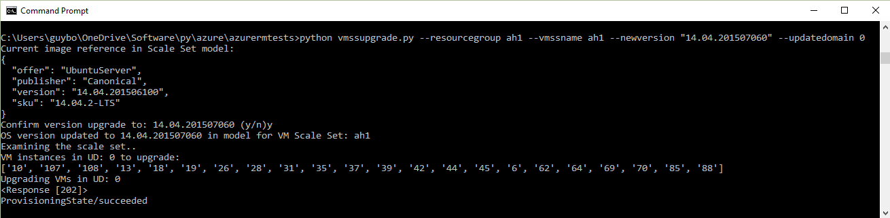
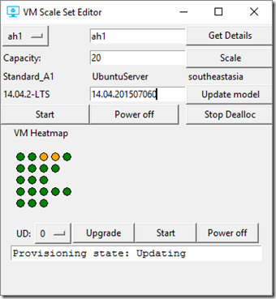

# Upgrade a virtual machine scale set
This article describes how you can roll out an OS update to an Azure virtual machine scale set without any downtime. In this context, an OS update involves changing the version or SKU of the OS or changing the URI of a custom image. Updating without downtime means updating virtual machines one at a time or in groups (such as one fault domain at a time) rather than all at once. By doing so, any virtual machines that are not being upgraded can keep running.

To avoid ambiguity, let’s distinguish four types of OS update you might want to perform:

* Changing the version or SKU of a platform image. For example, changing Ubuntu 14.04.2-LTS version from 14.04.201506100 to 14.04.201507060, or changing the Ubuntu 15.10/latest SKU to 16.04.0-LTS/latest. This scenario is covered in this article.
* Changing the URI that points to a new version of a custom image you built (**properties** > **virtualMachineProfile** > **storageProfile** > **osDisk** > **image** > **uri**). This scenario is covered in this article.
* Changing the image reference of a scale set that was created using Azure Managed Disks.
* Patching the OS from within a virtual machine (examples of this include installing a security patch and running Windows Update). This scenario is supported but not covered in this article.

Virtual machine scale sets that are deployed as part of an [Azure Service Fabric](https://azure.microsoft.com/services/service-fabric/) cluster are not covered here. See [Patch Windows OS in your Service Fabric cluster](https://docs.microsoft.com/en-us/azure/service-fabric/service-fabric-patch-orchestration-application) for more information about patching Service Fabric.

The basic sequence for changing the OS version/SKU of a platform image or the URI of a custom image looks as follows:

1. Get the virtual machine scale set model.
2. Change the version, SKU, image reference, or URI value in the model.
3. Update the model.
4. Do a *manualUpgrade* call on the virtual machines in the scale set. This step is only relevant if *upgradePolicy* is set to **Manual** in your scale set. If it is set to **Automatic**, all the virtual machines are upgraded at once, thus causing downtime.

With this information in mind, let’s see how you could update the version of a scale set in PowerShell, and by using the REST API. These examples cover the case of a platform image, but this article provides enough information for you to adapt this process to a custom image.

## PowerShell
This example updates a Windows virtual machine scale set (creating to the new version 4.0.20160229. After updating the model, it does an update one virtual machine instance at a time.

```powershell
$rgname = "myrg"
$vmssname = "myvmss"
$newversion = "4.0.20160229"
$instanceid = "1"

# get the VMSS model
$vmss = Get-AzureRmVmss -ResourceGroupName $rgname -VMScaleSetName $vmssname

# set the new version in the model data
$vmss.virtualMachineProfile.storageProfile.imageReference.version = $newversion

# update the virtual machine scale set model
Update-AzureRmVmss -ResourceGroupName $rgname -Name $vmssname -VirtualMachineScaleSet $vmss

# now start updating instances
Update-AzureRmVmssInstance -ResourceGroupName $rgname -VMScaleSetName $vmssname -InstanceId $instanceId
```

If you are updating the URI for a custom image instead of changing a platform image version, replace the “set the new version” line with a command that will update the source image URI. For example, if the scale set was created without using Azure Managed Disks, the update would look like this:

```powershell
# set the new version in the model data
$vmss.virtualMachineProfile.storageProfile.osDisk.image.uri= $newURI
```

If a custom image based scale set was created using Azure Managed Disks, then the image reference would be updated. For example:

```powershell
# set the new version in the model data
$vmss.virtualMachineProfile.storageProfile.imageReference.id = $newImageReference
```

## The REST API
Here are a couple of Python examples that use the Azure REST API to roll out an OS version update. Both use the lightweight [azurerm](https://pypi.python.org/pypi/azurerm) library of Azure REST API wrapper functions to do a GET on the scale set model, followed by a PUT with an updated model. They also look at virtual machine instances views to identify the virtual machines by update domain.

### Vmssupgrade
 [Vmssupgrade](https://github.com/gbowerman/vmsstools) is a Python script that's used to roll out an OS upgrade to a running virtual machine scale set one update domain at a time.



This script lets you choose specific virtual machines to update or specify an update domain. It supports changing a platform image version or changing the URI of a custom image.

### Vmsseditor
[Vmsseditor](https://github.com/gbowerman/vmssdashboard) is a general-purpose editor for virtual machine scale sets that shows virtual machine status as a heatmap where one row represents one update domain. Among other things, you can update the model for a scale set with a new version, SKU, or custom image URI, and then pick fault domains to upgrade. When you do so, all the virtual machines in that update domain are upgraded to the new model. Alternatively, you can do a rolling upgrade based on the batch size of your choice.  

The following screenshot shows a model of a scale set for Ubuntu 14.04-2LTS version 14.04.201507060. Many more options have been added to this tool since this screenshot was taken.


After you click **Upgrade** and then **Get Details**, virtual machines in UD 0 start to update.



