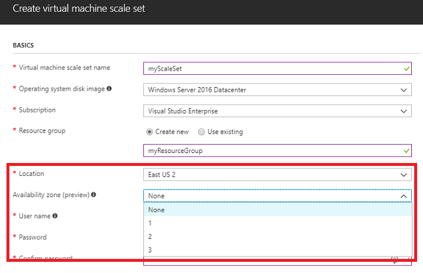

# Create a virtual machine scale set that uses Availability Zones (Preview)
To protect your virtual machine scale sets from datacenter-level failures, you can create a scale set across Availability Zones. Azure regions that support Availability Zones have a minimum of three separate zones, each with their own independent power source, network, and cooling. For more information, see [Overview of Availability Zones](../availability-zones/az-overview.md).

[!INCLUDE [availability-zones-preview-statement.md](../../includes/availability-zones-preview-statement.md)]


## Single-zone and zone-redundant scale sets
When you deploy a virtual machine scale set, you can choose to use a single Availability Zone in a region, or multiple zones.

When you create a scale set in a single zone, you control which zone all those VM instances run in, and the scale set is managed and autoscales only within that zone. A zone-redundant scale set lets you create a single scale set that spans multiple zones. As VM instances are created, by default they are evenly balanced across zones. Should an interruption occur in one of the zones, a scale set does not automatically scale out to increase capacity. A best practice would be to configure autoscale rules based on CPU or memory usage. The autoscale rules would allow the scale set to respond to a loss of the VM instances in that one zone by scaling out new instances in the remaining operational zones.

To use Availability Zones, your scale set must be created in a [supported Azure region](../availability-zones/az-overview.md#regions-that-support-availability-zones). You also need to [register for the Availability Zones preview](http://aka.ms/azenroll). You can create a scale set that uses Availability Zones with one of the following methods:

- [Azure portal](#use-the-azure-portal)
- [Azure CLI 2.0](#use-the-azure-cli-20)
- [Azure PowerShell](#use-azure-powershell)
- [Azure Resource Manager templates](#use-azure-resource-manager-templates)


## Use the Azure portal
The process to create a scale set that uses an Availability Zone is the same as detailed in the [getting started article](virtual-machine-scale-sets-create-portal.md). Make sure that you have [registered for the Availability Zones preview](http://aka.ms/azenroll). When you select a supported Azure region, you can create a scale set in one of the available zones, as shown in the following example:



The scale set and supporting resources, such as the Azure load balancer and public IP address, are created in the single zone that you specify.


## Use the Azure CLI 2.0
The process to create a scale set that uses an Availability Zone is the same as detailed in the [getting started article](virtual-machine-scale-sets-create-cli.md). To use Availability Zones, you must create your scale set in a supported Azure region, and have [registered for the Availability Zones preview](http://aka.ms/azenroll).

Add the `--zones` parameter to the [az vmss create](/cli/azure/vmss#az_vmss_create) command and specify which zone to use (such as zone *1*, *2*, or *3*). The following example creates a single-zone scale set named *myScaleSet* in zone *1*:

```azurecli
az vmss create \
    --resource-group myResourceGroup \
    --name myScaleSet \
    --image UbuntuLTS \
    --upgrade-policy-mode automatic \
    --admin-username azureuser \
    --generate-ssh-keys \
    --zones 1
```
For a complete example of a single-zone scale set and network resources, see [this sample CLI script](https://github.com/Azure/azure-docs-cli-python-samples/blob/master/virtual-machine-scale-sets/create-single-availability-zone/create-single-availability-zone.sh.)

### Zone-redundant scale set
To create a zone-redundant scale set, you use a *Standard* SKU public IP address and load balancer. For enhanced redundancy, the *Standard* SKU creates zone-redundant network resources. For more information, see [Azure Load Balancer Standard overview](../load-balancer/load-balancer-standard-overview.md). The first time that you create a zone-redundant scale set or load balancer, you must complete the following steps to register your account for these preview features.

1. Register your account for the zone-redundant scale set and network features with [az feature register](/cli/azure/feature#az_feature_register) as follows:

    ```azurecli
    az feature register --name MultipleAvailabilityZones --namespace Microsoft.Compute
    az feature register --name AllowLBPreview --namespace Microsoft.Network
    ```
    
2. It may take a few minutes to register for the features. You can check on the status of the operation with [az feature show](/cli/azure/feature#az_feature_show):

    ```azurecli
    az feature show --name MultipleAvailabilityZones --namespace Microsoft.Compute
    az feature show --name AllowLBPreview --namespace Microsoft.Network
    ```

    The following example shows the desired status of feature as *Registered*:
    
    ```json
    "properties": {
          "state": "Registered"
       },
    ```

3. Once both the zone-redundant scale set and network resources report as *Registered*, re-register the *Compute* and *Network* providers with [az provider register](/cli/azure/provider#az_provider_register) as follows:

    ```azurecli
    az provider register --namespace Microsoft.Compute
    az provider register --namespace Microsoft.Network
    ```

To create a zone-redundant scale set, specify multiple zones with the `--zones` parameter. The following example creates a zone-redundant scale set named *myScaleSet* across zones *1,2,3*:

```azurecli
az vmss create \
    --resource-group myResourceGroup \
    --name myScaleSet \
    --image UbuntuLTS \
    --upgrade-policy-mode automatic \
    --admin-username azureuser \
    --generate-ssh-keys \
    --zones {1,2,3}
```

It takes a few minutes to create and configure all the scale set resources and VMs in the zone(s) that you specify. For a complete example of a zone-redundant scale set and network resources, see [this sample CLI script](https://github.com/Azure/azure-docs-cli-python-samples/blob/master/virtual-machine-scale-sets/create-zone-redundant-scale-set/create-zone-redundant-scale-set.sh)


## Use Azure PowerShell
The process to create a scale set that uses an Availability Zone is the same as detailed in the [getting started article](virtual-machine-scale-sets-create-powershell.md). To use Availability Zones, you must create your scale set in a supported Azure region, and have [registered for the Availability Zones preview](http://aka.ms/azenroll). Add the `-Zone` parameter to the [New-AzureRmVmssConfig](/powershell/module/azurerm.compute/new-azurermvmssconfig) command and specify which zone to use (such as zone *1*, *2*, or *3*). 

The following example creates a single-zone scale set config named *vmssConfig* in *East US 2* zone *1*:

```powershell
$vmssConfig = New-AzureRmVmssConfig `
    -Location "East US 2" `
    -SkuCapacity 2 `
    -SkuName "Standard_DS2" `
    -UpgradePolicyMode Automatic `
    -Zone "1"
```

For a complete example of a single-zone scale set and network resources, see [this sample PowerShell script](https://github.com/Azure/azure-docs-powershell-samples/blob/master/virtual-machine-scale-sets/create-single-availability-zone/create-single-availability-zone.ps1)

### Zone-redundant scale set
To create a zone-redundant scale set, you use a *Standard* SKU public IP address and load balancer. For enhanced redundancy, the *Standard* SKU creates zone-redundant network resources. For more information, see [Azure Load Balancer Standard overview](../load-balancer/load-balancer-standard-overview.md). The first time that you create a zone-redundant scale set or load balancer, you must complete the following steps to register your account for these preview features.

1. Register your account for the zone-redundant scale set and network features with [Register-AzureRmProviderFeature](/powershell/module/azurerm.resources/register-azurermproviderfeature) as follows:

    ```powershell
    Register-AzureRmProviderFeature -FeatureName MultipleAvailabilityZones -ProviderNamespace Microsoft.Compute
    Register-AzureRmProviderFeature -FeatureName AllowLBPreview -ProviderNamespace Microsoft.Network
    ```
    
2. It may take a few minutes to register for the features. You can check on the status of the operation with [Get-AzureRmProviderFeature](/powershell/module/AzureRM.Resources/Get-AzureRmProviderFeature):

    ```powershell
    Get-AzureRmProviderFeature -FeatureName MultipleAvailabilityZones -ProviderNamespace Microsoft.Compute 
    Get-AzureRmProviderFeature -FeatureName AllowLBPreview -ProviderNamespace Microsoft.Network
    ```

    The following example shows the desired status of feature as *Registered*:
    
    ```powershell
    RegistrationState
    -----------------
    Registered
    ```

3. Once both the zone-redundant scale set and network resources report as *Registered*, re-register the *Compute* and *Network* providers with [Register-AzureRmResourceProvider](/powershell/module/AzureRM.Resources/Register-AzureRmResourceProvider) as follows:

    ```powershell
    Register-AzureRmResourceProvider -ProviderNamespace Microsoft.Compute
    Register-AzureRmResourceProvider -ProviderNamespace Microsoft.Network
    ```

To create a zone-redundant scale set, specify multiple zones with the `-Zone` parameter. The following example creates a zone-redundant scale set config named *myScaleSet* across *East US 2* zones *1, 2, 3*:

```powershell
$vmssConfig = New-AzureRmVmssConfig `
    -Location "East US 2" `
    -SkuCapacity 2 `
    -SkuName "Standard_DS2" `
    -UpgradePolicyMode Automatic `
    -Zone "1", "2", "3"
```

If you create a public IP address with [New-AzureRmPublicIpAddress](/powershell/module/azurerm.network/new-azurermpublicipaddress) or a load balancer with [New-AzureRmLoadBalancer](/powershell/module/AzureRM.Network/New-AzureRmLoadBalancer), specify the *-SKU "Standard"* to create zone-redundant network resources. You also need to create a Network Security Group and rules to permit any traffic. For more information, see [Azure Load Balancer Standard overview](../load-balancer/load-balancer-standard-overview.md).

For a complete example of a zone-redundant scale set and network resources, see [this sample PowerShell script](https://github.com/Azure/azure-docs-powershell-samples/blob/master/virtual-machine-scale-sets/create-zone-redundant-scale-set/create-zone-redundant-scale-set.ps1)


## Use Azure Resource Manager templates
The process to create a scale set that uses an Availability Zone is the same as detailed in the getting started article for [Linux](virtual-machine-scale-sets-create-template-linux.md) or [Windows](virtual-machine-scale-sets-create-template-windows.md). To use Availability Zones, you must create your scale set in a supported Azure region, and have [registered for the Availability Zones preview](http://aka.ms/azenroll). Add the `zones` property to the *Microsoft.Compute/virtualMachineScaleSets* resource type in your template and specify which zone to use (such as zone *1*, *2*, or *3*).

The following example creates a Linux single-zone scale set named *myScaleSet* in *East US 2* zone *1*:

```json
{
  "type": "Microsoft.Compute/virtualMachineScaleSets",
  "name": "myScaleSet",
  "location": "East US 2",
  "apiVersion": "2017-12-01",
  "zones": ["1"],
  "sku": {
    "name": "Standard_A1",
    "capacity": "2"
  },
  "properties": {
    "upgradePolicy": {
      "mode": "Automatic"
    },
    "virtualMachineProfile": {
      "storageProfile": {
        "osDisk": {
          "caching": "ReadWrite",
          "createOption": "FromImage"
        },
        "imageReference":  {
          "publisher": "Canonical",
          "offer": "UbuntuServer",
          "sku": "16.04-LTS",
          "version": "latest"
        }
      },
      "osProfile": {
        "computerNamePrefix": "myvmss",
        "adminUsername": "azureuser",
        "adminPassword": "P@ssw0rd!"
      }
    }
  }
}
```

For a complete example of a single-zone scale set and network resources, see [this sample Resource Manager template](https://github.com/Azure/vm-scale-sets/blob/master/preview/zones/singlezone.json)

### Zone-redundant scale set
To create a zone-redundant scale set, specify multiple values in the `zones` property for the *Microsoft.Compute/virtualMachineScaleSets* resource type. The following example creates a zone-redundant scale set named *myScaleSet* across *East US 2* zones *1,2,3*:

```json
{
  "type": "Microsoft.Compute/virtualMachineScaleSets",
  "name": "myScaleSet",
  "location": "East US 2",
  "apiVersion": "2017-12-01",
  "zones": [
        "1",
        "2",
        "3"
      ]
}
```

If you create a public IP address or a load balancer, specify the *"sku": { "name": "Standard" }"* property to create zone-redundant network resources. You also need to create a Network Security Group and rules to permit any traffic. For more information, see [Azure Load Balancer Standard overview](../load-balancer/load-balancer-standard-overview.md).

For a complete example of a zone-redundant scale set and network resources, see [this sample Resource Manager template](https://github.com/Azure/vm-scale-sets/blob/master/preview/zones/multizone.json)


## Next steps
Now that you have created a scale set in an Availability Zone, you can learn how to [Deploy applications on virtual machine scale sets](virtual-machine-scale-sets-deploy-app.md) or [Use autoscale with virtual machine scale sets](virtual-machine-scale-sets-autoscale-overview.md).
