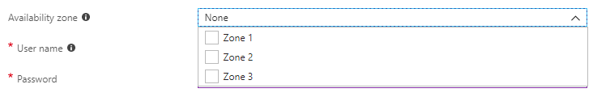

# Create a virtual machine scale set that uses Availability Zones

To protect your virtual machine scale sets from datacenter-level failures, you can create a scale set across Availability Zones. Azure regions that support Availability Zones have a minimum of three separate zones, each with their own independent power source, network, and cooling. For more information, see [Overview of Availability Zones](../availability-zones/az-overview.md).

## Availability considerations

When you deploy a scale set into one or more zones as of API version *2017-12-01*, you have the option to deploy with "max spreading" or "static 5 fault domain spreading". With max spreading, the scale set spreads your VMs across as many fault domains as possible within each zone. This spreading could be across greater or fewer than five fault domains per zone. With "static 5 fault domain spreading", the scale set spreads your VMs across exactly five fault domains per zone. If the scale set cannot find five distinct fault domains per zone to satisfy the allocation request, the request fails.

**We recommend deploying with max spreading for most workloads**, as this approach provides the best spreading in most cases. If you need replicas to be spread across distinct hardware isolation units, we recommend spreading across Availability Zones and utilize max spreading within each zone.

With max spreading, you only see one fault domain in the scale set VM instance view and in the instance metadata regardless of how many fault domains the VMs are spread across. The spreading within each zone is implicit.

To use max spreading, set *platformFaultDomainCount* to *1*. To use static five fault domain spreading, set *platformFaultDomainCount* to *5*. In API version *2017-12-01*, *platformFaultDomainCount* defaults to *1* for single-zone and cross-zone scale sets. Currently, only static five fault domain spreading is supported for regional (non-zonal) scale sets.

### Placement groups

When you deploy a scale set, you also have the option to deploy with a single [placement group](./virtual-machine-scale-sets-placement-groups.md) per Availability Zone, or with multiple per zone. For regional (non-zonal) scale sets, the choice is to have a single placement group in the region or to have multiple in the region. For most workloads, we recommend multiple placement groups, which allows for greater scale. In API version *2017-12-01*, scale sets default to multiple placement groups for single-zone and cross-zone scale sets, but they default to single placement group for regional (non-zonal) scale sets.

> [!NOTE]
> If you use max spreading, you must use multiple placement groups.

### Zone balancing

Finally, for scale sets deployed across multiple zones, you also have the option of choosing "best effort zone balance" or "strict zone balance". A scale set is considered "balanced" if each zone the same number of VMs or +\\- 1 VM in all other zones for the scale set. For example:

- A scale set with 2 VMs in zone 1, 3 VMs in zone 2, and 3 VMs in zone 3 is considered balanced. There is only one zone with a different VM count and it is only 1 less than the other zones. 
- A scale set with 1 VM in zone 1, 3 VMs in zone 2, and 3 VMs in zone 3 is considered unbalanced. Zone 1 has 2 fewer VMs than zones 2 and 3.

It's possible that VMs in the scale set are successfully created, but extensions on those VMs fail to deploy. These VMs with extension failures are still counted when determining if a scale set is balanced. For instance, a scale set with 3 VMs in zone 1, 3 VMs in zone 2, and 3 VMs in zone 3 is considered balanced even if all extensions failed in zone 1 and all extensions succeeded in zones 2 and 3.

With best-effort zone balance, the scale set attempts to scale in and out while maintaining balance. However, if for some reason this is not possible (for example, if one zone goes down, the scale set cannot create a new VM in that zone), the scale set allows temporary imbalance to successfully scale in or out. On subsequent scale-out attempts, the scale set adds VMs to zones that need more VMs for the scale set to be balanced. Similarly, on subsequent scale in attempts, the scale set removes VMs from zones that need fewer VMs for the scale set to be balanced. With "strict zone balance", the scale set fails any attempts to scale in or out if doing so would cause unbalance.

To use best-effort zone balance, set *zoneBalance* to *false*. This setting is the default in API version *2017-12-01*. To use strict zone balance, set *zoneBalance* to *true*.

## Single-zone and zone-redundant scale sets

When you deploy a virtual machine scale set, you can choose to use a single Availability Zone in a region, or multiple zones.

When you create a scale set in a single zone, you control which zone all those VM instances run in, and the scale set is managed and autoscales only within that zone. A zone-redundant scale set lets you create a single scale set that spans multiple zones. As VM instances are created, by default they are evenly balanced across zones. Should an interruption occur in one of the zones, a scale set does not automatically scale out to increase capacity. A best practice would be to configure autoscale rules based on CPU or memory usage. The autoscale rules would allow the scale set to respond to a loss of the VM instances in that one zone by scaling out new instances in the remaining operational zones.

To use Availability Zones, your scale set must be created in a [supported Azure region](../availability-zones/az-overview.md#services-support-by-region). You can create a scale set that uses Availability Zones with one of the following methods:

- [Azure portal](#use-the-azure-portal)
- Azure CLI
- [Azure PowerShell](#use-azure-powershell)
- [Azure Resource Manager templates](#use-azure-resource-manager-templates)

## Use the Azure portal

The process to create a scale set that uses an Availability Zone is the same as detailed in the [getting started article](quick-create-portal.md). When you select a supported Azure region, you can create a scale set in one or more available zones, as shown in the following example:



The scale set and supporting resources, such as the Azure load balancer and public IP address, are created in the single zone that you specify.

## Use the Azure CLI

The process to create a scale set that uses an Availability Zone is the same as detailed in the [getting started article](quick-create-cli.md). To use Availability Zones, you must create your scale set in a supported Azure region.

Add the `--zones` parameter to the [az vmss create](/cli/azure/vmss) command and specify which zone to use (such as zone *1*, *2*, or *3*). The following example creates a single-zone scale set named *myScaleSet* in zone *1*:

```azurecli
az vmss create \
    --resource-group myResourceGroup \
    --name myScaleSet \
    --image UbuntuLTS \
    --upgrade-policy-mode automatic \
    --admin-username azureuser \
    --generate-ssh-keys \
    --zones 1
```

For a complete example of a single-zone scale set and network resources, see [this sample CLI script](https://github.com/Azure/azure-docs-cli-python-samples/blob/master/virtual-machine-scale-sets/create-single-availability-zone/create-single-availability-zone.sh)

### Zone-redundant scale set

To create a zone-redundant scale set, you use a *Standard* SKU public IP address and load balancer. For enhanced redundancy, the *Standard* SKU creates zone-redundant network resources. For more information, see [Azure Load Balancer Standard overview](../load-balancer/load-balancer-standard-overview.md) and [Standard Load Balancer and Availability Zones](../load-balancer/load-balancer-standard-availability-zones.md).

To create a zone-redundant scale set, specify multiple zones with the `--zones` parameter. The following example creates a zone-redundant scale set named *myScaleSet* across zones *1,2,3*:

```azurecli
az vmss create \
    --resource-group myResourceGroup \
    --name myScaleSet \
    --image UbuntuLTS \
    --upgrade-policy-mode automatic \
    --admin-username azureuser \
    --generate-ssh-keys \
    --zones 1 2 3
```

It takes a few minutes to create and configure all the scale set resources and VMs in the zone(s) that you specify. For a complete example of a zone-redundant scale set and network resources, see [this sample CLI script](https://github.com/Azure/azure-docs-cli-python-samples/blob/master/virtual-machine-scale-sets/create-zone-redundant-scale-set/create-zone-redundant-scale-set.sh)

## Use Azure PowerShell

To use Availability Zones, you must create your scale set in a supported Azure region. Add the `-Zone` parameter to the [New-AzVmssConfig](/powershell/module/az.compute/new-azvmssconfig) command and specify which zone to use (such as zone *1*, *2*, or *3*).

The following example creates a single-zone scale set named *myScaleSet* in *East US 2* zone *1*. The Azure network resources for virtual network, public IP address, and load balancer are automatically created. When prompted, provide your own desired administrative credentials for the VM instances in the scale set:

```powershell
New-AzVmss `
  -ResourceGroupName "myResourceGroup" `
  -Location "EastUS2" `
  -VMScaleSetName "myScaleSet" `
  -VirtualNetworkName "myVnet" `
  -SubnetName "mySubnet" `
  -PublicIpAddressName "myPublicIPAddress" `
  -LoadBalancerName "myLoadBalancer" `
  -UpgradePolicy "Automatic" `
  -Zone "1"
```

### Zone-redundant scale set

To create a zone-redundant scale set, specify multiple zones with the `-Zone` parameter. The following example creates a zone-redundant scale set named *myScaleSet* across *East US 2* zones *1, 2, 3*. The zone-redundant Azure network resources for virtual network, public IP address, and load balancer are automatically created. When prompted, provide your own desired administrative credentials for the VM instances in the scale set:

```powershell
New-AzVmss `
  -ResourceGroupName "myResourceGroup" `
  -Location "EastUS2" `
  -VMScaleSetName "myScaleSet" `
  -VirtualNetworkName "myVnet" `
  -SubnetName "mySubnet" `
  -PublicIpAddressName "myPublicIPAddress" `
  -LoadBalancerName "myLoadBalancer" `
  -UpgradePolicy "Automatic" `
  -Zone "1", "2", "3"
```

## Use Azure Resource Manager templates

The process to create a scale set that uses an Availability Zone is the same as detailed in the getting started article for [Linux](quick-create-template-linux.md) or [Windows](quick-create-template-windows.md). To use Availability Zones, you must create your scale set in a supported Azure region. Add the `zones` property to the *Microsoft.Compute/virtualMachineScaleSets* resource type in your template and specify which zone to use (such as zone *1*, *2*, or *3*).

The following example creates a Linux single-zone scale set named *myScaleSet* in *East US 2* zone *1*:

```json
{
  "type": "Microsoft.Compute/virtualMachineScaleSets",
  "name": "myScaleSet",
  "location": "East US 2",
  "apiVersion": "2017-12-01",
  "zones": ["1"],
  "sku": {
    "name": "Standard_A1",
    "capacity": "2"
  },
  "properties": {
    "upgradePolicy": {
      "mode": "Automatic"
    },
    "virtualMachineProfile": {
      "storageProfile": {
        "osDisk": {
          "caching": "ReadWrite",
          "createOption": "FromImage"
        },
        "imageReference":  {
          "publisher": "Canonical",
          "offer": "UbuntuServer",
          "sku": "16.04-LTS",
          "version": "latest"
        }
      },
      "osProfile": {
        "computerNamePrefix": "myvmss",
        "adminUsername": "azureuser",
        "adminPassword": "P@ssw0rd!"
      }
    }
  }
}
```

For a complete example of a single-zone scale set and network resources, see [this sample Resource Manager template](https://github.com/Azure/vm-scale-sets/blob/master/preview/zones/singlezone.json)

### Zone-redundant scale set

To create a zone-redundant scale set, specify multiple values in the `zones` property for the *Microsoft.Compute/virtualMachineScaleSets* resource type. The following example creates a zone-redundant scale set named *myScaleSet* across *East US 2* zones *1,2,3*:

```json
{
  "type": "Microsoft.Compute/virtualMachineScaleSets",
  "name": "myScaleSet",
  "location": "East US 2",
  "apiVersion": "2017-12-01",
  "zones": [
        "1",
        "2",
        "3"
      ]
}
```

If you create a public IP address or a load balancer, specify the *"sku": { "name": "Standard" }"* property to create zone-redundant network resources. You also need to create a Network Security Group and rules to permit any traffic. For more information, see [Azure Load Balancer Standard overview](../load-balancer/load-balancer-standard-overview.md) and [Standard Load Balancer and Availability Zones](../load-balancer/load-balancer-standard-availability-zones.md).

For a complete example of a zone-redundant scale set and network resources, see [this sample Resource Manager template](https://github.com/Azure/vm-scale-sets/blob/master/preview/zones/multizone.json)

## Next steps

Now that you have created a scale set in an Availability Zone, you can learn how to [Deploy applications on virtual machine scale sets](tutorial-install-apps-cli.md) or [Use autoscale with virtual machine scale sets](tutorial-autoscale-cli.md).
