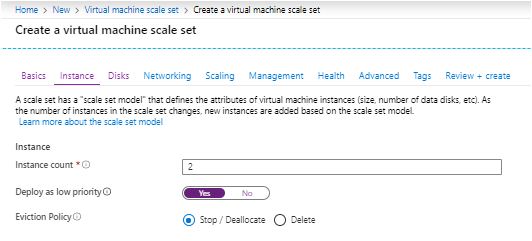

# Low-priority VMs on scale sets (preview)

Using low-priority VMs on scale sets allows you to take advantage of our unutilized capacity at a significant cost savings. At any point in time when Azure needs the capacity back, the Azure infrastructure will evict low-priority VMs. Therefore, low-priority VMs are great for workloads that can handle interruptions like batch processing jobs, dev/test environments, large compute workloads, and more.

The amount of available unutilized capacity can vary based on size, region, time of day, and more. When deploying low-priority VMs on scale sets, Azure will allocate the VMs if there is capacity available, but there is no SLA for these VMs. A low-priority scale set is deployed in a single fault domain and offers no high availability guarantees.

## Eviction Policy

When creating low-priority scale sets, you can set the eviction policy to *Deallocate* (default) or *Delete*. 

The *Deallocate* policy moves your evicted VMs to the stopped-deallocated state allowing you to redeploy evicted instances. However, there is no guarantee that the allocation will succeed. The deallocated VMs will count against your scale set instance quota and you will be charged for your underlying disks. 

If you would like your VMs in your low-priority scale set to be deleted when they are evicted, you can set the eviction policy to *delete*. With the eviction policy set to delete, you can create new VMs by increasing the scale set instance count property. The evicted VMs are deleted together with their underlying disks, and therefore you will not be charged for the storage. You can also use the auto-scaling feature of scale sets to automatically try and compensate for evicted VMs, however, there is no guarantee that the allocation will succeed. It is recommended you only use the auto-scale feature on low-priority scale sets when you set the eviction policy to delete to avoid the cost of your disks and hitting quota limits. 

> [!NOTE]
> During preview, you will be able to set your eviction policy by using the [Azure portal](#use-the-azure-portal) and [Azure Resource Manager templates](#use-azure-resource-manager-templates). 

## Deploying low-priority VMs on scale sets

To deploy low-priority VMs on scale sets, you can set the new *Priority* flag to *Low*. All VMs in your scale set will be set to low-priority. To create a scale set with low-priority VMs, use one of the following methods:
- [Azure portal](#use-the-azure-portal)
- [Azure CLI](#use-the-azure-cli-20)
- [Azure PowerShell](#use-azure-powershell)
- [Azure Resource Manager templates](#use-azure-resource-manager-templates)

## Use the Azure portal

The process to create a scale set that uses low-priority VMs is the same as detailed in the [getting started article](quick-create-portal.md). When you are deploying a scale set, you can choose to set the low-priority flag and the eviction policy:


## Use the Azure CLI

The process to create a scale set with low-priority VMs is the same as detailed in the [getting started article](quick-create-cli.md). Just add the '--Priority' parameter to the cli call and set it to *Low* as shown in the example below:

```azurecli
az vmss create \
    --resource-group myResourceGroup \
    --name myScaleSet \
    --image UbuntuLTS \
    --upgrade-policy-mode automatic \
    --admin-username azureuser \
    --generate-ssh-keys \
    --priority Low
```

## Use Azure PowerShell

The process to create a scale set with low-priority VMs is the same as detailed in the [getting started article](quick-create-powershell.md).
Just add the '-Priority' parameter to the [New-AzureRmVmssConfig](/powershell/module/azurerm.compute/new-azurermvmssconfig) and set it to *Low* as shown in the example below:

```powershell
$vmssConfig = New-AzureRmVmssConfig `
    -Location "East US 2" `
    -SkuCapacity 2 `
    -SkuName "Standard_DS2" `
    -UpgradePolicyMode Automatic `
    -Priority "Low"
```

## Use Azure Resource Manager Templates

The process to create a scale set that uses low-priority VMs is the same as detailed in the getting started article for [Linux](quick-create-template-linux.md) or [Windows](quick-create-template-windows.md). Add the 'priority' property to the *Microsoft.Compute/virtualMachineScaleSets/virtualMachineProfile* resource type in your template and specify *Low* as the value. Be sure to use *2018-03-01* API version or higher. 

In order to set the eviction policy to deletion, add the 'evictionPolicy' parameter and set it to *delete*.

The following example creates a Linux low-priority scale set named *myScaleSet* in *West Central US*, which will *delete* the VMs in the scale set on eviction:

```json
{
  "type": "Microsoft.Compute/virtualMachineScaleSets",
  "name": "myScaleSet",
  "location": "East US 2",
  "apiVersion": "2018-03-01",
  "sku": {
    "name": "Standard_DS2_v2",
    "capacity": "2"
  },
  "properties": {
    "upgradePolicy": {
      "mode": "Automatic"
    },
    "virtualMachineProfile": {
       "priority": "Low",
       "evictionPolicy": "delete",
       "storageProfile": {
        "osDisk": {
          "caching": "ReadWrite",
          "createOption": "FromImage"
        },
        "imageReference":  {
          "publisher": "Canonical",
          "offer": "UbuntuServer",
          "sku": "16.04-LTS",
          "version": "latest"
        }
      },
      "osProfile": {
        "computerNamePrefix": "myvmss",
        "adminUsername": "azureuser",
        "adminPassword": "P@ssw0rd!"
      }
    }
  }
}
```
## FAQ

### Can I convert existing scale sets to low-priority scale sets?
No, setting the low-priority flag is only supported at creation time.

### Can I create a scale set with both regular VMs and low-priority VMs?
No, a scale set cannot support more than one priority type.

### How is quota managed for low-priority VMs?
Low-priority VMs and regular VMs share the same quota pool. 

### Can I use autoscale with low-priority scale sets?
Yes, you can set autoscaling rules on your low-priority scale set. If your VMs are evicted, autoscale can try to create new low-priority VMs. Remember, you are not guaranteed this capacity though. 

### Does autoscale work with both eviction policies (deallocate and delete)?
It is recommended that you set your eviction policy to delete when using autoscale. This is because deallocated instances are counted against your capacity count on the scale set. When using autoscale, you will likely hit your target instance count quickly due to the deallocated, evicted instances. 

## Next steps
Now that you have created a scale set with low-priority VMs, try deploying our [auto scale template using low-priority](https://github.com/Azure/vm-scale-sets/tree/master/preview/lowpri).

Check out the [virtual machine scale set pricing page](https://azure.microsoft.com/pricing/details/virtual-machine-scale-sets/linux/) for pricing details.