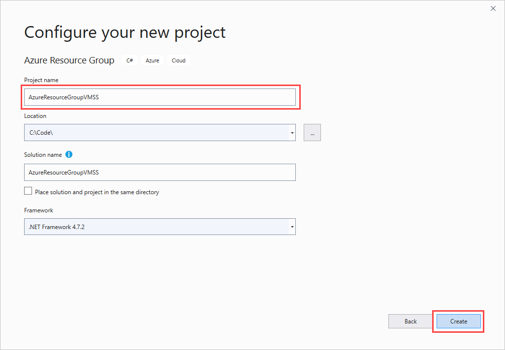
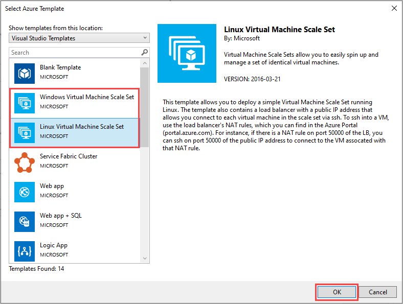
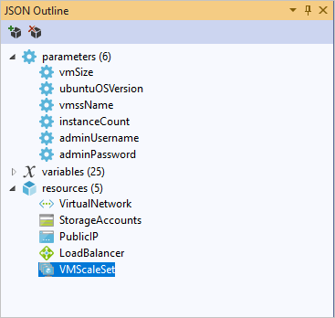
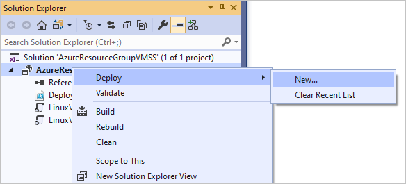
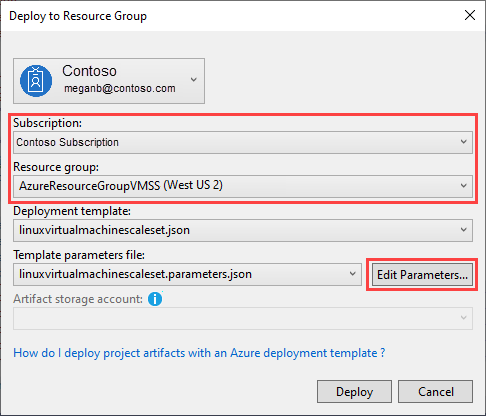
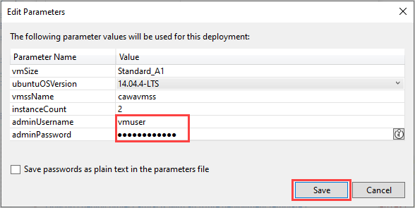
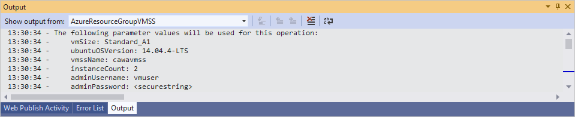
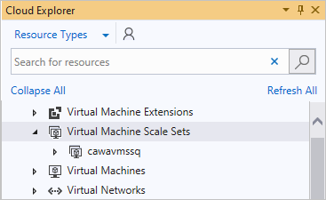

# How to create a Virtual Machine Scale Set with Visual Studio

This article shows you how to deploy an Azure Virtual Machine Scale Set using a Visual Studio Resource Group deployment.

[Azure Virtual Machine Scale Sets](https://azure.microsoft.com/blog/azure-vm-scale-sets-public-preview/) is an Azure Compute resource to deploy and manage a collection of similar virtual machines with autoscale and load balancing. You can provision and deploy Virtual Machine Scale Sets using [Azure Resource Manager Templates](https://github.com/Azure/azure-quickstart-templates). Azure Resource Manager templates can be deployed using Azure CLI, PowerShell, REST and also directly from Visual Studio. Visual Studio provides a set of example templates, which you can deploy as part of an Azure Resource Group deployment project.

Azure Resource Group deployments are a way to group and publish a set of related Azure resources in a single deployment operation. For more information, see [Creating and deploying Azure resource groups through Visual Studio](../vs-azure-tools-resource-groups-deployment-projects-create-deploy.md).

## Prerequisites

To get started deploying Virtual Machine Scale Sets in Visual Studio, you need the following prerequisites:

* Visual Studio 2013 or later
* Azure SDK 2.7, 2.8 or 2.9

>[!NOTE]
>This article uses Visual Studio 2019 with [Azure SDK 2.8](https://azure.microsoft.com/blog/announcing-the-azure-sdk-2-8-for-net/).

## Create a Project  

1. Open Visual Studio and select **Create a new project**.

1. In **Create a new project**, choose **Azure Resource Group** for C# and then select **Next**.

1. In **Configure your new project**, enter a name and select **Create**.

    

1. From the list of templates, choose either the **Windows Virtual Machine Scale Set** or **Linux Virtual Machine Scale Set** template. Select **OK**.

   

After you create your project, **Solution Explorer** contains a PowerShell deployment script, an Azure Resource Manager template, and a parameter file for the Virtual Machine Scale Set.

## Customize your project

Now you can edit the template to customize it for your application's needs. You could add virtual machine extension properties or edit load-balancing rules. By default, the Virtual Machine Scale Set templates are configured to deploy the **AzureDiagnostics** extension, which makes it easy to add autoscale rules. The templates also deploy a load balancer with a public IP address, configured with inbound NAT rules.

The load balancer lets you connect to the virtual machine instances with SSH (Linux) or RDP (Windows). The front-end port range starts at 50000. For Linux, if you SSH to port 50000, load balancing routes you to port 22 of the first virtual machine in the Scale Set. Connecting to port 50001 is routed to port 22 of the second virtual machine, and so on.

 A good way to edit your templates with Visual Studio is to use the **JSON Outline**. You can organize the parameters, variables, and resources. With an understanding of the schema, Visual Studio can point out errors in your template before you deploy it.

## Deploy the project

Deploy the Azure Resource Manager template to create the Virtual Machine Scale Set resource:

1. In **Solution Explorer**, right-click the project and choose **Deploy** > **New**.

    

1. In **Deploy to Resource Group**, choose which subscription to use and select a resource group. You can create a resource group, if necessary.

1. Next, select **Edit Parameters** to enter parameters that are passed to your template.

   

1. Provide the username and password for the operating system. These values are required to create the deployment. If you don't have PowerShell Tools for Visual Studio installed, select **Save passwords** to avoid a hidden PowerShell command prompt, or use [Key Vault support](https://azure.microsoft.com/blog/keyvault-support-for-arm-templates/). Select **Save** to continue.

    

1. In **Deploy to Resource Group**, select **Deploy**. The action runs the **Deploy-AzureResourceGroup.ps1** script. The **Output** window shows the deployment progress.

   

## Explore your Virtual Machine Scale Set 

Select **View** > **Cloud Explorer** to view the new Virtual Machine Scale Set. Use **Refresh All**, if necessary.

**Cloud Explorer** lets you manage Azure resources in Visual Studio while developing applications. You can also view your Virtual Machine Scale Set in the [Azure portal](https://portal.azure.com) and [Azure Resource Explorer](https://resources.azure.com/).

 The portal provides the best way to manage your Azure infrastructure with a web browser. Azure Resource Explorer provides an easy way to explore and debug Azure resources. Azure Resource Explorer offers the instance view and also shows PowerShell commands for the resources you're looking at.

## Next steps

Once you've successfully deployed Virtual Machine Scale Sets through Visual Studio, you can further customize your project to suit your application requirements. For example, configure autoscale by adding an **Insights** resource. You could add infrastructure to your template, such as standalone virtual machines, or deploy applications using the custom script extension. Good example templates can be found in the [Azure Quickstart Templates](https://github.com/Azure/azure-quickstart-templates) GitHub repository. Search for `vmss`.
