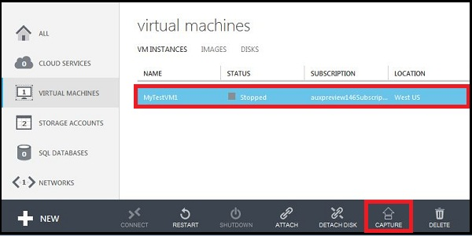
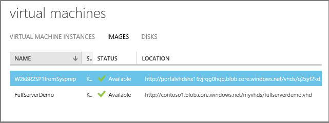

<properties 
	pageTitle="Capture an image of a virtual machine running Windows Server" 
	description="Learn how to capture an image of an Azure virtual machine (VM) running Windows Server 2008 R2." 
	services="virtual-machines" 
	documentationCenter="" 
	authors="KBDAzure" 
	manager="timlt" 
	editor="tysonn"/>

<tags 
	ms.service="virtual-machines" 
	ms.workload="infrastructure-services" 
	ms.tgt_pltfrm="vm-windows" 
	ms.devlang="na" 
	ms.topic="article" 
	ms.date="03/13/2015" 
	ms.author="kathydav"/>

#How to Capture a Windows Virtual Machine to Use as a Template#

This article shows you how to capture an Azure virtual machine running Windows so you can use it like a template to create other virtual machines. This template includes the OS disk and any data disks attached the virtual machine. It doesn't include networking configuration, so you'll need to configure that when you create the other virtual machines that use the template.

Azure treats this template as an image and stores it under **My Images**. This is also where any images you've uploaded are stored. For more information about images, see [About Virtual Machine Images in Azure] [].

##Before You Begin##

These steps assume that you've already created an Azure virtual machine and configured the operating system, including attaching any data disks. If you haven't done this yet, see these instructions:

- [How to Create a Custom Virtual Machine] []
- [How to Attach a Data Disk to a Virtual Machine] []

##Capture the Virtual Machine##

1. Connect to the virtual machine by clicking **Connect** on the command bar. For details, see [How to Log on to a Virtual Machine Running Windows Server] [].

2.	Open a Command Prompt window as an administrator.

3.	Change the directory to `%windir%\system32\sysprep`, and then run sysprep.exe.

4. 	The **System Preparation Tool** dialog box appears. Do the following:

	- In **System Cleanup Action**, select **Enter System Out-of-Box Experience (OOBE)** and make sure that **Generalize** is checked. For more information about using Sysprep, see [How to Use Sysprep: An Introduction][].

	- In **Shutdown Options**, select **Shutdown**.

	- Click **OK**.

	

7.	Sysprep shuts down the virtual machine, which changes the status of the virtual machine in the [Management Portal](http://manage.windowsazure.com) to **Stopped**.

8.	Click **Virtual Machines**, and then select the virtual machine you want to capture.

9.	On the command bar, click **Capture**.

	

	The **Capture the Virtual Machine** dialog box appears.

10.	In **Image Name**, type a name for the new image.

11.	Before you add a Windows Server image to your set of custom images, it must be generalized by running Sysprep as instructed in the previous steps. Click **I have run Sysprep on the virtual machine** to indicate that you have done this.

12.	Click the check mark to capture the image. 

  **NOTE: When you capture an image of a generalized virtual machine, the virtual machine is deleted.**

 The new image is now available under **Images**.
 

##Next Steps##
The image is ready to be used as a template to create virtual machines. To do this, you'll create a custom virtual machine by using the **From Gallery** method and select the image you just created. For instructions, see [How to Create a Custom Virtual Machine] [].

	
[About Virtual Machine Images in Azure]: http://msdn.microsoft.com/library/azure/dn790290.aspx
[How to Create a Custom Virtual Machine]: virtual-machines-create-custom.md
[How to Attach a Data Disk to a Virtual Machine]: storage-windows-attach-disk.md
[How to Log on to a Virtual Machine Running Windows Server]:http://www.windowsazure.com/manage/windows/how-to-guides/log-on-a-windows-vm/
[How to Use Sysprep: An Introduction]:http://technet.microsoft.com/library/bb457073.aspx
[Run Sysprep.exe]: ./media/virtual-machines-capture-image-windows-server/SysprepCommand.png
[Enter Sysprep.exe options]: ./media/virtual-machines-capture-image-windows-server/SysprepGeneral.png
[The virtual machine is stopped]: ./media/virtual-machines-capture-image-windows-server/SysprepStopped.png
[Capture an image of the virtual machine]: ./media/virtual-machines-capture-image-windows-server/CaptureVM.png
[Enter the image name]: ./media/virtual-machines-capture-image-windows-server/Capture.png
[Image capture successful]: ./media/virtual-machines-capture-image-windows-server/CaptureSuccess.png
[Use the captured image]: ./media/virtual-machines-capture-image-windows-server/MyImagesWindows.png
