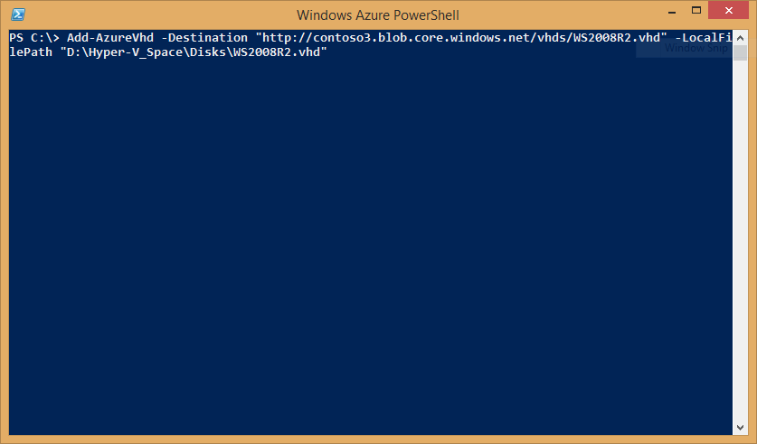
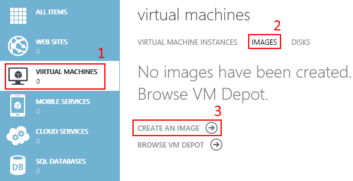
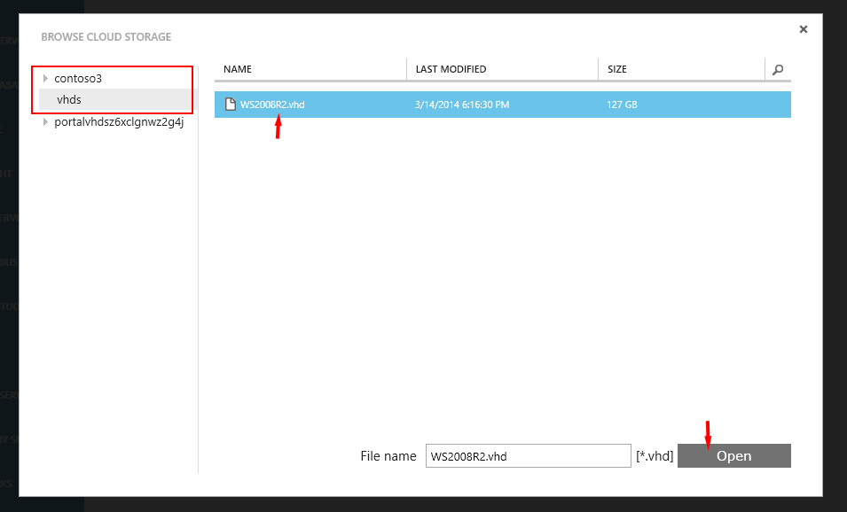
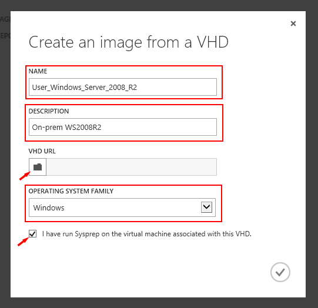
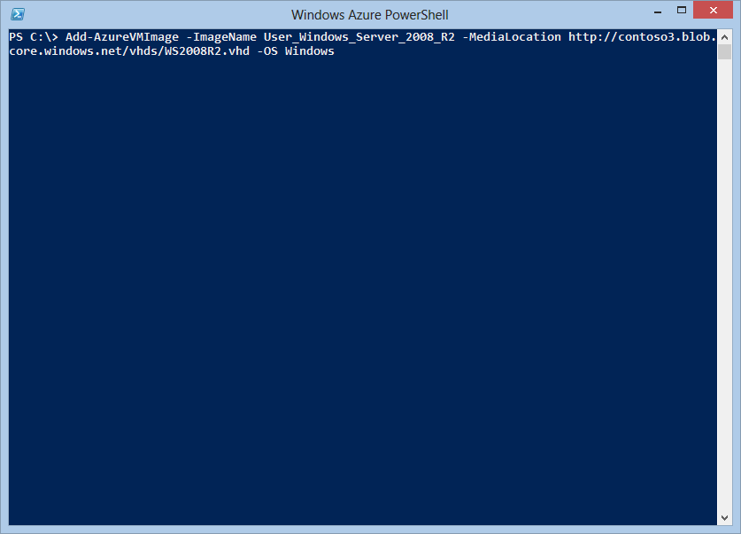

<properties 
	pageTitle="Create and upload a Windows Server VHD to Azure" 
	description="Learn to create and upload a virtual hard disk (VHD) in Azure that has the Windows Server operating system." 
	services="virtual-machines" 
	documentationCenter="" 
	authors="KBDAzure" 
	manager="timlt" 
	editor="tysonn"/>

<tags 
	ms.service="virtual-machines" 
	ms.workload="infrastructure-services" 
	ms.tgt_pltfrm="vm-windows" 
	ms.devlang="na" 
	ms.topic="article" 
	ms.date="04/29/2015" 
	ms.author="kathydav"/>

# Create and upload a Windows Server VHD to Azure#

This article shows you how to upload a virtual hard disk (VHD) with an operating system so you can use it as an image to create virtual machines based on that image. For more information about disks and images in Microsoft Azure, see [About Disks and Images in Azure](http://msdn.microsoft.com/library/azure/jj672979.aspx).

> [AZURE.NOTE] When you create a virtual machine based on an image, you can customize the operating system settings as appropriate for the applications you plan to run on the virtual machine. This configuration is saved for that virtual machine and doesn't affect the image. 

## Prerequisites##

This article assumes you have the following:

1. **An Azure subscription** - If you don't have one, you can [open an Azure account for free](/pricing/free-trial/?WT.mc_id=A261C142F): You get credits you can use to try out paid Azure services, and even after they're used up you can keep the account and use free Azure services, such as Websites. Your credit card will never be charged, unless you explicitly change your settings and ask to be charged. You also can [activate MSDN subscriber benefits](/pricing/member-offers/msdn-benefits-details/?WT.mc_id=A261C142F): Your MSDN subscription gives you credits every month that you can use for paid Azure services.   

2. **Microsoft Azure PowerShell** - You have the Microsoft Azure PowerShell module installed and configured to use your subscription. To download the module, see [Microsoft Azure Downloads](http://azure.microsoft.com/downloads/). A tutorial to install and configure the module is available [here](powershell-install-configure.md). You'll use the [Add-AzureVHD](http://msdn.microsoft.com/library/azure/dn495173.aspx) cmdlet to upload the VHD.

3. **A supported Windows operating system stored in a .vhd file** - You have installed a supported Windows Server operating system to a virtual hard disk. Multiple tools exist to create .vhd files. You can use a virtualization solution such as Hyper-V to create a virtual machine and install the operating system. For instructions, see [Install the Hyper-V Role and Configure a Virtual Machine](http://technet.microsoft.com/library/hh846766.aspx).

> [AZURE.NOTE] The VHDX format is not supported in Microsoft Azure. You can convert the disk to VHD format using Hyper-V Manager or the [Convert-VHD cmdlet](http://technet.microsoft.com/library/hh848454.aspx). A tutorial on this can be found [here](http://blogs.msdn.com/b/virtual_pc_guy/archive/2012/10/03/using-powershell-to-convert-a-vhd-to-a-vhdx.aspx).
 
 The following Windows Server versions are supported:

  <TABLE BORDER="1" WIDTH="600">
  <TR BGCOLOR="#E9E7E7">
    <TH>OS</TH>
    <TH>SKU</TH>
    <TH>Service Pack</TH>
    <TH>Architecture</TH>
  </TR>
  <TR>
    <TD>Windows Server 2012 R2</TD>
    <TD>All editions</TD>
    <TD>N/A</TD>
    <TD>x64</TD>
  </TR>
  <TR>
    <TD>Windows Server 2012</TD>
    <TD>All editions</TD>
    <TD>N/A</TD>
    <TD>x64</TD>
  </TR>
  <TR>
    <TD>Windows Server 2008 R2</TD>
    <TD>All editions</TD>
    <TD>SP1</TD>
    <TD>x64</TD>
  </TR>
  </TABLE>

This task includes the following steps:

- [Step 1: Prepare the image to be uploaded] []
- [Step 2: Create a storage account in Azure] []
- [Step 3: Prepare the connection to Azure] []
- [Step 4: Upload the .vhd file] []

## Step 1: Prepare the image to be uploaded ##

Before you can upload the image to Azure, you need to generalize it by using the Sysprep command. For more information about Sysprep, see [How to Use Sysprep: An Introduction](http://technet.microsoft.com/library/bb457073.aspx).

From the virtual machine that the operating system was installed to, complete the following procedure:

1. Log in to the operating system.

2. Open a Command Prompt window as an administrator. Change the directory to **%windir%\system32\sysprep**, and then run `sysprep.exe`.

	

3.	The **System Preparation Tool** dialog box appears.

	

4.  In the **System Preparation Tool**, select **Enter System Out of Box Experience (OOBE)** and make sure that Generalize is checked.

5.  In **Shutdown Options**, select **Shutdown**.

6.  Click **OK**. 

## Step 2: Create a storage account in Azure ##

You need a storage account in Azure to upload a .vhd file so it can be used in Azure to create a virtual machine. You can use the Azure Management Portal to create a storage account.

1. Sign in to the Azure Management Portal.

2. On the command bar, click **New**.

3. Click **Data Services** > **Storage** > **Quick Create**.

	

4. Fill out the fields as follows:
	
	- Under **URL**, type a subdomain name to use in the URL for the storage account. The entry can contain from 3-24 lowercase letters and numbers. This name becomes the host name within the URL that is used to address Blob, Queue, or Table resources for the subscription.
			
	- Choose the **location or affinity group** for the storage account. An affinity group lets you place your cloud services and storage in the same data center.
		 
	- Decide whether to use **geo-replication** for the storage account. Geo-replication is turned on by default. This option replicates your data to a secondary location, at no cost to you, so that your storage fails over to that location if a major failure occurs at the primary location. The secondary location is assigned automatically, and can't be changed. If you need more control over the location of your cloud-based storage due to legal requirements or organizational policy, you can turn off geo-replication. However, be aware that if you later turn on geo-replication, you will be charged a one-time data transfer fee to replicate your existing data to the secondary location. Storage services without geo-replication are offered at a discount. More details on managing geo-replication of Storage accounts can be found here: [Create, manage, or delete a storage account](../storage-create-storage-account/#replication-options).

	

5. Click **Create Storage Account**. The account now appears under **Storage**.

	

6. Next, create a container for your uploaded VHDs. Click the storage account name and then click **Containers**.

	

7. Click **Create a Container**.

	

8. Type a **Name** for your container and select the **Access** policy.

	

	> [AZURE.NOTE] By default, the container is private and can be accessed only by the account owner. To allow public read access to the blobs in the container, but not the container properties and metadata, use the "Public Blob" option. To allow full public read access for the container and blobs, use the "Public Container" option.

## Step 3: Prepare the connection to Microsoft Azure ##

Before you can upload a .vhd file, you need to establish a secure connection between your computer and your subscription in Azure. You can use the Microsoft Azure Active Directory method or the certificate method to do this.

> [AZURE.TIP] To get started with Azure PowerShell, see [How to install and configure Microsoft Azure PowerShell](install-configure-powershell.md). For general information, see [Get Started with Microsoft Azure Cmdlets](https://msdn.microsoft.com/library/azure/jj554332.aspx). 

### Use the Microsoft Azure AD method

1. Open the Azure PowerShell console.

2. Type:  
	`Add-AzureAccount`
	
	This command opens a sign-in window so you can sign with your work or school account.

	

3. Azure authenticates and saves the credential information, and then closes the window.

### Use the certificate method 

1. Open the Azure PowerShell console. 

2.	Type: 
	`Get-AzurePublishSettingsFile`.

3. A browser window opens and prompts you to download a .publishsettings file. It contains information and a certificate for your Microsoft Azure subscription.

	

3. Save the .publishsettings file. 

4. Type: 
	`Import-AzurePublishSettingsFile <PathToFile>`

	Where `<PathToFile>` is the full path to the .publishsettings file. 

## Step 4: Upload the .vhd file

When you upload the .vhd file, you can place the .vhd file anywhere within your blob storage. In the following command examples, **BlobStorageURL** is the URL for the storage account that you created in Step 2, **YourImagesFolder** is the container within blob storage where you want to store your images. **VHDName** is the label that appears in the Management Portal to identify the virtual hard disk. **PathToVHDFile** is the full path and name of the .vhd file. 

1. From the Azure PowerShell window you used in the previous step, type:

	`Add-AzureVhd -Destination "<BlobStorageURL>/<YourImagesFolder>/<VHDName>.vhd" -LocalFilePath <PathToVHDFile>`
	
	

	For more information about the Add-AzureVhd cmdlet, see [Add-AzureVhd](http://msdn.microsoft.com/library/dn495173.aspx).

## Step 5: Add the Image to Your List of Custom Images ##

After you upload the .vhd, you add it as an image to the list of custom images associated with your subscription.

1. From the Management Portal, under **All Items**, click **Virtual Machines**.

2. Under Virtual Machines, click **Images**.

3. And then click **Create an Image**.

	

4. In **Create an image from a VHD**, do the following:
 	

	- Specify **name**
	- Specify **description**
	- To specify the **URL of your VHD**, click the folder button to open the following window:
 
	

	- Select the storage account your VHD is in and click **Open**. This returns you to the **Create an image from a VHD** window.
	- After you return to the **Create an image from a VHD** window, select the Operating System Family.
	- Check **I have run Sysprep on the virtual machine associated with this VHD** to acknowledge that you generalized the operating system in Step 1, and then click **OK**. 

	

5. **OPTIONAL :** You can the Add-AzureVMImage cmdlet instead of the Management Portal to add your VHD as an image. 	In the Azure PowerShell console, type:

	`Add-AzureVMImage -ImageName <Your Image's Name> -MediaLocation <location of the VHD> -OS <Type of the OS on the VHD>`
	
	

6. After you complete the previous steps, the new image is listed when you choose the **Images** tab. 

	

	This new image is now available under **My Images** when you create a virtual machine. For instructions, see [How to Create a Custom Virtual Machine Running Windows](virtual-machines-windows-create-custom.md).

	

	> [AZURE.TIP] If you get an error when you try to create a VM, with this error message, "The VHD https://XXXXX... has an unsupported virtual size of YYYY bytes. The size must be a whole number (in MBs)," it means your VHD is not a whole number of MBs and needs to be a fixed size VHD. Try using the Add-AzureVMImage PowerShell cmdlet instead of the Management Portal to add the image (see step 5, above). The Azure cmdlets ensure that the VHD meets the Azure requirements.
	
## Next Steps ##
 

After creating a virtual machine, trying creating a SQL Server Virtual Machine. For instructions, see [Provisioning a SQL Server Virtual Machine on Microsoft Azure](virtual-machines-provision-sql-server.md). 

[Step 1: Prepare the image to be uploaded]: #prepimage
[Step 2: Create a storage account in Azure]: #createstorage
[Step 3: Prepare the connection to Azure]: #prepAzure
[Step 4: Upload the .vhd file]: #upload
