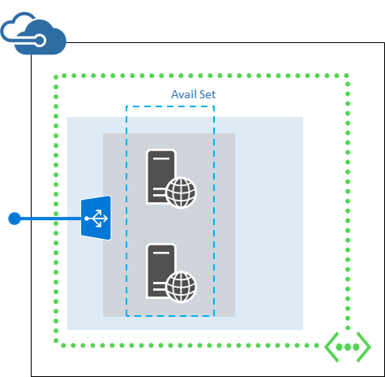

<properties 
	pageTitle="Deploy and Manage Azure Virtual Machines using Resource Manager Templates and PowerShell" 
	description="Easily deploy the most common set of configurations for Azure virtual machines and manage them using Resource Manager Templates and PowerShell." 
	services="virtual-machines" 
	documentationCenter="" 
	authors="JoeDavies-MSFT" 
	manager="timlt" 
	editor=""/>

<tags 
	ms.service="virtual-machines" 
	ms.workload="infrastructure-services" 
	ms.tgt_pltfrm="na" 
	ms.devlang="na" 
	ms.topic="article" 
	ms.date="04/29/2015" 
	ms.author="josephd"/>

# Deploy and Manage Virtual Machines using Azure Resource Manager Templates and PowerShell

All of the tasks you perform to deploy Azure Virtual Machines can be fully automated. This article provides guidance on how to automate common tasks for deploying and managing Azure Virtual Machines using Azure Resource Manager templates and Azure PowerShell as well as links to more documentation on automation for Virtual Machines. These tasks include:

- Deploy a VM in Azure - DONE
- Create a custom VM image - DONE 
- Deploy a multi-VM application that uses a virtual network and an external load balancer - DONE
- Deploy a Multi-VM App using Chef
- Deploy a Multi-VM App using Puppet
- Updating an already deployed VM
- Adding an additional VM to an already deployed resource group
- Remove a resource group - DONE
- Start a virtual machine - DONE
- Stop a virtual machine - DONE
- Restart a virtual machine - DONE
- Remove a virtual machine - DONE

Before you get started, make sure you have Azure PowerShell ready to go.

[AZURE.INCLUDE [arm-getting-setup-powershell](../includes/arm-getting-setup-powershell.md)]

## Understanding Azure Resource Templates and Resource Groups

Most applications that are deployed and run in Microsoft Azure are built out of a combination of different cloud resource types (such as one or more VMs and Storage accounts, a SQL database, a Virtual Network, or a CDN). *Azure Resource Manager Templates* make it possible for you to deploy and manage these different resources together by using a JSON description of the resources and associated configuration and deployment parameters. 

Once you have defined a JSON-based resource template, you can execute it and have the resources defined within it deployed in Azure using a PowerShell command. You can run these commands either standalone within the PowerShell command shell, or integrate it within a script that contains additional automation logic.

The resources you create using Azure Resource Manager Templates will be deployed to either a new or existing Azure Resource Group. An *Azure Resource Group* allows you to manage multiple deployed resources together as a logical group; this allows you to manage the overall lifecycle of the group/application and provide management APIs that allow you to:

- Stop, start, or delete all of the resources within the group at once. 
- Apply Role-Based Access Control (RBAC) rules to lock down security permissions on them. 
- Audit operations. 
- Tag resources with additional meta-data for better tracking. 

You can learn more about Azure Resource Groups [here](azure-preview-portal-using-resource-group.md).

## Common Task: Deploy a VM in Azure

Use the instructions in this section to deploy a new Azure VM using a Resource Manager Template and Azure PowerShell. This template creates a single virtual machine in a new virtual network with a single subnet.

 
Follow these steps to deploy a VM using a Resource Manager template with Azure PowerShell commands.

### Step 1: Examine the JSON file for the template.

Here are the contents of the JSON file for the template.

	{
    "$schema": "http://schema.management.azure.com/schemas/2014-04-01-preview/deploymentTemplate.json",
    "contentVersion": "1.0.0.0",
    "parameters" : {
        "newStorageAccountName": {
            "type": "string"
        },
        "dnsNameForPublicIP" : {
            "type" : "string"
        },
        "adminUserName": {
            "type": "string"
        },
        "adminPassword": {
            "type": "securestring"
        },
        "imagePublisher": {
            "type": "string",
            "defaultValue": "Canonical",
            "metadata": {
                 "Description": "Image Publisher"
            }
        },
        "imageOffer": {
            "type": "string",
            "defaultValue": "UbuntuServer",
            "metadata": {
                "Description": "Image Offer"
            }
        },
        "imageSKU": {
            "type": "string",
            "defaultValue": "14.04.2-LTS",
            "metadata": {
                "Description": "Image SKU"
            }
        },
        "location": {
            "type": "String",
            "defaultValue" : "West US"
        },
        "vmSize": {
            "type": "string",
            "defaultValue": "Standard_A0"
        },
        "publicIPAddressName": {
            "type": "string"
        },
        "vmName": {
            "type": "string",
            "defaultValue" : "myVM"
        },
        "virtualNetworkName":{
            "type" : "string",
            "defaultValue" : "myVNET"
        },
        "nicName":{
            "type" : "string",
            "defaultValue":"myNIC"
        }
    },
    "variables": {
        "addressPrefix":"10.0.0.0/16",
        "subnet1Name": "Subnet-1",
        "subnet2Name": "Subnet-2",
        "subnet1Prefix" : "10.0.0.0/24",
        "subnet2Prefix" : "10.0.1.0/24",
        "vmStorageAccountContainerName": "vhds",
        "publicIPAddressType" : "Dynamic",
        "storageAccountType": "Standard_LRS",
        "vnetID":"[resourceId('Microsoft.Network/virtualNetworks',parameters('virtualNetworkName'))]",
        "subnet1Ref" : "[concat(variables('vnetID'),'/subnets/',variables('subnet1Name'))]"
    },
    "resources": [
    {
      "type": "Microsoft.Storage/storageAccounts",
      "name": "[parameters('newStorageAccountName')]",
      "apiVersion": "2015-05-01-preview",
      "location": "[parameters('location')]",
      "properties": {
        "accountType": "[variables('storageAccountType')]"
      }
    },
    {
        "apiVersion": "2015-05-01-preview",
        "type": "Microsoft.Network/publicIPAddresses",
        "name": "[parameters('publicIPAddressName')]",
        "location": "[parameters('location')]",
        "properties": {
            "publicIPAllocationMethod": "[variables('publicIPAddressType')]",
            "dnsSettings": {
                "domainNameLabel": "[parameters('dnsNameForPublicIP')]"
            }
        }
    },
    {
      "apiVersion": "2015-05-01-preview",
      "type": "Microsoft.Network/virtualNetworks",
      "name": "[parameters('virtualNetworkName')]",
      "location": "[parameters('location')]",
      "properties": {
        "addressSpace": {
          "addressPrefixes": [
            "[variables('addressPrefix')]"
          ]
        },
        "subnets": [
          {
            "name": "[variables('subnet1Name')]",
            "properties" : {
                "addressPrefix": "[variables('subnet1Prefix')]"
            }
          },
          {
            "name": "[variables('subnet2Name')]",
            "properties" : {
                "addressPrefix": "[variables('subnet2Prefix')]"
            }
          }
        ]
      }
    },
    {
        "apiVersion": "2015-05-01-preview",
        "type": "Microsoft.Network/networkInterfaces",
        "name": "[parameters('nicName')]",
        "location": "[parameters('location')]",
        "dependsOn": [
            "[concat('Microsoft.Network/publicIPAddresses/', parameters('publicIPAddressName'))]",
            "[concat('Microsoft.Network/virtualNetworks/', parameters('virtualNetworkName'))]"
        ],
        "properties": {
            "ipConfigurations": [
            {
                "name": "ipconfig1",
                "properties": {
                    "privateIPAllocationMethod": "Dynamic",
                    "publicIPAddress": {
                        "id": "[resourceId('Microsoft.Network/publicIPAddresses',parameters('publicIPAddressName'))]"
                    },
                    "subnet": {
                        "id": "[variables('subnet1Ref')]"
                    }
                }
            }
            ]
        }
    },
    {
        "apiVersion": "2015-05-01-preview",
        "type": "Microsoft.Compute/virtualMachines",
        "name": "[parameters('vmName')]",
        "location": "[parameters('location')]",
        "dependsOn": [
            "[concat('Microsoft.Storage/storageAccounts/', parameters('newStorageAccountName'))]",
            "[concat('Microsoft.Network/networkInterfaces/', parameters('nicName'))]"
        ],
        "properties": {
            "hardwareProfile": {
                "vmSize": "[parameters('vmSize')]"
            },
            "osProfile": {
                "computername": "[parameters('vmName')]",
                "adminUsername": "[parameters('adminUsername')]",
                "adminPassword": "[parameters('adminPassword')]"
            },
            "storageProfile": {
                "imageReference": {
                    "publisher": "[parameters('imagePublisher')]",
                    "offer": "[parameters('imageOffer')]",
                    "sku" : "[parameters('imageSKU')]",
                    "version":"latest"
                },
                "osDisk" : {
                    "name": "osdisk",
                    "vhd": {
                       "uri": "[concat('http://',parameters('newStorageAccountName'),'.blob.core.windows.net/vhds/','osdisk.vhd')]"
                    },
                    "caching": "ReadWrite",
                    "createOption": "FromImage"
                }
            },
            "networkProfile": {
                "networkInterfaces" : [
                {
                    "id": "[resourceId('Microsoft.Network/networkInterfaces',parameters('nicName'))]"
                }
                ]
            }
        }
    }
    ]
	}

We are also building a repository of templates in GitHub that you can use and contribute your own templates.

### Step 2: Create the virtual machine with the template.

To create the virtual machine, replace the elements within the “< >” with your specific information and run these commands:

	$deployName="<deployment name>"
	$RGName="<resource group name>"
	$locName="<Azure location, such as West US>"
	$templateURI="https://raw.githubusercontent.com/azurermtemplates/azurermtemplates/master/101-simple-vm-from-image/azuredeploy.json"
	New-AzureResourceGroup –Name $RGName –Location $locName
	New-AzureResourceGroupDeployment -Name $deployName -ResourceGroupName $RGName -TemplateUri $templateURI

You will be prompted to supply the values of parameters in the **"parameters"** section of the JSON file. When you have specified all the parameter values, Azure Resource Manager creates the resource group and the virtual machine. This table lists values for the imagePublisher, imageOffer, and imageSKU parameters.

[[add table from Corey]] 

Here is an example:

	$deployName="TestDeployment"
	$RGName="TestRG"
	$locname="West US"
	$templateURI="https://raw.githubusercontent.com/azurermtemplates/azurermtemplates/master/101-simple-vm-from-image/azuredeploy.json"
	New-AzureResourceGroup –Name $RGName –Location $locName
	New-AzureResourceGroupDeployment -Name $deployName -ResourceGroupName $RGName -TemplateUri $templateURI

You will receive the following type of information:

	cmdlet New-AzureResourceGroup at command pipeline position 1
	Supply values for the following parameters:
	(Type !? for Help.)
	newStorageAccountName: saTest
	dnsNameForPublicIP: contoso.com
	adminUserName: WebAdmin1
	adminPassword: *******
	imagepublisher: MicrosoftWindowsServer
	...

## Common Task: Create a custom VM image

Use the instructions in this sections to create a custom VM image in Azure with a Resource Manager template using Azure PowerShell. This template creates a single virtual machine from a specified virtual hard disk (VHD).

### Step 1: Examine the JSON file for the template.

Here are the contents of the JSON file for the template.

	{
	    "$schema": "http://schema.management.azure.com/schemas/2014-04-01-preview/deploymentTemplate.json",
	    "contentVersion": "1.0.0.0",
	    "parameters": {
	        "osDiskVhdUri": {
	            "type": "string",
	            "metadata": {
	                "Description": "Uri of the existing VHD"
	            }
	        },
	        "osType": {
	            "type": "string",
	            "allowedValues": [
	                "windows",
	                "linux"
	            ],
	            "metadata": {
	                "Description": "Type of OS on the existing vhd"
	            }
	        },
	        "location": {
	            "type": "String",
	            "defaultValue": "West US",
	            "metadata": {
	                "Description": "Location to create the VM in"
	            }
	        },
	        "vmSize": {
	            "type": "string",
	            "defaultValue": "Standard_A2",
	            "metadata": {
	                "Description": "Size of the VM"
	            }
	        },
	        "vmName": {
	            "type": "string",
	            "defaultValue": "myVM",
	            "metadata": {
	                "Description": "Name of the VM"
	            }
	        },
	        "nicName": {
	            "type": "string",
	            "defaultValue": "myNIC",
	            "metadata": {
	                "Description": "NIC to attach the new VM to"
	            }
	        }
	    },
	    "resources": [{
	        "apiVersion": "2014-12-01-preview",
	        "type": "Microsoft.Compute/virtualMachines",
	        "name": "[parameters('vmName')]",
	        "location": "[parameters('location')]",
	        "properties": {
	            "hardwareProfile": {
	                "vmSize": "[parameters('vmSize')]"
	            },
	            "storageProfile": {
	                "osDisk": {
	                    "name": "[concat(parameters('vmName'),'-osDisk')]",
	                    "osType": "[parameters('osType')]",
	                    "caching": "ReadWrite",
	                    "vhd": {
	                        "uri": "[parameters('osDiskVhdUri')]"
	                    }
	                }
	            },
	            "networkProfile": {
	                "networkInterfaces": [{
	                    "id": "[resourceId('Microsoft.Network/networkInterfaces',parameters('nicName'))]"
	                }]
	            }
	        }
	    }]
	}

[[get the latest JSON code]]

### Step 2: Obtain the VHD.

For a Windows-based virtual machine, see [Create and upload a Windows Server VHD to Azure](virtual-machines-create-upload-vhd-windows-server.md).

For a Linux-based virtual machine, see [Create and upload a Linux VHD in Azure](virtual-machines-linux-create-upload-vhd.md).

### Step 3: Create the virtual machine with the template.

To create an new virtual machine based on the VHD, replace the elements within the “< >” with your specific information and run these commands:

	$deployName="<deployment name>"
	$RGName="<resource group name>"
	$locName="<Azure location, such as West US>"
	$templateURI="https://raw.githubusercontent.com/azurermtemplates/azurermtemplates/master/201-vm-from-specialized-vhd/azuredeploy.json"
	New-AzureResourceGroup –Name $RGName –Location $locName
	New-AzureResourceGroupDeployment -Name $deployName -ResourceGroupName $RGName -TemplateUri $templateURI

You will be prompted to supply the values of parameters in the "parameters" section of the JSON file. When you have specified all the parameter values, Azure Resource Manager creates the resource group and the virtual machine.

Here is an example:

	$deployName="TestDeployment"
	$RGName="TestRG"
	$locname="West US"
	$templateURI="https://raw.githubusercontent.com/azurermtemplates/azurermtemplates/master/201-vm-from-specialized-vhd/azuredeploy.json"
	New-AzureResourceGroup –Name $RGName –Location $locName
	New-AzureResourceGroupDeployment -Name $deployName -ResourceGroupName $RGName -TemplateUri $templateURI

You will receive the following type of information:

	cmdlet New-AzureResourceGroup at command pipeline position 1
	Supply values for the following parameters:
	(Type !? for Help.)
	osDiskVhdUri: [[need to add here]]
	osType: windows
	location: West US
	vmSize: Standard_A3
	...

## Deploy a multi-VM application that uses a virtual network and an external load balancer

Use the instructions in these sections to deploy a multi-VM application that uses a virtual network and a load balancer with a Resource Manager template using Azure PowerShell. This template creates two virtual machines in a new virtual network with a single subnet in a new cloud service, and adds them to an external load-balanced set for incoming traffic to TCP port 80.

Follow these steps to deploy a multi-VM application that uses a virtual network and a load balancer using a Resource Manager template in the Github template repository using Azure PowerShell commands.

### Step 1: Examine the JSON file for the template.

Here are the contents of the JSON file for the template.

	{
	"$schema": "http://schema.management.azure.com/schemas/2014-04-01-preview/deploymentTemplate.json",
	    "contentVersion": "1.0.0.0",
    "parameters": {
        "region": {
            "type": "string"
        },
        "storageAccountName": {
            "type": "string",
            "defaultValue": "uniqueStorageAccountName"
        },
        "adminUsername": {
            "type": "string"
        },
        "adminPassword": {
            "type": "securestring"
        },
        "dnsNameforLBIP": {
            "type": "string",
            "defaultValue": "uniqueDnsNameforLBIP"
        },
        "backendPort": {
            "type": "int",
            "defaultValue": 3389
        },
        "vmNamePrefix": {
            "type": "string",
            "defaultValue": "myVM"
        },
        "vmSourceImageName": {
            "type": "string",
            "defaultValue": "a699494373c04fc0bc8f2bb1389d6106__Windows-Server-2012-R2-201412.01-en.us-127GB.vhd"
        },
        "lbName": {
            "type": "string",
            "defaultValue": "myLB"
        },
        "nicNamePrefix": {
            "type": "string",
            "defaultValue": "nic"
        },
        "publicIPAddressName": {
            "type": "string",
            "defaultValue": "myPublicIP"
        },
        "vnetName": {
            "type": "string",
            "defaultValue": "myVNET"
        },
        "vmSize": {
            "type": "string",
            "defaultValue": "Standard_A1",
            "allowedValues": [
                "Standard_A0",
                "Standard_A1",
                "Standard_A2",
                "Standard_A3",
                "Standard_A4"
            ]
        }
    },
    "variables": {
        "storageAccountType": "Standard_LRS",
        "vmStorageAccountContainerName": "vhds",
        "availabilitySetName": "myAvSet",
        "addressPrefix": "10.0.0.0/16",
        "subnetName": "Subnet-1",
        "subnetPrefix": "10.0.0.0/24",
        "publicIPAddressType": "Dynamic",
        "vnetID": "[resourceId('Microsoft.Network/virtualNetworks',parameters('vnetName'))]",
        "subnetRef": "[concat(variables('vnetID'),'/subnets/',variables ('subnetName'))]",
        "publicIPAddressID": "[resourceId('Microsoft.Network/publicIPAddresses',parameters('publicIPAddressName'))]",
        "lbID": "[resourceId('Microsoft.Network/loadBalancers',parameters('lbName'))]",
        "numberOfInstances": 2,
        "nicId1": "[resourceId('Microsoft.Network/networkInterfaces',concat(parameters('nicNamePrefix'), 0))]",
        "nicId2": "[resourceId('Microsoft.Network/networkInterfaces',concat(parameters('nicNamePrefix'), 1))]",
        "frontEndIPConfigID": "[concat(variables('lbID'),'/frontendIPConfigurations/LBFE')]",
        "backEndIPConfigID1": "[concat(variables('nicId1'),'/ipConfigurations/ipconfig1')]",
        "backEndIPConfigID2": "[concat(variables('nicId2'),'/ipConfigurations/ipconfig1')]",
        "sourceImageName": "[concat('/', subscription().subscriptionId,'/services/images/',parameters('vmSourceImageName'))]",
        "lbPoolID": "[concat(variables('lbID'),'/backendAddressPools/LBBE')]",
        "lbProbeID": "[concat(variables('lbID'),'/probes/tcpProbe')]"
    },
    "resources": [
        {
            "type": "Microsoft.Storage/storageAccounts",
            "name": "[parameters('storageAccountName')]",
            "apiVersion": "2014-12-01-preview",
            "location": "[parameters('region')]",
            "properties": {
                "accountType": "[variables('storageAccountType')]"
            }
        },
        {
            "type": "Microsoft.Compute/availabilitySets",
            "name": "[variables('availabilitySetName')]",
            "apiVersion": "2014-12-01-preview",
            "location": "[parameters('region')]",
            "properties": {}
        },
        {
            "apiVersion": "2014-12-01-preview",
            "type": "Microsoft.Network/publicIPAddresses",
            "name": "[parameters('publicIPAddressName')]",
            "location": "[parameters('region')]",
            "properties": {
                "publicIPAllocationMethod": "[variables('publicIPAddressType')]",
                "dnsSettings": {
                    "domainNameLabel": "[parameters('dnsNameforLBIP')]"
                }
            }
        },
        {
            "apiVersion": "2014-12-01-preview",
            "type": "Microsoft.Network/virtualNetworks",
            "name": "[parameters('vnetName')]",
            "location": "[parameters('region')]",
            "properties": {
                "addressSpace": {
                    "addressPrefixes": [
                        "[variables('addressPrefix')]"
                    ]
                },
                "subnets": [
                    {
                        "name": "[variables('subnetName')]",
                        "properties": {
                            "addressPrefix": "[variables('subnetPrefix')]"
                        }
                    }
                ]
            }
        },
        {
            "apiVersion": "2014-12-01-preview",
            "type": "Microsoft.Network/networkInterfaces",
            "name": "[concat(parameters('nicNamePrefix'), copyindex())]",
            "location": "[parameters('region')]",
            "copy": {
                "name": "nicLoop",
                "count": "[variables('numberOfInstances')]"
            },
            "dependsOn": [
                "[concat('Microsoft.Network/virtualNetworks/', parameters('vnetName'))]"
            ],
            "properties": {
                "ipConfigurations": [
                    {
                        "name": "ipconfig1",
                        "properties": {
                            "privateIPAllocationMethod": "Dynamic",
                            "subnet": {
                                "id": "[variables('subnetRef')]"
                            }
                        }
                    }
                ]
            }
        },
        {
            "apiVersion": "2014-12-01-preview",
            "name": "[parameters('lbName')]",
            "type": "Microsoft.Network/loadBalancers",
            "location": "[parameters('region')]",
            "dependsOn": [
                "nicLoop",
                "[concat('Microsoft.Network/publicIPAddresses/', parameters('publicIPAddressName'))]"
            ],
            "properties": {
                "frontendIPConfigurations": [
                    {
                        "name": "LBFE",
                        "properties": {
                            "publicIPAddress": {
                                "id": "[variables('publicIPAddressID')]"
                            }
                        }
                    }
                ],
                "backendAddressPools": [
                    {
                        "name": "LBBE",
                        "properties": {
                            "backendIPConfigurations": [
                                {
                                    "id": "[variables('backEndIPConfigID1')]"
                                },
                                {
                                    "id": "[variables('backEndIPConfigID2')]"
                                }
                            ]
                        }
                    }
                ],
                "inboundNatRules": [
                    {
                        "name": "RDP-VM1",
                        "properties": {
                            "frontendIPConfigurations": [
                                {
                                    "id": "[variables('frontEndIPConfigID')]"
                                }
                            ],
                            "backendIPConfiguration": {
                                "id": "[variables('backEndIPConfigID1')]"
                            },
                            "protocol": "tcp",
                            "frontendPort": 50001,
                            "backendPort": 3389,
                            "enableFloatingIP": false
                        }
                    },
                    {
                        "name": "RDP-VM2",
                        "properties": {
                            "frontendIPConfigurations": [
                                {
                                    "id": "[variables('frontEndIPConfigID')]"
                                }
                            ],
                            "backendIPConfiguration": {
                                "id": "[variables('backEndIPConfigID2')]"
                            },
                            "protocol": "tcp",
                            "frontendPort": 50002,
                            "backendPort": 3389,
                            "enableFloatingIP": false
                        }
                    }
                ],
                "loadBalancingRules": [
                    {
                        "name": "LBRule",
                        "properties": {
                            "frontendIPConfigurations": [
                                {
                                    "id": "[variables('frontEndIPConfigID')]"
                                }
                            ],
                            "backendAddressPool": {
                                "id": "[variables('lbPoolID')]"
                            },
                            "protocol": "tcp",
                            "frontendPort": 80,
                            "backendPort": 80,
                            "enableFloatingIP": false,
                            "idleTimeoutInMinutes": 5,
                            "probe": {
                                "id": "[variables('lbProbeID')]"
                            }
                        }
                    }
                ],
                "probes": [
                    {
                        "name": "tcpProbe",
                        "properties": {
                            "protocol": "tcp",
                            "port": 80,
                            "intervalInSeconds": "5",
                            "numberOfProbes": "2"
                        }
                    }
                ]
            }
        },
        {
            "apiVersion": "2014-12-01-preview",
            "type": "Microsoft.Compute/virtualMachines",
            "name": "[concat(parameters('vmNamePrefix'), copyindex())]",
            "copy": {
                "name": "virtualMachineLoop",
                "count": "[variables('numberOfInstances')]"
            },
            "location": "[parameters('region')]",
            "dependsOn": [
                "[concat('Microsoft.Storage/storageAccounts/', parameters('storageAccountName'))]",
                "[concat('Microsoft.Network/networkInterfaces/', parameters('nicNamePrefix'), copyindex())]",
                "[concat('Microsoft.Compute/availabilitySets/', variables('availabilitySetName'))]"
            ],
            "properties": {
                "availabilitySet": {
                    "id": "[resourceId('Microsoft.Compute/availabilitySets',variables('availabilitySetName'))]"
                },
                "hardwareProfile": {
                    "vmSize": "[parameters('vmSize')]"
                },
                "osProfile": {
                    "computername": "[concat(parameters('vmNamePrefix'), copyIndex())]",
                    "adminUsername": "[parameters('adminUsername')]",
                    "adminPassword": "[parameters('adminPassword')]"
                },
                "storageProfile": {
                    "sourceImage": {
                        "id": "[variables('sourceImageName')]"
                    },
                    "destinationVhdsContainer": "[concat('http://',parameters('storageAccountName'),'.blob.core.windows.net/',variables('vmStorageAccountContainerName'),'/')]"
                },
                "networkProfile": {
                    "networkInterfaces": [
                        {
                            "id": "[resourceId('Microsoft.Network/networkInterfaces',concat(parameters('nicNamePrefix'),copyindex()))]"
                        }
                    ]
                }
            }
        }
    ]
	}

[[get the latest JSON code]]

### Step 2: Create the deployment with the template.

Fill in an Azure deployment name, Resource Group name, Azure location, and then run these commands.

	$deployName="<deployment name>"
	$RGName="<resource group name>"
	$locName="<Azure location, such as West US>"
	$templateURI="https://raw.githubusercontent.com/azurermtemplates/azurermtemplates/master/201-2-vms-loadbalancer-lbrules/azuredeploy.json"
	New-AzureResourceGroup –Name $RGName –Location $locName
	New-AzureResourceGroupDeployment -Name $deployName -ResourceGroupName $RGName -TemplateUri $templateURI

When you run the New-AzureResourceGroupDeployment command, you will be prompted to supply the values of parameters of the JSON file. When you have specified all the parameter values, the command creates the resource group and the deployment. 

	$deployName="TestDeployment"
	$RGName="TestRG"
	$locname="West US"
	$templateURI="https://raw.githubusercontent.com/azurermtemplates/azurermtemplates/master/201-2-vms-loadbalancer-lbrules/azuredeploy.json"
	New-AzureResourceGroup –Name $RGName –Location $locName
	New-AzureResourceGroupDeployment -Name $deployName -ResourceGroupName $RGName -TemplateUri $templateURI

You would see something like this.

	cmdlet New-AzureResourceGroup at command pipeline position 1
	Supply values for the following parameters:
	(Type !? for Help.)
	newStorageAccountName: saTest
	adminUserName: WebAdmin1
	adminPassword: *******
	dnsNameforLBIP: web07
	backendPort: 80
	vmNamePrefix: WEBFARM
	...

## Remove a resource group

You can remove any resource group you have created with the **Remove-AzureResourceGroup** command.  Replace everything within the quotes, including the < and > characters, with the correct name.

	Remove-AzureResourceGroup  -Name “<resource group name>”

## Display information about a virtual machine

You can see information about a VM using the **Get-AzureVM** command. This command returns a VM object that can be manipulated using various other cmdlets to update the state of the VM. Replace everything within the quotes, including the < and > characters, with the correct name.

	Get-AzureVM –ResourceGroupName “<resource group name>” –Name “<VM name>”

You will see information about your virtual machine like this:

	ResourceGroupName                  :  resourcegroupname
	Name                                              :  vmname
	VMSize                                            :  Standard_A2
	Tags                                                 :  {}
	AvailabilitySetId                            :
	ProvisioningState                          :  succeeded
	OSConfiguration                            :  Windows
	...

## Start a virtual machine

You can start a VM using the **Start-AzureVM** command.  Replace everything within the quotes, including the < and > characters, with the correct name.

	Start-AzureVM –ResourceGroupName “<resource group name>” –Name “<VM name>”

You will see information about your virtual machine like this:

[[add]]

## Stop a virtual machine

You can stop a VM using the **Stop-AzureVM** command.  Replace everything within the quotes, including the < and > characters, with the correct name.

	Stop-AzureVM –ResourceGroupName “<resource group name>” –Name “<VM name>”

You will see information about your virtual machine like this:

[[add]]

##Restart a Virtual Machine

You can restart a VM using the **Restart-AzureVM** command. Replace everything within the quotes, including the < and > characters, with the correct name.

	Restart-AzureVM –ResourceGroupName “<resource group name>” –Name “<VM name>”

You will see information about your virtual machine like this:

[[add]

## Delete a virtual machine

You can delete a VM using the **Remove-AzureVM** command. Replace everything within the quotes, including the < and > characters, with the correct name.  Use the –Force parameter to skip the confirmation prompt.

	Remove-AzureVM –ResourceGroupName “<resource group name>” –Name “<VM name>”

You will see information about your virtual machine like this:

[[add]]

## Additional Resources

[Virtual machines documentation](http://azure.microsoft.com/documentation/services/virtual-machines/)

[Azure virtual machines FAQ](http://msdn.microsoft.com/library/azure/dn683781.aspx)

[Overview of Azure Virtual Machines](http://msdn.microsoft.com/library/azure/jj156143.aspx)

[How to install and configure Azure PowerShell](install-configure-powershell.md)

