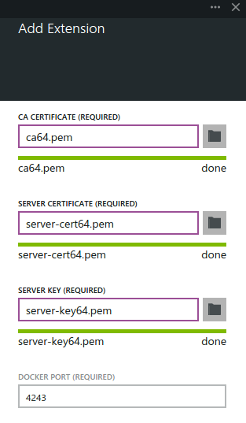
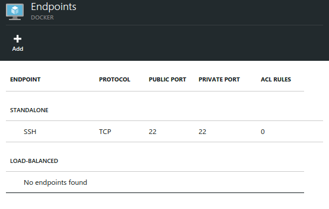

<properties 
	pageTitle="Using the Docker VM Extension for Linux on Azure" 
	description="Describes Docker and the Azure Virtual Machines extensions, and shows how to programmatically create Virtual Machines on Azure that are docker hosts from the command line using the azure-cli command interface." 
	services="virtual-machines" 
	documentationCenter="" 
	authors="squillace" 
	manager="timlt" 
	editor="tysonn"/>

<tags 
	ms.service="virtual-machines" 
	ms.devlang="multiple" 
	ms.topic="article" 
	ms.tgt_pltfrm="vm-linux" 
	ms.workload="infrastructure-services" 
	ms.date="02/11/2015" 
	ms.author="rasquill"/>
<!--The next line, with one pound sign at the beginning, is the page title--> 
# Using the Docker VM Extension with the Azure Portal

[Docker](https://www.docker.com/) is one of the most popular virtualization approaches that uses [Linux containers](http://en.wikipedia.org/wiki/LXC) rather than virtual machines as a way of isolating data and computing on shared resources. You can use the Docker VM extension managed by [Azure Linux Agent] to create a Docker VM that hosts any number of containers for your applications on Azure. 

<!--Table of contents for topic, the words in brackets must match the heading wording exactly-->
In this section

+ [Create a new VM from the Image Gallery]
+ [Create Docker Certificates]
+ [Add the Docker VM Extension]
+ [Test Docker Client and Azure Docker Host]
+ [Next steps]

> [AZURE.NOTE] This topic describes how to create a Docker VM from the Azure Portal. To see how to create a Docker VM at the command line, see [How to use the Docker VM Extension from Azure Cross-Platform Interface (xplat-cli)]. To see a high-level discussion of containers and their advantages, see the [Docker High Level Whiteboard](http://channel9.msdn.com/Blogs/Regular-IT-Guy/Docker-High-Level-Whiteboard). 

## <a id='createvm'>Create a new VM from the Image Gallery</a>
The first step requires an Azure VM from a Linux image that supports the Docker VM Extension, using an Ubuntu 14.04 LTS image from the Image Gallery as an example server image and Ubuntu 14.04 Desktop as a client. In the portal, click **+ New** in the bottom left corner to create a new VM instance and select an Ubuntu 14.04 LTS image from the selections available or from the complete Image Gallery, as shown below. 

> [AZURE.NOTE] Currently, only Ubuntu 14.04 LTS images more recent than July 2014 support the Docker VM Extension.


## <a id'dockercerts'>Create Docker Certificates</a>

After the VM has been created, ensure that Docker is installed on your client computer. (For details, see [Docker installation instructions](https://docs.docker.com/installation/#installation).) 

Create the certificate and key files for Docker communication according to [Running Docker with https] and place them in the **`~/.docker`** directory on your client computer. 

> [AZURE.NOTE] The Docker VM Extension in the portal currently requires credentials that are base64 encoded.

At the command line, use **`base64`** or another favorite encoding tool to create base64-encoded topics. Doing this with a simple set of certificate and key files might look similar to this:

```
 ~/.docker$ l
 ca-key.pem  ca.pem  cert.pem  key.pem  server-cert.pem  server-key.pem
 ~/.docker$ base64 ca.pem > ca64.pem
 ~/.docker$ base64 server-cert.pem > server-cert64.pem
 ~/.docker$ base64 server-key.pem > server-key64.pem
 ~/.docker$ l
 ca64.pem    ca.pem    key.pem            server-cert.pem   server-key.pem
 ca-key.pem  cert.pem  server-cert64.pem  server-key64.pem
```

## <a id'adddockerextension'>Add the Docker VM Extension</a>
To add the Docker VM Extension, locate the VM instance you created and scroll down to **Extensions** and click it to bring up VM Extensions, as shown below.
> [AZURE.NOTE] This functionality is supported in the preview portal only: https://portal.azure.com/


### Add an Extension
Click the **+ Add** to display the possible VM Extensions you can add to this VM. 


### Select the Docker VM Extension
Choose the Docker VM Extension, which brings up the Docker description and important links, and then click **Create** at the bottom to begin the installation procedure.


### Add your Certificate and Key Files:

In the form fields, enter the base64-encoded versions of your CA Certificate, your Server Certificate, and your Server Key, as shown in the following graphic.



> [AZURE.NOTE] Note that (as in the preceding image) the 4243 is filled in by default. You can enter any endpoint here, but the next step will be to open up the matching endpoint. If you change the default, make sure to open up the matching endpoint in the next step.

## Add the Docker Communication Endpoint
When viewing your VM in the resource group you've created, scroll down to click **Endpoints** to view the endpoints on the VM as shown here.



Click **+ Add** to add another endpoint, and in the default case, enter a name for the endpoint (in this example, **docker**), and 4243 for both private and public ports. Leave the protocol value showing **TCP**, and Click **OK** to create the endpoint.


## <a id='testclientandserver'>Test Docker Client and Azure Docker Host</a>
Locate and copy the name of your VM's domain, and at the command line of your client computer, type `docker --tls -H tcp://`*dockerextension*`.cloudapp.net:4243 info` (where *dockerextension* is replaced by the subdomain for your VM). 

The result should appear similar to this:

```
$ docker --tls -H tcp://dockerextension.cloudapp.net:4243 info
Containers: 0
Images: 0
Storage Driver: devicemapper
 Pool Name: docker-8:1-131214-pool
 Pool Blocksize: 65.54 kB
 Data file: /var/lib/docker/devicemapper/devicemapper/data
 Metadata file: /var/lib/docker/devicemapper/devicemapper/metadata
 Data Space Used: 305.7 MB
 Data Space Total: 107.4 GB
 Metadata Space Used: 729.1 kB
 Metadata Space Total: 2.147 GB
 Library Version: 1.02.82-git (2013-10-04)
Execution Driver: native-0.2
Kernel Version: 3.13.0-36-generic
WARNING: No swap limit support
```

Once you complete the above steps, you now have a fully functional Docker host running on an Azure VM, configured to be connected to remotely from other clients.

<!--Every topic should have next steps and links to the next logical set of content to keep the customer engaged-->
## Next steps

You are ready to go to the [Docker User Guide] and use your Docker VM. If you want to automate creating Docker hosts on Azure VMs through command line interface, see [How to use the Docker VM Extension from Azure Cross-Platform Interface (xplat-cli)]

<!--Anchors-->
[Create a new VM from the Image Gallery]: #createvm
[Create Docker Certificates]: #dockercerts
[Add the Docker VM Extension]: #adddockerextension
[Test Docker Client and Azure Docker Host]: #testclientandserver
[Next steps]: #next-steps

<!--Image references-->
[StartingPoint]: ./media/StartingPoint.png
[StartingPoint]: ./media/StartingPoint.png
[StartingPoint]: ./media/StartingPoint.png
[StartingPoint]: ./media/StartingPoint.png
[StartingPoint]: ./media/StartingPoint.png
[StartingPoint]: ./media/StartingPoint.png
[StartingPoint]: ./media/StartingPoint.png
[StartingPoint]: ./media/StartingPoint.png
[6]: ./media/markdown-template-for-new-articles/pretty49.png
[7]: ./media/markdown-template-for-new-articles/channel-9.png


<!--Link references-->
[How to use the Docker VM Extension from Azure Cross-Platform Interface (xplat-cli)]: http://azure.microsoft.com/documentation/articles/virtual-machines-docker-with-xplat-cli/
[Azure Linux Agent]: virtual-machines-linux-agent-user-guide.md
[Link 3 to another azure.microsoft.com documentation topic]: storage-whatis-account.md

[Running Docker with https]: http://docs.docker.com/articles/https/
[Docker User Guide]: https://docs.docker.com/userguide/
