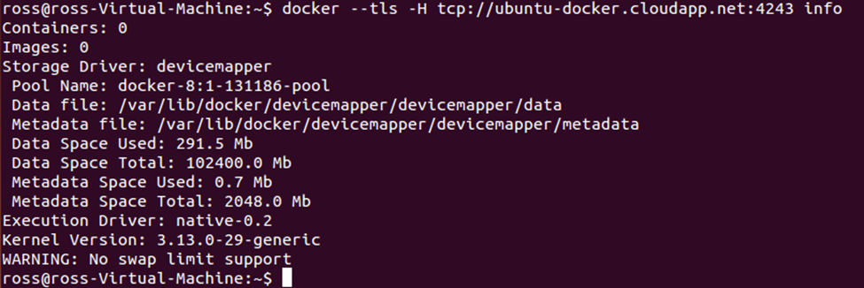

<properties 
	pageTitle="Using the Docker VM Extension for Linux on Azure" 
	description="Describes Docker and the Azure Virtual Machines extensions, and shows how to programmatically create Virtual Machines on Azure that are docker hosts from the command line using the azure-cli command interface." 
	services="virtual-machines" 
	documentationCenter="" 
	authors="squillace" 
	manager="timlt" 
	editor="tysonn"/>

<tags 
	ms.service="virtual-machines" 
	ms.devlang="multiple" 
	ms.topic="article" 
	ms.tgt_pltfrm="vm-linux" 
	ms.workload="infrastructure-services" 
	ms.date="02/02/2015" 
	ms.author="rasquill"/>
# Using the Docker VM Extension from Azure Cross-Platform Interface (xplat-cli)
This topic describes how to create a VM with the Docker VM Extension from the xplat-cli on any platform. [Docker](https://www.docker.com/) is one of the most popular virtualization approaches that uses [Linux containers](http://en.wikipedia.org/wiki/LXC) rather than virtual machines as a way of isolating data and computing on shared resources. You can use the Docker VM extension to the [Azure Linux Agent](virtual-machines-linux-agent-user-guide.md) to create a Docker VM that hosts any number of containers for your applications on Azure. To see a high-level discussion of containers and their advantages, see the [Docker High Level Whiteboard](http://channel9.msdn.com/Blogs/Regular-IT-Guy/Docker-High-Level-Whiteboard).

+ [How to use the Docker VM Extension with Azure]
+ [Virtual Machine Extensions for Linux and Windows] 
+ [Container and Container Management Resources for Azure]
+ [Next steps]


## <a id='How to use the Docker VM Extension with Azure'>How to use the Docker VM Extension with Azure</a>
To use the Docker VM extension with Azure, you must install a version of the [Azure Cross-Platform Command-Line Interface](https://github.com/Azure/azure-sdk-tools-xplat) (called the **xplat-cli** in this topic) higher than 0.8.6 (as of this writing the current version is 0.8.10). You can install the xplat-cli on Mac, Linux, and Windows. 

> [AZURE.NOTE] Although you can install the xplat-cli on Microsoft Windows, Docker was built with kernel dependencies specific to Linux. Therefore, to use Windows as a Docker client you must host a full Linux distribution as a virtual machine inside Hyper-V or another hypervisor. Once you have done that, you can use the xplat-cli and the Docker commands in this document and those of Docker. Docker itself has a setup program for Windows, [Boot2Docker](https://docs.docker.com/installation/windows/), which you can also use to automate this same setup.

The complete process to use Docker on Azure is simple:

+ Install the xplat-cli command line tools and its dependencies on the computer from which you want to control Azure (on Windows, this will be a Linux distribution running as a virtual machine)
+ Use the xplat-cli Docker commands to create a VM Docker host in Azure
+ Use the local Docker commands to manage your Docker containers in your Docker VM in Azure.

> [AZURE.NOTE] The xplat-cli (command line interface) is currently the only way to create a Docker-controlled VM on Azure to host Docker containers. 

### Install the Cross-Platform Command-Line Interface (xplat-cli)
To install and configure the Cross-Platform Command-Line Interface, see [How to install the Azure Cross-Platform Command-Line Interface](xplat-cli.md#install). To confirm the installation, type `azure` at the command prompt and after a short moment you should see the xplat-cli ASCII art, which lists the basic commands available to you. If the installation worked correctly, you should be able to type `azure help vm` and see that one of the listed commands is "docker".

> [AZURE.NOTE] If you are using an Ubuntu 14.04 LTS installation, that image has a slightly different node installation that may require some extra work. One suggestion that seems to work well is located [here](https://www.digitalocean.com/community/tutorials/how-to-install-node-js-on-an-ubuntu-14-04-server) in the **How To Install Using a PPA** section, which describes how to install the most recent version of nodejs directly and seems to work well on an Ubuntu 14.04 LTS distribution. 

### Connect the xplat-cli to to your Azure Account
Before you can use the xplat-cli you must associate your Azure account credentials with the xplat-cli on your platform. The section [How to connect to your Azure subscription](xplat-cli.md#configure) explains how to either download and import your **.publishsettings** file or associate your xplat-cli command-line with an organizational id. 

> [AZURE.NOTE] There are some differences in behavior when using one or the other methods of authentication, so do be sure to read the document above to understand the different functionality. 

### Install Docker and use the Docker VM Extension for Azure
Follow the [Docker installation instructions](https://docs.docker.com/installation/#installation) to install Docker locally on your computer. For most operating systems and distributions, this means typing `apt-get install docker.io`. Confirm that the Docker version is at 1.0 or greater.

To use Docker with an Azure Virtual Machine, the Linux image used for the VM must have the [Azure Linux VM Agent](virtual-machines-linux-agent-user-guide.md) installed. Currently, there are only two types of images that provide this:

+ An Ubuntu image from the Azure Image Gallery or 

+ A custom Linux image that you have created with the Azure Linux VM Agent installed and configured. See [Azure Linux VM Agent](virtual-machines-linux-agent-user-guide.md) for more information about how to build a custom Linux VM with the Azure VM Agent.

### Using the Azure Image Gallery

From a Bash or Terminal session, use the following xplat-cli command to locate the most recent Ubuntu image in the VM gallery to use by typing

`azure vm image list | grep Ubuntu-14_04`

and select one of the image names, such as `b39f27a8b8c64d52b05eac6a62ebad85__Ubuntu-14_04-LTS-amd64-server-20140724-en-us-30GB`, and use the following command to create a new VM using that image. 

```
azure vm docker create -e 22 -l "West US" <vm-cloudservice name> "b39f27a8b8c64d52b05eac6a62ebad85__Ubuntu-14_04-LTS-amd64-server-20140724-en-us-30GB" <username> <password>
``` 

where:

+ *&lt;vm-cloudservice name&gt;* is the name of the VM that will become the Docker container host computer in Azure

+  *&lt;username&gt;* is the username of the default root user of the VM

+ *&lt;password&gt;* is the password of the *username* account that meets the standards of complexity for Azure 
 
> [AZURE.NOTE] Currently, a password must be at least 8 characters, contain one lower case and one upper case character, a number, and a special character such as one of the following characters: `!@#$%^&+=`. No, the period at the end of the preceding sentence is NOT a special character. 

If the command was successful, you should see something like the following, depending on the precise arguments and options you used:


> [AZURE.NOTE] Creating a virtual machine can take a few minutes, but after it has been provisioned the Docker daemon (the Docker service) starts and you can connect to the Docker container host.

To test the Docker VM you have created in Azure, type

`docker --tls -H tcp://<vm-name-you-used>.cloudapp.net:4243 info`

where *<vm-name-you-used>* is the name of the virtual machine that you used in your call to `azure vm docker create`. You should see something similar to the following, which indicates that your Docker Host VM is up and running in Azure and waiting for your commands.



### Docker Host VM Authentication
In addition to creating the Docker VM, the `azure vm docker create` command also automatically creates the necessary certificates to allow your Docker client computer to connect to the Azure container host using HTTPS, and the certificates are stored on both the client and host machines, as appropriate. On subsequent runs, the existing certificates are reused and shared with the new host.

By default, certificates are placed in `~/.docker`, and Docker will be configured to run on port **4243**. If you would like to use a different port or directory, then you may use one of the following `azure vm docker create` command line options to configure your Docker container host VM to use a different port or different certificates for connecting clients:

```
-dp, --docker-port [port]              Port to use for docker [4243]
-dc, --docker-cert-dir [dir]           Directory containing docker certs [.docker/]
```

The Docker daemon on the host is configured to listen for and authenticate client connections on the specified port using the certificates generated by the `azure vm docker create` command. The client machine must have these certificates to gain access to the Docker host. 

> [AZURE.NOTE] A networked host running without these certificates will be vulnerable to anyone that can to connect to the machine. Before you modify the default configuration, ensure that you understand the risks to your computers and applications.


<!--Every topic should have next steps and links to the next logical set of content to keep the customer engaged-->
## Next steps

You are ready to go to the [Docker User Guide] and use your Docker VM. To create a Docker-enabled VM in the new portal, see [How to use the Docker VM Extension with the Portal].

<!--Anchors-->
[Subheading 1]: #subheading-1
[Subheading 2]: #subheading-2
[Subheading 3]: #subheading-3
[Next steps]: #next-steps

[How to use the Docker VM Extension with Azure]: #How-to-use-the-Docker-VM-Extension-with-Azure
[Virtual Machine Extensions for Linux and Windows]: #Virtual-Machine-Extensions-For-Linux-and-Windows
[Container and Container Management Resources for Azure]: #Container-and-Container-Management-Resources-for-Azure

<!--Image references-->
[5]: ./media/markdown-template-for-new-articles/octocats.png
[6]: ./media/markdown-template-for-new-articles/pretty49.png
[7]: ./media/markdown-template-for-new-articles/channel-9.png


<!--Link references-->
[Link 1 to another azure.microsoft.com documentation topic]: virtual-machines-windows-tutorial.md
[Link 2 to another azure.microsoft.com documentation topic]: web-sites-custom-domain-name.md
[Link 3 to another azure.microsoft.com documentation topic]: storage-whatis-account.md
[How to use the Docker VM Extension with the Portal]: http://azure.microsoft.com/documentation/articles/virtual-machines-docker-with-portal/

[Docker User Guide]: https://docs.docker.com/userguide/
