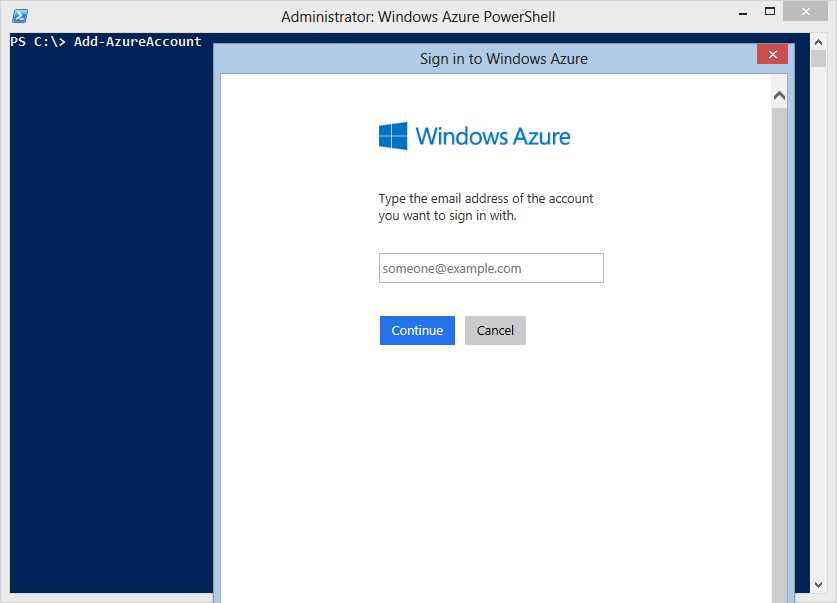
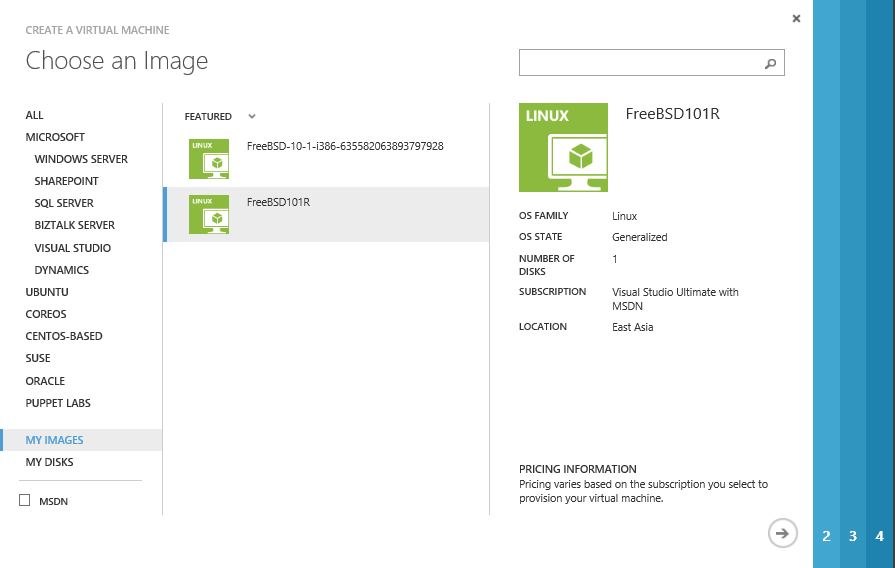

<properties 
   pageTitle="Create and upload a FreeBSD VHD to Azure" 
   description="Learn to create and upload an Azure virtual hard disk (VHD) that contains the FreeBSD operating system" 
   services="virtual-machines" 
   documentationCenter="" 
   authors="KylieLiang" 
   manager="timlt" 
   editor=""/>

<tags
   ms.service="virtual-machines"
   ms.devlang="na"
   ms.topic="article"
   ms.tgt_pltfrm="vm-linux"
   ms.workload="infrastructure-services" 
   ms.date="02/05/2015"
   ms.author="kyliel"/>

# Create and Upload a FreeBSD VHD to Azure 

This article shows you how to create and upload a virtual hard disk (VHD) that contains the FreeBSD Operating System so you can use it as your own image to create virtual machines in Azure. 

##Prerequisites##
This article assumes that you have the following items:

- **An Azure subscription** - If you don't have one, you can create a free trial account in just a couple of minutes. For details, see [Create an Azure account](php-create-account.md). 

- **Azure PowerShell tools** - You have the Microsoft Azure PowerShell module installed and configured to use your subscription. To download the module, see [Azure Downloads](http://azure.microsoft.com/downloads/). A tutorial to install and configure the module is available here. You'll use the [Azure Downloads](http://azure.microsoft.com/downloads/) cmdlet to upload the VHD.

- **FreeBSD operating system installed in a .vhd file**  - You have installed a supported FreeBSD operating system to a virtual hard disk. Multiple tools exist to create .vhd files, for example you can use a virtualization solution such as Hyper-V to create the .vhd file and install the operating system. For instructions, see [Install the Hyper-V Role and Configure a Virtual Machine](http://technet.microsoft.com/library/hh846766.aspx). 

> [AZURE.NOTE] The newer VHDX format is not supported in Azure. You can convert the disk to VHD format using Hyper-V Manager or the cmdlet [convert-vhd](https://technet.microsoft.com/library/hh848454.aspx).

This task includes the following five steps.

## Step 1: Prepare the image to be uploaded ##

As for FreeBSD installation on Hyper-v, a tutorial is available [here](http://blogs.msdn.com/b/kylie/archive/2014/12/25/running-freebsd-on-hyper-v.aspx).

From the virtual machine that the FreeBSD operating system was installed to, complete the following procedures:

1. **Enable DHCP**

		# echo 'ifconfig_hn0="SYNCDHCP"' >> /etc/rc.conf
		# service netif restart

2. **Enable SSH**

    SSH is enabled by default after installation from disc. If not or if you use FreeBSD VHD directly, type:

		# echo 'sshd_enable="YES"' >> /etc/rc.conf 
		# ssh-keygen -t dsa -f /etc/ssh/ssh_host_dsa_key 
		# ssh-keygen -t rsa -f /etc/ssh/ssh_host_rsa_key 
		# service sshd restart

3. **Setup serial console**

		# echo 'console="comconsole vidconsole"' >> /boot/loader.conf
		# echo 'comconsole_speed="115200"' >> /boot/loader.conf

4. **Install sudo**

    The root account is disabled in Azure and then you need to utilize sudo from an unprivileged user to run commands with elevated privileges.

		# pkg install sudo

5. Prerequisites for Azure Agent

    5.1 **Install python**

		# pkg install python27 py27-asn1
		# ln -s /usr/local/bin/python2.7 /usr/bin/python

    5.2 **Install wget**

		# pkg install wget 

6. **Install Azure Agent**

    The latest release of the Azure Agent can always be found on [github](https://github.com/Azure/WALinuxAgent/releases). Version 2.0.10 and later officially supports FreeBSD 10 and later releases.

		# wget https://raw.githubusercontent.com/Azure/WALinuxAgent/WALinuxAgent-2.0.10/waagent --no-check-certificate
		# mv waagent /usr/sbin
		# chmod 755 /usr/sbin/waagent
		# /usr/sbin/waagent -install

    **Important**: After installation, please double check it is running.

		# service –e | grep waagent
		/etc/rc.d/waagent
		# cat /var/log/waagent.log

    Now you could **shut down** your VM. You also could execute step 7 before shut down but it is optional.

7. De-provision is optional. It is to clean the system and make it suitable for re-provisioning.

    Below command also deletes the last provisioned user account and associated data.

		# waagent –deprovision+user

## Step 2: Create a storage account in Azure ##

You need a storage account in Azure to upload a .vhd file so it can be used in Azure to create a virtual machine. You can use the Azure Management Portal to create a storage account.

1. Sign in to the Azure Management Portal.

2. On the command bar, click **New**.

3. Click **Data Services** > **Storage** > **Quick Create**.

	

4. Fill out the fields as follows:
	
	- Under **URL**, type a subdomain name to use in the URL for the storage account. The entry can contain from 3-24 lowercase letters and numbers. This name becomes the host name within the URL that is used to address Blob, Queue, or Table resources for the subscription.
			
	- Choose the **location or affinity group** for the storage account. An affinity group lets you place your cloud services and storage in the same data center.
		 
	- Decide whether to use **geo-replication** for the storage account. Geo-replication is turned on by default. This option replicates your data to a secondary location, at no cost to you, so that your storage fails over to that location if a major failure occurs at the primary location. The secondary location is assigned automatically, and can't be changed. If you need more control over the location of your cloud-based storage due to legal requirements or organizational policy, you can turn off geo-replication. However, be aware that if you later turn on geo-replication, you will be charged a one-time data transfer fee to replicate your existing data to the secondary location. Storage services without geo-replication are offered at a discount. More details on managing geo-replication of Storage accounts can be found here: [Create, manage, or delete a storage account](../storage-create-storage-account/#replication-options).

	

5. Click **Create Storage Account**. The account now appears under **Storage**.

	

6. Next, create a container for your uploaded VHDs. Click the storage account name and then click **Containers**.

	

7. Click **Create a Container**.

	

8. Type a **Name** for your container and select the **Access** policy.

	

    > [AZURE.NOTE] By default, the container is private and can be accessed only by the account owner. To allow public read access to the blobs in the container, but not the container properties and metadata, use the "Public Blob" option. To allow full public read access for the container and blobs, use the "Public Container" option.

## Step 3: Prepare the connection to Microsoft Azure ##

Before you can upload a .vhd file, you need to establish a secure connection between your computer and your subscription in Azure. You can use the Microsoft Azure Active Directory method or the certificate method to do this.

<h3>Use the Microsoft Azure AD method</h3>

1. Open the Azure PowerShell console.

2. Type the following command:  
	`Add-AzureAccount`
	
	This command opens a sign-in window so you can sign with your work or school account.

	

3. Azure authenticates and saves the credential information, and then closes the window.

<h3>Use the certificate method</h3> 

1. Open the Azure PowerShell console. 

2. Type: 
	`Get-AzurePublishSettingsFile`.

3. A browser window opens and prompts you to download a .publishsettings file. It contains information and a certificate for your Microsoft Azure subscription.

	

3. Save the .publishsettings file. 

4. Type: 
	`Import-AzurePublishSettingsFile <PathToFile>`

	Where `<PathToFile>` is the full path to the .publishsettings file. 

   For more information, see [Get Started with Microsoft Azure Cmdlets](http://msdn.microsoft.com/library/windowsazure/jj554332.aspx) 
	
   For more information on installing and configuring PowerShell, see [How to install and configure Microsoft Azure PowerShell](install-configure-powershell.md). 

## Step 4: Upload the .vhd file ##

When you upload the .vhd file, you can place the .vhd file anywhere within your blob storage. In the following command examples, **BlobStorageURL** is the URL for the storage account that you created in Step 2, **YourImagesFolder** is the container within blob storage where you want to store your images. **VHDName** is the label that appears in the Management Portal to identify the virtual hard disk. **PathToVHDFile** is the full path and name of the .vhd file. 

1. From the Azure PowerShell window you used in the previous step, type:

		Add-AzureVhd -Destination "<BlobStorageURL>/<YourImagesFolder>/<VHDName>.vhd" -LocalFilePath <PathToVHDFile>		

## Step 5: Create a VM with uploaded VHD ##
After you upload the .vhd, you can add it as an image to the list of custom images associated with your subscription and create a virtual machine with this custom image.

1. From the Azure PowerShell window you used in the previous step, type:

		Add-AzureVMImage -ImageName <Your Image's Name> -MediaLocation <location of the VHD> -OS <Type of the OS on the VHD>

    **Important**: Please use Linux as OS type for now since current Azure PowerShell version only accepts “Linux” or “Windows” as parameter.

2. After you complete the previous steps, the new image is listed when you choose the **Images** tab on the Azure management portal.  

    

3. Create a virtual machine from gallery. This new image is now available under **My Images**. Select the new image and go through the prompts to set up a hostname, password/SSH key and etc. 

	

4. Once provisioning has completed, you will see your FreeBSD VM running in Azure. 

	
