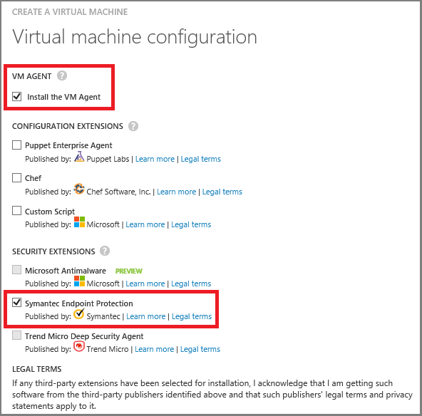

<properties title="How to install and configure Symantec Endpoint Protection on an Azure VM" pageTitle="How to install and configure Symantec Endpoint Protection on an Azure VM" description="Describes installing and configuring Symantec Endpoint Protection on a VM in Azure" metaKeywords="" services="virtual machines" solutions="" documentationCenter="" authors="kathydav" manager="timlt" videoId="" scriptId="" />

<tags ms.service="virtual-machines" ms.workload="infrastructure-services" ms.tgt_pltfrm="vm-multiple" ms.devlang="na" ms.topic="article" ms.date="7/16/2014" ms.author="kathydav" />

#How to install and configure Symantec Endpoint Protection on an Azure VM

 This article shows you how to install and configure the Symantec Endpoint Protection client on a new or existing virtual machine (VM) running Windows Server. This is the full client, which includes services such as virus and spyware protection, firewall, and intrusion prevention. 

The client is installed as a security extension by using the VM Agent. On a new virtual machine, you'll install the agent along with the endpoint client. On an existing virtual machine without the agent, you'll need to download and install the agent first. This article covers both situations.

 If you have an existing subscription from Symantec for an on-premises solution, you can use it to protect your Azure virtual machines. If you're not a customer yet, you can sign up for a trial subscription. For more information about this solution, see [Symantec Endpoint Protection on Microsoft's Azure platform](http://go.microsoft.com/fwlink/p/?LinkId=403942). This page also provides links to licensing information and alternative instructions for installing the client if you're already a Symantec customer.

##Install Symantec Endpoint Protection on a new virtual machine

The [Azure Management Portal](http://manage.windowsazure.com) lets you install the VM Agent and the Symantec security extension when you use the **From Gallery** option to create the virtual machine. Using this approach is an easy way to add protection from Symantec if you're creating a single virtual machine. 

This **From Gallery** option opens a wizard that helps you set up the virtual machine. You use the last page of the wizard to install the VM Agent and Symantec security extension. 

For general instructions, see [Create a Virtual Machine Running Windows Server](http://go.microsoft.com/fwlink/p/?LinkId=403943). When you get to the last page of the wizard, do the following:

1.	Under VM Agent, check **Install VM Agent**.

2.	Under Security Extensions, check **Symantec Endpoint Protection**.

	

3.	Click the check mark at the bottom of the page to create the virtual machine.

## Install Symantec Endpoint Protection on an existing virtual machine

To install the Deep Security Agent on an existing virtual machine, you'll need the following:

- The Azure PowerShell module, version 0.8.2 or newer. For instructions and a link to the latest version, see [How to Install and Configure Azure PowerShell](http://go.microsoft.com/fwlink/p/?LinkId=320552).  

- The VM Agent. For instructions and a link to the download, see the blog post [VM Agent and Extensions - Part 2](http://go.microsoft.com/fwlink/p/?LinkId=403947).

Open an Azure PowerShell session and run the following commands. Be sure to substitute your own values for the placeholders, such as MyServiceName.

1.	Get the cloud service name, virtual machine name, and VM, and store each of those in variables so the next commands can use them:

`$servicename = MyServiceName`

`$name = MyVmName`

`$vm = Get-AzureVM -ServiceName $servicename -Name $name`

	> [WACOM.NOTE] If you don't know the cloud service and VM name, run Get-AzureVM to display that information for all VMs in the current subscription.

2.	Add Symantec Endpoint Protection Agent to the virtual machine. To install the latest version, run:
	
`Set-AzureVMExtension -Publisher Symantec -ExtensionName SymantecEndpointProtection -VM $vm.VM`

	> [WACOM.NOTE] If you want to install a specific version, run the following command to get a list of available versions: `Get-AzureVMAvailableExtension -Publisher Symantec -ExtensionName SymantecEndpointProtection`. 
Then, include the Version parameter when you run Set-AzureVMExtension.

3.	Update the VM, which installs the Symantec Endpoint Protection Agent:
	
`Update-AzureVM -ServiceName $servicename -Name $name -VM $vm.VM`

## Additional Resources
[How to Log on to a Virtual Machine Running Windows Server]

[Manage Extensions]

<!--Link references-->
[How to Log on to a Virtual Machine Running Windows Server]: ../virtual-machines-log-on-windows-server/
[Manage Extensions]: http://go.microsoft.com/fwlink/p/?linkid=390493&clcid=0x409

