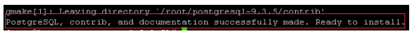
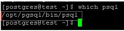
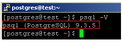
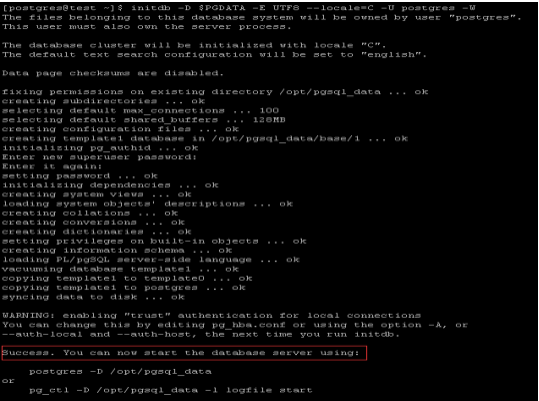
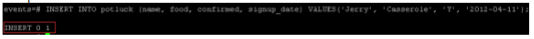

<properties
	pageTitle="Install and Config PostgreSQL on Microsoft Azure Linux VM "
	description="Learn how to Install and Config PostgreSQL on a Linux virtual machine (VM) in Azure. You can install on Ubuntu or CentOS."
	services="virtual-machines"
	documentationCenter=""
	authors="SuperScottz"
	manager="timlt"
	editor=""/>

<tags
	ms.service="virtual-machines"
	ms.workload="infrastructure-services"
	ms.tgt_pltfrm="vm-linux"
	ms.devlang="na"
	ms.topic="article"
	ms.date="3/12/2015"
	ms.author="mingzhan"/>

#Install and Config PostgreSQL on Microsoft Azure 

In this article, you will learn how to install and config the PostgreSQL on Linux VM in Microsoft Azure.

##1. Overview of the PostgreSQL 

PostgreSQL is the world’s most advanced open source database. Developed over 25 years by a vibrant and independent open source community, PostgreSQL was born from the same research as Oracle and DB2 and contains comparable enterprise class features such as full ACID compliance for outstanding transaction reliability and Multi-Version Concurrency Control for supporting high concurrent loads. 

PostgreSQL supports standards such as ANSI SQL and SQL/MED (including foreign data wrappers for Oracle, MySQL, MongoDB and many others) and yet is highly extensible with support for over 12 procedural languages, GIN and GIST Indexes, Spatial data support, and multiple NoSQL like features for document (JSON) or key-value based applications. 

PostgreSQL can be easily deployed in Windows azure. 

##2. Create a virtual machine on Microsoft Azure 

To create a Linux virtual machine in the Microsoft Azure Management Portal by using the Image Gallery, take reference from following link. It assumes you do not have any experience on using Azure.
  
http://azure.microsoft.com/en-us/documentation/articles/virtual-machines-linux-tutorial/  

##3. Create virtual network  

Virtual network is required to deploy your VM.  To get a detail step, take the reference from here.

https://msdn.microsoft.com/en-us/library/azure/dn631643.aspx

##4. Create endpoint  

To create an endpoint is easy in the Azure Management. Navigate to the following link and it shows you how to do this and assumes that you don't have any experience on using Azure. 

http://azure.microsoft.com/en-us/documentation/articles/virtual-machines-set-up-endpoints/ 

In this case, use 1999 port as the PostgreSQL port.  

##5. Compiling and installing PostgreSQL 

To elevate permissions, run command and switch to root user 

	[azureuser@test ~]$ sudo su - 

Install dependencies 

 If your Linux OS is Redhat family, run the following command 

	[root@test ~]# yum install readline-devel gcc make zlib-devel openssl openssl-devel libxml2-devel pam-devel pam  libxslt-devel tcl-devel python-devel -y  

 If your Linux OS is Debian family, run the following command 

 	[root@test ~]# apt-get install readline-devel gcc make zlib-devel openssl openssl-devel libxml2-devel pam-devel pam libxslt-devel tcl-devel python-devel -y  

If your Linux OS is Suse family, run the following command 

	[root@test ~]# zypper install readline-devel gcc make zlib-devel openssl openssl-devel libxml2-devel pam-devel pam  libxslt-devel tcl-devel python-devel -y  

Download PostgreSQL into root directory 

Note: Following is a example, more detailed download address is https://ftp.postgresql.org/pub/source/ 

	[root@test ~]# wget https://ftp.postgresql.org/pub/source/v9.3.5/postgresql-9.3.5.tar.bz2 -P /root/ 

Unzip the PostgreSQL  in root directory 
	[root@test ~]# tar jxvf  postgresql-9.3.5.tar.bz2 

To start the build, type: 

	[root@test ~]#cd postgresql-9.3.5 

	[root@test postgresql-9.3.5]# ./configure --prefix=/opt/postgresql-9.3.5 

If you want to build everything that can be built, including the documentation (HTML and man pages), and the additional modules (contrib), type instead: 

	[root@test postgresql-9.3.5]# gmake install-world 

The last line of output displayed should be: 

###5.1. Configure PostgreSQL 

Create a symbolic link to make sure the consistent name with previous version 

	[root@test ~]# ln -s /opt/pgsql9.3.5 /opt/pgsql 

Create database storage directory 

	[root@test ~]# mkdir -p /opt/pgsql_data 

Create a non-root user and modify user’s profile, and switch to this user (postgres) 

Note: For security, PostgreSQL Database will use a non-root user to initialize the database, start or shut down the database. 

	[root@test ~]# useradd postgres 

	[root@test ~]# chown -R postgres.postgres /opt/pgsql_data 

	[root@test ~]# su - postgres 

Edit bash_profile 

	cat >> ~/.bash_profile <<EOF 

	export PGPORT=1999                                                     

	export PGDATA=/opt/pgsql_data                                

	export LANG=en_US.utf8                                             

	export PGHOME=/opt/pgsql                                      

	export PATH=\$PATH:\$PGHOME/bin 

	export MANPATH=\$MANPATH:\$PGHOME/share/man 

	export DATA=`date +"%Y%m%d%H%M"` 

	export PGUSER=postgres 

	alias rm='rm -i' 

	alias ll='ls -lh' 

	EOF 

Effective immediately 

	[postgres@test ~]$ source .bash_profile 

Validate the installation, below is the successful result 
	[postgres@test ~]$ which psql 

View the PostgreSQL version 

	[postgres@test ~]$ psql -V 

Initialize the database 

	[postgres@test ~]$ initdb -D $PGDATA -E UTF8 --locale=C -U postgres -W 

See output

###5.2. Set PostgreSQL to automatically start 

	[postgres@ test ~]$ exit 

	[root@test ~]# cd /root/postgresql-9.3.5/contrib/start-scripts 

	[root@test start-scripts]# cp linux /etc/init.d/postgresql 

Modify two variables in /etc/init.d/postgresql file 

prefix is set to the installation path of PostgreSQL: **/opt/pgsql** 

PGDATA is set to the data storage path of PostgreSQL: **/opt/pgsql_data**

	[root@test ~]# sed -i '32s#usr/local#opt#' /etc/init.d/postgresql 

	[root@test ~]# sed -i '35s#usr/local/pgsql/data#opt/pgsql_data#' /etc/init.d/postgresql 

Grant execute permission 

	[root@test start-scripts]# chmod +x /etc/init.d/postgresql 

Start PostgreSQL 

	[root@test start-scripts]# /etc/init.d/postgresql start 

Check if the endpoint of PostgreSQL is on 

	[root@test start-scripts]# netstat -tunlp|grep 1999 

see output

##6. Connecting to the Postgres Databases 

Go ahead and switch into the postgres user once again 

	[root@test ~]# su - postgres 

Start to create postgres database 

	[postgres@test ~]$ createdb events 

 Switch to events database just created 

	[postgres@test ~]$ psql -d events 

###6.1. How to Create and Delete a Postgres Tables 

Once we login the database (using the psql -d events command where events is that database's name), we can create tables there. 

For example, create a new Postgres table 

	CREATE TABLE potluck (name VARCHAR(20), 

	food VARCHAR(30), 

	confirmed CHAR(1),  

	signup_date DATE); 

We have set up 4 columns in the table—name, food, confirmed, and signup date 

1. The “name” column has been limited by the VARCHAR command to be under 20 characters long. 

2. The “food” column designates the food each person will bring. The VARCHAR limits text to be under 30 characters. 

3. The “confirmed” column records whether the person has RSVP’d with one letter, Y or N.  

4. The “date” column will show when they signed up for the event. Postgres requires that dates be written as yyyy-mm-dd 

The following is successful creation 

 Check the table structure via the following command 

###6.2. How to Add Information to a Postgres Table 

First, insert information into each row 

	INSERT INTO potluck (name, food, confirmed, signup_date) VALUES('John', 'Casserole', 'Y', '2012-04-11'); 

See output 

Add a couple more people to our group(based on your requirement) 

	INSERT INTO potluck (name, food, confirmed, signup_date) VALUES('Sandy', 'Key Lime Tarts', 'N', '2012-04-14'); 

	INSERT INTO potluck (name, food, confirmed, signup_date)VALUES ('Tom', 'BBQ','Y', '2012-04-18'); 

	INSERT INTO potluck (name, food, confirmed, signup_date) VALUES('Tina', 'Salad', 'Y', '2012-04-18'); 

###6.3. Show tables 

	select * from potluck; 

Below is the output 

###6.4. Delete the data via following command 

	delete from potluck where name=’John’; 

Below is the output 

###6.5. How to Update Information in the Table 

For example: Sandy has confirmed that she is attending, so we are going to update that in the table. 

Update via following 

 	UPDATE potluck set confirmed = 'Y' WHERE name = 'Sandy'; 
