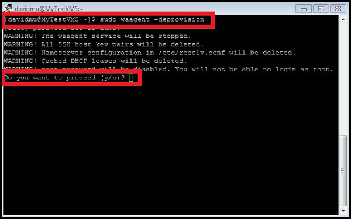
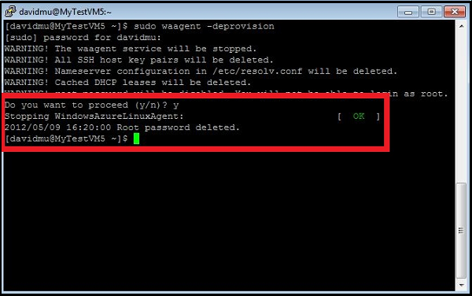

<properties
	pageTitle="Capture an image of a virtual machine running Linux"
	description="Learn how to capture an image of an Azure virtual machine (VM) running Linux."
	services="virtual-machines"
	documentationCenter=""
	authors="KBDAzure"
	manager="timlt"
	editor="tysonn"/>

<tags
	ms.service="virtual-machines"
	ms.workload="infrastructure-services"
	ms.tgt_pltfrm="vm-linux"
	ms.devlang="na"
	ms.topic="article"
	ms.date="03/16/2015" 
	ms.author="kathydav"/>

# How to Capture a Linux Virtual Machine to Use as a Template##

This article shows you how to capture an Azure virtual machine running Linux so you can use it like a template to create other virtual machines. This template includes the OS disk and any data disks attached the virtual machine. It doesn't include networking configuration, so you'll need to configure that when you create the other virtual machines that use the template.

Azure treats this template as an image and stores it under **My Images**. This is also where any images you've uploaded are stored. For more information about images, see [About Virtual Machine Images in Azure] [].

##Before You Begin##

These steps assume that you've already created an Azure virtual machine and configured the operating system, including attaching any data disks. If you haven't done this yet, see these instructions:

- [How to Create a Custom Virtual Machine] []
- [How to Attach a Data Disk to a Virtual Machine] []

##Capture the Virtual Machine##

1. Connect to the virtual machine by clicking **Connect** on the command bar. For details, see [How to Log on to a Virtual Machine Running Linux][].

2. In the SSH window, type the following command and then enter the password for the account that you created on the virtual machine.  Note that the output from `waagent` may vary slightly depending on the version of this utility:

	`sudo waagent -deprovision`

	

3. Type **y** to continue.

	

4. Type **Exit** to close the SSH client.

5. In the [Management Portal](http://manage.windowsazure.com), select the virtual machine, and then click **Shut down**.

6. When the virtual machine is stopped, on the command bar, click **Capture** to open the **Capture the Virtual Machine** dialog box.

7.	In **Image Name**, type a name for the new image.

8.	All Linux images must be *deprovisioned* by running the `waagent` command with the `-deprovision` option. Click **I have run waagent-deprovision on the virtual machine** to indicate that the operating system is prepared to be an image.

9.	Click the check mark to capture the image.

	The new image is now available under **Images**. The virtual machine is deleted after the image is captured.

	

##Next Steps##
The image is ready to be used as a template to create virtual machines. To do this, you'll create a custom virtual machine by using the **From Gallery** method and select the image you just created. For instructions, see [How to Create a Custom Virtual Machine] [].

[How to Log on to a Virtual Machine Running Linux]: virtual-machines-linux-how-to-log-on.md
[About Virtual Machine Images in Azure]: http://msdn.microsoft.com/library/azure/dn790290.aspx
[How to Create a Custom Virtual Machine]: virtual-machines-create-custom.md
[How to Attach a Data Disk to a Virtual Machine]: storage-windows-attach-disk.md
