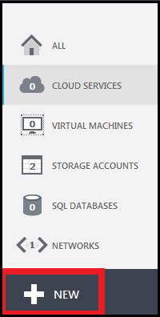

<properties linkid="manage-linux-common-task-upload-vhd" urlDisplayName="Upload a VHD" pageTitle="Create and upload a Linux VHD in Azure" metaKeywords="Azure VHD, uploading Linux VHD" description="Learn to create and upload an Azure virtual hard disk (VHD) that has the Linux operating system." metaCanonical="" services="virtual-machines" documentationCenter="" title="Creating and Uploading a Virtual Hard Disk that Contains the Linux Operating System" authors="kathydav" solutions="" manager="dongill" editor="tysonn" />

<tags ms.service="virtual-machines" ms.workload="infrastructure-services" ms.tgt_pltfrm="vm-linux" ms.devlang="na" ms.topic="article" ms.date="01/01/1900" ms.author="kathydav" />

# Creating and Uploading a Virtual Hard Disk that Contains the Linux Operating System

This article shows you how to create and upload a virtual hard disk (VHD) so you can use it as your own image to create virtual machines in Azure. You'll learn how to prepare the operating system so you can use it to create multiple virtual machines based on that image.  

> [WACOM.NOTE] You don't need any experience with Azure VMs to complete the steps in this article. However, you do need an Azure account. You can create a free trial account in just a couple of minutes. For details, see [Create an Azure account](http://www.windowsazure.com/en-us/develop/php/tutorials/create-a-windows-azure-account/). 

A virtual machine in Azure runs the operating system that's based on the image you choose when you create the virtual machine. Your images are stored in VHD format, in .vhd files in a storage account. For more information about disks and images in Azure, see [Manage Disks and Images](http://msdn.microsoft.com/en-us/library/windowsazure/jj672979.aspx).

When you create the virtual machine, you can customize some of the operating system settings so they're appropriate for the application you want to run. For instructions, see [How to Create a Custom Virtual Machine](/en-us/manage/windows/how-to-guides/custom-create-a-vm/).

**Important**: The Azure platform SLA applies to virtual machines running the Linux OS only when one of the endorsed distributions is used with the configuration details as specified in [this article](http://support.microsoft.com/kb/2805216). All Linux distributions that are provided in the Azure image gallery are endorsed distributions with the required configuration.

##Prerequisites##
This article assumes that you have the following items:

- **A management certificate** - You have created a management certificate for the subscription for which you want to upload a VHD, and exported the certificate to a .cer file. For more information about creating certificates, see [Create a Management Certificate for Azure](http://msdn.microsoft.com/library/windowsazure/gg551722.aspx). 

- **Linux operating system installed in a .vhd file.**  - You have installed a supported Linux operating system to a virtual hard disk. Multiple tools exist to create .vhd files. You can use a virtualization solutions such as Hyper-V to create the .vhd file and install the operating system. For instructions, see [Install the Hyper-V Role and Configure a Virtual Machine](http://technet.microsoft.com/library/hh846766.aspx). 

	**Important**: The newer VHDX format is not supported in Azure. You can convert the disk to VHD format using Hyper-V Manager or the convert-vhd cmdlet.

	For a list of endorsed distributions, see [Linux on Azure-Endorsed Distributions](../linux-endorsed-distributions). Alternatively, see the section at the end of this article for [Information for Non Endorsed Distributions][].

- **Linux Azure command-line tool.** If you are using a Linux operating system to create your image, you use this tool to upload the VHD file. To download the tool, see [Azure Command-Line Tools for Linux and Mac](http://go.microsoft.com/fwlink/?LinkID=253691&clcid=0x409).

- **Add-AzureVhd cmdlet**, which is part of the Azure PowerShell module. To download the module, see [Azure Downloads](/en-us/develop/downloads/). For reference information, see [Add-AzureVhd](http://msdn.microsoft.com/library/windowsazure/dn495173.aspx).

**For all distributions please note the following:**

- When installing the Linux system it is recommended to utilize standard partitions rather than LVM (often the default for many installations). This will avoid LVM name conflicts with cloned VMs, particularly if an OS disk ever needs to be attached to another VM for troubleshooting.

- The Azure Linux Agent (waagent) is not compatible with NetworkManager. Networking configuration should be controllable via the ifup/ifdown scripts.  Most of the RPM/Deb packages provided by distributions configure NetworkManager as a conflict to the waagent package, and thus will uninstall NetworkManager when you install the Linux agent package.  The Azure Linux Agent also requires that the python-pyasn1 package is installed.

- NUMA is not supported for larger VM sizes due to a bug in Linux kernel versions below 2.6.37. Manual installation of waagent will automatically disable NUMA in the GRUB configuration for the Linux kernel. This issue primarily impacts distributions using the upstream Red Hat 2.6.32 kernel.

- It is recommended that you do not create a SWAP partition at installation time. You may configure SWAP space by using the Azure Linux Agent. It is also not recommended to use the mainstream Linux kernel with an Azure virtual machine without the patch available at the [Microsoft web site](http://go.microsoft.com/fwlink/?LinkID=253692&clcid=0x409) (many current distributions/kernels may already include this fix).

- All of the VHDs must have sizes that are multiples of 1 MB.

This task includes the following steps:

- [Step 1: Prepare the image to be uploaded] []
- [Step 2: Create a storage account in Azure] []
- [Step 3: Prepare the connection to Azure] []
- [Step 4: Upload the image to Azure] []

## Step 1: Prepare the image to be uploaded ##

### Prepare CentOS 6.2+ ###

You must complete specific configuration steps in the operating system for the virtual machine to run in Azure.

1. In the center pane of Hyper-V Manager, select the virtual machine.

2. Click **Connect** to open the window for the virtual machine.

3. Uninstall NetworkManager by running the following command:

		rpm -e --nodeps NetworkManager

	**Note:** If the package is not already installed, this command will fail with an error message. This is expected.

4.	Create a file named **network** in the `/etc/sysconfig/` directory that contains the following text:

		NETWORKING=yes
		HOSTNAME=localhost.localdomain

5.	Create a file named **ifcfg-eth0** in the `/etc/sysconfig/network-scripts/` directory that contains the following text:

		DEVICE=eth0
		ONBOOT=yes
		BOOTPROTO=dhcp
		TYPE=Ethernet
		USERCTL=no
		PEERDNS=yes
		IPV6INIT=no

6.	Move (or remove) udev rules to avoid generating static rules for the Ethernet interface.  These rules cause problems when cloning a virtual machine in Windows Azure or Hyper-V:

		# sudo mkdir -m 0700 /var/lib/waagent
		# sudo mv /lib/udev/rules.d/75-persistent-net-generator.rules /var/lib/waagent/
		# sudo mv /etc/udev/rules.d/70-persistent-net.rules /var/lib/waagent/

7. Ensure the network service will start at boot time by running the following command:

		# chkconfig network on

8.	**CentOS 6.2 or 6.3 Only**: Install the drivers for the Linux Integration Services

	**Note:** The step is only valid for CentOS 6.2 and 6.3.  In CentOS 6.4+ the Linux Integration Services are already available in the kernel.

	a) Obtain the .iso file that contains the drivers for the Linux Integration Services from [Download Center](http://www.microsoft.com/en-us/download/details.aspx?id=34603).

	b) In Hyper-V Manager, in the **Actions** pane, click **Settings**.

	

	c) In the **Hardware** pane, click **IDE Controller 1**.

	

	d) In the **IDE Controller** box, click **DVD Drive**, and then click **Add**.

	e) Select **Image file**, browse to **Linux IC v3.2.iso**, and then click **Open**.

	f) In the **Settings** page, click **OK**.

	g) Click **Connect** to open the window for the virtual machine.

	h) In the Command Prompt window, type the following commands:

		mount /dev/cdrom /media
		/media/install.sh
		reboot

9. Install python-pyasn1 by running the following command:

		# sudo yum install python-pyasn1

10. Replace their /etc/yum.repos.d/CentOS-Base.repo file with the following text

		[openlogic]
		name=CentOS-$releasever - openlogic packages for $basearch
		baseurl=http://olcentgbl.trafficmanager.net/openlogic/$releasever/openlogic/$basearch/
		enabled=1
		gpgcheck=0
		
		[base]
		name=CentOS-$releasever - Base
		baseurl=http://olcentgbl.trafficmanager.net/centos/$releasever/os/$basearch/
		gpgcheck=1
		gpgkey=file:///etc/pki/rpm-gpg/RPM-GPG-KEY-CentOS-6
		
		#released updates
		[updates]
		name=CentOS-$releasever - Updates
		baseurl=http://olcentgbl.trafficmanager.net/centos/$releasever/updates/$basearch/
		gpgcheck=1
		gpgkey=file:///etc/pki/rpm-gpg/RPM-GPG-KEY-CentOS-6
		
		#additional packages that may be useful
		[extras]
		name=CentOS-$releasever - Extras
		baseurl=http://olcentgbl.trafficmanager.net/centos/$releasever/extras/$basearch/
		gpgcheck=1
		gpgkey=file:///etc/pki/rpm-gpg/RPM-GPG-KEY-CentOS-6
		
		#additional packages that extend functionality of existing packages
		[centosplus]
		name=CentOS-$releasever - Plus
		baseurl=http://olcentgbl.trafficmanager.net/centos/$releasever/centosplus/$basearch/
		gpgcheck=1
		enabled=0
		gpgkey=file:///etc/pki/rpm-gpg/RPM-GPG-KEY-CentOS-6
		
		#contrib - packages by Centos Users
		[contrib]
		name=CentOS-$releasever - Contrib
		baseurl=http://olcentgbl.trafficmanager.net/centos/$releasever/contrib/$basearch/
		gpgcheck=1
		enabled=0
		gpgkey=file:///etc/pki/rpm-gpg/RPM-GPG-KEY-CentOS-6

11.	Add the following line to /etc/yum.conf:

		http_caching=packages

	And on CentOS 6.2 & 6.3 only add the following line:

		exclude=kernel*

12. Disable the yum module "fastestmirror" by editing the file "/etc/yum/pluginconf.d/fastestmirror.conf", and under [main] type the following

		set enabled=0

13.	Run the following commend to clear the current yum metadata:

		yum clean all

14. For CentOS 6.2 and 6.3, update a running VM's kernel by running the following commands

	For CentOS 6.2, run the following commands:

		sudo yum remove kernel-firmware
		sudo yum --disableexcludes=all install kernel

	For CentOS 6.3+ type the following:

		sudo yum --disableexcludes=all install kernel

15.	Modify the kernel boot line in your grub configuration to include additional kernel parameters for Azure. To do this open /boot/grub/menu.lst in a text editor and ensure that the default kernel includes the following parameters:

		console=ttyS0 earlyprintk=ttyS0 rootdelay=300 numa=off

	This will also ensure all console messages are sent to the first serial port, which can assist Azure support with debugging issues. In addition this will disable NUMA due to a bug in the kernel version used by CentOS 6.

16.	In /etc/sudoers, comment out the following line, if it exists:

		Defaults targetpw

17.	Ensure that the SSH server is installed and configured to start at boot time.

18. Install the Azure Linux Agent by running the following command:

		yum install WALinuxAgent

	Note that installing the WALinuxAgent package will remove the NetworkManager and NetworkManager-gnome packages if they were not already removed as described in step 2.

19.	Do not create swap space on the OS disk.

	The Azure Linux Agent can automatically configure swap space using the local resource disk that is attached to the VM after provisioning on Azure. Note that the local resource disk is a *temporary* disk, and might be emptied when the VM is deprovisioned. After installing the Azure Linux Agent (see previous step), modify the following parameters in /etc/waagent.conf appropriately:

		ResourceDisk.Format=y
		ResourceDisk.Filesystem=ext4
		ResourceDisk.MountPoint=/mnt/resource
		ResourceDisk.EnableSwap=y
		ResourceDisk.SwapSizeMB=2048    ## NOTE: set this to whatever you need it to be.

20.	Run the following commands to deprovision the virtual machine and prepare it for provisioning on Azure:

		waagent -force -deprovision
		export HISTSIZE=0
		logout

21. Click **Shutdown** in Hyper-V Manager.

### Prepare Ubuntu 12.04+ ###

1. In the center pane of Hyper-V Manager, select the virtual machine.

2. Click **Connect** to open the window for the virtual machine.

3.	Replace the current repositories in your image to use the azure repositories that carry the kernel and agent package that you will need to upgrade the VM.  The steps vary slightly depending on the Ubuntu version.

	Before editing /etc/apt/sources.list, it is recommended to make a backup
		sudo cp /etc/apt/sources.list /etc/apt/sources.list.bak

	Ubuntu 12.04:

		sudo sed -i "s/[a-z][a-z].archive.ubuntu.com/azure.archive.ubuntu.com/g" /etc/apt/sources.list
		sudo apt-add-repository 'http://archive.canonical.com/ubuntu precise-backports main'
		sudo apt-get update

	Ubuntu 12.10:

		sudo sed -i "s/[a-z][a-z].archive.ubuntu.com/azure.archive.ubuntu.com/g" /etc/apt/sources.list
		sudo apt-add-repository 'http://archive.canonical.com/ubuntu quantal-backports main'
		sudo apt-get update

	Ubuntu 13.04+:

		sudo sed -i "s/[a-z][a-z].archive.ubuntu.com/azure.archive.ubuntu.com/g" /etc/apt/sources.list
		sudo apt-get update

4. Update the operating system to the latest kernel by running the following commands : 

	Ubuntu 12.04:

		sudo apt-get update
		sudo apt-get install hv-kvp-daemon-init linux-backports-modules-hv-precise-virtual
		(recommended) sudo apt-get dist-upgrade
		sudo reboot

	Ubuntu 12.10:

		sudo apt-get update
		sudo apt-get install hv-kvp-daemon-init linux-backports-modules-hv-quantal-virtual
		(recommended) sudo apt-get dist-upgrade
		sudo reboot
	
	Ubuntu 13.04, 13.10 and 14.04:

		sudo apt-get update
		sudo apt-get install hv-kvp-daemon-init
		(recommended) sudo apt-get dist-upgrade
		sudo reboot

5.	Ubuntu will wait at the Grub prompt for user input after a system crash. To prevent this, complete the following steps:

	a) Open the /etc/grub.d/00_header file.

	b) In the function **make_timeout()**, search for **if ["\${recordfail}" = 1 ]; then**

	c) Change the statement below this line to **set timeout=5**.

	d) Run 'sudo update-grub'.

6. Modify the kernel boot line for Grub to include additional kernel parameters for Azure. To do this open /etc/default/grub in a text editor, find the variable called "GRUB_CMDLINE_LINUX_DEFAULT" (or add it if needed) and edit it to include the following parameters:

		GRUB_CMDLINE_LINUX_DEFAULT="console=ttyS0 earlyprintk=ttyS0 rootdelay=300"

	Save and close this file, and then run 'sudo update-grub'. This will ensure all console messages are sent to the first serial port, which can assist Azure technical support with debugging issues. 

7.	In /etc/sudoers, comment out the following line, if it exists:

		Defaults targetpw

8.	Ensure that the SSH server is installed and configured to start at boot time.

9.	Install the agent by running the following commands with sudo:

		apt-get update
		apt-get install walinuxagent

	Note that installing the walinuxagent package will remove the NetworkManager and NetworkManager-gnome packages, if they are installed.

10.	Do not create swap space on the OS disk.

	The Azure Linux Agent can automatically configure swap space using the local resource disk that is attached to the VM after provisioning on Azure. Note that the local resource disk is a *temporary* disk, and might be emptied when the VM is deprovisioned. After installing the Azure Linux Agent (see previous step), modify the following parameters in /etc/waagent.conf appropriately:

		ResourceDisk.Format=y
		ResourceDisk.Filesystem=ext4
		ResourceDisk.MountPoint=/mnt/resource
		ResourceDisk.EnableSwap=y
		ResourceDisk.SwapSizeMB=2048    ## NOTE: set this to whatever you need it to be.

11.	Run the following commands to deprovision the virtual machine and prepare it for provisioning on Azure:

		waagent -force -deprovision
		export HISTSIZE=0
		logout

12. Click **Shutdown** in Hyper-V Manager.

### Prepare Oracle Linux 6.4+ ###

You must complete specific configuration steps in the operating system for the virtual machine to run in Azure.

1. In the center pane of Hyper-V Manager, select the virtual machine.

2. Click **Connect** to open the window for the virtual machine.

3. Uninstall NetworkManager by running the following command:

		rpm -e --nodeps NetworkManager

	**Note:** If the package is not already installed, this command will fail with an error message. This is expected.

4.	Create a file named **network** in the `/etc/sysconfig/` directory that contains the following text:

		NETWORKING=yes
		HOSTNAME=localhost.localdomain

5.	Create a file named **ifcfg-eth0** in the `/etc/sysconfig/network-scripts/` directory that contains the following text:

		DEVICE=eth0
		ONBOOT=yes
		BOOTPROTO=dhcp
		TYPE=Ethernet
		USERCTL=no
		PEERDNS=yes
		IPV6INIT=no

6.	Move (or remove) udev rules to avoid generating static rules for the Ethernet interface.  These rules cause problems when cloning a virtual machine in Windows Azure or Hyper-V:

		# sudo mkdir -m 0700 /var/lib/waagent
		# sudo mv /lib/udev/rules.d/75-persistent-net-generator.rules /var/lib/waagent/
		# sudo mv /etc/udev/rules.d/70-persistent-net.rules /var/lib/waagent/

7. Ensure the network service will start at boot time by running the following command:

		# chkconfig network on

8. Install python-pyasn1 by running the following command:

		# sudo yum install python-pyasn1

9.	Modify the kernel boot line in your grub configuration to include additional kernel parameters for Azure. To do this open /boot/grub/menu.lst in a text editor and ensure that the default kernel includes the following parameters:

		console=ttyS0 earlyprintk=ttyS0 rootdelay=300 numa=off

	This will also ensure all console messages are sent to the first serial port, which can assist Azure support with debugging issues. In addition this will disable NUMA due to a bug in the kernel version used by CentOS 6.

10.	In /etc/sudoers, comment out the following line, if it exists:

		Defaults targetpw

11.	Ensure that the SSH server is installed and configured to start at boot time.

12. Install the Azure Linux Agent by running the following command:

		yum install WALinuxAgent

	Note that installing the WALinuxAgent package will remove the NetworkManager and NetworkManager-gnome packages, if they are installed.

13.	Do not create swap space on the OS disk.

	The Azure Linux Agent can automatically configure swap space using the local resource disk that is attached to the VM after provisioning on Azure.  After installing the Azure Linux Agent (see previous step), modify the following parameters in /etc/waagent.conf appropriately:

		ResourceDisk.Format=y
		ResourceDisk.Filesystem=ext4
		ResourceDisk.MountPoint=/mnt/resource
		ResourceDisk.EnableSwap=y
		ResourceDisk.SwapSizeMB=2048    ## NOTE: set this to whatever you need it to be.

14.	Run the following commands to deprovision the virtual machine and prepare it for provisioning on Azure:

		waagent -force -deprovision
		export HISTSIZE=0
		logout

15. Click **Shutdown** in Hyper-V Manager.

### Prepare SUSE Linux Enterprise Server 11 SP2 & SP3 ###

**NOTE:** [SUSE Studio](http://www.susestudio.com) can easily create and manage your SLES/opeSUSE images for Azure and Hyper-V. In addition, the following official images in the SUSE Studio Gallery can be downloaded or cloned into your own SUSE Studio account for easy customization:

> - [SLES 11 SP3 for Azure on SUSE Studio Gallery](http://susestudio.com/a/02kbT4/sles-11-sp3-for-windows-azure)

1. In the center pane of Hyper-V Manager, select the virtual machine.

2. Click **Connect** to open the window for the virtual machine.

3. Add the repository containing the latest kernel and Azure Linux Agent. Run the command `zypper lr`. For example, with SLES 11 SP3 the output should look similar to the following:

		# | Alias                        | Name               | Enabled | Refresh
		--+------------------------------+--------------------+---------+--------
		1 | susecloud:SLES11-SP1-Pool    | SLES11-SP1-Pool    | No      | Yes
		2 | susecloud:SLES11-SP1-Updates | SLES11-SP1-Updates | No      | Yes
		3 | susecloud:SLES11-SP2-Core    | SLES11-SP2-Core    | No      | Yes
		4 | susecloud:SLES11-SP2-Updates | SLES11-SP2-Updates | No      | Yes
		5 | susecloud:SLES11-SP3-Pool    | SLES11-SP3-Pool    | Yes     | Yes
		6 | susecloud:SLES11-SP3-Updates | SLES11-SP3-Updates | Yes     | Yes

 	In case the command returns an error message such as the following:

		"No repositories defined. Use the 'zypper addrepo' command to add one or more repositories."

	then the repositories may need to be re-enabled or the system registered.  This can be done via the suse_register utility.  For more information, please see the [SLES documentation](https://www.suse.com/documentation/sles11/).

   In case one of the relevant update repositories is not enabled, enable it with following command:

		zypper mr -e [REPOSITORY NUMBER]

   In the above case, the command proper command would be

		zypper mr -e 1 2 3 4

4. Update the kernel to the latest available version:

		zypper up kernel-default

5. Install the Azure Linux Agent:

		zypper up WALinuxAgent
		
	You may see message similar to the following:

		"There is an update candidate for 'WALinuxAgent', but it is from different vendor.
		Use 'zypper install WALinuxAgent-1.2-1.1.noarch' to install this candidate."

	As the vendor of the package has changed from "Microsoft Corporation" to "SUSE LINUX Products GmbH, Nuernberg, Germany", one has to explicitely install the package as mentioned in the message.

	Note: The version of the WALinuxAgent package might be slightly different.

6. Modify the kernel boot line in your grub configuration to include additional kernel parameters for Azure. To do this open /boot/grub/menu.lst in a text editor and ensure that the default kernel includes the following parameters:

		console=ttyS0 earlyprintk=ttyS0 rootdelay=300

	This will ensure all console messages are sent to the first serial port, which can assist Azure support with debugging issues.

7.	It is recommended that you set /etc/sysconfig/network/dhcp or equivalent from DHCLIENT_SET_HOSTNAME="yes" to DHCLIENT_SET_HOSTNAME="no"

8.	In /etc/sudoers, comment out the following line, if it exists:

		Defaults targetpw

9.	Ensure that the SSH server is installed and configured to start at boot time

10.	Do not create swap space on the OS disk

	The Azure Linux Agent can automatically configure swap space using the local resource disk that is attached to the VM after provisioning on Azure. Note that the local resource disk is a *temporary* disk, and might be emptied when the VM is deprovisioned. After installing the Azure Linux Agent (see previous step), modify the following parameters in /etc/waagent.conf appropriately:

		ResourceDisk.Format=y
		ResourceDisk.Filesystem=ext4
		ResourceDisk.MountPoint=/mnt/resource
		ResourceDisk.EnableSwap=y
		ResourceDisk.SwapSizeMB=2048    ## NOTE: set this to whatever you need it to be.

11.	Run the following commands to deprovision the virtual machine and prepare it for provisioning on Azure:

		waagent -force -deprovision
		export HISTSIZE=0
		logout

12. Click **Shutdown** in Hyper-V Manager.

### Prepare openSUSE 12.3+ ###

**NOTE:** [SUSE Studio](http://www.susestudio.com) can easily create and manage your SLES/opeSUSE images for Azure and Hyper-V. In addition, the following official images in the SUSE Studio Gallery can be downloaded or cloned into your own SUSE Studio account for easy customization:

> - [openSUSE 13.1 for Azure on SUSE Studio Gallery](https://susestudio.com/a/02kbT4/opensuse-13-1-for-windows-azure)

1. In the center pane of Hyper-V Manager, select the virtual machine.

2. Click **Connect** to open the window for the virtual machine.

3. Update the operating system to the latest available kernel and patches

4. On the shell, run the command '`zypper lr`'. If this command returns output similar to the following (note that version numbers may vary):

		# | Alias                     | Name                      | Enabled | Refresh
		--+---------------------------+---------------------------+---------+--------
		1 | Cloud:Tools_openSUSE_12.3 | Cloud:Tools_openSUSE_12.3 | Yes     | Yes
		2 | openSUSE_12.3_OSS         | openSUSE_12.3_OSS         | Yes     | Yes
		3 | openSUSE_12.3_Updates     | openSUSE_12.3_Updates     | Yes     | Yes

   then the repositories are configured as expected, no adjustments are necessary.

   In case the command returns "No repositories defined. Use the 'zypper addrepo' command to add one 
   or more repositories". then the repositories need to be re-enabled:

		zypper ar -f http://download.opensuse.org/distribution/12.3/repo/oss openSUSE_12.3_OSS
		zypper ar -f http://download.opensuse.org/update/12.3 openSUSE_12.3_Updates

   Verify your repositories have been added by calling 'zypper lr' again.

   In case one of the relevant update repositories is not enabled, enable it with following command:

		zypper mr -e [NUMBER OF REPOSITORY]

5.	Disable automatic DVD ROM probing.

6.	Install the Azure Linux Agent:

	First, add the repository containing the new WALinuxAgent:

		zypper ar -f -r http://download.opensuse.org/repositories/Cloud:/Tools/openSUSE_12.3/Cloud:Tools.repo

	Then, run the following command:
 
		zypper up WALinuxAgent

	After you run this command, you may a similar message like the following:

		"There is an update candidate for 'WALinuxAgent', but it is from different vendor. 
		Use 'zypper install WALinuxAgent' to install this candidate."

	This message is expected. As the vendor of the package has changed from "Microsoft Corporation" to "obs://build.opensuse.org/Cloud," one has to explicitely install the package as mentioned in the message.

7.	Modify the kernel boot line in your grub configuration to include additional kernel parameters for Azure. To do this open /boot/grub/menu.lst in a text editor and ensure that the default kernel includes the following parameters:

		console=ttyS0 earlyprintk=ttyS0 rootdelay=300

	This will ensure all console messages are sent to the first serial port, which can assist Azure support with debugging issues.  In addition, remove the following parameters from the kernel boot line if they exist:

		libata.atapi_enabled=0 reserve=0x1f0,0x8

9.	It is recommended that you set /etc/sysconfig/network/dhcp or equivalent from DHCLIENT_SET_HOSTNAME="yes" to DHCLIENT_SET_HOSTNAME="no"

10.	In /etc/sudoers, comment out the following line, if it exists:

		Defaults targetpw

11.	Ensure that the SSH server is installed and configured to start at boot time

12.	Do not create swap space on the OS disk

	The Azure Linux Agent can automatically configure swap space using the local resource disk that is attached to the VM after provisioning on Azure. Note that the local resource disk is a *temporary* disk, and might be emptied when the VM is deprovisioned. After installing the Azure Linux Agent (see previous step), modify the following parameters in /etc/waagent.conf appropriately:

		ResourceDisk.Format=y
		ResourceDisk.Filesystem=ext4
		ResourceDisk.MountPoint=/mnt/resource
		ResourceDisk.EnableSwap=y
		ResourceDisk.SwapSizeMB=2048    ## NOTE: set this to whatever you need it to be.

13.	Run the following commands to deprovision the virtual machine and prepare it for provisioning on Azure:

		waagent -force -deprovision
		export HISTSIZE=0
		logout

14. Ensure the Azure Linux Agent runs at startup:

		systemctl enable waagent.service

14. Click **Shutdown** in Hyper-V Manager.

## Step 2: Create a storage account in Azure ##

A storage account represents the highest level of the namespace for accessing the storage services and is associated with your Azure subscription. You need a storage account in Azure to upload a .vhd file to Azure that can be used for creating a virtual machine. You can create a storage account by using the Azure Management Portal.

1. Sign in to the Azure Management Portal.

2. On the command bar, click **New**.

	

3. Click **Storage Account**, and then click **Quick Create**.

	

4. Fill out the fields as follows:

	

- Under **URL**, type a subdomain name to use in the URL for the storage account. The entry can contain from 3-24 lowercase letters and numbers. This name becomes the host name within the URL that is used to address Blob, Queue, or Table resources for the subscription.
	
- Choose the location or affinity group for the storage account. By specifying an affinity group, you can co-locate your cloud services in the same data center with your storage.
 
- Decide whether to use geo-replication for the storage account. Geo-replication is turned on by default. This option replicates your data to a secondary location, at no cost to you, so that your storage fails over to a secondary location if a major failure occurs that can't be handled in the primary location. The secondary location is assigned automatically, and can't be changed. If legal requirements or organizational policy requires tighter control over the location of your cloud-based storage, you can turn off geo-replication. However, be aware that if you later turn on geo-replication, you will be charged a one-time data transfer fee to replicate your existing data to the secondary location. Storage services without geo-replication are offered at a discount.

5. Click **Create Storage Account**.

	The account is now listed under **Storage Accounts**.

	

## Step 3: Prepare the connection to Azure ##

Before you can upload a .vhd file, you need to establish a secure connection between your computer and your subscription in Azure. 

1. Open an Azure PowerShell window.

2. Type: 

	`Get-AzurePublishSettingsFile`

	This command opens a browser window and automatically downloads a .publishsettings file that contains information and a certificate for your Azure subscription. 

3. Save the .publishsettings file. 

4. Type:

	`Import-AzurePublishSettingsFile <PathToFile>`

	Where `<PathToFile>` is the full path to the .publishsettings file. 

	For more information, see [Get Started with Azure Cmdlets](http://msdn.microsoft.com/en-us/library/windowsazure/jj554332.aspx) 

## Step 4: Upload the image to Azure ##

When you upload the .vhd file, you can place the .vhd file anywhere within your blob storage. In the following command examples, **BlobStorageURL** is the URL for the storage account that you created in Step 2, **YourImagesFolder** is the container within blob storage where you want to store your images. **VHDName** is the label that appears in the Management Portal to identify the virtual hard disk. **PathToVHDFile** is the full path and name of the .vhd file. 

Do one of the following:

- From the Azure PowerShell window you used in the previous step, type:

	`Add-AzureVhd -Destination <BlobStorageURL>/<YourImagesFolder>/<VHDName> -LocalFilePath <PathToVHDFile>`

	For more information, see [Add-AzureVhd](http://msdn.microsoft.com/en-us/library/windowsazure/dn205185.aspx).

- Use the Linux command-line tool to upload the image. You can upload an image by using the following command:

		Azure vm image create <image name> --location <Location of the data center> --OS Linux <Sourcepath to the vhd>

## Information for Non Endorsed Distributions ##
In essence all distributions running on Azure will need to meet the following prerequisites to have a chance to properly run in the platform. 

This list is by no means comprehensive as every distribution is different; and it is quite possible that even if you meet all the criteria below you will still need to significantly tweak your image to ensure that it properly runs on top of the platform.

It is for this reason that we recommend that you start with one of our [partners endorsed images](https://www.windowsazure.com/en-us/manage/linux/other-resources/endorsed-distributions/).

The list below replaces step 1 of the process to create your own VHD:

1.	You will need to ensure that you are running a kernel that either incorporates the latest LIS drivers for Hyper V or that you have successfully compiled them ( They have been Open Sourced). The Drivers can be found [at this location](http://go.microsoft.com/fwlink/p/?LinkID=254263&clcid=0x409)

2.	Your kernel should also include the latest version of the ATA PiiX driver that is used to to provision the iamges and has the fixes committed to the kernel with commit cd006086fa5d91414d8ff9ff2b78fbb593878e3c Date:   Fri May 4 22:15:11 2012 +0100   ata_piix: defer disks to the Hyper-V drivers by default

3.	Your compressed intird should be less than 40 MB (* we are continuously working to increase this number so it might be outdated by now)

4.	Modify the kernel boot line in Grub or Grub2 to include the following parameters. This will also ensure all console messages are sent to the first serial port, which can assist Azure support with debugging issues:

		console=ttyS0 earlyprintk=ttyS0 rootdelay=300

5.	It is recommended that you set /etc/sysconfig/network/dhcp or equivalent from DHCLIENT_SET_HOSTNAME="yes" to DHCLIENT_SET_HOSTNAME="no"

6.	You should Ensure that all SCSI devices mounted in your kernel include an I/O timeout of  300 seconds or more.

7.	You will need to install the Azure Linux Agent following the steps in the [Linux Agent Guide](https://www.windowsazure.com/en-us/manage/linux/how-to-guides/linux-agent-guide/). The agent has been released under the Apache 2 license and you can get the latest bits at the [Agent GitHub Location](http://go.microsoft.com/fwlink/p/?LinkID=250998&clcid=0x409)

8.	In /etc/sudoers, comment out the following line, if it exists:

		Defaults targetpw

9.	Ensure that the SSH server is installed and configured to start at boot time

10.	Do not create swap space on the OS disk

	The Azure Linux Agent can automatically configure swap space using the local resource disk that is attached to the VM after provisioning on Azure. Note that the local resource disk is a *temporary* disk, and might be emptied when the VM is deprovisioned. After installing the Azure Linux Agent (see previous step), modify the following parameters in /etc/waagent.conf appropriately:

		ResourceDisk.Format=y
		ResourceDisk.Filesystem=ext4
		ResourceDisk.MountPoint=/mnt/resource
		ResourceDisk.EnableSwap=y
		ResourceDisk.SwapSizeMB=2048    ## NOTE: set this to whatever you need it to be.

11.	You will need to run the following commands to deprovision the virtual machine:

        waagent -force -deprovision
        export HISTSIZE=0
        logout

12.	You will then need to shut down the virtual machine and proceed with the upload.

[Step 1: Prepare the image to be uploaded]: #prepimage
[Step 2: Create a storage account in Azure]: #createstorage
[Step 3: Prepare the connection to Azure]: #connect
[Step 4: Upload the image to Azure]: #upload
[Information for Non Endorsed Distributions]: #nonendorsed
