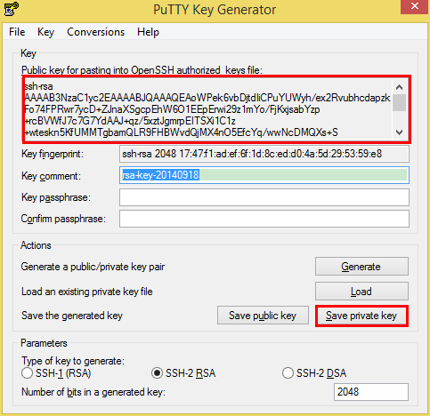
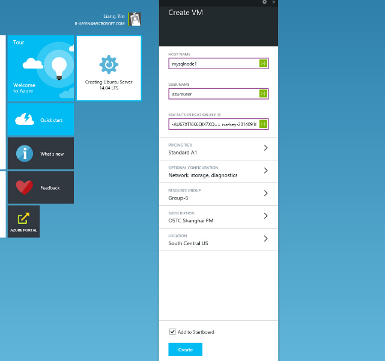

<properties
	pageTitle="How to install MySQL on Azure "
	description="Learn how to install the MySQL stack on a Linux virtual machine (VM) in Azure. You can install on Ubuntu or CentOS."
	services="virtual-machines"
	documentationCenter=""
	authors="SuperScottz"
	manager="timlt"
	editor=""/>

<tags
	ms.service="virtual-machines"
	ms.workload="infrastructure-services"
	ms.tgt_pltfrm="vm-linux"
	ms.devlang="na"
	ms.topic="article"
	ms.date="03/12/2015"
	ms.author="mingzhan"/>

#How to install MySQL on Azure


In this topic,tt is assumed that the reader already has an Azure account. If not, it is recommended to sign up by visiting [Azure](http://azure.microsoft.com).



##Creating a VM image in Microsoft Azure.
Here we will create a new VM from Microsoft Azure management portal.
###Generate “SSH Authentication Key”
We will need the SSH key to access the Azure portal. 


- Download and install puttygen from [here](http://www.chiark.greenend.org.uk/~sgtatham/putty/download.html). 
- Run puttygen.exe.
- Click “Generate” button to generate Keys.


 
 
- After the key is generated, it will show as below. 
 
 

- Copy the public key, and save it in a file named “publicKey.key”. Don’t just click the “Save public key” button, because the saved public key’s format is different from the public key we want.
- Click "save private key" button and save it as “privateKey.ppk”. 

###Login Azure Portal

Go to  https://portal.azure.com/, and login.

###Create a Linux VM

Click “NEW” in the left bottom, create an image by following the instructions, choosing the Linux image accord to your needs. Here I choose Ubuntu 14.04 as an example. 

  

###Set up HOST NAME

For “HOST NAME”: this is the URL you can use to access your virtual machine. You just need to specify the DNS name, for example “mysqlnode1”, Azure will generate the URL as “mysqlnode1.cloudapp.net”; For “SSH AUTHENTICATION KEY”: this is the public key which generate by puttygen, you need copy it from the content in file “publicKey.key”.

  
  

##Open the MySQL default port
Endpoints in Microsoft azure consists of a protocol, along with a public and private port.The private port is port that the service is listening on the local computer. The public port is the port that the service is listening on externally.
Port 3306 is the default port number which will be listened to by MySQL.
Click “BROWSE”  ⇒ “VIRTUAL MACHINE”, then click the image you created.
 
   


##Connect to the image you created
You can choose any SSH tools to connect to your virtual machine. Here we use Putty as example.
 

- First download Putty, the download URL of Putty is here .
- After download the Putty, click the executable file “PUTTY.EXE”. Setting as follows.


     The “Host Name (or IP address)” is the URL as “DNS NAME” when you create an image.
     
     The “Port” we can chose 22.  This is default port of SSH services.

   
 
- Before selecting Open, click the Connection > SSH > Auth tab to browse your file which generated by Puttygen and contain private key. See the screenshot below for the field to fill in.

   
 
- Then click “Open”, you may be alerted by a message box, stating that the machine you connect may not be the machine you want to connect. If you have configured DNS name and port number correctly, click “yes”.
  
 

- After that, you see like follow. 
 
 


##Install MySQL on your virtual machine
Three installation methods are supported for MySQL: binary packages, rpm packages and source packages.
For performance consideration, we will use rpm package for MySQL 5.6 as an example for this article. MySQL5.6 performance is significantly improved over MySQL5.5.  More information can be found [here](http://www.mysqlperformanceblog.com/2013/02/18/is-mysql-5-6-slower-than-mysql-5-5/).


###How to install MySQL5.6 on Ubuntu or Debian
We will use Ubuntu 14.04 LTS as example for this article. 

- Step 1: Install MySQL Server 5.6

    Install mysql-server 5.6 with apt-get command

              # azureuser@mysqlnode1:~$ sudo apt-get update
              # azureuser@mysqlnode1:~$ sudo apt-get -y install mysql-server-5.6

    During installation, you will see a pop up dialog asking you to set MySQL root password. You will need to specify the new MySQL user root password.
    Below is the screenshot.

 

    Confirm the password again when it is asked.

 
 
- Step 2: Login into MySQL Server

    After MySQL server installation is finishes, MySQL service is started automatically. You can login in MySQL Server with user root.
    To login into MySQL Server, use the below command.It will ask the mysql root password which you have set during mysql server installation.

             # azureuser@mysqlnode1:~$ mysql -uroot -p

- Step 3: Check MySQL Service on the VM
    
    After logon, make sure MySQL service is running, you can user following commends to start/restart the service.

    (a) To get status of MySQL service

             #sudo service mysql status

    (b) To start MySQL Service

             #sudo service mysql start

    (c) To stop MySQL service

             #sudo service mysql stop

    (d) To restart the MySQL service

             #sudo service mysql restart


###How to install MySQL on Redhat OS family or Oracle Linux
- Step 1: Adding the MySQL Yum Repository
    To get root permissions, run command: 

            #sudo su -
            #[root@azureuser ~]# wget http://repo.mysql.com/mysql-community-release-el6-5.noarch.rpm 
            #[root@azureuser ~]# yum localinstall -y mysql-community-release-el6-5.noarch.rpm 

- Step 2: Selecting a Release Series
 
            #[root@azureuser ~]# vim /etc/yum.repos.d/mysql-community.repo

    This is a typical entry for a release series' subrepository in the file:

        \# *Enable to use MySQL 5.6*

        [mysql56-community]
        name=MySQL 5.6 Community Server

        baseurl=http://repo.mysql.com/yum/mysql-5.6-community/el/6/$basearch/

        enabled=1

        gpgcheck=1

        gpgkey=file:/etc/pki/rpm-gpg/RPM-GPG-KEY-mysql

- Step 3: Installing MySQL with Yum
    Install MySQL by the following command:

           #[root@azureuser ~]#yum install mysql-community-server 

    This installs the package for the MySQL server, as well as other required packages.

- Step 4: Check the MySQL running state

    You can check the status of the MySQL server with the following command:
   
           #[root@azureuser ~]#service mysqld status

    You can check whether the default port of the MySQL server is running:

           #[root@azureuser ~]#netstat  –tunlp|grep 3306

- Step 5: Starting and Stopping the MySQL Server

    Start the MySQL server with the following command:

           #[root@azureuser ~]#service mysqld start

    Stop the MySQL server with the following command:

           #[root@azureuser ~]#service mysqld stop

    To set MySQL to start when the system boots, execute the following command:

           #[root@azureuser ~]#chkconfig mysqld on


###How to install MySQL on Suse Linux

- Step 1: Install MySQL Server

    To elevate permissions, run command: 

           #sudo su -

    Install MySQL by the following command:

           #mysql-test:~ # zypper update

           #mysql-test:~ # zypper install mysql-server mysql-devel mysql

- Step 2: Check the MySQL running state

    You can check the status of the MySQL server with the following command:

           #mysql-test:~ # rcmysql status

    You can check whether the default port of the MySQL server is running;

           #mysql-test:~ # netstat  –tunlp|grep 3306

- Step 3: Starting and Stopping the MySQL Server

    Start the MySQL server with the following command:

           #mysql-test:~ # rcmysql start

    Stop the MySQL server with the following command:

           #mysql-test:~ # rcmysql stop

    To set MySQL to start when the system boots, execute the following command:

           #mysql-test:~ # insserv mysql
