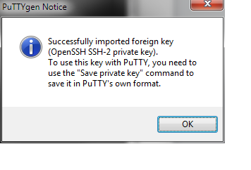
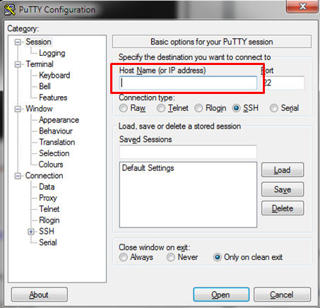

<properties 
	pageTitle="Use SSH to connect to Linux virtual machines in Azure" 
	description="Learn how to generate and use SSH keys with a Linux virtual machine on Azure." 
	services="virtual-machines" 
	documentationCenter="" 
	authors="szarkos" 
	manager="timlt" 
	editor=""/>

<tags 
	ms.service="virtual-machines" 
	ms.workload="infrastructure-services" 
	ms.tgt_pltfrm="vm-linux" 
	ms.devlang="na" 
	ms.topic="article" 
	ms.date="03/13/2015" 
	ms.author="szark"/>

#How to Use SSH with Linux on Azure

The current version of the Azure Management Portal only accepts SSH public keys that are encapsulated in an X509 certificate. Follow the steps below to generate and use SSH keys with Azure.

## Generate Azure Compatible Keys in Linux ##

1. Install the `openssl` utility if needed:

	**CentOS / Oracle Linux**

		# sudo yum install openssl

	**Ubuntu**

		# sudo apt-get install openssl

	**SLES & openSUSE**

		# sudo zypper install openssl

2. Use `openssl` to generate an X509 certificate with a 2048-bit RSA keypair. Please answer the few questions that the `openssl` prompts for (or you may leave them blank). The content in these fields is not used by the platform:

		# openssl req -x509 -nodes -days 365 -newkey rsa:2048 -keyout myPrivateKey.key -out myCert.pem

3.	Change the permissions on the private key to secure it.

		# chmod 600 myPrivateKey.key

4.	Upload the `myCert.pem` while creating the Linux virtual machine. The provisioning process will automatically install the public key in this certificate into the `authorized_keys` file for the specified user in the virtual machine.

5.	If you are going to use the API directly, and not use the Management Portal, convert the `myCert.pem` to `myCert.cer` (DER encoded X509 certificate) using the following command:

		# openssl  x509 -outform der -in myCert.pem -out myCert.cer

## Generate a Key from an Existing OpenSSH Compatible Key
The previous example describes how to create a new key for use with Azure. In some cases you may already have an existing OpenSSH compatible public & private key pair and wish to use the same keys with Azure.

OpenSSH private keys are directly readable by the `openssl` utility. The following command will take an existing SSH private key (id_rsa in the example below) and create the `.pem` public key that is needed for Azure:

	# openssl req -x509 -key ~/.ssh/id_rsa -nodes -days 365 -newkey rsa:2048 -out myCert.pem

The **myCert.pem** file is the public key that may then be used to provision a Linux virtual machine on Azure. During provisioning the `.pem` file will be translated into an `openssh` compatible public key and placed in `~/.ssh/authorized_keys`.

## Connect to an Azure Virtual Machine from Linux

1. In some cases the SSH endpoint for a Linux virtual machine may be configured for a port other then the default port 22. You can find the correct port number on the Dashboard for the VM in the Management Portal (under "SSH Details").

2.	Connect to the Linux virtual machine using `ssh`. You will be prompted to accept the fingerprint of the host's public key the first time you log in.

		# ssh -i  myPrivateKey.key -p <port> username@servicename.cloudapp.net

3.	(Optional) You may copy `myPrivateKey.key` to `~/.ssh/id_rsa` so that your OpenSSH client can automatically pick this up without the use of the `-i` option.

## Get OpenSSL on Windows ##
### Use msysgit ###

1.	Download and install msysgit from the following location: [http://msysgit.github.com/](http://msysgit.github.com/)
2.	Run `msys` from the installed directory (example: c:\msysgit\msys.exe)
3.	Change to the `bin` directory by typing in `cd bin`

###Use GitHub for Windows###

1.	Download and install GitHub for Windows from the following location: [http://windows.github.com/](http://windows.github.com/)
2.	Run Git Shell from the Start Menu > All Programs > GitHub, Inc

###Use cygwin###

1.	Download and install Cygwin from the following location: [http://cygwin.com/](http://cygwin.com/)
2.	Ensure that the OpenSSL package and all of its dependencies are installed.
3.	Run `cygwin`

## Create a Private Key on Windows ##

1.	Follow one of the set of instructions above to be able to run `openssl.exe`
2.	Type in the following command:

		# openssl.exe req -x509 -nodes -days 365 -newkey rsa:2048 -keyout myPrivateKey.key -out myCert.pem

3.	Your screen should look like the following:

	

4.	Answer the questions that are asked.
5.	It would have created two files: `myPrivateKey.key` and `myCert.pem`.
6.	If you are going to use the API directly, and not use the Management Portal, convert the `myCert.pem` to `myCert.cer` (DER encoded X509 certificate) using the following command:

		# openssl.exe  x509 -outform der -in myCert.pem -out myCert.cer

## Create a PPK for Putty ##

1. Download and install Puttygen from the following location: [http://www.chiark.greenend.org.uk/~sgtatham/putty/download.html](http://www.chiark.greenend.org.uk/~sgtatham/putty/download.html)

2. Puttygen may not be able to read the private key that was created earlier (`myPrivateKey.key`). Run the following command to translate it into an RSA private key that Puttygen can understand:

		# openssl rsa -in ./myPrivateKey.key -out myPrivateKey_rsa
		# chmod 600 ./myPrivateKey_rsa

	The command above should produce a new private key called myPrivateKey_rsa.

3. Run `puttygen.exe`

4. Click the menu: File > Load a Private Key

5. Find your private key, which we named `myPrivateKey_rsa` above. You will need to change the file filter to show **All Files (\*.\*)**

6. Click **Open**. You will receive a prompt which should look like this:

	

7. Click **OK**

8. Click **Save Private Key**, which is highlighted in the screenshot below:

	

9. Save the file as a PPK

## Use Putty to Connect to a Linux Machine ##

1.	Download and install putty from the following location: [http://www.chiark.greenend.org.uk/~sgtatham/putty/download.html](http://www.chiark.greenend.org.uk/~sgtatham/putty/download.html)
2.	Run putty.exe
3.	Fill in the host name using the IP from the Management Portal:

	

4.	Before selecting **Open**, click the Connection > SSH > Auth tab to choose your key. See the screenshot below for the field to fill in:

	

5.	Click **Open** to connect to your virtual machine
