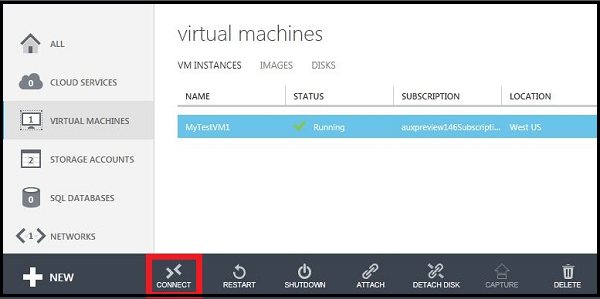

<properties urlDisplayName="Log on to a VM" pageTitle="Log on to a virtual machine running Windows Server" metaKeywords="Azure logging on vm, vm portal" description="Learn to use the Azure Management Portal to log on to a virtual machine running Windows Server." metaCanonical="" services="virtual-machines" documentationCenter="" title="How to Log on to a Virtual Machine Running Windows Server" authors="kathydav" solutions="" manager="timlt" editor="tysonn" />

<tags ms.service="virtual-machines" ms.workload="infrastructure-services" ms.tgt_pltfrm="vm-windows" ms.devlang="na" ms.topic="article" ms.date="08/05/2014" ms.author="kathydav" />

#How to Log on to a Virtual Machine Running Windows Server#

For a virtual machine that's running the Windows Server operating system, you use the Connect button in the Management Portal to start a Remote Desktop Connection. 

>[WACOM.NOTE] If you need to reset the user name or password, or enable RDP in the virtual machine, you can use the [VMAccess](http://go.microsoft.com/fwlink/p/?LinkId=396856) extension to do that. For requirements and troubleshooting tips, see [Connect to an Azure virtual machine with RDP or SSH](http://go.microsoft.com/fwlink/p/?LinkId=398294).

1. If you have not already done so, sign in to the [Azure Management Portal](http://manage.windowsazure.com).

2. Click **Virtual Machines**, and then select the appropriate virtual machine.

3. On the command bar, click **Connect**.

	

4. Click **Open** to use the Remote Desktop Protocol file that was automatically created for the virtual machine.
	
5. Click **Connect** to continue.

	

6. Type the user name and password of the administrative account on the virtual machine, and then click **OK**. This is the user name and password you specified when you created the virtual machine, unless the virtual machine is now a domain controller. In that case, type the user name and password of a domain administrator account for the domain.
	
	
7. Click **Yes** to verify the identity of the virtual machine.

	

	You can now work with the virtual machine just as you would with any other server.

