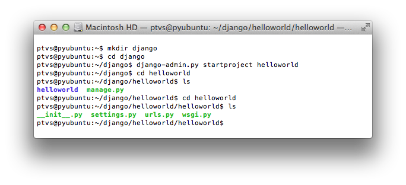

<properties linkid="develop-python-web-app-with-django-mac" urlDisplayName="Web with Django" pageTitle="Python web app with Django on Mac - Azure tutorial" metaKeywords="" description="A tutorial that shows how to host a Django-based web site on Azure using a Linux virtual machine." metaCanonical="" services="virtual-machines" documentationCenter="Python" title="Django Hello World Web Application (mac-linux)" authors="larryf" solutions="" manager="" editor="" />

# Django Hello World Web Application (mac-linux)

<a href="/en-us/develop/python/tutorials/web-app-with-django/" title="Windows">Windows</a><a href="/en-us/develop/python/tutorials/django-hello-world-(maclinux)/" title="Mac/Linux" class="current">Mac/Linux</a>

This tutorial describes how to host a Django-based web site on Windows 
Azure using a Linux virtual machine. This tutorial assumes you have no prior experience using Azure. Upon completing this guide, you will have a Django-based application up and running in the cloud.

You will learn how to:

* Setup an Azure virtual machine to host Django. While this tutorial explains how to accomplish this under **Linux**, the same could also be done with a Windows Server VM hosted in Azure. 
* Create a new Django application from Linux.

By following this tutorial, you will build a simple Hello World web
application. The application will be hosted in an Azure virtual machine.

A screenshot of the completed application is below:

[WACOM.INCLUDE [create-account-and-vms-note](../includes/create-account-and-vms-note.md)]

## Creating and configuring an Azure virtual machine to host Django

1. Follow the instructions given [here][portal-vm] to create an Azure virtual machine of the *Ubuntu Server 12.04* distribution.

  **Note:** you *only* need to create the virtual machine. Stop at the section titled *How to log on to the virtual machine after you create it*.

1. Instruct Azure to direct port **80** traffic from the web to port **80** on the virtual machine:
	* Navigate to your newly created virtual machine in the Azure Portal and click the *ENDPOINTS* tab.
	* Click *ADD ENDPOINT* button at the bottom of the screen.
	
	* Open up the *TCP* protocol's *PUBLIC PORT 80* as *PRIVATE PORT 80*.
	

## Setting up the development environment

**Note:** If you need to install Python or would like to use the Client Libraries, please see the [Python Installation Guide](../python-how-to-install/).

The Ubuntu Linux VM already comes with Python 2.7 pre-installed, but it doesn't have Apache or django installed.  Follow these steps to connect to your VM and install Apache and django.

1.  Launch a new **Terminal** window.
    
1.  Enter the following command to connect to the Azure VM.

		$ ssh yourusername@yourVmUrl

1.  Enter the following commands to install django:

		$ sudo apt-get install python-setuptools
		$ sudo easy_install django

1.  Enter the following command to install Apache with mod-wsgi:

		$ sudo apt-get install apache2 libapache2-mod-wsgi

## Creating a new Django application

1.  Open the **Terminal** window you used in the previous section to ssh into your VM.
    
1.  Enter the following commands to create a new Django project:

    

    The **django-admin.py** script generates a basic structure for Django-based web sites:
    -   **manage.py** helps you to start hosting and stop hosting your Django-based web site
    -   **helloworld\settings.py** contains Django settings for your application.
    -   **helloworld\urls.py** contains the mapping code between each url and its view.

1.  Create a new file named **views.py** in the *helloworld* subdirectory of *django\helloworld*, as a sibling of **urls.py**. This will contain the view that renders the "hello world" page. Start your editor and enter the following:
		
		from django.http import HttpResponse
		def hello(request):
    		html = "<html><body>Hello World!</body></html>"
    		return HttpResponse(html)

1.  Now replace the contents of the **urls.py** file with the following:

		from django.conf.urls.defaults import patterns, include, url
		from helloworld.views import hello
		urlpatterns = patterns('',
			(r'^$',hello),
		)

## Deploying and running your Django web site

1.  Edit the apache configuration file **/etc/apache2/httpd.conf** and add the following, replacing *username* with the user name that you specified during the creation of the VM:

		WSGIScriptAlias / /home/*username*/django/helloworld/helloworld/wsgi.py
		WSGIPythonPath /home/*username*/django/helloworld

		<Directory /home/*username*/django/helloworld/helloworld>
		<Files wsgi.py>
		Order deny,allow
		Allow from all
		</Files>
		</Directory>

1.  Restart apache with the following command:

        $ sudo apachectl restart

1.  Finally, load the web page in your browser:

	

## Shutting down your Azure virtual machine

When you're done with this tutorial, shutdown and/or remove your newly created Azure virtual machine to free up resources for other tutorials and avoid incurring Azure usage charges.

[portal-vm]: /en-us/manage/linux/tutorials/virtual-machine-from-gallery/
