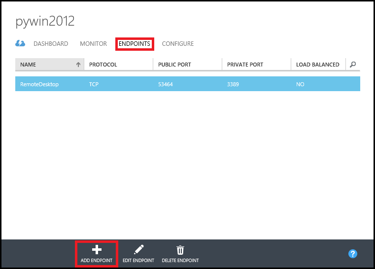
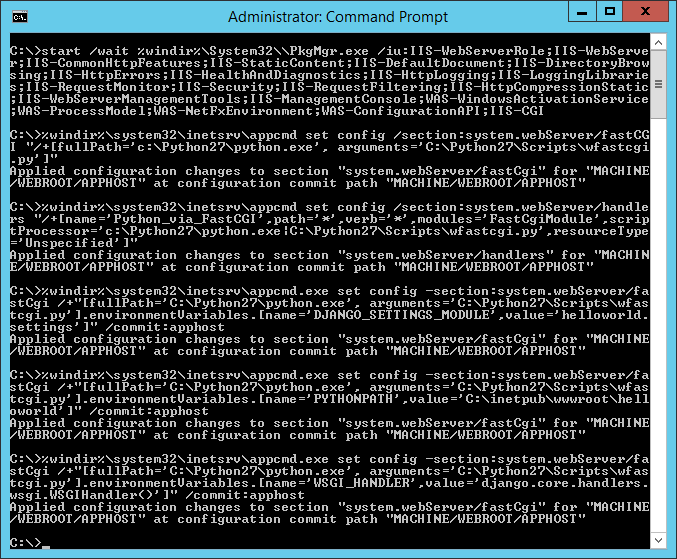
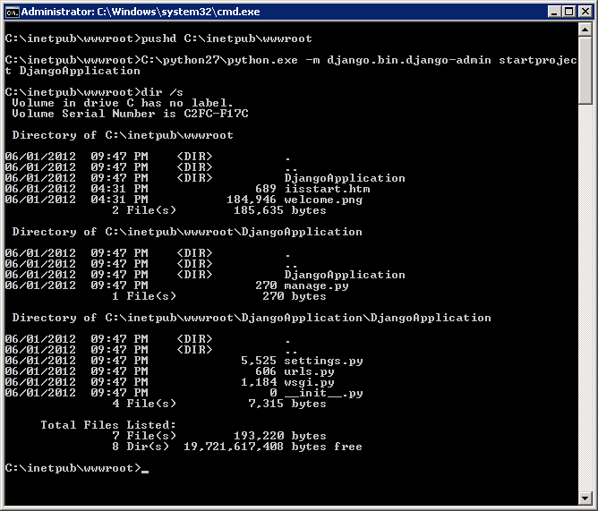

<properties 
	pageTitle="Python web app with Django - Azure tutorial" 
	description="A tutorial that teaches you how to host a Django-based website on Azure using a Windows Server 2012 R2 Datacenter virtual machine." 
	services="virtual-machines" 
	documentationCenter="python" 
	authors="huguesv" 
	manager="wpickett" 
	editor=""/>

<tags 
	ms.service="virtual-machines" 
	ms.workload="web" 
	ms.tgt_pltfrm="vm-windows" 
	ms.devlang="python" 
	ms.topic="article" 
	ms.date="02/05/2015" 
	ms.author="huvalo"/>

# Django Hello World Web Application

<a href="/develop/python/tutorials/web-app-with-django/" title="Windows" class="current">Windows</a><a href="/develop/python/tutorials/django-hello-world-(maclinux)/" title="MacLinux">Mac/Linux</a>

This tutorial describes how to host a Django-based website on Microsoft 
Azure using a Windows Server virtual machine. This tutorial assumes you have no prior experience using Azure. Upon completing this guide, you will have a Django-based application up and running in the cloud.

You will learn how to:

* Setup an Azure virtual machine to host Django. While this tutorial explains how to accomplish this under **Windows Server**, the same could also be done with a Linux VM hosted in Azure. 
* Create a new Django application from Windows.

By following this tutorial, you will build a simple Hello World web
application. The application will be hosted in an Azure virtual machine.

A screenshot of the completed application is below:

![A browser window displaying the hello world page on Azure][1]

[AZURE.INCLUDE [create-account-and-vms-note](../includes/create-account-and-vms-note.md)]

## Creating and configuring an Azure virtual machine to host Django

1. Follow the instructions given [here][portal-vm] to create an Azure virtual machine of the *Windows Server 2012 R2 Datacenter* distribution.

1. Instruct Azure to direct port **80** traffic from the web to port **80** on the virtual machine:
 - Navigate to your newly created virtual machine in the Azure Portal and click the *ENDPOINTS* tab.
 - Click the *ADD* button at the bottom of the screen.
	

 - Open up the *TCP* protocol's *PUBLIC PORT 80* as *PRIVATE PORT 80*.
![][port80]
1. From the *DASHBOARD* tab, click *CONNECT* to use *Remote Desktop* to remotely log into the newly created Azure virtual machine.  

**Important Note:** all instructions below assume you logged into the virtual machine correctly and are issuing commands there rather than your local machine! 

## Setting up Python and Django

**Note:** In order to download using Internet Explorer you may have to configure IE ESC settings (Start/Administrative Tools/Server Manager/Local Server, then click  **IE Enhanced Security Configuration**, set to Off).

1. Install [Web Platform Installer][].
1. Install Python and WFastCGI using Web Platform Installer.  This will install wfastcgi.py in your Python scripts folder.
	1. Start Web Platform Installer.
	1. Type WFastCGI in the search bar. 
	1. Select the WFactCGI entry for the version of Python you wish to use (2.7 or 3.4).  Note that this will install Python as a dependency of WFastCGI. 
1. Install Django using pip.

    Python 2.7:

        c:\python27\scripts\pip install django

    Python 3.4:

        c:\python34\scripts\pip install django

## Setting up IIS with FastCGI

1. Install IIS with FastCGI support.  This may take several minutes to execute.

		start /wait %windir%\System32\\PkgMgr.exe /iu:IIS-WebServerRole;IIS-WebServer;IIS-CommonHttpFeatures;IIS-StaticContent;IIS-DefaultDocument;IIS-DirectoryBrowsing;IIS-HttpErrors;IIS-HealthAndDiagnostics;IIS-HttpLogging;IIS-LoggingLibraries;IIS-RequestMonitor;IIS-Security;IIS-RequestFiltering;IIS-HttpCompressionStatic;IIS-WebServerManagementTools;IIS-ManagementConsole;WAS-WindowsActivationService;WAS-ProcessModel;WAS-NetFxEnvironment;WAS-ConfigurationAPI;IIS-CGI

### Python 2.7

Run these commands only if you are using Python 2.7.

1. Setup the Python Fast CGI Handler.

		%windir%\system32\inetsrv\appcmd set config /section:system.webServer/fastCGI "/+[fullPath='c:\Python27\python.exe', arguments='C:\Python27\Scripts\wfastcgi.py']"

1. Register the handler for this site.

		%windir%\system32\inetsrv\appcmd set config /section:system.webServer/handlers "/+[name='Python_via_FastCGI',path='*',verb='*',modules='FastCgiModule',scriptProcessor='c:\Python27\python.exe|C:\Python27\Scripts\wfastcgi.py',resourceType='Unspecified']"

1. Configure the handler to run your Django application.

		%windir%\system32\inetsrv\appcmd.exe set config -section:system.webServer/fastCgi /+"[fullPath='C:\Python27\python.exe', arguments='C:\Python27\Scripts\wfastcgi.py'].environmentVariables.[name='DJANGO_SETTINGS_MODULE',value='helloworld.settings']" /commit:apphost

1. Configure PYTHONPATH so your Django app can be found by the Python interpreter.

		%windir%\system32\inetsrv\appcmd.exe set config -section:system.webServer/fastCgi /+"[fullPath='C:\Python27\python.exe', arguments='C:\Python27\Scripts\wfastcgi.py'].environmentVariables.[name='PYTHONPATH',value='C:\inetpub\wwwroot\helloworld']" /commit:apphost

1. Tell the FastCGI to WSGI gateway which WSGI handler to use.

		%windir%\system32\inetsrv\appcmd.exe set config -section:system.webServer/fastCgi /+"[fullPath='C:\Python27\python.exe', arguments='C:\Python27\Scripts\wfastcgi.py'].environmentVariables.[name='WSGI_HANDLER',value='django.core.handlers.wsgi.WSGIHandler()']" /commit:apphost

1. You should see the following:

	 

### Python 3.4

Run these commands only if you are using Python 3.4.

1. Setup the Python Fast CGI Handler.

		%windir%\system32\inetsrv\appcmd set config /section:system.webServer/fastCGI "/+[fullPath='c:\Python34\python.exe', arguments='C:\Python34\Scripts\wfastcgi.py']"

1. Register the handler for this site.

		%windir%\system32\inetsrv\appcmd set config /section:system.webServer/handlers "/+[name='Python_via_FastCGI',path='*',verb='*',modules='FastCgiModule',scriptProcessor='c:\Python34\python.exe|C:\Python34\Scripts\wfastcgi.py',resourceType='Unspecified']"

1. Configure the handler to run your Django application.

		%windir%\system32\inetsrv\appcmd.exe set config -section:system.webServer/fastCgi /+"[fullPath='C:\Python34\python.exe', arguments='C:\Python34\Scripts\wfastcgi.py'].environmentVariables.[name='DJANGO_SETTINGS_MODULE',value='helloworld.settings']" /commit:apphost

1. Configure PYTHONPATH so your Django app can be found by the Python interpreter.

		%windir%\system32\inetsrv\appcmd.exe set config -section:system.webServer/fastCgi /+"[fullPath='C:\Python34\python.exe', arguments='C:\Python34\Scripts\wfastcgi.py'].environmentVariables.[name='PYTHONPATH',value='C:\inetpub\wwwroot\helloworld']" /commit:apphost

1. Tell the FastCGI to WSGI gateway which WSGI handler to use.

		%windir%\system32\inetsrv\appcmd.exe set config -section:system.webServer/fastCgi /+"[fullPath='C:\Python34\python.exe', arguments='C:\Python34\Scripts\wfastcgi.py'].environmentVariables.[name='WSGI_HANDLER',value='django.core.handlers.wsgi.WSGIHandler()']" /commit:apphost

1. You should see the following:

	 

## Creating a new Django application

1.  From *C:\inetpub\wwwroot*, enter the following command to create a new Django project:

    Python 2.7:

		C:\Python27\Scripts\django-admin.exe startproject helloworld

    Python 3.4:

		C:\Python34\Scripts\django-admin.exe startproject helloworld
    
	

1.  The **django-admin** command generates a basic structure for Django-based websites:
    
  -   **helloworld\manage.py** helps you to start hosting and stop hosting your Django-based website
  -   **helloworld\helloworld\settings.py** contains Django settings for your application.
  -   **helloworld\helloworld\urls.py** contains the mapping code between each url and its view.

1.  Create a new file named **views.py** in the *C:\inetpub\wwwroot\helloworld\helloworld* directory. This will contain the view that renders the "hello world" page. Start your editor and enter the following:
		
		from django.http import HttpResponse
		def home(request):
    		html = "<html><body>Hello World!</body></html>"
    		return HttpResponse(html)

1.  Replace the contents of the **urls.py** file with the following:

		from django.conf.urls import patterns, url
		urlpatterns = patterns('',
			url(r'^$', 'helloworld.views.home', name='home'),
		)

1. Finally, load the web page in your browser.

![A browser window displaying the hello world page on Azure][1]

## Shutting down your Azure virtual machine

When you're done with this tutorial, shutdown and/or remove your newly created Azure virtual machine to free up resources for other tutorials and avoid incurring Azure usage charges.

[1]: ./media/virtual-machines-python-django-web-app-windows-server/django-helloworld-browser-azure.png

[port80]: ./media/virtual-machines-python-django-web-app-windows-server/django-helloworld-port80.png

[portal-vm]: /manage/windows/tutorials/virtual-machine-from-gallery/

[Web Platform Installer]: http://www.microsoft.com/web/downloads/platform.aspx

