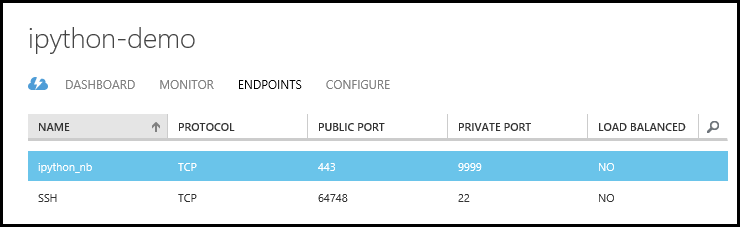
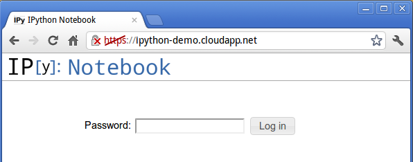
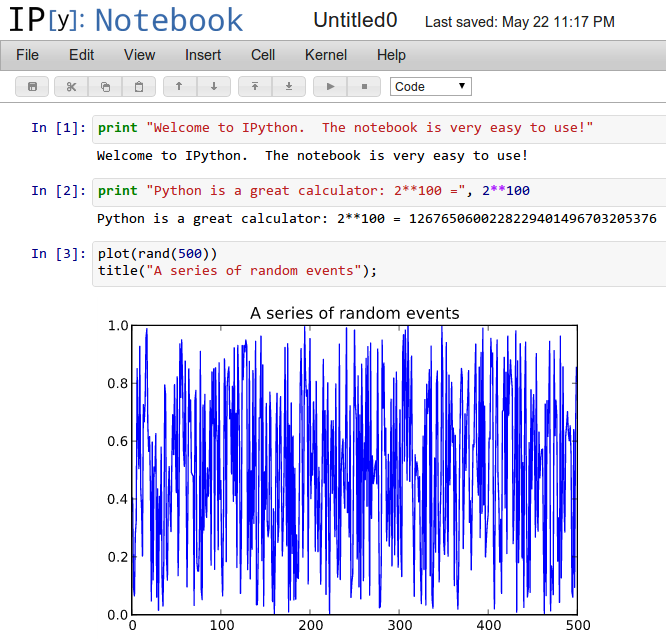
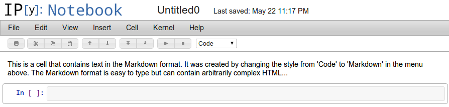
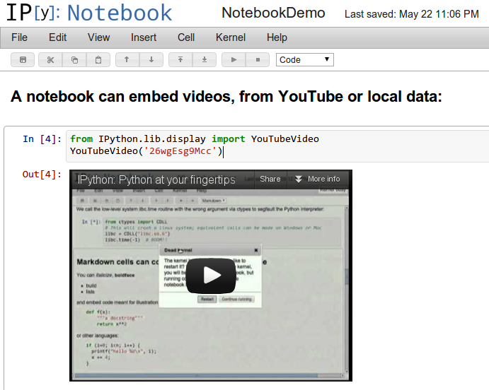
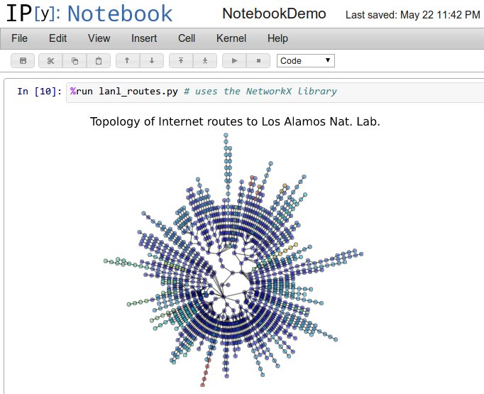

<properties 
	pageTitle="IPython Notebook - Azure tutorial" 
	description="A tutorial that shows how to deploy the IPython Notebook on Azure, using Linux or Windows virtual machines (VMs)." 
	services="virtual-machines" 
	documentationCenter="python" 
	authors="huguesv" 
	manager="wpickett" 
	editor=""/>

<tags 
	ms.service="virtual-machines" 
	ms.workload="infrastructure-services" 
	ms.tgt_pltfrm="vm-multiple" 
	ms.devlang="python" 
	ms.topic="article" 
	ms.date="02/05/2015" 
	ms.author="huvalo"/>

# IPython Notebook on Azure

The <a href="http://ipython.org">IPython project</a> provides a collection of tools for scientific computing that include powerful interactive shells, high-performance and easy to use parallel libraries and a web-based environment called the IPython Notebook. The Notebook provides a working environment for interactive computing that combines code execution with the creation of a live computational document. These notebook files can contain arbitrary text, mathematical formulas, input code, results, graphics, videos and any other kind of media that a modern web browser is capable of displaying.

<a href="http://go.microsoft.com/fwlink/?LinkID=254535&amp;clcid=0x409" target="_blank" class="label">watch the tutorial</a> <a style="background-image: url('/media/devcenter/python/ipy-youtube2.png') !important;" href="http://go.microsoft.com/fwlink/?LinkID=254535&amp;clcid=0x409" target="_blank" class="dev-onpage-video">Play Video</a> 5:22

Whether you're absolutely new to Python and want to learn it in a fun,
interactive environment or do some serious parallel/technical computing, the
IPython Notebook is a great choice. As an illustration of its capabilities, the
following screenshot shows the IPython Notebook being used, in combination with
the SciPy and matplotlib packages, to analyze the structure of a sound
recording:

This document will show you how to deploy the IPython Notebook on Microsoft
Azure, using Linux or Windows virtual machines (VMs).  By using the IPython
Notebook on Azure, you can easily provide a web-accessible interface to
scalable computational resources with all the power of Python and its many
libraries.  Since all installation is done in the cloud, users can access these
resources without the need for any local configuration beyond a modern web
browser.

[AZURE.INCLUDE [create-account-and-vms-note](../includes/create-account-and-vms-note.md)]

## Create and Configure a VM on Azure

The first step is to create a Virtual Machine (VM)  running on Azure.
This VM is a complete operating system in the cloud and will be used to
run the IPython Notebook. Azure is capable of running both Linux and Windows
virtual machines, and we will cover the setup of IPython on both types of virtual machines.

### Linux VM

Follow the instructions given [here][portal-vm-linux] to create a virtual machine of the *OpenSUSE* or *Ubuntu* distribution. This tutorial uses OpenSUSE 13.2 and Ubuntu Server 14.04 LTS. We'll assume the default user name *azureuser*.

### Windows VM

Follow the instructions given [here][portal-vm-windows] to create a virtual machine of the *Windows Server 2012 R2 Datacenter* distribution. In this tutorial, we'll assume that the user name is *azureuser*.

## Create an Endpoint for the IPython Notebook

This step applies to both the Linux and Windows VM. Later on we will configure
IPython to run its notebook server on port 9999. To make this port publicly
available, we must create an endpoint in the Azure Management Portal. This
endpoint opens up a port in the Azure firewall and maps the public port (HTTPS,
443) to the private port on the VM (9999).

To create an endpoint, go to the VM dashboard, click "Endpoints", then "Add
Endpoint" and create a new endpoint (called `ipython_nb` in this example). Pick
TCP for the protocol, 443 for the public port and 9999 for the private port:

After this step, the "Endpoints" Dashboard tab will look like this:

## Install Required Software on the VM

To run the IPython Notebook on our VM, we must first install IPython and
its dependencies.

### Linux (OpenSUSE)

To install IPython and its dependencies, SSH into the Linux VM and carry out 
the following steps.

Install [NumPy][numpy], [Matplotlib][matplotlib], [Tornado][tornado] and other IPython's dependencies by doing:

    sudo zypper install python-matplotlib
    sudo zypper install python-tornado
    sudo zypper install python-jinja2
    sudo zypper install ipython

### Linux (Ubuntu)

To install IPython and its dependencies, SSH into the Linux VM and carry out 
the following steps.

First, retrieve new lists of packages:

    sudo apt-get update

Install [NumPy][numpy], [Matplotlib][matplotlib], [Tornado][tornado] and other IPython's dependencies by doing:

    sudo apt-get install python-matplotlib
    sudo apt-get install python-tornado
    sudo apt-get install ipython
    sudo apt-get install ipython-notebook

### Windows

To install IPython and its dependencies on the Windows VM, Remote Desktop to connect to the VM. Then carry out the following steps, 
using the Windows PowerShell to run all command line actions.

**Note**: In order to download anything using Internet Explorer, you'll need to change some security settings.  From **Server Manager**, click on **Local Server**, then on **IE Enhanced Security Configuration** and turn it off for administrators.  You can enable it again once you're done installing IPython.

1.  Download and install the latest 32-bit version of [Python 2.7][].  You will need to add `C:\Python27` and `C:\Python27\Scripts` to your `PATH` environment variable.

1.  Install [Tornado][tornado] and [PyZMQ][pyzmq] and other IPython's dependencies by doing:

        easy_install tornado
        easy_install pyzmq
        easy_install jinja2
        easy_install six
        easy_install python-dateutil
        easy_install pyparsing

1.  Download and install [NumPy][numpy] using the `.exe` binary installer available on their website.  As of this writing, the latest version is **numpy-1.9.1-win32-superpack-python2.7.exe**.

1.  Install [Matplotlib][matplotlib] by doing:

        pip install matplotlib==1.4.2

1.  Download and install [OpenSSL][].

	* You'll find the required **Visual C++ 2008 Redistributable** on the same download page.

	* You will need to add `C:\OpenSSL-Win32\bin` to your `PATH` environment variable.

	> [AZURE.NOTE] When installing OpenSSL, use version 1.0.1g or higher as these include a fix for the Heartbleed security vulnerability.

1.  Install IPython using the command:

        pip install ipython==2.4

1.  Open a port in Windows Firewall.  On Windows Server 2012, the firewall will block incoming connections by default.  To open port 9999, follow these steps:

    - Start **Windows Firewall with Advanced Security** from the Start Screen.

    - Click on **Inbound Rules** in the left panel.

	- Click on **New Rule...** in the Actions panel.

	- In the New Inbound Rule Wizard, select **Port**.

	- In the next screen, select **TCP** and enter **9999** in **Specific local ports**.

	- Accept defaults, give the rule a name and click Finish.

### Configure the IPython Notebook

Next, we configure the IPython Notebook. The first step is to create a custom
IPython configuration profile to encapsulate the configuration information:

    ipython profile create nbserver

Next we `cd` to the profile directory to create our SSL certificate and edit
the profiles configuration file.

On Linux:

    cd ~/.ipython/profile_nbserver/

On Windows:

    cd \users\azureuser\.ipython\profile_nbserver

Create the SSL certificate as follows (Linux and Windows):

    openssl req -x509 -nodes -days 365 -newkey rsa:1024 -keyout mycert.pem -out mycert.pem

Note that since we are creating a self-signed SSL certificate, when connecting
to the notebook your browser will give you a security warning.  For long-term
production use, you will want to use a properly signed certificate associated
with your organization.  Since certificate management is beyond the scope of
this demo, we will stick to a self-signed certificate for now.

In addition to using a certificate, you must also provide a password to protect
your notebook from unauthorized use.  For security reasons IPython uses
encrypted passwords in its configuration file, so you'll need to encrypt your
password first.  IPython provides a utility to do so; at a command prompt run:

    python -c "import IPython;print IPython.lib.passwd()"

This will prompt you for a password and confirmation, and will then print the
password as follows:

    Enter password: 
    Verify password: 
    sha1:b86e933199ad:a02e9592e59723da722.. (elided the rest for security)
    
Next, we will edit the profile's configuration file, which is the
`ipython_notebook_config.py` file in the profile directory you are in.  Note that this file may not exist -- just create it.  This
file has a number of fields and by default all are commented out.  You can open
this file with any text editor of your liking, and you should ensure that it
has at least the following content:

    c = get_config()
    
    # This starts plotting support always with matplotlib
    c.IPKernelApp.pylab = 'inline'
    
    # You must give the path to the certificate file.
    
    # If using a Linux VM:
    c.NotebookApp.certfile = u'/home/azureuser/.ipython/profile_nbserver/mycert.pem'
    
    # And if using a Windows VM:
    c.NotebookApp.certfile = r'C:\Users\azureuser\.ipython\profile_nbserver\mycert.pem'
    
    # Create your own password as indicated above
    c.NotebookApp.password = u'sha1:b86e933199ad:a02e9592e5 etc... '
    
    # Network and browser details. We use a fixed port (9999) so it matches
    # our Azure setup, where we've allowed traffic on that port
    
    c.NotebookApp.ip = '*'
    c.NotebookApp.port = 9999
    c.NotebookApp.open_browser = False

### Run the IPython Notebook

At this point we are ready to start the IPython Notebook. To do this,
navigate to the directory you want to store notebooks in and start
the IPython Notebook server:

    ipython notebook --profile=nbserver

You should now be able to access your IPython Notebook at the address
`https://[Your Chosen Name Here].cloudapp.net`.

When you first access your notebook, the login page asks for your password:

And once you log in, you will see the "IPython Notebook Dashboard", which is
the control center for all notebook operations.  From this page you can create
new notebooks, open existing ones, etc:

If you click on the "New Notebook" button, you will see an opening page as
follows:

The area marked with an `In []:` prompt is the input area, and here you can
type any valid Python code and it will execute when you hit `Shift-Enter` or
click on the "Play" icon (the right-pointing triangle in the toolbar).

Sinc we have configured the notebook to start with NumPy and matplotlib support
automatically, you can even produce figures, for example:

## A powerful paradigm: live computational documents with rich media

The notebook itself should feel very natural to anyone who has used Python and
a word processor, because it is in some ways a mix of both: you can execute
blocks of Python code, but you can also keep notes and other text by changing
the style of a cell from "Code" to "Markdown" using the drop-down menu in the
toolbar:

But this is much more than a word processor, as the IPython notebook allows the
mixing of computation and rich media (text, graphics, video and virtually
anything a modern web browser can display). For example, you can mix
explanatory videos with computation for educational purposes:

or embed external websites that remain live and usable, inside of a notebook
file:

And with the power of Python's many excellent libraries for scientific and
technical computing, a simple calculation can be performed with the same ease
than a complex network analysis, all in one environment:

This paradigm of mixing the power of the modern web with live computation
offers many possibilities, and is ideally suited for the cloud; the Notebook
can be used:

* as a computational scratchpad to record exploratory work on a problem,

* to share results with colleagues, either in 'live' computational form or in
  hardcopy formats (HTML, PDF),

* to distribute and present live teaching materials that involve computation,
  so students can immediately experiment with the real code, modify it and
  re-execute it interactively,

* to provide "executable papers" that present the results of research in a way
  that can be immediately reproduced, validated and extended by others,

* as a platform for collaborative computing: multiple users can log into the
  same notebook server to share a live computational session,

* and more...

If you go to the IPython source code [repository][], you will find an entire
directory with notebook examples which you can download and then experiment with on your own Azure IPython VM.  Simply download the `.ipynb` files from the site and upload them onto the dashboard of your notebook Azure VM (or download them directly into the VM).

## Conclusion

The IPython Notebook provides a powerful interface for accessing interactively
the power of the Python ecosystem on Azure.  It covers a wide range of
usage cases including simple exploration and learning Python, data analysis and
visualization, simulation and parallel computing. The resulting Notebook
documents contain a complete record of the computations that are performed and
can be shared with other IPython users.  The IPython Notebook can be used as a
local application, but it is ideally suited for cloud deployments on Azure

The core features of IPython are also available inside Visual Studio via the 
[Python Tools for Visual Studio][] (PTVS). PTVS is a free and open-source plug-in 
from Microsoft that turns Visual Studio into an advanced Python development 
environment that includes an advanced editor with IntelliSense, debugging, 
profiling and parallel computing integration.

[tornado]:      http://www.tornadoweb.org/          "Tornado"
[PyZMQ]:        https://github.com/zeromq/pyzmq     "PyZMQ"
[NumPy]:        http://www.numpy.org/               "NumPy"
[Matplotlib]:   http://matplotlib.sourceforge.net/  "Matplotlib"

[portal-vm-windows]: /manage/windows/tutorials/virtual-machine-from-gallery/
[portal-vm-linux]: /manage/linux/tutorials/virtual-machine-from-gallery/

[repository]: https://github.com/ipython/ipython
[Python Tools for Visual Studio]: http://aka.ms/ptvs

[Python 2.7]: http://www.python.org/download
[OpenSSL]: http://slproweb.com/products/Win32OpenSSL.html
