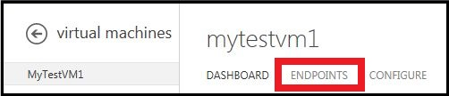
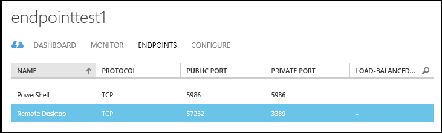
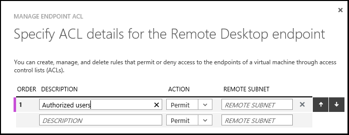

<properties 
	pageTitle="Set up endpoints on a virtual machine in Azure" 
	description="Learn to set up endpoints in the classic portal to allow communication with a virtual machine in Azure." 
	services="virtual-machines" 
	documentationCenter="" 
	authors="KBDAzure" 
	manager="timlt" 
	editor=""/>

<tags 
	ms.service="virtual-machines" 
	ms.workload="infrastructure-services" 
	ms.tgt_pltfrm="na" 
	ms.devlang="na" 
	ms.topic="article" 
	ms.date="04/29/2015" 
	ms.author="kathydav"/>

#How to Set Up Endpoints to a Virtual Machine

All virtual machines that you create in Azure can automatically communicate using a private network channel with other virtual machines in the same cloud service or virtual network. However, computers on the Internet or other virtual networks require endpoints to direct the inbound network traffic to a virtual machine.

When you create a virtual machine in the Azure Management Portal, endpoints for Remote Desktop, Windows PowerShell Remoting, and Secure Shell (SSH) are automatically created. You can configure additional endpoints while creating the virtual machine or afterwards as needed. 

Each endpoint has a public port and a private port:

- The public port is used by the Azure load balancer to listen for incoming traffic to the virtual machine from the Internet. 
- The private port is used by the virtual machine to listen for incoming traffic, typically destined to an application or service running on the virtual machine.

Default values for the IP protocol and TCP or UDP ports for well-known network protocols are provided when you create endpoints with the Management Portal. For custom endpoints, you must specify the correct IP protocol (TCP or UDP) and the public and private ports. To distribute incoming traffic randomly across multiple virtual machines, you must create a load-balanced set consisting of multiple endpoints.

After you create an endpoint, you can use an access control list (ACL) to define rules that permit or deny the incoming traffic to the public port of the endpoint based on its source IP address. However, if the virtual machine is in an Azure virtual network, you should use Network Security Groups instead. For more information, see [About Network Security Groups](https://msdn.microsoft.com/library/azure/dn848316.aspx).

**Important**: Firewall configuration for Azure virtual machines is done automatically for ports associated with Remote Desktop and Secure Shell (SSH), and in most cases for Windows PowerShell Remoting. For ports specified for all other endpoints, no configuration is done automatically to the firewall of the virtual machine. When you create an endpoint for the virtual machine, you'll need to ensure that the firewall of the virtual machine also allows the traffic for the protocol and private port corresponding to the endpoint configuration.

##Create an Endpoint

1.	If you have not already done so, sign in to the [Azure Management Portal](http://manage.windowsazure.com/).
2.	Click **Virtual Machines**, and then click the name of the virtual machine that you want to configure.
3.	Click **Endpoints**. The Endpoints page lists all the current endpoints for the virtual machine.

	
 
4.	In the taskbar, click **Add**. 
5.	On the **Add an endpoint to a virtual machine** page, choose the type of endpoint. 

	- If you're creating a new endpoint that is not part of a load-balanced set or the first member in a new load-balanced set, choose **Add a stand-alone endpoint**, and then click the left arrow.
	- Otherwise, choose **Add an endpoint to an existing load-balanced set**, select the name of the load-balanced set, and then click the left arrow. On the **Specify the details of the endpoint** page, type a name for the endpoint in **Name**, and then click the check mark to create the endpoint.

6.	On the **Specify the details of the endpoint** page, type a name for the endpoint in **Name**. You can also choose a network protocol name from the list, which will fill in initial values for the **Protocol**, **Public Port**, and **Private Port**.
7.	For a customized endpoint, in **Protocol**, choose either **TCP** or **UDP**.
8.	For customized ports, in **Public Port**, type the port number for the incoming traffic from the Internet. In **Private Port**, type the port number on which the virtual machine is listening. These port numbers can be different. Ensure that the firewall on the virtual machine has been configured to allow the traffic corresponding to the protocol (in step 7) and private port.
9.	If this endpoint will be the first one in a load-balanced set, click **Create a load-balanced set**, and then click the right arrow. On the **Configure the load-balanced set** page, specify a load-balanced set name, a probe protocol and port, and the probe interval and number of probes sent. The Azure load balancer sends probes to the virtual machines in a load-balanced set to monitor their availability. The Azure load balancer does not forward traffic to virtual machines that do not respond to the probe. Click the right arrow.
10.	Click the check mark to create the endpoint.

You will now see the endpoint listed on the Endpoints page.

 
To use an Azure PowerShell cmdlet to set this up, see [Add-AzureEndpoint](https://msdn.microsoft.com/library/azure/dn495300.aspx).

##Manage the ACL on an Endpoint

To define the set of computers that can send traffic, the ACL on an endpoint can restrict traffic based upon source IP address. Follow these steps to add, modify, or remove an ACL on an endpoint.

> [AZURE.NOTE] If the endpoint is part of a load-balanced set, any changes you make to the ACL on an endpoint are applied to all endpoints in the set.

If the virtual machine is in an Azure virtual network, you should use Network Security Groups instead. For details, see [About Network Security Groups](https://msdn.microsoft.com/library/azure/dn848316.aspx).

1.	If you have not already done so, sign in to the Azure Management Portal.
2.	Click **Virtual Machines**, and then click the name of the virtual machine that you want to configure.
3.	Click **Endpoints**. The Endpoints page lists all endpoints for the virtual machine.

    
 
4.	Select the appropriate endpoint from the list. 
5.	In the task bar, click **Manage ACL**. The **Specify ACL details** dialog box appears.

    
 
6.	Use rows in the list to add, delete, or edit rules for an ACL and change their order. The **Remote Subnet** value is an IP address range for incoming traffic from the Internet that the Azure load balancer will either permit or deny based on the traffic's source IP address. You must specify the IP address range in CIDR format, also known as address prefix format. An example is 131.107.0.0/16. 

You can use rules to allow only traffic from specific computers corresponding to your computers on the Internet or to deny traffic from specific, known address ranges.

The rules are evaluated in order starting with the first rule and ending with the last rule. This means that rules should be ordered from least restrictive to most restrictive. For examples and more information, see [About Network Access Control Lists](http://go.microsoft.com/fwlink/p/?linkid=303816).

To use an Azure PowerShell cmdlet to set this up, see [Managing Access Control Lists (ACLs) for Endpoints by using PowerShell](https://msdn.microsoft.com/library/azure/dn376543.aspx).

## Additional Resources

[Load Balancing for Azure Infrastructure Services](virtual-machines-load-balance.md)

[About Network Access Control Lists](http://go.microsoft.com/fwlink/p/?linkid=303816)

[About Network Security Groups](https://msdn.microsoft.com/library/azure/dn848316.aspx)

