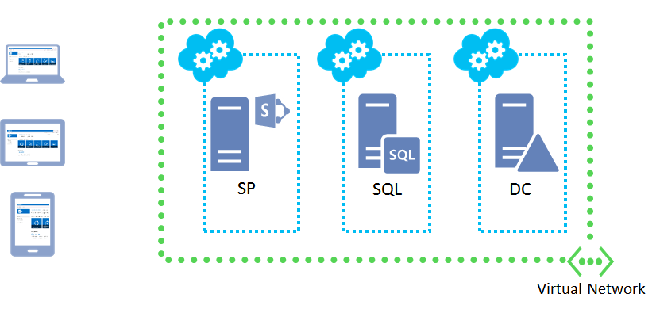
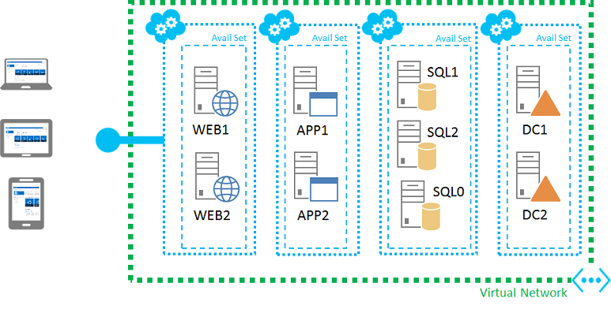

<properties title="SharePoint Server Farm" pageTitle="SharePoint Server Farm" description="Describes the new SharePoint farm feature available in the Azure Preview Portal" metaKeywords="" services="virtual-machines" solutions="" documentationCenter="" authors="josephd" videoId="" scriptId="" />

#SharePoint Server Farm#

With SharePoint Server Farm, the Microsoft Azure Preview Portal automatically creates a pre-configured SharePoint Server 2013 farm for you. This can save you a lot of time when you need a basic or high-availability SharePoint farm for a development and testing environment or if you are evaluating SharePoint Server 2013 as a collaboration solution for your organization.

The basic SharePoint farm consists of three virtual machines in the following configuration:

You can use this farm configuration for a simplified setup for SharePoint app development or your first-time evaluation of SharePoint 2013.

The high-availability SharePoint farm consists of nine virtual machines in the following configuration:

You can use this farm configuration to test higher client loads, high-availability of the external SharePoint site, and SQL Server AlwaysOn for a SharePoint farm. You can also use this configuration for SharePoint app development in a highly available environment.
 
For the configuration details of both of these farms, see [SharePoint Server Farm Configuration Details](../virtual-machines-sharepoint-farm-config-azure-preview/).

These farms have a pre-configured endpoint to allow authenticated web traffic (TCP port 80) to the SharePoint web server through an Internet-connected client computer. This endpoint is to a pre-configured team site. To access this team site, you must first obtain the domain name of the SharePoint farm web server:

1.	From the Azure Preview Portal, click **Browse**, and then click **Virtual Machines**. 
2.	In the list of virtual machines, click the name of your web server (ends in SP, WEB1, or WEB2).
3.	In the pane for your web server virtual machine, click **Properties**. 
4.	Note the FQDN in **Domain Name**. 
5.	From your Internet browser, access the URL **http://[FQDN]**. For example, for the domain name spfarm1-web1-contoso.cloudpapp.net, the URL is **http://spfarm1-web1-contoso.cloudpapp.net**.
6.	When prompted, enter the user account credentials that you specified when you created the farm.

From the Central Administration SharePoint site, you can configure My sites, SharePoint applications, and other functionality. For more information, see [Configure SharePoint 2013](http://technet.microsoft.com/library/ee836142.aspx).  To access the Central Administration SharePoint site, you must first obtain its external port number.

1.	From the Azure Preview Portal, click **Browse**, and then click **Virtual Machines**. 
2.	In the list of virtual machines, click the name of the name of the SharePoint server for the basic configuration (ends in SP) or the name of the application servers for the high-availability configuration (ends in APP1 or APP2).
3.	In the pane for the virtual machine, click **Properties**. 
4.	Note the FQDN in **Domain Name**. 
5.	Close the **Properties** pane.
6.	In the pane for the virtual machine, scroll down to the list of **Endpoints**.
7.	Note the port number for the endpoint named SPCentralAdmin.
8.	From your Internet browser, access the URL **http://[FQDN]:[port number]**. For example, for the domain name spfarm1-app1-contoso.cloudpapp.net and the external port number 54398, the URL is **http://spfarm1-app1-contoso.cloudpapp.net:54398**.
9.	When prompted, enter the user account credentials that you specified when you created the farm.

Notes:

- The Azure Preview Portal creates these virtual machines within your subscription.
- The Azure Preview Portal creates both of these farms in a cloud-only virtual network with an Internet-facing web presence. There is no site-to-site VPN connection back to your organization network. 
- You can administer these servers through remote desktop connections.

##Stepping through configuration##

To create your SharePoint farm with SharePoint Farm, do the following:

1. In the [Microsoft Azure Preview Portal](https://portal.azure.com/), click  **Virtual Machines** > **SharePoint Server Farm**.
2. In the **Create a SharePoint farm** pane, type the name of a resource group.
3. Type a user name and password for a local administrator account on each virtual machine in your farm. Choose a name and password that is difficult to guess.
4. If you want the high-availability farm, click **Enable high availability**.
5. To configure your domain controllers, click the arrow. You can specify a host name prefix (the default is the resource group name), forest root domain name (default is contoso.com), and the size of your domain controllers (default is A1).
6. To configure your SQL servers, click the arrow. You can specify a host name prefix (the default is the resource group name), the size of your SQL servers (default is A5), a database access account name and password (the default is to use the administrator account), and a SQL server service account name (the default is sqlservice) and password (the default is to use the same password as the administrator account).
7. To configure your SharePoint servers, click the arrow. You can specify a host name prefix (the default is the resource group name), the size of your SharePoint servers (default is A23), a SharePoint user account (the default is sp_setup) and password, a SharePoint farm account name (the default is sp_farm) and password, and a SharePoint farm passphrase. The default is to use the administrator password for the SharePoint user account, farm account, and passphrase.
8. To configure optional configuration (your virtual network or, storage account, diagnostics), click the arrow.
9. To specify the subscription, click the arrow.
10. To specify the location (region), click the arrow.
11. When you are done, click **Create**.

##Azure Resource Manager##

SharePoint Server Farm uses the Azure Resource Manager and scripts to automatically create the infrastructure and the server configurations for these SharePoint farms. For more information, see [Using Windows PowerShell with Resource Manager](http://azure.microsoft.com/en-us/documentation/articles/powershell-azure-resource-manager/).

