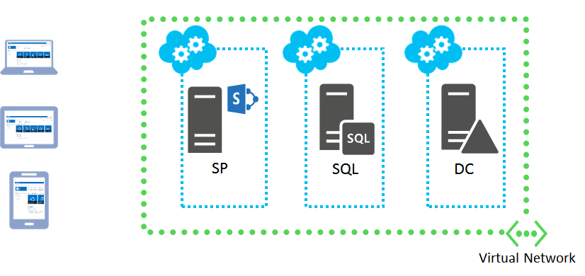
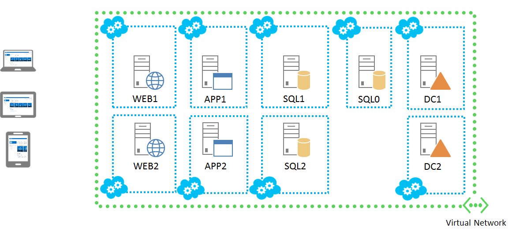

<properties 
	pageTitle="SharePoint Server Farm Configuration Details" 
	description="Describes the default configuration of SharePoint farms" 
	services="virtual-machines" 
	documentationCenter="" 
	authors="JoeDavies-MSFT" 
	manager="timlt" 
	editor=""/>

<tags 
	ms.service="virtual-machines" 
	ms.workload="infrastructure-services" 
	ms.tgt_pltfrm="vm-sharepoint" 
	ms.devlang="na" 
	ms.topic="article" 
	ms.date="04/09/2015" 
	ms.author="josephd"/>

# SharePoint Server Farm Configuration Details

SharePoint Server Farm is a feature of the Microsoft Azure Preview Portal that automatically creates a pre-configured SharePoint Server 2013 farm for you. There are two farm configurations:

- Basic
- High-availability

The following sections provide configuration details for each farm.

For additional information, see [SharePoint Server Farm](virtual-machines-sharepoint-farm-azure-preview.md).

## Basic SharePoint farm

The basic SharePoint farm consists of three virtual machines in this configuration:

 

Here are the configuration details:

-	Azure Subscription: Specified during the initial configuration.
-	Azure Domain Names (also known as cloud services): Separate Domain Names are automatically created for each virtual machine.
-	Storage account: Specified during the initial configuration.
-	Virtual network 	
	-   Type: Cloud-only	
    -	Address space: 192.168.16.0/26    

- Virtual machines
	-	*HostNamePrefix*-DC (AD DS domain controller)
	-	*HostNamePrefix*-SQL (SQL Server 2014 server)
	-	*HostNamePrefix*-SP (SharePoint 2013 server)

- Domain controller
	-	Virtual machine image: Windows Server 2012 R2.
	-	Host name prefix: Specified during the initial configuration.
	-	Size: A1 (default)
	-	Domain name: contoso.com (default)
	-	Domain administrator account name: Specified during the initial configuration.
	-	Domain administrator account password: Specified during the initial configuration.

- SQL Server
	-	Virtual machine image: SQL Server 2014 RTM Enterprise on Windows Server 2012 R2.
	-	Host name prefix: Specified during the initial configuration.
	-	Size: A5 (default)
	-	Database access account name: Specified during the initial configuration.
	-	Database access account password: Specified during the initial configuration.
	-	SQL Server service account name: Specified during the initial configuration.
	-	SQL Server service account password: Specified during the initial configuration.

- SharePoint server
	-	Virtual machine image: SharePoint Server 2013 Trial.
	-	Host name prefix: Specified during the initial configuration.
	-	Size: A2 (default)
	-	SharePoint farm account name: Specified during the initial configuration.
	-	SharePoint farm account password: Specified during the initial configuration.
	-	SharePoint farm passphrase: Specified during the initial configuration.

## High-availability SharePoint farm

The high-availability SharePoint farm consists of nine virtual machines in this configuration:

 
Here are the configuration details:

-	Azure Subscription: Specified during the initial configuration.
-	Azure Domain Names (also known as cloud services): Separate Domain Names are created according to the figure above.
-	Storage account: Specified during the initial configuration.
-	Virtual network	
	-	Type: Cloud-only
	-	Address space: 192.168.16.0/26	

-	Virtual machines
	-	*HostNamePrefix*-DC1 (AD DS domain controller)
	-	*HostNamePrefix*-DC2 (AD DS domain controller)
	-	*HostNamePrefix*-SQL1 (SQL Server 2014 server)
	-	*HostNamePrefix*-SQL2 (SQL Server 2014 server)
	-	*HostNamePrefix*-SQL0 (Windows Server 2012 R2 server)
	-	*HostNamePrefix*-WEB1 (SharePoint 2013 server)
	-	*HostNamePrefix*-WEB2 (SharePoint 2013 server)
	-	*HostNamePrefix*-APP1 (SharePoint 2013 server)
	-	*HostNamePrefix*-APP2 (SharePoint 2013 server)

-	Domain controllers
	-	Virtual machine image: Windows Server 2012 R2.
	-	Host name prefix: Specified during the initial configuration.
	-	Size: A1 (default)
	-	Domain name: contoso.com (default)
	-	Domain administrator account name: Specified during the initial configuration.
	-	Domain administrator account password: Specified during the initial configuration.

-	SQL Servers
	-	Virtual machine image: SQL Server 2014 RTM Enterprise on Windows Server 2012 R2.
	-	Host name prefix: Specified during the initial configuration.
	-	Size: A5 (default)
	-	Database access account name: Specified during the initial configuration.
	-	Database access account password: Specified during the initial configuration.
	-	SQL Server service account name: Specified during the initial configuration.
	-	SQL Server service account password: Specified during the initial configuration.

-	SharePoint servers
	-	Virtual machine image: SharePoint Server 2013 Trial.
	-	Host name prefix: Specified during the initial configuration.
	-	Size: A2 (default)
	-	SharePoint farm account name: Specified during the initial configuration.
	-	SharePoint farm account password: Specified during the initial configuration.		
	-	SharePoint farm passphrase: Specified during the initial configuration.

> [AZURE.NOTE] The SharePoint servers are created from the SharePoint Server 2013 Trail image. To
continue using the virtual machine after the trial expiration, you need to
convert the installation to use a Retail or Volume License key for either the Standard or Enterprise editions of SharePoint Server 2013.

## Additional Resources

[SharePoint Server Farm](virtual-machines-sharepoint-farm-azure-preview.md)

[SharePoint on Azure Infrastructure Services](http://msdn.microsoft.com/library/azure/dn275955.aspx)

[Set up a SharePoint intranet farm in a hybrid cloud for testing](virtual-networks-setup-sharepoint-hybrid-cloud-testing.md)
