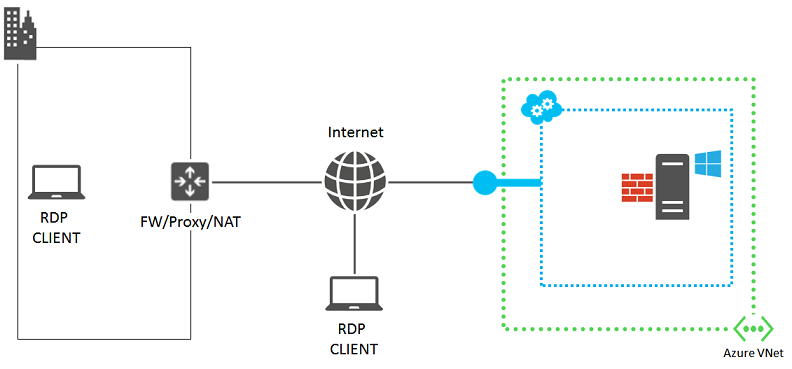
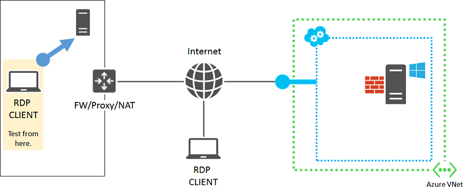
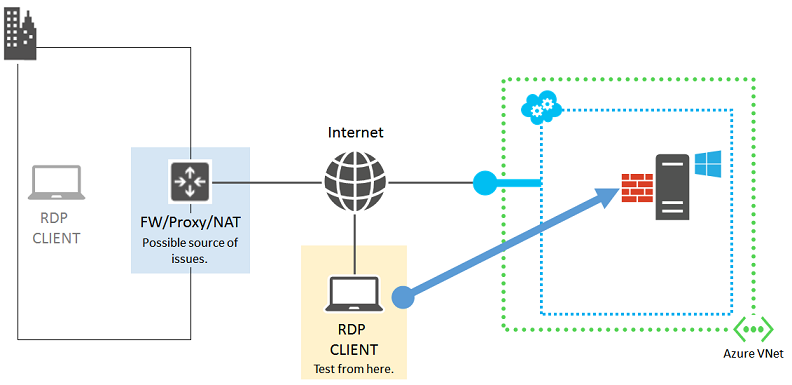
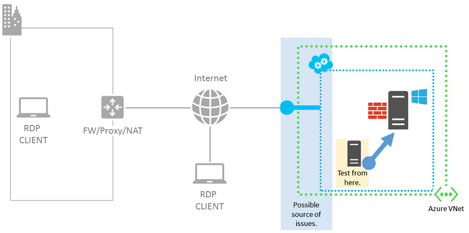
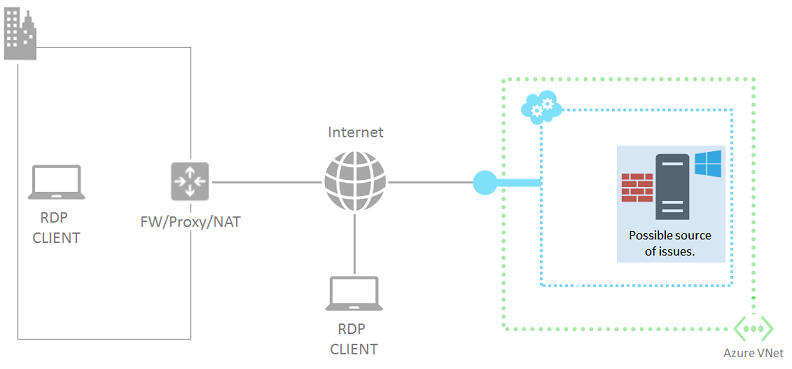

<properties 
	pageTitle="Troubleshoot Remote Desktop connections to a Windows-based Azure Virtual Machine" 
	description="Learn how to restore Remote Desktop (RDP) connectivity to your Azure virtual machine with diagnotics and steps to isolate the source of the problem."
	services="virtual-machines" 
	documentationCenter="" 
	authors="JoeDavies-MSFT" 
	manager="timlt" 
	editor=""/>

<tags 
	ms.service="virtual-machines" 
	ms.workload="infrastructure-services" 
	ms.tgt_pltfrm="na" 
	ms.devlang="na" 
	ms.topic="article" 
	ms.date="03/27/2015" 
	ms.author="josephd"/>

# Troubleshoot Remote Desktop connections to a Windows-based Azure Virtual Machine

This topic describes a methodical approach for correction and root cause determination of Remote Desktop connections to Windows-based Azure virtual machines.

## Step 1: Run the Azure IaaS diagnostics package

To address many of the common problems with creating Remote Desktop connections, Microsoft has created an [Azure IaaS (Windows) diagnostics package](https://home.diagnostics.support.microsoft.com/SelfHelp?knowledgebaseArticleFilter=2976864). 

1.	Click **Microsoft Azure IaaS (Windows) diagnostics package** on this page to create a new diagnostics session.
2.	On the **Which of the following issues are you experiencing with your Azure VM?** page, select the **RDP connectivity to an Azure VM (Reboot Required)** issue. 

For more information, see the [Microsoft Azure IaaS (Windows) diagnostics package Knowledgebase article](http://support.microsoft.com/kb/2976864). 

If running the Azure IaaS diagnostics package did not correct the problem or you were unable to run the diagnostics package, more detailed troubleshooting described in the following steps might be required.

> [AZURE.NOTE] The Azure IaaS (Windows) diagnostics package must be run from a computer running Windows 8, Windows 8.1, Windows Server 2012, or Windows Server 2012 R2.

## Step 2: Determine the error message from the Remote Desktop client

Use these sections based on the error message you get.

### Remote Desktop Connection message window: The remote session was disconnected because there are no Remote Desktop License Servers available to provide a license.

Cause: The 120-day licensing grace period for the Remote Desktop Server role has expired and you need to install licenses.
 
As a temporary workaround, save a local copy of the RDP file from the Azure Management Portal and then run this command at a Windows PowerShell command prompt to connect. 

	mstsc <File name>.RDP /admin

This will disable licensing for only that connection. 

If you don't actually need more than two simultaneous Remote Desktop connections to the virtual machine, you can use Server Manager to remove the Remote Desktop Server role.

Also see the [Azure VM fails with "No Remote Desktop License Servers available"](http://blogs.msdn.com/b/wats/archive/2014/01/21/rdp-to-azure-vm-fails-with-quot-no-remote-desktop-license-servers-available-quot.aspx) blog post.

### Remote Desktop Connection message window: Remote Desktop can't find the computer "name".

Cause: The Remote Desktop client on your computer cannot resolve the name of the computer in the settings of the RDP file. 

Here is an example RDP file generated by the Azure Management Portal:

	full address:s:tailspin-azdatatier.cloudapp.net:55919
	prompt for credentials:i:1

The address portion consists of the fully qualified domain name of the cloud service that contains the virtual machine (tailspin-azdatatier.cloudapp.net in this example) and the external TCP port of the endpoint for Remote Desktop traffic (55919).

Possible solutions to this problem:

- If you are on an organization intranet, ensure that your computer has access to the proxy server and can send HTTPS traffic to it.
- If you are using a locally stored RDP file, try using the one generated by the Azure Management Portal to ensure you have the correct name for the cloud service and endpoint port of the virtual machine.

### Windows Security message window: Your credentials did not work.

Cause: The account name and password that you submitted cannot be validated by the virtual machine to which you are connecting.

A Windows-based computer can validate the credentials of either a local account or a domain-based account. 

- For local accounts, use the <computer name>\<account name> syntax (example: SQL1\Admin4798). 
- For domain accounts, use the <domain name>\<account name> syntax (example: CONTOSO\johndoe).

For computers that you promote to domain controllers in a new AD forest, the local administrator account that you are logged into when you perform the promotion gets converted to an equivalent account with the same password in the new forest and domain. The previous local administrator account is deleted. For example, if you logged in with the local administrator account DC1\DCAdmin and promoted the virtual machine as a domain controller in a new forest for the corp.contoso.com domain, the DC1\DCAdmin local account gets deleted and a new domain account CORP\DCAdmin is created with the same password.

Double-check the account name to ensure that it is a name that the virtual machine can verify as a valid account. Double-check the password to ensure that it is the correct password. 

If you need to change the password of the local administrator account, see [How to Reset a Password or the Remote Desktop Service for Windows Virtual Machines](virtual-machines-windows-reset-password.md).

### Remote Desktop Connection message window: This computer can't connect to the remote computer.

Cause: The account that you are using to connect does not have Remote Desktop logon rights. 

Each Windows computer has a Remote Desktop Users local group, which contains the accounts and groups that have the right to logon with a Remote Desktop connection. Members of the local Administrators group also have access, even though those accounts are not listed as members of the Remote Desktop Users local group. For domain-joined machines, the local Administrators group also contains the Domain Administrators for the domain.

Ensure that the account you are using to initiate the connection has remote desktop logon rights. Use a domain administrator or local administrator account as a temporary workaround to create a Remote Desktop connection and add the desired account to the Remote Desktop Users local group using the Computer Management snap-in (**System Tools > Local Users and Groups > Groups > Remote Desktop Users**).

### Remote Desktop Connection message window: Remote desktop cannot connect to the remote computer for one of these reasons…

Cause: The Remote Desktop client cannot reach the Remote Desktop Services service on the virtual machine. This problem can be due to many root causes. 

Here are the set of components involved.

 
Before diving into a step-by-step troubleshooting process, it is helpful to mentally review what has changed since you were able to successfully create Remote Desktop connections and use that change as a basis for correcting the problem. For example:

- If you were able to create Remote Desktop connections and you changed the public IP address of the cloud service containing your virtual machine (also known as the virtual IP address [VIP]), your DNS client cache might have an entry for the DNS name of the cloud service and the *old IP address*. Flush your DNS client cache and try again. Alternately, try making the connection using the new VIP.
- If you changed from using the Azure Management Portal or the Azure Preview Portal to using an application to manage your Remote Desktop connections, ensure that the application configuration includes the randomly-determined TCP port for the Remote Desktop traffic. 

The following sections step through isolating and determining the various root causes for this problem and providing solutions and workarounds.

## Step 3: Preliminary steps before detailed troubleshooting

Perform these steps:

- Check the status of virtual machine in the Azure Management Portal or the Azure Preview Portal
- [Restart the virtual machine](https://msdn.microsoft.com/library/azure/dn763934.aspx)
- [Resize the virtual machine](https://msdn.microsoft.com/library/dn168976.aspx)

After these steps, try the Remote Desktop connection again. 

## Step 4: Detailed troubleshooting 

The inability for your Remote Desktop client to reach the Remote Desktop Services service on the Azure virtual machine can be due to the following sources of issues or misconfigurations:

- Remote Desktop client computer
- Organization intranet edge device
- Cloud service endpoint and access control list (ACL)
- Network security groups
- Windows-based Azure virtual machine

### Source 1: Remote Desktop client computer

To eliminate your computer as being the source of issues or misconfiguration, verify that your computer can make Remote Desktop connections to another on-premises, Windows-based computer. 

 
If you cannot, check for these on your computer:

- A local firewall setting that is blocking Remote Desktop traffic
- Locally-installed client proxy software that is preventing Remote Desktop connections
- Locally-installed network monitoring software that is preventing Remote Desktop connections
- Other types of security software that either monitor traffic or allow/disallow specific types of traffic that is preventing Remote Desktop connections

In all of these cases, try to temporarily disable the software and attempt a Remote Desktop connection to an on-premises computer to determine the root cause. Then, work with your network administrator to correct the settings of the software to allow Remote Desktop connections.

### Source 2: Organization intranet edge device

To eliminate your organization intranet edge device as being the source of issues or misconfiguration, verify that a computer directly connected to the Internet can make Remote Desktop connections to your Azure virtual machine.

 
If you do not have a computer that is directly connected to the Internet, you can easily create a new Azure virtual machine in its own cloud service and use it. For more information, see [Create a virtual machine running Windows in Azure](virtual-machines-windows-tutorial.md). Delete the virtual machine and cloud service when you are done with your testing.

If you can create a Remote Desktop connection with a computer directly attached to the Internet, check your organization intranet edge device for:

- An internal firewall that is blocking HTTPS connections to the Internet
- Your proxy server that is preventing Remote Desktop connections
- Intrusion detection or network monitoring software running on devices in your edge network that is preventing Remote Desktop connections

Work with your network administrator to correct the settings of your organization intranet edge device to allow HTTPS-based Remote Desktop connections to the Internet.

### Source 3: Cloud service endpoint and ACL

To eliminate the cloud service endpoint and ACL as being the source of issues or misconfiguration, verify that another Azure virtual machine that is in the same cloud service can make Remote Desktop connections to your Azure virtual machine.

 
If you do not have another virtual machine in the same cloud service, you can easily create a new one. For more information, see [Create a virtual machine running Windows in Azure](virtual-machines-windows-tutorial.md). Delete the extra virtual machine when you are done with your testing.

If you can create a Remote Desktop connection with a virtual machine in the same cloud service, check for these:

- The endpoint configuration for Remote Desktop traffic on the target virtual machine. The private TCP port of the endpoint must match the TCP port on which the Remote Desktop Services service on the virtual machine is listening, which by default is 3389. 
- The ACL for the Remote Desktop traffic endpoint on the target virtual machine. ACLs allow you to specify allowed or denied incoming traffic from the Internet based on its source IP address. Misconfigured ACLs can prevent incoming Remote Desktop traffic to the endpoint. Examine your ACLs to ensure that incoming traffic from your public IP addresses of your proxy or other edge server are allowed. For more information, see [About Network Access Control Lists (ACLs)](https://msdn.microsoft.com/library/azure/dn376541.aspx).

To eliminate the endpoint as a source of the problem, remove the current endpoint and create a new endpoint, choosing a random port in the range 49152–65535 for the external port number. For more information, see [Set up endpoints on a virtual machine in Azure](virtual-machines-set-up-endpoints.md).

### Source 4: Network Security Groups

Network Security Groups allow you have more granular control of allowed inbound and outbound traffic. You can create rules that span subnets and cloud services in an Azure virtual network. Examine your Network Security Group rules to ensure that Remote Desktop traffic from the Internet is allowed.

For more information, see [About Network Security Groups](https://msdn.microsoft.com/library/azure/dn848316.aspx).

### Source 5: Windows-based Azure virtual machine

The last set of possible problems is on the Azure virtual machine itself.

 
First, if you were unable to run the [Azure IaaS (Windows) diagnostics package](https://home.diagnostics.support.microsoft.com/SelfHelp?knowledgebaseArticleFilter=2976864) for the **RDP connectivity to an Azure VM (Reboot Required)** issue, follow the instructions in [How to Reset a Password or the Remote Desktop Service for Windows Virtual Machines](virtual-machines-windows-reset-password.md) to reset the Remote Desktop Services service on the virtual machine. This will:

- Enable the "Remote Desktop" Windows Firewall default rule (TCP port 3389).
- Enable Remote Desktop connections by setting the HKLM\System\CurrentControlSet\Control\Terminal Server\fDenyTSConnections registry value to 0.

Try the connection from your computer again. If you are not successful, these are some of the possible problems:

- The Remote Desktop Services service is not running on the target virtual machine.
- The Remote Desktop Services service is not listening on TCP port 3389.
- The Windows Firewall or other local firewall has an outbound rule that is preventing Remote Desktop traffic.
- Intrusion detection or network monitoring software running on the Azure virtual machine is preventing Remote Desktop connections.

To correct these possible problems, you can use a remote PowerShell session to the Azure virtual machine. First, you must install a certificate for the virtual machine's hosting cloud service. Go to [Configures Secure Remote PowerShell Access to Azure Virtual Machines](http://gallery.technet.microsoft.com/scriptcenter/Configures-Secure-Remote-b137f2fe) and download the **InstallWinRMCertAzureVM.ps1** script file to a folder on your local computer.

Next, install Azure PowerShell if you haven't already. See [How to install and configure Azure PowerShell](install-configure-powershell.md).

Next, open an Azure PowerShell command prompt and then change the current folder to the location of the **InstallWinRMCertAzureVM.ps1** script file. To run a PowerShell script, you must set the correct execution policy. Run the **Get-ExecutionPolicy** command to determine your current policy level. For information about setting the appropriate level, see [Set-ExecutionPolicy](https://technet.microsoft.com/library/hh849812.aspx).

Next, fill in your Azure subscription name, the cloud service name, and your virtual machine name (removing the < and > characters), then run these commands.

	$subscr="<Name of your Azure subscription>"
	$serviceName="<Name of the cloud service that contains the target virtual machine>"
	$vmName="<Name of the target virtual machine>"
	.\InstallWinRMCertAzureVM.ps1 -SubscriptionName $subscr -ServiceName $serviceName -Name $vmName

You can get the correct subscription name from the SubscriptionName property of the display of the **Get-AzureSubscription** command. You can get the cloud service name for the virtual machine from the ServiceName column of the display of the **Get-AzureVM** command.

To prove that you have this new certificate, open a Certificates snap-in focused on the Current User and look in the **Trusted Root Certification Authorities\Certificates** folder. You should see a certificate with the DNS name of your cloud service in the Issued To column (example: cloudservice4testing.cloudapp.net).

Next, initiate a remote PowerShell session with these commands.

	$uri = Get-AzureWinRMUri -ServiceName $serviceName -Name $vmName
	$creds = Get-Credential
	Enter-PSSession -ConnectionUri $uri -Credential $creds

After entering valid administrator credentials, you should see something like this as your Azure PowerShell prompt:

	[cloudservice4testing.cloudapp.net]: PS C:\Users\User1\Documents>

The first part of the prompt indicates that you are now issuing PowerShell commands for the cloud service that contains the target virtual machine. Your cloud service name will be something different than "cloudservice4testing.cloudapp.net". 

You can now issue PowerShell commands to investigate the additional problems cited above and make configuration corrections.

### To manually correct the Remote Desktop Services service listening TCP port

If you were unable to run the [Azure IaaS (Windows) diagnostics package](https://home.diagnostics.support.microsoft.com/SelfHelp?knowledgebaseArticleFilter=2976864) for the **RDP connectivity to an Azure VM (Reboot Required)** issue, at the remote PowerShell session prompt, run this command.

	Get-ItemProperty -Path "HKLM:\System\CurrentControlSet\Control\Terminal Server\WinStations\RDP-Tcp" -Name "PortNumber"

The PortNumber property shows the current port number. If needed, change the Remote Desktop port number back to its default value (3389) with this command.

	Set-ItemProperty -Path "HKLM:\System\CurrentControlSet\Control\Terminal Server\WinStations\RDP-Tcp" -Name "PortNumber" -Value 3389

Verify that the port has been changed to 3389 with this command.

	Get-ItemProperty -Path "HKLM:\System\CurrentControlSet\Control\Terminal Server\WinStations\RDP-Tcp" -Name "PortNumber"

Exit the remote PowerShell session with this command.

	Exit-PSSession

Verify that the Remote Desktop endpoint for the Azure virtual machine is also using TCP port 3398 as its internal port. Then, restart the Azure virtual machine and try your remote desktop connection again.

## Step 5: Submit your issue to the Azure support forums

To get help from Azure experts across the world, you can submit your issue to either the MSDN Azure or Stack Overflow forums. See [Microsoft Azure Forums](http://azure.microsoft.com/support/forums/) for more information.

## Step 6: File an Azure support incident

If you have run the [Azure IaaS (Windows) diagnostics package](https://home.diagnostics.support.microsoft.com/SelfHelp?knowledgebaseArticleFilter=2976864) for the **RDP connectivity to an Azure VM (Reboot Required)** issue or done steps 2 through 5 in in this article and submitted your issue to the Azure support forums, but still cannot create a Remote Desktop connection, one alternative to consider is whether you can recreate the virtual machine.

If you cannot recreate the virtual machine, it might be time for you to file an Azure support incident.

To file an incident, go to the [Azure Support site](http://azure.microsoft.com/support/options/) and click on **Get Support**.

For information about using Azure Support, see the [Microsoft Azure Support FAQ](http://azure.microsoft.com/support/faq/).

## Additional Resources

[Azure IaaS (Windows) diagnostics package](https://home.diagnostics.support.microsoft.com/SelfHelp?knowledgebaseArticleFilter=2976864)

[How to Reset a Password or the Remote Desktop Service for Windows Virtual Machines](virtual-machines-windows-reset-password.md)

[How to install and configure Azure PowerShell](install-configure-powershell.md)

[Virtual machines documentation](http://azure.microsoft.com/documentation/services/virtual-machines/)

[Azure virtual machines FAQ](http://msdn.microsoft.com/library/azure/dn683781.aspx)

