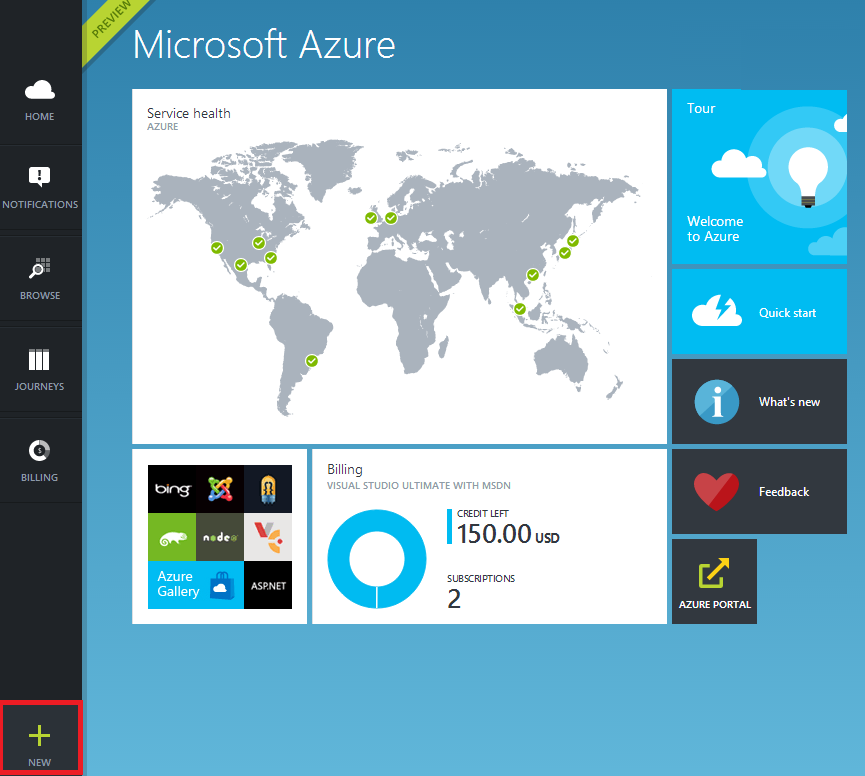
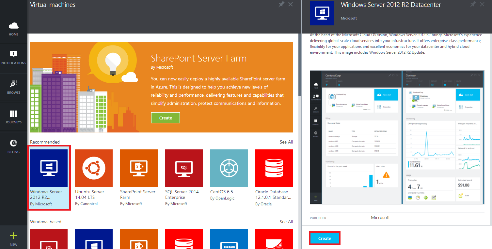
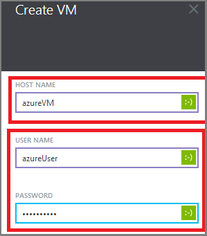
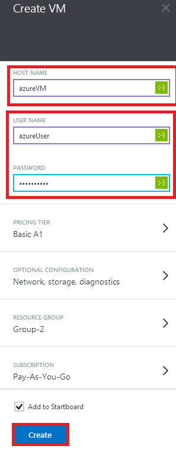
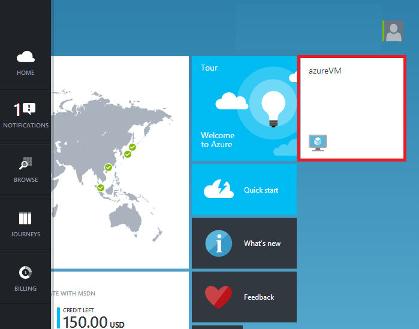
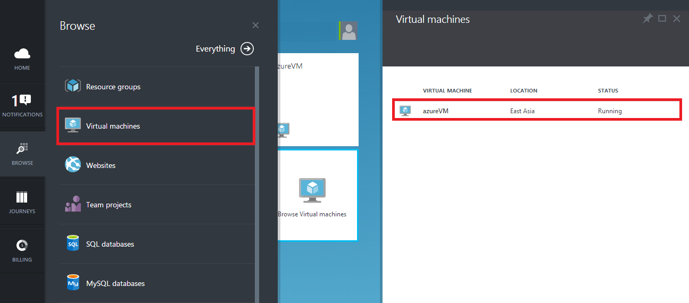
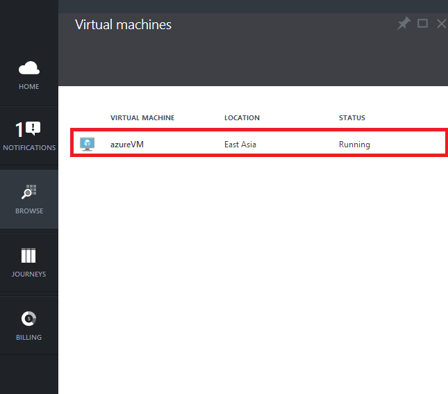
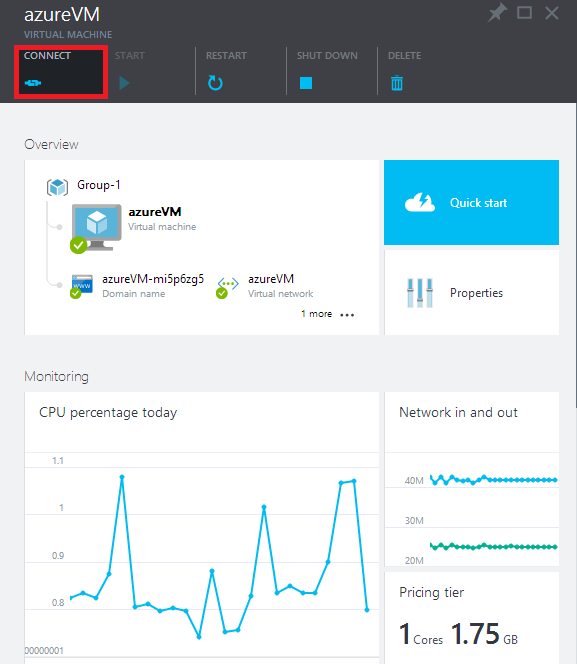

<properties pageTitle="Create a virtual machine running Windows in the Azure Preview Portal" metaKeywords="Azure image gallery vm" description="Learn how to create an Azure virtual machine (VM) running Windows, using the Azure Marketplace in the Azure Preview Portal" services="virtual-machines" documentationCenter="" title="" authors="dlepow" solutions=""  manager="timlt" />

<tags ms.service="virtual-machines" ms.workload="infrastructure-services" ms.tgt_pltfrm="vm-windows" ms.devlang="na" ms.topic="article" ms.date="01/13/2015" ms.author="danlep,kathydav,rasquill" />

<!---Workflow can be confusing...have to select the correct size with **Browse all pricing tiers** then click Select on that pane and the **Recommended pricing tiers** pane to apply. But even after that, it didn't seem to pick the Premium storage account...showed up as 'standard GRS' when I inspected what type of storage account would be used for the VM. 
-->

<!-- Preview portal screenshots getting a little out of date. Please refresh at next update.
-->

# Create a Virtual Machine in the Azure Preview Portal#

<a href="/en-us/documentation/articles/virtual-machines-windows-tutorial/" title="Azure Portal">Azure Portal</a><a href="/en-us/documentation/articles/virtual-machines-windows-tutorial-azure-preview/" title="Azure Preview Portal" class="current">Azure Preview Portal</a>

This tutorial shows you how easy it is to create an Azure virtual machine (VM) running Windows, using as an example a Windows Server image from the Azure Marketplace in the Azure Preview Portal. The Marketplace offers a variety of images, including Windows operating systems, Linux-based operating systems, and application images. 

> [AZURE.NOTE] You don't need any experience with Azure VMs to finish this tutorial. However, you do need an Azure account. You can create a free trial account in just a couple of minutes. For details, see [Create an Azure account](http://www.windowsazure.com/en-us/develop/php/tutorials/create-a-windows-azure-account/). 

This tutorial shows you:

- [How to create the virtual machine](#createvirtualmachine)
- [How to log on to the virtual machine after you create it](#logon)

If you'd like to know more, see [Virtual Machines](http://go.microsoft.com/fwlink/p/?LinkID=271224).

##How to create the virtual machine##

This section shows you how to use the Preview Portal to create a VM, using Windows Server 2012 R2 Datacenter as an example. You can use Azure's default settings for most of the configuration and create the VM in just a few minutes.

> [AZURE.NOTE] The images available to you depends on your subscription. This tutorial uses a Windows Server image, but an MSDN subscription may offer additional images, including desktop images. 
 

1. Sign in to the [Azure Preview Portal](https://portal.azure.com). Check out the [Free Trial](http://www.windowsazure.com/en-us/pricing/free-trial/) offer if you don't have a subscription yet.

2. On the Hub menu, click **New**.

	

3. In the **New** blade, click **Everything**, click **Virtual machines**, click **Windows Server 2012 R2 Datacenter**, and then click **Create**.

	
	
4. On the **Create VM** blade, fill in the **Host Name** you want for the VM, the administrative **User Name**, and a strong **Password**.  

	>[AZURE.NOTE] **User Name** refers to the administrative account that you use to manage the server. Create a unique password for this account and make sure to remember it. **You'll need the user name and password to log on to the virtual machine**.
	

	
	
	
5. Review the default settings, such as the **Pricing Tier**, **Optional Configuration**, and **Location**. These choices affect the size of VM as well as networking options such as domain membership. For example, to try out Premium Storage on a virtual machine, you'll need to pick a region and size that supports it. 

	>[AZURE.NOTE] Premium storage is in Preview, available for DS-series virtual machines in certain regions. For details, see [Premium Storage: High-Performance Storage for Azure Virtual Machine Workloads](http://azure.microsoft.com/en-us/documentation/articles/storage-premium-storage-preview-portal/).

	
	
6. When you're done reviewing or updating the settings, click **Create**.	

7. While Azure creates the VM, you can keep track of the progress in **Notifications**, in the Hub menu. After Azure creates the VM, you will see it on your Startboard.

	

## How to log on to the virtual machine after you create it ##

This section shows you how to log on to the VM so you can manage its settings and the applications that you'll run on it.

>[AZURE.NOTE] For requirements and troubleshooting tips, see [Connect to an Azure virtual machine with RDP or SSH](http://go.microsoft.com/fwlink/p/?LinkId=398294).

1. If you have not already done so, sign in to the [Azure Preview Portal](https://portal.azure.com).

2. Click your VM on the Startboard. If you need to find it, click **Browse** and then click **Virtual machines**. 

	

3. Then select your VM from the list. 

	

4. On the VM blade, click **Connect** at the top.

	

5. Click **Open** to use the Remote Desktop Protocol file that was automatically created for the virtual machine.
	
6. Click **Connect** to proceed with the connection process.

	

7. Type the user name and password of the administrative account on the virtual machine, and then click **OK**.
	
8. Click **Yes** to verify the identity of the virtual machine.

	

	You can now work with the virtual machine just as you would with any other server.

##Next Steps 

To learn more about configuring Windows virtual machines on Azure, see the following articles:

[How to Connect Virtual Machines in a Cloud Service](http://www.windowsazure.com/en-us/documentation/articles/cloud-services-connect-virtual-machine/)

[How to Create and Upload your own Virtual Hard Disk containing the Windows Server Operating System](http://www.windowsazure.com/en-us/documentation/articles/virtual-machines-create-upload-vhd-windows-server/)

[Attach Data Disks to a Virtual Machine](http://www.windowsazure.com/en-us/documentation/articles/storage-windows-attach-disk/)

[Manage the Availability of Virtual Machines](http://www.windowsazure.com/en-us/documentation/articles/manage-availability-virtual-machines/)

[About Azure VM configuration settings](http://msdn.microsoft.com/library/azure/dn763935.aspx)

[How to create the virtual machine]: #custommachine
[How to log on to the virtual machine after you create it]: #logon
