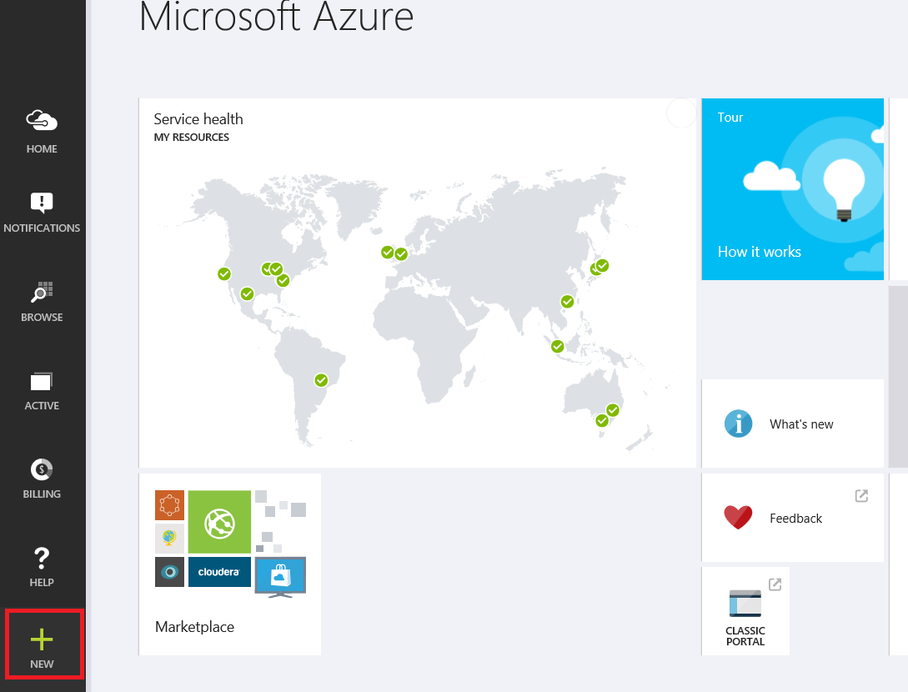
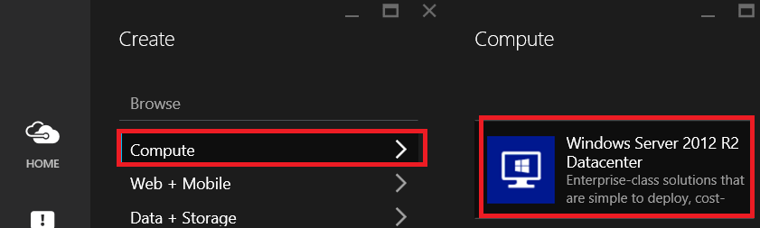
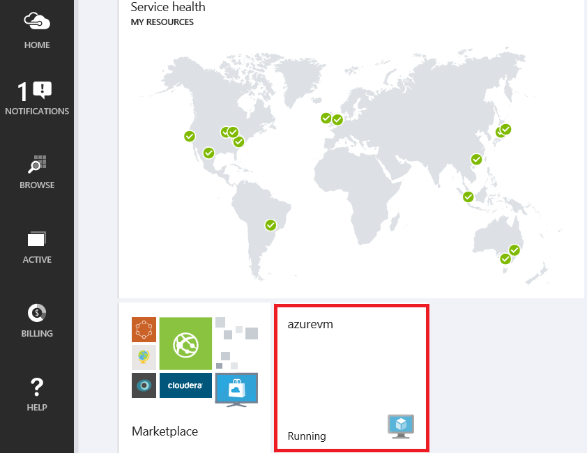
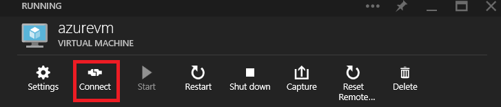

<properties
	pageTitle="Create a virtual machine running Windows in the Azure Preview Portal"
	description="Learn how to create an Azure virtual machine (VM) running Windows, using the Azure Marketplace in the Azure Preview Portal"
	services="virtual-machines"
	documentationCenter=""
	authors="KBDAzure"
	manager="timlt"
	editor=""/>
<tags
	ms.service="virtual-machines"
	ms.workload="infrastructure-services"
	ms.tgt_pltfrm="vm-windows"
	ms.devlang="na"
	ms.topic="article"
	ms.date="04/29/2015"
	ms.author="kathydav"/>

# Create a Virtual Machine Running Windows in the Azure Preview Portal#

> [AZURE.SELECTOR]
- [Azure Preview Portal](virtual-machines-windows-tutorial.md)
- [Azure Management Portal](virtual-machines-windows-tutorial-classic-portal.md)
- [PowerShell](virtual-machines-ps-create-preconfigure-windows-vms.md)

This tutorial shows you how easy it is to create an Azure virtual machine (VM) in the Azure Preview portal. This tutorial uses a Windows Server image, but that's only one of the many images available through Azure. This includes Windows operating systems, Linux-based operating systems, and images with installed applications. The images you can choose from depend on the type of subscription you have. For example, desktop images may be available to MSDN subscribers.

You can also create Windows VMs using [your own images](virtual-machines-create-upload-vhd-windows-server-classic-portal.md). To learn more about Azure VMs, see [Overview of Azure Virtual Machines](http://msdn.microsoft.com/library/azure/jj156143.aspx).

[AZURE.INCLUDE [free-trial-note](../includes/free-trial-note.md)]

## How to create the virtual machine

This section shows you how to use the Preview portal to create a VM, using Windows Server 2012 R2 Datacenter as an example. You can use Azure's default settings for most of the configuration and create the VM in just a few minutes.

1. Sign in to the [Preview portal](https://portal.azure.com).

2. On the Hub menu, click **New**.

	

3. In the **New** blade, click **Compute**, and then click **Windows Server 2012 R2 Datacenter**.

	

4. On the **Create VM** blade, fill in the **Host Name** you want for the VM, the administrative **User Name**, and a strong **Password**.  

	>[AZURE.NOTE] **User Name** refers to the administrative account that you use to manage the server. Create a unique password for this account and make sure to remember it. **You'll need the user name and password to log on to the virtual machine**.

	

5. Review the default settings, such as the **Pricing Tier** and **Optional Configuration**. These choices affect the size of VM as well as networking options such as domain membership. For example, to try out Premium Storage on a virtual machine, you'll need to pick a region and size that supports it. For your first virtual machine, the defaults are usually fine.

	>[AZURE.NOTE] Premium storage is available for DS-series virtual machines in certain regions. For details, see [Premium Storage: High-Performance Storage for Azure Virtual Machine Workloads](storage-premium-storage-preview-portal.md).

6. When you're done reviewing or updating the settings, click **Create**.

7. While Azure creates the VM, you can keep track of the progress in **Notifications**, in the Hub menu. After Azure creates the VM, you'll see it on your Startboard.

	

## How to log on to the virtual machine after you create it

This section shows you how to log on to the VM so you can manage its settings and the applications that you'll run on it.

>[AZURE.NOTE] For requirements and troubleshooting tips, see [Connect to an Azure virtual machine with RDP or SSH](https://msdn.microsoft.com/library/azure/dn535788.aspx).

1. If you haven't already done so, sign in to the [Preview portal](https://portal.azure.com).

2. Click your VM on the Startboard. If you need to find it, click **Browse** and then click  **Virtual machines**. Then select your VM from the list.

	

3. On the VM blade, click **Connect** at the top.

	

4. Click **Open** to use the Remote Desktop Protocol file that was automatically created for the virtual machine.

5. Click **Connect** to proceed with the connection process.

6. Type the user name and password of the administrative account on the virtual machine, and then click **OK**.

7. Click **Yes** to verify the identity of the virtual machine.

	You can now work with the virtual machine just as you would with any other server.

## Next steps

To learn more about configuring Windows virtual machines on Azure, see the following articles:

[How to Connect Virtual Machines in a Cloud Service](cloud-services-connect-virtual-machine.md)

[How to Create and Upload your own Virtual Hard Disk containing the Windows Server Operating System](virtual-machines-create-upload-vhd-windows-server-classic-portal.md)

[Attach Data Disks to a Virtual Machine](storage-windows-attach-disk.md)

[Manage the Availability of Virtual Machines](manage-availability-virtual-machines.md)

[About Azure VM configuration settings](http://msdn.microsoft.com/library/azure/dn763935.aspx)
