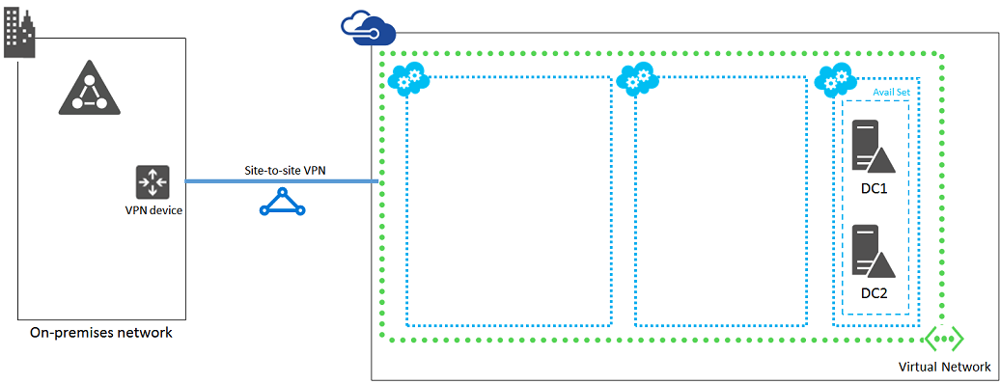

<properties 
	pageTitle="SharePoint Intranet Farm Workload Phase 2: Configure Domain Controllers" 
	description="In this second phase of deploying an intranet-only SharePoint 2013 farm with SQL Server AlwaysOn Availability Groups in Azure infrastructure services, you create and configure the two Active Directory domain controllers." 
	documentationCenter=""
	services="virtual-machines" 
	authors="JoeDavies-MSFT" 
	manager="timlt" 
	editor=""/>

<tags 
	ms.service="virtual-machines" 
	ms.workload="infrastructure-services" 
	ms.tgt_pltfrm="na" 
	ms.devlang="na" 
	ms.topic="article" 
	ms.date="05/05/2015" 
	ms.author="josephd"/>

# SharePoint Intranet Farm Workload Phase 2: Configure Domain Controllers

In this phase of deploying an intranet-only SharePoint 2013 farm with SQL Server AlwaysOn Availability Groups in Azure infrastructure services, you configure two domain controllers in the Azure Virtual Network so that client web requests for SharePoint farm resources can be authenticated in the Azure virtual network, rather than sending that authentication traffic across the VPN or ExpressRoute connection to your on-premises network. 

You must complete this phase before moving on to [Phase 3](virtual-machines-workload-intranet-sharepoint-phase3.md). See [Deploying SharePoint with SQL Server AlwaysOn Availability Groups in Azure](virtual-machines-workload-intranet-sharepoint-overview.md) for all of the phases.

## Create the domain controller virtual machines in Azure

First, you need to fill out the **Virtual machine name** column of Table M and modify virtual machine sizes as needed in the **Minimum size** column.  

Item | Virtual machine name | Gallery image | Minimum size 
--- | --- | --- | --- 
1. | ______________ (first domain controller, example DC1) | Windows Server 2012 R2 Datacenter | A2 (Medium)
2. | ______________ (second domain controller, example DC2) | Windows Server 2012 R2 Datacenter | A2 (Medium)
3. | ______________ (first SQL Server computer, example SQL1) | Microsoft SQL Server 2014 Enterprise – Windows Server 2012 R2 | 	A7
4. | ______________ (second SQL Server computer, example SQL2) | Microsoft SQL Server 2014 Enterprise – Windows Server 2012 R2 | 	A7
5. | ______________ (majority node witness for the cluster, example MN1) | Windows Server 2012 R2 Datacenter | A1 (Small)
6. | ______________ (first SharePoint application server, example APP1) | Microsoft SharePoint Server 2013 Trial – Windows Server 2012 R2 | A4 (ExtraLarge)
7. | ______________ (second SharePoint application server, example APP2) | Microsoft SharePoint Server 2013 Trial – Windows Server 2012 R2 | A4 (ExtraLarge)
8. | ______________ (first SharePoint web server, example WEB1) | Microsoft SharePoint Server 2013 Trial – Windows Server 2012 R2 | A4 (ExtraLarge)
9. | ______________ (second SharePoint web server, example WEB2) | Microsoft SharePoint Server 2013 Trial – Windows Server 2012 R2 | A4 (ExtraLarge)

**Table M – Virtual machines for the SharePoint 2013 intranet farm in Azure**

For the complete list of virtual machine sizes, see [Virtual Machine and Cloud Service Sizes for Azure](https://msdn.microsoft.com/library/azure/dn197896.aspx).

Use the following block of PowerShell commands to create the virtual machines for the two domain controllers. Specify the values for the variables, removing the < and > characters. Note that this PowerShell command set uses values from the following:

- Table M, for your virtual machines
- Table V, for your virtual network settings
- Table S, for your subnet
- Table A, for your availability sets
- Table C, for your cloud services

Recall that you defined Tables V, S, A, and C in [Phase 1: Configure Azure](virtual-machines-workload-intranet-sharepoint-phase1.md).

When you have supplied all the proper values, run the resulting block at the Azure PowerShell command prompt.

	# Create the first domain controller
	$vmName="<Table M – Item 1 - Virtual machine name column>"
	$vmSize="<Table M – Item 1 - Minimum size column, specify one: Small, Medium, Large, ExtraLarge, A5, A6, A7, A8, A9>"
	$availSet="<Table A – Item 1 – Availability set name column>"
	$image= Get-AzureVMImage | where { $_.ImageFamily -eq "Windows Server 2012 R2 Datacenter" } | sort PublishedDate -Descending | select -ExpandProperty ImageName -First 1
	$vm1=New-AzureVMConfig -Name $vmName -InstanceSize $vmSize -ImageName $image -AvailabilitySetName $availSet
	
	$cred=Get-Credential –Message "Type the name and password of the local administrator account for the first domain controller."
	$vm1 | Add-AzureProvisioningConfig -Windows -AdminUsername $cred.GetNetworkCredential().Username -Password $cred.GetNetworkCredential().Password
	
	$diskSize=<size of the additional data disk in GB>
	$diskLabel="<the label on the disk>"
	$lun=<Logical Unit Number (LUN) of the disk>
	$vm1 | Add-AzureDataDisk -CreateNew -DiskSizeInGB $diskSize -DiskLabel $diskLabel -LUN $lun -HostCaching None
	
	$subnetName="<Table S – Item 1 – Subnet name column>"
	$vm1 | Set-AzureSubnet -SubnetNames $subnetName
	
	$vm1 | Set-AzureStaticVNetIP -IPAddress <Table V – Item 6 – Value column>
	
	$serviceName="<Table C – Item 1 – Cloud service name column>"
	$vnetName="<Table V – Item 1 – Value column>"
	New-AzureVM –ServiceName $serviceName -VMs $vm1 -VNetName $vnetName
	
	# Create the second domain controller
	$vmName="<Table M – Item 2 - Virtual machine name column>"
	$vmSize="<Table M – Item 2 - Minimum size column, specify one: Small, Medium, Large, ExtraLarge, A5, A6, A7, A8, A9>"
	$image= Get-AzureVMImage | where { $_.ImageFamily -eq "Windows Server 2012 R2 Datacenter" } | sort PublishedDate -Descending | select -ExpandProperty ImageName -First 1
	
	$vm1=New-AzureVMConfig -Name $vmName -InstanceSize $vmSize -ImageName $image -AvailabilitySetName $availSet
	
	$cred=Get-Credential –Message "Type the name and password of the local administrator account for the second domain controller."
	$vm1 | Add-AzureProvisioningConfig -Windows -AdminUsername $cred.GetNetworkCredential().Username -Password $cred.GetNetworkCredential().Password 
	
	$diskSize=<size of the additional data disk in GB>
	$diskLabel="<the label on the disk>"
	$lun=<Logical Unit Number (LUN) of the disk>
	$vm1 | Add-AzureDataDisk -CreateNew -DiskSizeInGB $diskSize -DiskLabel $diskLabel -LUN $lun -HostCaching None
	
	$vm1 | Set-AzureSubnet -SubnetNames $subnetName
	
	$vm1 | Set-AzureStaticVNetIP -IPAddress <Table V – Item 7 – Value column>
	
	New-AzureVM –ServiceName $serviceName -VMs $vm1 -VNetName $vnetName

## Configure the first domain controller

Logon to the first domain controller computer using the credentials of the local administrator account.

### Logging on to a virtual machine with a Remote Desktop connection

1.	In the Azure Management Portal, in the left panel click **Virtual Machines**.
2.	To connect to a VM, click **Running** in the **Status** column next to its name.
3.	In the command bar on the bottom of the page, click **Connect**.
4.	The Management Portal informs you the .rdp file is being retrieved. Click **OK**.
5.	The browser dialog appears asking, "Do you want to open or save ComputerName.rdp from manage.windowsazure.com." Click **Open**.
6.	In the **Remote Desktop Connection** dialog, click **Connect**.
7.	In the **Windows Security** dialog, click **Use another account**.
8.	In **User name**, type the name of the VM and user name of the local administrator account created with the VM (a local machine account). Use the following format: 
- *ComputerName*\\*LocalAdministratorAccountName*
9.	In **Password**, type the password for the local administrator account.
10.	Click **OK**.
11.	In the **Remote Desktop Connection** dialog, click **Yes**. The desktop of the new machine appears in a Remote Desktop session window.

Next, you need to add the extra data disk to the first domain controller.

### To initialize an empty disk

1.	In the left pane of Server Manager, click **File and Storage Services**, and then click **Disks**.
2.	In the contents pane, in the **Disks** group, click disk **2** (with the **Partition** set to **Unknown**).
3.	Click **Tasks**, and then click **New Volume**.
4.	On the Before you begin page of the New Volume Wizard, click **Next**.
5.	On the Select the server and disk, click **Disk 2**, and then click **Next**. When prompted, click OK.
6.	On the Specify the size of the volume page, click **Next**.
7.	On the Assign to a drive letter or folder page, click **Next**.
8.	On the Select file system settings page, click **Next**.
9.	On the Confirm selections page, click **Create**.
10.	When complete, click **Close**.

Next, test the first domain controller's connectivity to locations on your organization network.

### To test connectivity

1.	From the desktop, open a Windows PowerShell command prompt.
2.	At the Windows PowerShell command prompt, use the **ping** command to ping names and IP addresses of resources on your organization network.

This procedure ensures that DNS name resolution is working correctly (that the virtual machine is correctly configured with on-premises DNS servers) and that packets can be sent to and from the cross-premises virtual network.

Next, from the Windows PowerShell command prompt on the first domain controller, run the following commands:

	$domname="<DNS domain name of the domain for which this computer will be a domain controller>"
	Install-WindowsFeature AD-Domain-Services -IncludeManagementTools
	Install-ADDSDomainController -InstallDns –DomainName $domname  -DatabasePath "F:\NTDS" -SysvolPath "F:\SYSVOL" -LogPath "F:\Logs"

The computer will restart.

## Configure the second domain controller

Logon to the second domain controller computer using the credentials of its local administrator account. For instructions, see the [Logging on to a virtual machine with a Remote Desktop connection procedure](#logon).

Next, you need to add the extra data disk to the second domain controller. See the [To initialize an empty disk procedure](#datadisk).

Next, test your connectivity to locations on your organization network from the second domain controller. See the [To test connectivity procedure](#testconn). Use this procedure to ensure that DNS name resolution is working correctly (that the virtual machine is correctly configured with on-premises DNS servers) and that packets can be sent to and from the cross-premises virtual network.

Next, from the Windows PowerShell command prompt on the second domain controller, run the following commands:

	$domname="<DNS domain name of the domain for which this computer will be a domain controller>"
	Install-WindowsFeature AD-Domain-Services -IncludeManagementTools
	Install-ADDSDomainController -InstallDns –DomainName $domname  -DatabasePath "F:\NTDS" -SysvolPath "F:\SYSVOL" -LogPath "F:\Logs"

The computer will restart.

## Configure SharePoint farm accounts and permissions

The SharePoint farm will need the following user accounts:

- sp_farm: A user account for managing SharePoint farms.
- sp_farm_db: A user account that has sysadmin rights on SQL Server instances.
- sp_install: A user account that has domain administration rights needed for installing roles and features.
- sqlservice: A user account that SQL instances can run as.

Next, log on to any computer with a domain administrator account for the domain for which the domain controllers are members, open an administrator-level Windows PowerShell command prompt, and run these commands *one at a time*:

	New-ADUser -SamAccountName sp_farm -AccountPassword (read-host "Set user password" -assecurestring) -name "sp_farm" -enabled $true -PasswordNeverExpires $true -ChangePasswordAtLogon $false
	
	New-ADUser -SamAccountName sp_farm_db -AccountPassword (read-host "Set user password" -assecurestring) -name "sp_farm_db" -enabled $true -PasswordNeverExpires $true -ChangePasswordAtLogon $false
	
	New-ADUser -SamAccountName sp_install -AccountPassword (read-host "Set user password" -assecurestring) -name "sp_install" -enabled $true -PasswordNeverExpires $true -ChangePasswordAtLogon $false
	
	New-	ADUser -SamAccountName sqlservice -AccountPassword (read-host "Set user password" -assecurestring) -name "sqlservice" -enabled $true -PasswordNeverExpires $true -ChangePasswordAtLogon $false

For each command, you will be prompted to enter a password. Record these account names and passwords and store them in a secure location.

Next, perform the following steps to add additional account properties to the new user accounts.

1.	From the Start screen, type **Active Directory Users**, and then click **Active Directory Users and Computers**. 
2.	In the tree pane, open your domain, and then click **Users**. 
3.	In the contents pane, right-click **sp_install**, and then click **Add to a group**.
4.	In the **Select Groups** dialog, type **domain admins**, and then click **OK** twice.
5.	In the dialog, click **View and click Advanced Features**. The option lets you see all hidden containers and hidden tabs in the property windows for AD objects.
6.	Right-click your domain name and click **Properties**.
7.	In the **Properties** dialog, click the **Security** tab, and then click the **Advanced** button.
8.	In the **Advanced Security settings for <YourDomain>** window, click **Add**.
9.	In the **Permission Entry for <YourDomain>** window, click **Select a principa**l.
10.	In the text box, type **<YourDomain>\sp_install**, and then click **OK**.
11.	Select **Allow** for **Create computer objects**, and then click **OK** three times.

Next, update the DNS servers for your virtual network so that Azure assigns virtual machines the IP addresses of the two new domain controllers to use as their DNS servers. Note that this procedure uses values from Table V (for your virtual network settings).

1.	In the left pane of the Azure Management Portal, click **Networks**, and then click the name of your virtual network (Table V – Item 1 – Value column).
2.	Click **Configure**.
3.	In **DNS Servers**, remove the entries corresponding to the DNS servers that are located on your on-premises network.
4.	In **DNS Servers**, add two entries with friendly names and the IP addresses of these two table items:
- Table V – Item 6 – Value column
- Table V – Item 7 – Value column
5.	In the command bar at the bottom, click **Save**.
6.	In the left pane of the Azure Management Portal, click **Virtual Machines**, and then click the **Status** column next to the name of your first domain controller.
7.	In the command bar, click **Restart**.
8.	When the first domain controller is started, click the **Status** column next to the name of your second domain controller.
9.	In the command bar, click **Restart**. Wait until the second domain controller is started.

Note that we restart the two domain controllers so that they are not configured with the on-premises DNS servers as DNS servers. Because they are both DNS servers themselves, they are automatically configured with the on-premises DNS servers as DNS forwarders when they were promoted to domain controllers.

Next, we need to create an AD replication site to ensure that servers in the Azure virtual network use the local domain controllers. Log on to the primary domain controller with the sp_install account and run the following commands from an administrator-level Windows PowerShell command prompt:

	$vnet="<Table V – Item 1 – Value column>"
	$vnetSpace="<Table V – Item 5 – Value column>"
	New-ADReplicationSite -Name $vnet 
	New-ADReplicationSubnet –Name $vnetSpace –Site $vnet

This shows the configuration resulting from the successful completion of this phase, with placeholder computer names.

## Next Step

To continue with the configuration of this workload, go to [Phase 3: Configure SQL Server Infrastructure](virtual-machines-workload-intranet-sharepoint-phase3.md).

## Additional Resources

[Deploying SharePoint with SQL Server AlwaysOn Availability Groups in Azure](virtual-machines-workload-intranet-sharepoint-overview.md)

[SharePoint farms hosted in Azure infrastructure services](virtual-machines-sharepoint-infrastructure-services.md)

[SharePoint with SQL Server AlwaysOn Infographic](http://go.microsoft.com/fwlink/?LinkId=394788)

[Microsoft Azure Architectures for SharePoint 2013](https://technet.microsoft.com/library/dn635309.aspx)
