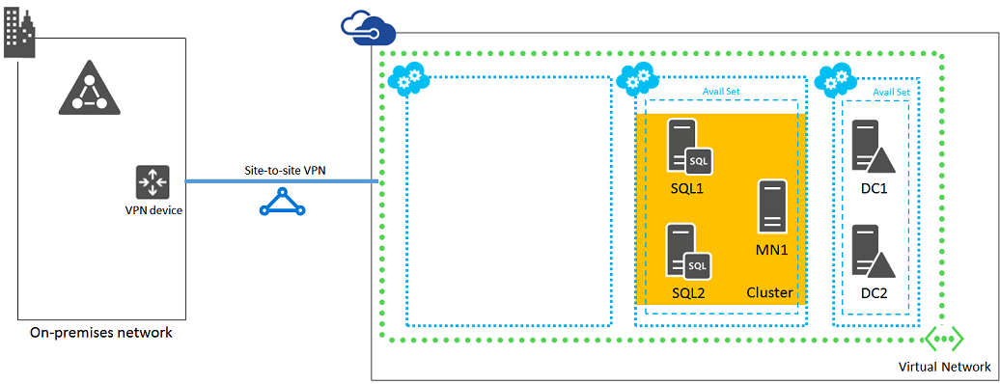

<properties 
	pageTitle="SharePoint Intranet Farm Workload Phase 3: Configure SQL Server Infrastructure" 
	description="In this third phase of deploying an intranet-only SharePoint 2013 farm with SQL Server AlwaysOn Availability Groups in Azure infrastructure services, you create the SQL Server cluster computers and the cluster itself." 
	documentationCenter=""
	services="virtual-machines" 
	authors="JoeDavies-MSFT" 
	manager="timlt" 
	editor=""/>

<tags 
	ms.service="virtual-machines" 
	ms.workload="infrastructure-services" 
	ms.tgt_pltfrm="na" 
	ms.devlang="na" 
	ms.topic="article" 
	ms.date="05/05/2015" 
	ms.author="josephd"/>

# SharePoint Intranet Farm Workload Phase 3: Configure SQL Server Infrastructure

In this phase of deploying an intranet-only SharePoint 2013 farm with SQL Server AlwaysOn Availability Groups in Azure infrastructure services, you configure the two SQL Server computers and the cluster majority node computer, and then combine them into a Windows Server cluster. 

You must complete this phase before moving on to [Phase 4](virtual-machines-workload-intranet-sharepoint-phase4.md). See [Deploying SharePoint with SQL Server AlwaysOn Availability Groups in Azure](virtual-machines-workload-intranet-sharepoint-overview.md) for all of the phases.

## Create the SQL Server cluster virtual machines in Azure

There are two SQL server virtual machines. One SQL server contains the primary database replica of an availability group. The second SQL server contains the secondary backup replica. The backup is provided to ensure high-availability. An additional virtual machine is for the cluster majority node.

Use the following block of PowerShell commands to create the virtual machines for the three servers. Specify the values for the variables, removing the < and > characters. Note that this PowerShell command set uses values from the following tables:

- Table M, for your virtual machines
- Table V, for your virtual network settings
- Table S, for your subnet
- Table A, for your availability sets
- Table C, for your cloud services

Recall that you defined Table M in [Phase 2: Configure Domain Controllers](virtual-machines-workload-intranet-sharepoint-phase2.md) and Tables V, S, A, and C in [Phase 1: Configure Azure](virtual-machines-workload-intranet-sharepoint-phase1.md).

When you have supplied all the proper values, run the resulting block at the Azure PowerShell command prompt.

	# Create the first SQL server
	$vmName="<Table M – Item 3 - Virtual machine name column>"
	$vmSize="<Table M – Item 3 - Minimum size column, specify one: Small, Medium, Large, ExtraLarge, A5, A6, A7, A8, A9>"
	$availSet="<Table A – Item 2 – Availability set name column>"
	
	$image= Get-AzureVMImage | where { $_.ImageFamily -eq "SQL Server 2014 RTM Standard on Windows Server 2012 R2" } | sort PublishedDate -Descending | select -ExpandProperty ImageName -First 1
	$vm1=New-AzureVMConfig -Name $vmName -InstanceSize $vmSize -ImageName $image -AvailabilitySetName $availSet
	
	$cred1=Get-Credential –Message "Type the name and password of the local administrator account for the first SQL Server computer."
	$cred2=Get-Credential –Message "Now type the name and password of an account that has permissions to add this virtual machine to the domain."
	$ADDomainName="<name of the AD domain that the server is joining (example CORP)>"
	$domainDNS="<FQDN of the AD domain that the server is joining (example corp.contoso.com)>"
	$vm1 | Add-AzureProvisioningConfig -AdminUsername $cred1.GetNetworkCredential().Username -Password $cred1.GetNetworkCredential().Password -WindowsDomain -Domain $ADDomainName -DomainUserName $cred2.GetNetworkCredential().Username -DomainPassword $cred2.GetNetworkCredential().Password -JoinDomain $domainDNS
	
	$diskSize=<size of the additional data disk in GB>
	$diskLabel="<the label on the disk>"
	$lun=<Logical Unit Number (LUN) of the disk>
	$vm1 | Add-AzureDataDisk -CreateNew -DiskSizeInGB $diskSize -DiskLabel $diskLabel -LUN $lun -HostCaching None
	
	$subnetName="<Table 6 – Item 1 – Subnet name column>"
	$vm1 | Set-AzureSubnet -SubnetNames $subnetName
	
	$serviceName="<Table C – Item 2 – Cloud service name column>"
	$vnetName="<Table V – Item 1 – Value column>"
	New-AzureVM –ServiceName $serviceName -VMs $vm1 -VNetName $vnetName
	
	# Create the second SQL server
	$vmName="<Table M – Item 4 - Virtual machine name column>"
	$vmSize="<Table M – Item 4 - Minimum size column, specify one: Small, Medium, Large, ExtraLarge, A5, A6, A7, A8, A9>"
	$vm1=New-AzureVMConfig -Name $vmname -InstanceSize $vmsize -ImageName $image -AvailabilitySetName $availSet
	
	$cred1=Get-Credential –Message "Type the name and password of the local administrator account for the second SQL Server computer."
	$vm1 | Add-AzureProvisioningConfig -AdminUsername $cred1.GetNetworkCredential().Username -Password $cred1.GetNetworkCredential().Password -WindowsDomain -Domain $ADDomainName -DomainUserName $cred2.GetNetworkCredential().Username -DomainPassword $cred2.GetNetworkCredential().Password -JoinDomain $domainDNS
	
	$diskSize=<size of the additional data disk in GB>
	$diskLabel="<the label on the disk>"
	$lun=<Logical Unit Number (LUN) of the disk>
	$vm1 | Add-AzureDataDisk -CreateNew -DiskSizeInGB $diskSize -DiskLabel $diskLabel -LUN $lun -HostCaching None
	
	$vm1 | Set-AzureSubnet -SubnetNames $subnetName
	
	New-AzureVM –ServiceName $serviceName -VMs $vm1 -VNetName $vnetName
	
	# Create the cluster majority node server
	$vmName="<Table M – Item 5 - Virtual machine name column>"
	$vmSize="<Table M – Item 5 - Minimum size column, specify one: Small, Medium, Large, ExtraLarge, A5, A6, A7, A8, A9>"
	$image= Get-AzureVMImage | where { $_.ImageFamily -eq "Windows Server 2012 R2 Datacenter" } | sort PublishedDate -Descending | select -ExpandProperty ImageName -First 1
	$vm1=New-AzureVMConfig -Name $vmName -InstanceSize $vmSize -ImageName $image -AvailabilitySetName $availSet
	
	$cred1=Get-Credential –Message "Type the name and password of the local administrator account for the cluster majority node server."
	$vm1 | Add-AzureProvisioningConfig -AdminUsername $cred1.GetNetworkCredential().Username -Password $cred1.GetNetworkCredential().Password -WindowsDomain -Domain $ADDomainName -DomainUserName $cred2.GetNetworkCredential().Username -DomainPassword $cred2.GetNetworkCredential().Password -JoinDomain $domainDNS
	
	$vm1 | Set-AzureSubnet -SubnetNames $subnetName
	
	New-AzureVM –ServiceName $serviceName -VMs $vm1 -VNetName $vnetName

## Configure the SQL Server computers

For each SQL server, do the following:

1. Use the [Logging on to a virtual machine with a Remote Desktop connection procedure](virtual-machines-workload-intranet-sharepoint-phase2.md#logon) to log on using the credentials of the local administrator account.

2. Use the [To initialize an empty disk procedure](virtual-machines-workload-intranet-sharepoint-phase2.md#datadisk) twice, once for each SQL server, to add the extra data disk.

3. Run the following commands from a Windows PowerShell command prompt:

		md f:\Data
		md f:\Log
		md f:\Backup

4. Use the [To test connectivity procedure](virtual-machines-workload-intranet-sharepoint-phase2.md#testconn) to test connectivity to locations on your organization network. This procedure ensures that DNS name resolution is working correctly (that the virtual machine is correctly configured with DNS servers in the virtual network) and that packets can be sent to and from the cross-premises virtual network.

Use the following procedure twice, once for each SQL server, to configure the SQL server to use the F: drive for new databases and for accounts and permissions.

1.	On the Start screen, type **SQL Studio**, and then click **SQL Server 2014 Management Studio**.
2.	In **Connect to Server**, click **Connect**.
3.	In the left pane, right-click the top node—the default instance named after the machine—and then click **Properties**.
4.	In **Server Properties**, click **Database Settings**.
5.	In **Database default locations**, set the following values: 
- For **Data**, set the path to **f:\Data**.
- For **Log**, set the path to **f:\Log**.
- For **Backup**, set the path to **f:\Backup**.
- Only new databases use these locations.
6.	Click **OK** to close the window.
7.	In the left pane, expand the **Security folder**.
8.	Right-click **Logins**, and then click **New login**.
9.	In **Login name**, type *domain*\sp_farm_db in (in which *domain* is the name of the domain in which the sp_farm_db account was created). 
10.	Under **Select a page**, click **Server Roles**, click **sysadmin**, and then click **OK**.
11.	Close SQL Server 2014 Management Studio.

Use the following procedure twice, once for each SQL server, to allow remote desktop connections using the sp_farm_db account.

1.	On the Start screen, right-click **This PC**, and then click **Properties**.
2.	In the **System** window, click **Remote Settings**.
3.	In the **Remote Desktop** section, click **Select Users**, and then click **Add**.
4.	In **Enter the object names to select**, type [domain]**\sp_farm_db**, and then click **OK** three times.

SQL Server requires a port that clients use to access the database server. It also needs ports to connect with the SQL Server Management Studio and to manage the high-availability group. Next, run the following command at an administrator-level Windows PowerShell command prompt twice, once for each SQL server, to add a firewall rule that allows inbound traffic to the SQL server.

	New-NetFirewallRule -DisplayName "SQL Server ports 1433, 4234, and 5022" -Direction Inbound –Protocol TCP –LocalPort 1433,1434,5022 -Action Allow

For each of the SQL server virtual machines, sign out as the local administrator. 

For information about optimizing SQL Server performance in Azure, see [Performance Best Practices for SQL Server in Azure Virtual Machines](https://msdn.microsoft.com/library/azure/dn133149.aspx). You can also disable Geo Redundant Storage (GRS) for the SharePoint farm storage account and use storage spaces to optimize IOPs.

## Configure the cluster majority node server

Use the [Logging on to a virtual machine with a Remote Desktop connection procedure](virtual-machines-workload-intranet-sharepoint-phase2.md#logon) for the cluster majority node to log on using the credentials of a domain account.

On the cluster majority node, use the [To test connectivity procedure](virtual-machines-workload-intranet-sharepoint-phase2.md#testconn) to test connectivity to locations on your organization network.

## Create the Windows server cluster

SQL Server AlwaysOn Availability Groups rely on the Windows Server Failover Clustering (WSFC) feature of Windows Server. The feature allows several machines to participate as a group in a cluster. When one machine fails, a second machine is ready to take its place. Therefore the first task is to enable the Failover Clustering feature on all of the participating machines, which include:

- The primary SQL server
- The secondary SQL server
- The cluster majority node

The failover cluster requires at least three VMs. Two machines host SQL Server. The second SQL Server VM is a synchronous secondary replica, ensuring zero data loss if the primary machine fails. The third machine does not need to host SQL Server. The cluster majority node functions as a quorum witness in the WSFC. Because the WSFC cluster relies on a quorum to monitor health, there must always be a majority to ensure that the WSFC cluster is online. If only two machines are in a cluster, and one fails, there can be no majority when only one out of two fails. For more information, see [WSFC Quorum Modes and Voting Configuration (SQL Server)](http://msdn.microsoft.com/library/hh270280.aspx).

For both SQL server computers and for the cluster majority node, run the following command at an administrator-level Windows PowerShell command prompt:

	Install-WindowsFeature Failover-Clustering -IncludeManagementTools

Due to current non-RFC-compliant behavior by DHCP in Azure, creation of a Windows Server Failover Cluster (WSFC) cluster can fail. For details, search for "WSFC cluster behavior in Azure networking" in High Availability and Disaster Recovery for SQL Server in Azure Virtual Machines. However, there is a workaround. Use the following steps to create the cluster.

1.	Log on to the primary SQL Server virtual machine with the **sp_install** account.
2.	From the Start screen, type **Failover**, and then click **Failover Cluster Manager**.
3.	In the left pane, right-click **Failover Cluster Manager**, and then click **Create Cluster**.
4.	On the Before You Begin page, click **Next**.
5.	On the Select Servers page, type the name of the primary SQL Server machine, click **Add**, and then click **Next**.
6.	On the Validation Warning page, click **No, I do not require support from Microsoft for this cluster, and therefore do not want to run the validation tests. When I click Next, continue creating the cluster.**, and then click **Next**.
7.	On the Access Point for Administering the Cluster page, in the **Cluster Nam**e text box, type the name for your cluster, and then click **Next**.
8.	In the Confirmation page, click **Next** to begin cluster creation. 
9.	On the Summary page, click **Finish**.
10.	In the left pane, click your new cluster. In the **Cluster Core Resources** section of the contents pane, open your server cluster name. The **IP Address** resource appears in the **Failed** state. The IP address resource cannot be brought online because the cluster is assigned the same IP address as that of the machine itself. The result is a duplicate address. 
11.	Right-click the failed **IP Address** resource, and then click **Properties**.
12.	In the **IP Address Properties** dialog box, click **Static IP Address**.
13.	Type an unused IP in the address range corresponding to the subnet on which the SQL server is located, and then click **OK**.
14.	Right-click the failed IP Address resource, and then click **Bring Online**. Wait until both resources are online. When the cluster name resource comes online, it updates the domain controller with a new Active Directory (AD) computer account. This AD account is later used to run the availability group clustered service.
15.	Now that the AD account is created, bring the cluster name offline. Right-click the cluster name in **Cluster Core Resources**, and then click **Take Offline**.
16.	To remove the cluster IP address, right-click **IP Address**, click **Remove**, and then click **Yes** when prompted. The cluster resource can no longer come online because it depends on the IP address resource. However, an availability group does not depend on the cluster name or IP address in order to work properly. So the cluster name can be left offline.
17.	To add the remaining nodes to the cluster, right-click your cluster name in the left pane, and then click **Add Nod**e.
18.	On the Before You Begin page, click **Next**. 
19.	On the Select Servers page, type the name and then click **Add** to add both the secondary SQL server and cluster majority node to the cluster. After adding the two computers, click **Next**.
If a machine cannot be added, and the error message is "the Remote Registry is not running," do the following. Log on to the machine, open the Services snap-in (services.msc), and enable the Remote Registry. For more information, see [Unable to connect to Remote Registry service](http://technet.microsoft.com/library/bb266998.aspx). 
20.	On the Validation Warning page, click **No, I do not require support from Microsoft for this cluster, and therefore do not want to run the validation tests. When I click Next, continue creating the cluster.**, and then click **Next**. 
21.	On the Confirmation page, click **Next**.
22.	On the Summary page, click **Finish**.
23.	In the left pane, click **Nodes**. You should see all three computers listed.

## Enable AlwaysOn Availability Groups

The next step is to enable AlwaysOn Availability Groups using the SQL Server Configuration Manager. Note that an availability group in SQL Server differs from an Azure availability set. An availability group contains databases that are highly-available and recoverable. An Azure availability set allocates virtual machines to different fault domains. For more information about fault domains, see [Manage the Availability of Virtual Machines](virtual-machines-manage-availability.md). 

Use these steps to enable AlwaysOn Availability Groups on SQL Server.

1.	Log on to the primary SQL server using the **sp_farm_db** account, or some other account that has sysadmin server role on the SQL server.
2.	On the Start screen, type **SQL Server Configuration**, and then click **SQL Server Configuration Manager**.
3.	In the left pane, click **SQL Server Services**.
4.	In the contents pane, double-click **SQL Server (MSSQLSERVER)**.
5.	In **SQL Server (MSSQLSERVER) Properties**, click the **AlwaysOn High Availability** tab, select **Enable AlwaysOn Availability Group**s, click **Apply**, and then click **OK** when prompted. Do not close the properties window yet. 
6.	Click the virtual-machines-manage-availability tab, then type [Domain]**\sqlservice** in **Account Name**. Type the sqlservice account password in **Password** and **Confirm passwor**d, and then click **OK**.
7.	In the message window, click **Yes** to restart the SQL Server service.
8.	Log on to the secondary SQL server and repeat this process. 

This shows the configuration resulting from the successful completion of this phase, with placeholder computer names.

## Next Step

To continue with the configuration of this workload, go to [Phase 4: Configure SharePoint Servers](virtual-machines-workload-intranet-sharepoint-phase4.md).

## Additional Resources

[Deploying SharePoint with SQL Server AlwaysOn Availability Groups in Azure](virtual-machines-workload-intranet-sharepoint-overview.md)

[SharePoint farms hosted in Azure infrastructure services](virtual-machines-sharepoint-infrastructure-services.md)

[SharePoint with SQL Server AlwaysOn Infographic](http://go.microsoft.com/fwlink/?LinkId=394788)

[Microsoft Azure Architectures for SharePoint 2013](https://technet.microsoft.com/library/dn635309.aspx)

