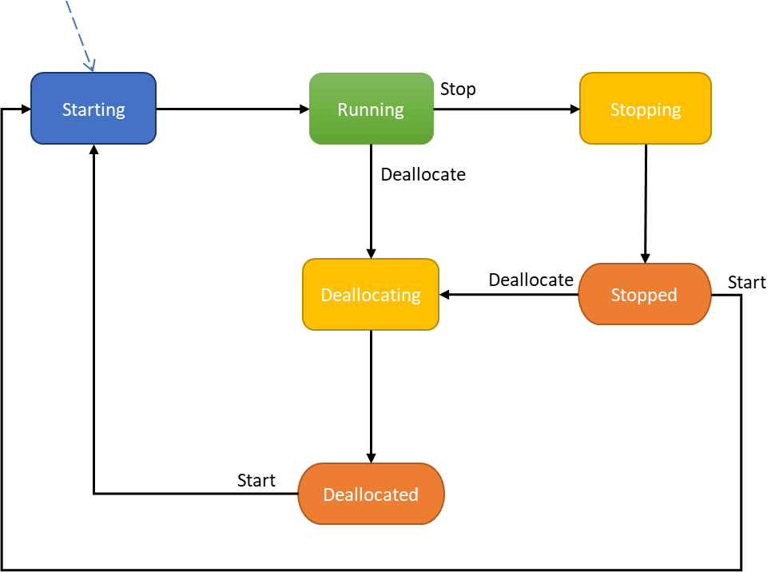

#Virtual Machines Lifecycle and States

Virtual Machines goes through different states in its lifecycle. VMs can be in one of the two distinct state machines called
provisioning and power states. Understanding these states will help
build a great customer experience for your applications.

##Power State

The Power states represent VM’s running state as seen by the hypervisor.

Figure 1: VM power state diagram

<table width="685">
<tbody>
<tr>
<td width="119">

<strong>State</strong>

</td>
<td width="484">

<strong>Description</strong>

</td>
<td width="83">

<strong>Billing</strong>

</td>
</tr>
<tr>
<td width="119">

<strong>Starting</strong>

</td>
<td width="484">

VM is starting up.

"statuses": [

 {

 "code": "ProvisioningState/creating",

 "level": "Info",

 "displayStatus": "Creating"

 },

 {

 "code": "PowerState/starting",

 "level": "Info",

 "displayStatus": "VM starting"

 }

 ]

</td>
<td width="83">

<strong>Not Billed</strong>

</td>
</tr>
<tr>
<td width="119">

<strong>Running</strong>

</td>
<td width="484">

Running state for a VM

"statuses": [

 {

 "code": "ProvisioningState/succeeded",

 "level": "Info",

 "displayStatus": "Provisioning succeeded",

 "time": &ldquo;time&rdquo;

 },

 {

 "code": "PowerState/running",

 "level": "Info",

 "displayStatus": "VM running"

 }

 ]

</td>
<td width="83">

<strong>Billed (Hardware + Software) </strong>

</td>
</tr>
<tr>
<td width="119">

<strong>Stopping</strong>

</td>
<td width="484">

Status of the VM when a VM is either stopped from client or guest OS. Stopping status is a transitional state which eventually transitions to its final state of Stopped.

"statuses": [

 {

 "code": "ProvisioningState/updating",

 "level": "Info",

 "displayStatus": "Updating"

 },

 {

 "code": "PowerState/stopping",

 "level": "Info",

 "displayStatus": "VM stopping"

 }

 ]

</td>
<td width="83">

<strong>Billed (Hardware + Software)</strong>

</td>
</tr>
<tr>
<td width="119">

<strong>Stopped</strong>

</td>
<td width="484">

State occurs when a VM has been shut down from the guest OS then the VM transitions to the stopped state.

An important distinction to note is that VM is only stopped on the host but not removed as compared to deallocate and is still billed.

"statuses": [

 {

 "code": "ProvisioningState/succeeded",

 "level": "Info",

 "displayStatus": "Provisioning succeeded",

 "time": "time"

 },

 {

 "code": "PowerState/stopped",

 "level": "Info",

 "displayStatus": "VM stopped"

 }

 ]

</td>
<td width="83">

<strong>Billed (Hardware only)</strong>

</td>
</tr>
<tr>
<td width="119">

<strong>Deallocating</strong>

</td>
<td width="484">

when the user stops the VM using client APIs VM transitions to deallocating transitional state.

"statuses": [

 {

 "code": "ProvisioningState/updating",

 "level": "Info",

 "displayStatus": "Updating"

 },

 {

 "code": "PowerState/deallocating",

 "level": "Info",

 "displayStatus": "VM deallocating"

 }

 ]

</td>
<td width="83">

<strong>Billed (Hardware only)</strong>

</td>
</tr>
<tr>
<td width="119">

<strong>Deallocated</strong>

</td>
<td width="484">

VM is stopped and removed/deallocated from the host. VM in the deallocated state are not billed, but other resources like network and storage are billed.

"statuses": [

 {

 "code": "ProvisioningState/succeeded",

 "level": "Info",

 "displayStatus": "Provisioning succeeded",

 "time": "time"

 },

 {

 "code": "PowerState/deallocated",

 "level": "Info",

 "displayStatus": "VM deallocated"

 }

 ]

</td>
<td width="83">

<strong>Not billed </strong>

</td>
</tr>
</tbody>
</table>

A VM can error out due to a variety of reasons, e.g., infrastructure,
platform, etc. Some of these failures are self-recovered and occur due
to loss of communication. Please refer to the following [Virtual
Machines Error
Messages](https://docs.microsoft.com/en-us/azure/virtual-machines/windows/error-messages)
in cases where VM has not recovered.

##Provisioning

These states reflect statuses of User-initiated (control plane)
operations on the VM. These states are independent of the running state
of a VM, which are exposed as Power states and discussed later in this
document.

**User Initiated actions **

1.  **Create** – Create a VM

2.  **Update** – Update model for an existing VM. Some non-model changes
    to VM such as start/Restart also fall under update.

3.  **Delete** – Delete a VM

4.  **Deallocate** – Deallocating a VM is a power state. Internal effect
    of deallocating a VM results into Update of the VM hence resulting
    into provisioning states related to updating.

**Operation states** – Transitional states after the platform has
accepted the request for user action.

<table>
<tbody>
<tr>
<td width="162">

<strong>States</strong>

</td>
<td width="366">

Description

</td>
</tr>
<tr>
<td width="162">

<strong>Creating</strong>

</td>
<td width="366">

"statuses": [

 {

 "code": "ProvisioningState/creating",

 "level": "Info",

 "displayStatus": "Creating"

 }

</td>
</tr>
<tr>
<td width="162">

<strong>Updating</strong>

</td>
<td width="366">

"statuses": [

 {

 "code": "ProvisioningState/updating",

 "level": "Info",

 "displayStatus": "Updating"

 }

 ]

</td>
</tr>
<tr>
<td width="162">

<strong>Deleting</strong>

</td>
<td width="366">

"statuses": [

 {

 "code": "ProvisioningState/deleting",

 "level": "Info",

 "displayStatus": "Deleting"

 }

 ]

</td>
</tr>
<tr>
<td width="162">

<strong>InProgress</strong>

</td>
<td width="366">

Creating or updating or deletion status

</td>
</tr>
<tr>
<td width="162">

<strong>Canceled</strong>

</td>
<td width="366">

User-initiated cancel will result in this state

</td>
</tr>
<tr>
<td width="162">

<strong>OS provisioning states</strong>

</td>
<td width="366">

If a VM is created with an OS image and not with a specialized image then following sub-states can be observed

<strong>1. </strong><strong>OSProvisioningInprogress</strong> &ndash; The VM is running, and installation of guest OS is in progress.   "statuses": [

 {

 "code": "ProvisioningState/ OSProvisioningInprogress",

 "level": "Info",

 "displayStatus": "OS Provisioning In progress"

 }

]

<strong>2. </strong><strong>OSProvisioningComplete</strong> &ndash; Short-lived as it quickly transitions to Success state from completion unless VM has to install the extension, installation of extension take time and thus provides a window where this state can be observed before it transitions over to succeed.  "statuses": [

 {

 "code": "ProvisioningState/ OSProvisioningComplete",

 "level": "Info",

 "displayStatus": "OS Provisioning Complete"

 }

]

<strong>Note</strong>: OS Provisioning can transition to Failed if OS fails or if OS fails to install in time. At this time customers will be billed for the deployed VM on the infrastructure. In cases where OS take longer than expected to complete the installation, the platform will automatically transition to success from failure. In other cases re-starting a VM can resolve the issue. If the issue is persistent, then refer to error codes documentation for resolution.

</td>
</tr>
</tbody>
</table>

Extract or delete HTML tags based on their name or whether or not they contain some attributes or content with the <a href="https://htmlg.com/html-editor/" target="_blank" rel="nofollow noopener">HTML editor pro</a> online program.

**Success**– This state represents that user-initiated actions have
completed.

> "statuses": \[
>
> {
>
> "code": "ProvisioningState/succeeded",
>
> "level": "Info",
>
> "displayStatus": "Provisioning succeeded",
>
> "time": "time"
>
> }
>
> \]

**Failed** – This state represents something has went wrong with the
operation. Refer to the error codes to get more information and possible
resolution.

> "statuses": \[
>
> {
>
> "code": "ProvisioningState/failed",
>
> "level": "Info",
>
> "displayStatus": "Provisioning failed",
>
> "time": "time"
>
> }
>
> \]

**Edge cases**: In cases where a VM was running and in a good state, a
failed management operation will typically leave the VM running with the
original VM model (configuration). If such a case happens then, the
effective running VM model may be different from the latest received and
persisted by CRP which is reported back if by GetVM API. To resolve this
issue, please look at the error message (either from the last failed
operation of the VM instance view). If the error is due to API input
validation then try to fix the inputs but if the error is due to Azure
internal errors a retry of the management operation should resolve the
issue.
