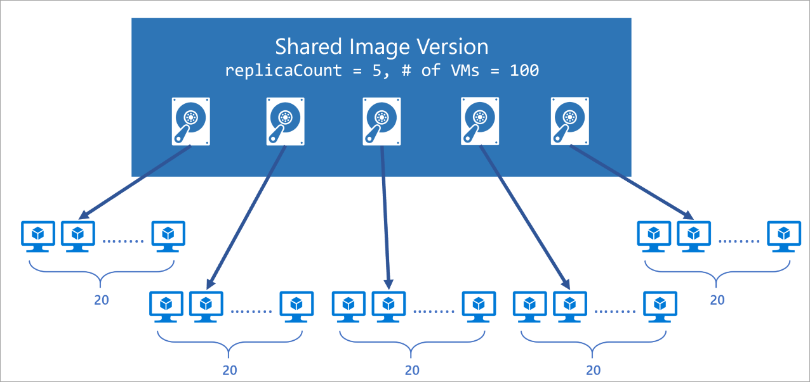
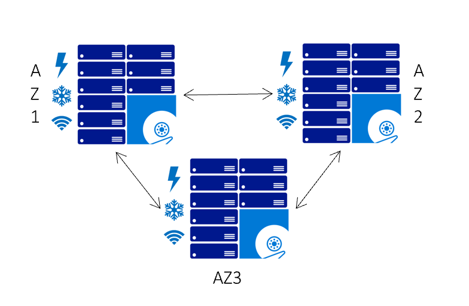

# Store and share resources in an Azure Compute Gallery

**Applies to:** :heavy_check_mark: Linux VMs :heavy_check_mark: Windows VMs :heavy_check_mark: Flexible scale sets :heavy_check_mark: Uniform scale sets

An Azure Compute Gallery helps you build structure and organization around your Azure resources, like images and [applications](vm-applications.md). An Azure Compute Gallery provides:

- Global replication.<sup>1</sup>
- Versioning and grouping of resources for easier management.
- Highly available resources with Zone Redundant Storage (ZRS) accounts in regions that support Availability Zones. ZRS offers better resilience against zonal failures.
- Premium storage support (Premium_LRS).
- Sharing to the community, across subscriptions, and between Active Directory (AD) tenants.
- Scaling your deployments with resource replicas in each region.

With a gallery, you can share your resources to everyone, or limit sharing to different users, service principals, or AD groups within your organization. Resources can be replicated to multiple regions, for quicker scaling of your deployments.

<sup>1</sup> The Azure Compute Gallery service isn't a global resource. For disaster recovery scenarios, the best practice is to have at least two galleries, in different regions.

## Images 

For more information about storing images in an Azure Compute Gallery, see [Store and share images in an Azure Compute Gallery](shared-image-galleries.md).

## VM apps

While you can create an image of a VM with apps pre-installed, you would need to update your image each time you have application changes. Separating your application installation from your VM images means there’s no need to publish a new image for every line of code change.

For more information about storing applications in an Azure Compute Gallery, see [VM Applications](vm-applications.md).


## Regional Support

All public regions can be target regions, but certain regions require that customers go through a request process in order to gain access. To request that a subscription be added to the allowlist for a region such as Australia Central or Australia Central 2, submit [an access request](/troubleshoot/azure/general/region-access-request-process)

## Limits 

There are limits, per subscription, for deploying resources using Azure Compute Galleries:
- 100 galleries, per subscription, per region
- 1,000 image definitions, per subscription, per region
- 10,000 image versions, per subscription, per region
- 100 replicas per image version however 50 replicas should be sufficient for most use cases
- Any disk attached to the image must be less than or equal to 1 TB in size
- Resource move isn't supported for Azure compute gallery resources

For more information, see [Check resource usage against limits](../networking/check-usage-against-limits.md) for examples on how to check your current usage.
 
## Scaling
Azure Compute Gallery allows you to specify the number of replicas you want to keep. In multi-VM deployment scenarios the VM deployments can be spread to different replicas reducing the chance of instance creation processing being throttled due to overloading of a single replica.

With Azure Compute Gallery, you can deploy up to a 1,000 VM instances in a scale set. You can set a different replica count in each target region, based on the scale needs for the region. Since each replica is a copy of your resource, this helps scale your deployments linearly with each extra replica. While we understand no two resources or regions are the same, here's our general guideline on how to use replicas in a region:

- For every 20 VMs that you create concurrently, we recommend you keep one replica. For example, if you're creating 120 VMs concurrently using the same image in a region, we suggest you keep at least 6 replicas of your image.
- For each scale set you create concurrently, we recommend you keep one replica.

We always recommend that to over-provision the number of replicas due to factors like resource size, content and OS type.



## High availability

[Azure Zone Redundant Storage (ZRS)](https://azure.microsoft.com/blog/azure-zone-redundant-storage-in-public-preview/) provides resilience against an Availability Zone failure in the region. With the general availability of Azure Compute Gallery, you can choose to store your images in ZRS accounts in regions with Availability Zones.

You can also choose the account type for each of the target regions. The default storage account type is Standard_LRS, but you can choose Standard_ZRS for regions with Availability Zones. For more information on regional availability of ZRS, see [Data redundancy](../storage/common/storage-redundancy.md).



## Replication
Azure Compute Gallery also allows you to replicate your resources to other Azure regions automatically. Each image version can be replicated to different regions depending on what makes sense for your organization. One example is to always replicate the latest image in multi-regions while all older image versions are only available in 1 region. This can help save on storage costs.

The regions that a resource is replicated to can be updated after creation time. The time it takes to replicate to different regions depends on the amount of data being copied and the number of regions the version is replicated to. This can take a few hours in some cases. While the replication is happening, you can view the status of replication per region. Once the image replication is complete in a region, you can then deploy a VM or scale-set using that resource in the region.


<a name=community></a>

## Sharing

There are three main ways to share images in an Azure Compute Gallery, depending on who you want to share with:


| Sharing with: | People | Groups | Service Principal | All users in a specific   subscription (or) tenant | Publicly with all users in   Azure |
|---|---|---|---|---|---|
| [RBAC Sharing](#rbac) | Yes | Yes | Yes | No | No |
| RBAC + [Direct shared gallery](#shared-directly-to-a-tenant-or-subscription)  | Yes | Yes | Yes | Yes | No |
| RBAC + [Community gallery](#community-gallery) | Yes | Yes | Yes | No | Yes |

### RBAC

As the Azure Compute Gallery, definition, and version are all resources, they can be shared using the built-in native Azure Roles-based Access Control (RBAC) roles. Using Azure RBAC roles you can share these resources to other users, service principals, and groups. You can even share access to individuals outside of the tenant they were created within. Once a user has access to the resource version, they can use it to deploy a VM or a Virtual Machine Scale Set.  Here's the sharing matrix that helps understand what the user gets access to:

| Shared with User     | Azure Compute Gallery | Image Definition | Image version |
|----------------------|----------------------|--------------|----------------------|
| Azure Compute Gallery | Yes                  | Yes          | Yes                  |
| Image Definition     | No                   | Yes          | Yes                  |

We recommend sharing at the Gallery level for the best experience. We don't recommend sharing individual image versions. For more information about Azure RBAC, see [Assign Azure roles](../role-based-access-control/role-assignments-portal.md).

For more information, see [Share using RBAC](./share-gallery.md).


### Shared directly to a tenant or subscription

Give specific subscriptions or tenants access to a direct shared Azure Compute Gallery. Sharing a gallery with tenants and subscriptions give them read-only access to your gallery. For more information, see [Share a gallery with subscriptions or tenants](./share-gallery-direct.md).

> [!IMPORTANT]
> Azure Compute Gallery – direct shared gallery is currently in PREVIEW and subject to the [Preview Terms for Azure Compute Gallery](https://azure.microsoft.com/support/legal/preview-supplemental-terms/).
>
> To publish images to a direct shared gallery during the preview, you need to register at [https://aka.ms/directsharedgallery-preview](https://aka.ms/directsharedgallery-preview). Creating VMs from a direct shared gallery is open to all Azure users.
> 
> During the preview, you need to create a new gallery, with the property `sharingProfile.permissions` set to `Groups`. When using the CLI to create a gallery, use the `--permissions groups` parameter. You can't use an existing gallery, the property can't currently be updated.
>
> You can't currently create a Flexible virtual machine scale set from an image shared to you by another tenant.

#### Limitations

During the preview:
- You can only share to subscriptions that are also in the preview.
- You can only share to 30 subscriptions and 5 tenants.
- A direct shared gallery can't contain encrypted image versions. Encrypted images can't be created within a gallery that is directly shared.
- Only the owner of a subscription, or a user or service principal assigned to the `Compute Gallery Sharing Admin` role at the subscription or gallery level will be able to enable group-based sharing.
- You need to create a new gallery,  with the property `sharingProfile.permissions` set to `Groups`. When using the CLI to create a gallery, use the `--permissions groups` parameter. You can't use an existing gallery, the property can't currently be updated.

### Community gallery

To share a gallery with all Azure users, you can create a community gallery (preview). Community galleries can be used by anyone with an Azure subscription. Someone creating a VM can browse images shared with the community using the portal, REST, or the Azure CLI.

Sharing images to the community is a new capability in [Azure Compute Gallery](./azure-compute-gallery.md). In the preview, you can make your image galleries public, and share them to all Azure customers. When a gallery is marked as a community gallery, all images under the gallery become available to all Azure customers as a new resource type under Microsoft.Compute/communityGalleries. All Azure customers can see the galleries and use them to create VMs. Your original resources of the type `Microsoft.Compute/galleries` are still under your subscription, and private.

For more information, see [Share images using a community gallery](./share-gallery-community.md).


> [!IMPORTANT]
> Azure Compute Gallery – community galleries is currently in PREVIEW and subject to the [Preview Terms for Azure Compute Gallery - community gallery](https://azure.microsoft.com/support/legal/preview-supplemental-terms/).
>
>To publish a community gallery, you'll need to [set up preview features in your Azure subscription](/azure/azure-resource-manager/management/preview-features?tabs=azure-portal). Creating VMs from community gallery images is open to all Azure users. 
> 
> During the preview, the gallery must be created as a community gallery (for CLI, this means using the `--permissions community` parameter) you currently can't migrate a regular gallery to a community gallery.
> 
> You can't currently create a Flexible virtual machine scale set from an image shared by another tenant.


#### Why share to the community?

As a content publisher, you might want to share a gallery to the community:

- If you have non-commercial, non-proprietary content to share widely on Azure.

- You want greater control over the number of versions, regions, and the duration of image availability.  

- You want to quickly share daily or nightly builds with your customers.  

- You don’t want to deal with the complexity of multi-tenant authentication when sharing with multiple tenants on Azure.

#### How sharing with the community works

You [create a gallery resource](create-gallery.md#create-a-community-gallery) under `Microsoft.Compute/Galleries` and choose `community` as a sharing option.

When you're ready, you flag your gallery as ready to be shared publicly. Only the  owner of a subscription, or a user or service principal with the `Compute Gallery Sharing Admin` role at the subscription or gallery level, can enable a gallery to go public to the community. At this point, the Azure infrastructure creates proxy read-only regional resources, under `Microsoft.Compute/CommunityGalleries`, which are public.

The end-users can only interact with the proxy resources, they never interact with your private resources. As the publisher of the private resource, you should consider the private resource as your handle to the public proxy resources. The `prefix` you provide when you create the gallery will be used, along with a unique GUID, to create the public facing name for your gallery.

Azure users can see the latest image versions shared to the community in the portal, or query for them using the CLI. Only the latest version of an image is listed in the community gallery.

When creating a community gallery, you'll need to provide contact information for your images. This information will be shown **publicly**, so be careful when providing it:
- Community gallery prefix
- Publisher support email
- Publisher URL
- Legal agreement URL

Information from your image definitions will also be publicly available, like what you provide for **Publisher**, **Offer**, and **SKU**.

> [!WARNING]
> If you want to stop sharing a gallery publicly, you can update the gallery to stop sharing, but making the gallery private will prevent existing virtual machine scale set users from scaling their resources.
>
> If you stop sharing your gallery during the preview, you won't be able to re-share it.


#### Limitations for images shared to the community

There are some limitations for sharing your gallery to the community:
- Encrypted images aren't supported.
- For the preview, image resources need to be created in the same region as the gallery. For example, if you create a gallery in West US, the image definitions and image versions should be created in West US if you want to make them available during the public preview.
- For the preview, you can't share [VM Applications](vm-applications.md) to the community.
- The gallery must be created as a community gallery. For the preview, there's no way to migrate an existing gallery to be a community gallery.
- To find images shared to the community from the Azure portal, you need to go through the VM create or scale set creation pages. You can't search the portal or Azure Marketplace for the images.

> [!IMPORTANT]
> Microsoft does not provide support for images you share to the community.

#### Community-shared images FAQ

**Q: What are the charges for using a gallery that is shared to the community?**

**A**: There are no charges for using the service itself. However, content publishers would be charged for the following:
- Storage charges for application versions and replicas in each of the regions (source and target). These charges are based on the storage account type chosen. 
- Network egress charges for replication across regions.

**Q: Is it safe to use images shared to the community?**

**A**: Users should exercise caution while using images from non-verified sources, since these images aren't subject to Azure certification.  

**Q: If an image that is shared to the community doesn’t work, who do I contact for support?**

**A**: Azure isn't responsible for any issues users might encounter with community-shared images. The support is provided by the image publisher. Please look up the publisher contact information for the image and reach out to them for any support.  

**Q: Is Community gallery sharing functionality part of Azure Marketplace?**

**A**: No, Community gallery sharing is not part of Azure Marketplace, it's a feature of 'Azure Compute Gallery'. Anyone with an Azure subscription can use 'Community gallery' and make their images public.

**Q: I have concerns about an image, who do I contact?**

**A**: For issues with images shared to the community:
- To report malicious images, contact [Abuse Report](https://msrc.microsoft.com/report/abuse). 
- To report images that potentially violate intellectual property rights, contact [Infringement Report](https://msrc.microsoft.com/report/infringement).
 

**Q: How do I request that an image shared to the community be replicated to a specific region?**

**A**: Only the content publishers have control over the regions their images are available in. If you don’t find an image in a specific region, reach out to the publisher directly.

## Activity Log
The [Activity log](../azure-monitor/essentials/activity-log.md) displays recent activity on the gallery, image, or version including any configuration changes and when it was created and deleted.  View the activity log in the Azure portal, or create a [diagnostic setting to send it to a Log Analytics workspace](../azure-monitor/essentials/activity-log.md#send-to-log-analytics-workspace), where you can view events over time or analyze them with other collected data

The following table lists a few example operations that relate to gallery operations in the activity log. For a complete list of possible log entries, see [Microsoft.Compute Resource Provider options](../role-based-access-control/resource-provider-operations.md#compute)

| Operation | Description |
|:---|:---|
| Microsoft.Compute/galleries/write | Creates a new Gallery or updates an existing one |
| Microsoft.Compute/galleries/delete	| Deletes the Gallery |
| Microsoft.Compute/galleries/share/action | Shares a Gallery to different scopes |
| Microsoft.Compute/galleries/images/read	| Gets the properties of Gallery Image |
| Microsoft.Compute/galleries/images/write	| Creates a new Gallery Image or updates an existing one |
| Microsoft.Compute/galleries/images/versions/read	| Gets the properties of Gallery Image Version |


## Billing
There is no extra charge for using the Azure Compute Gallery service. you'll be charged for the following resources:
- Storage costs of storing each replica. For images, the storage cost is charged as a snapshot and is based on the occupied size of the image version, the number of replicas of the image version and the number of regions the version is replicated to. 
- Network egress charges for replication of the first resource version from the source region to the replicated regions. Subsequent replicas are handled within the region, so there are no additional charges. 

For example, let's say you have an image of a 127 GB OS disk, that only occupies 10GB of storage, and one empty 32 GB data disk. The occupied size of each image would only be 10 GB. The image is replicated to 3 regions and each region has two replicas. There will be six total snapshots, each using 10GB. you'll be charged the storage cost for each snapshot based on the occupied size of 10 GB. you'll pay network egress charges for the first replica to be copied to the additional two regions. For more information on the pricing of snapshots in each region, see [Managed disks pricing](https://azure.microsoft.com/pricing/details/managed-disks/). For more information on network egress, see [Bandwidth pricing](https://azure.microsoft.com/pricing/details/bandwidth/).

## Best practices

- To prevent images from being accidentally deleted, use resource locks at the Gallery level. For more information, see [Protect your Azure resources with a lock](../azure-resource-manager/management/lock-resources.md).

- Use ZRS wherever available for high availability. You can configure ZRS in the replication tab when you create a version of the image or VM application.
 For more information about which regions support ZRS, see [Azure regions with availability zones](../availability-zones/az-overview.md#azure-regions-with-availability-zones).

- Keep a minimum of 3 replicas for production images. For every 20 VMs that you create concurrently, we recommend you keep one replica.  For example, if you create 1000 VMs concurrently, you should keep 50 replicas (you can have a maximum of 50 replicas per region).  To update the replica count, please go to the gallery -> Image Definition -> Image Version -> Update replication.

- Maintain separate galleries for production and test images, don’t put them in a single gallery.

- When creating an image definition, keep the Publisher/Offer/SKU consistent with Marketplace images to easily identify OS versions.  For example, if you're customizing a Windows server 2019 image from Marketplace and store it as a Compute gallery image, please use the same Publisher/Offer/SKU that is used in the Marketplace image in your compute gallery image.
 
- Use `excludeFromLatest` when publishing images if you want to exclude a specific image version during VM or scale set creation. 
[Gallery Image Versions - Create Or Update](/rest/api/compute/gallery-image-versions/create-or-update#galleryimageversionpublishingprofile).

    If you want to exclude a version in a specific region, use `regionalExcludeFromLatest`   instead of the global `excludeFromLatest`.  You can set both global and regional `excludeFromLatest` flag, but the regional flag will take precedence when both are specified.

    ```
    "publishingProfile": {
      "targetRegions": [
        {
          "name": "brazilsouth",
          "regionalReplicaCount": 1,
          "regionalExcludeFromLatest": false,
          "storageAccountType": "Standard_LRS"
        },
        {
          "name": "canadacentral",
          "regionalReplicaCount": 1,
          "regionalExcludeFromLatest": true,
          "storageAccountType": "Standard_LRS"
        }
      ],
      "replicaCount": 1,
      "excludeFromLatest": true,
      "storageAccountType": "Standard_LRS"
    }
    ```


- For disaster recovery scenarios, it's a best practice is to have at least two galleries, in different regions. You can still use image versions in other regions, but if the region your gallery is in goes down, you can't create new gallery resources or update existing ones.

- Set `safetyProfile.allowDeletionOfReplicatedLocations` to false on Image versions to prevent accidental deletion of replicated regions and prevent outage. You can also set this using CLI [allow-replicated-location-deletion](/cli/azure/sig/image-version#az-sig-image-version-create)

```
{ 
  "properties": { 
    "publishingProfile": { 
      "targetRegions": [ 
        { 
          "name": "West US", 
          "regionalReplicaCount": 1, 
          "storageAccountType": "Standard_LRS", 
          // encryption info         
        }
      ], 
      "replicaCount": 1, 
      "publishedDate": "2018-01-01T00:00:00Z", 
      "storageAccountType": "Standard_LRS" 
    }, 
    "storageProfile": { 
      "source": { 
        "id": "/subscriptions/{subscriptionId}/resourceGroups/{resourceGroup}/providers/Microsoft.Compute/images/{imageName}" 
      }, 
    }, 
   “safetyProfile”: { 
      “allowDeletionOfReplicatedLocations” : false 
    }, 
  }, 
  "location": "West US", 
  "name": "1.0.0" 
} 
```


## SDK support

The following SDKs support creating Azure Compute Galleries:

- [.NET](/dotnet/api/overview/azure/virtualmachines#management-apis)
- [Java](/java/azure/)
- [Node.js](/javascript/api/overview/azure/arm-compute-readme)
- [Python](/python/api/overview/azure/virtualmachines)
- [Go](/azure/go/)

## Templates

You can create Azure Compute Gallery resource using templates. There are several quickstart templates available: 

- [Create a gallery](https://azure.microsoft.com/resources/templates/sig-create/)
- [Create an image definition in a gallery](https://azure.microsoft.com/resources/templates/sig-image-definition-create/)
- [Create an image version in a gallery](https://azure.microsoft.com/resources/templates/sig-image-version-create/)


## Next steps

Learn how to deploy [images](shared-image-galleries.md) and [VM apps](vm-applications.md) using an Azure Compute Gallery.
