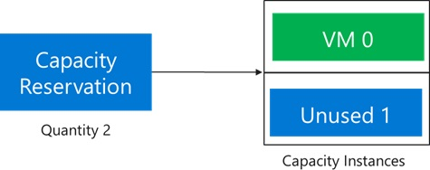
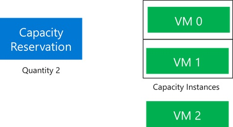
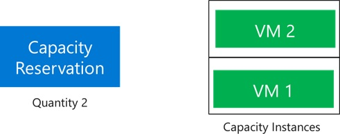
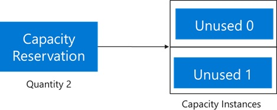
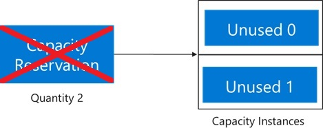
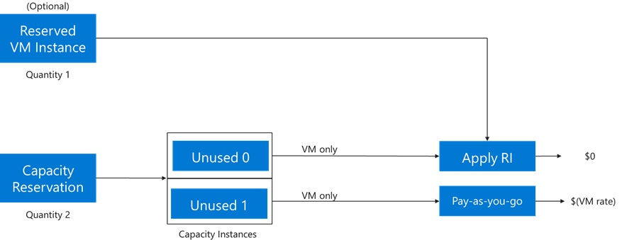
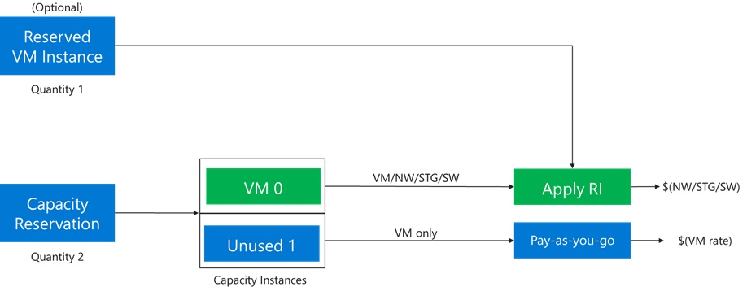

# On-demand Capacity Reservation 

**Applies to:** :heavy_check_mark: Linux VMs :heavy_check_mark: Windows VMs :heavy_check_mark: Uniform scale set :heavy_check_mark: Flexible scale sets

On-demand Capacity Reservation enables you to reserve Compute capacity in an Azure region or an Availability Zone for any duration of time. Unlike [Reserved Instances](https://azure.microsoft.com/pricing/reserved-vm-instances/), you don't have to sign up for a 1-year or a 3-year term commitment. Create and delete reservations at any time and have full control over how you want to manage your reservations.  

Once you create the Capacity Reservation, the resources can be used immediately. Capacity is reserved for you until you delete the reservation.  

Capacity Reservation has some basic properties that are always defined at the time of creation: 

- **VM size** - Each reservation is for one VM size. For example, `Standard_D2s_v3`.  
- **Location** - Each reservation is for one location (region). If that location has availability zones, then the reservation can also specify one of the zones. 
- **Quantity** - Each reservation has a quantity of instances to be reserved. 

To create a Capacity Reservation, these parameters are passed to Azure as a capacity request. If Azure doesn't have capacity available that meets the request, the reservation deployment fails. Your deployment fails if you don't have an adequate subscription quota. Request a higher quota or try a different VM size, location, or zone combination. 

Once Azure accepts your reservation request, it's available for VMs with matching configurations. To consume Capacity Reservation, the VM has to specify the reservation in its properties. Otherwise, the Capacity Reservation isn't used. One benefit of this design is that you can target only critical workloads to reservations and other non-critical workloads can run without reserved capacity. 

## Benefits of Capacity Reservation 

- Once deployed, capacity is reserved for your use and always available within the scope of applicable SLAs 
- Can be deployed and deleted at any time with no term commitment 
- Can be combined automatically with Reserved Instances to use term commitment discounts 

## SLA for Capacity Reservation 

Please read the Service Level Agreement details in the [SLA for Capacity Reservation](https://aka.ms/CapacityReservationSLAForVM). 

Any claim against the SLA requires calculating the Minutes Not Available for the reserved capacity. Here's an example of how to calculate Minutes Not Available. 

- A On Demand Capacity Reservation has a total Capacity of five Reserved Units. The On Demand Capacity Reservation starts in the Unused Capacity state with zero Virtual Machines Allocated. 
- A Supported Deployment of quantity 5 is allocated to the On Demand Capacity Reservation. Three Virtual Machines succeed and two fail with a Virtual Machine capacity error. Result: Two Reserved Units begin to accumulate Minutes Not Available. 
- No action is taken for 20 minutes. Result: Two Reserved Units each accumulate 15 Minutes Not Available. 
- At 20 minutes, a Supported Deployment of quantity 2 is attempted. One Virtual Machine succeeds, the other Virtual Machine fails with a Virtual Machine capacity error. Result: One Reserved Unit stays at 15 accumulated Minutes Not Available. Another Reserved Unit resumes accumulating Minutes Not Available. 
- Four more Supported Deployments of quantity 1 are made at 10-minute intervals. On the fourth attempt (60 minutes after the first capacity error), the Virtual Machine is deployed. Result: The last Reserved Unit adds 40 minutes of Minutes Not Available (Four attempts x 10 minutes between attempts) for a total of 55 Minutes Not Available. 

From this example accumulation of Minutes Not Available, here's the calculation of Service Credit. 

- One Reserved Unit accumulated 15 minutes of Downtime. The Percentage Uptime is 99.97%. This Reserved Unit doesn't qualify for Service Credit. 
- Another Reserved Unit accumulated 55 minutes of Downtime. The Percentage Uptime is 99.87. This Reserved Unit qualifies for Service Credit of 10%. 

## Limitations and restrictions 

- Creating capacity reservations requires quota in the same manner as creating virtual machines. 
- Creating capacity reservation is currently limited to certain VM Series and Sizes. The Compute [Resource SKUs list](/rest/api/compute/resource-skus/list) advertises the set of supported VM Sizes. 
- The following VM Series support creation of capacity reservations: 
    - Av2 
    - B 
    - D series, v2 and newer; AMD and Intel 
    - E series, all versions; AMD and Intel 
    - F series, all versions 
    - Lsv3 (Intel) and Lasv3 (AMD)
    - At VM deployment, Fault Domain (FD) count of up to 3 may be set as desired using Virtual Machine Scale Sets. A deployment with more than 3 FDs will fail to deploy against a Capacity Reservation. 
- Support for other VM Series isn't currently available: 
    - Ls and Lsv2 series  
    - M series, any version 
    - NC-series, v3 and newer 
    - NV-series, v2 and newer 
    - ND-series 
    - Hb-series 
    - Hc-series 
- The following deployment types are supported: 
    - Single VM
    - Virtual Machine Scale Sets with Uniform Orchestration
    - Virtual Machine Scale Sets with Flexible Orchestration (preview)
- The following deployment types aren't supported: 
    - Spot VMs 
    - Azure Dedicated Host Nodes or VMs deployed to Dedicated Hosts 
    - Availability Sets 
- Other deployment constraints aren't supported. For example: 
    - Proximity Placement Group 
    - Update domains 
    - Virtual Machine Scale Sets with single placement group set 'true' 
    - UltraSSD storage
    - VMs resuming from hibernation 
    - VMs requiring vnet encryption
- Only the subscription that created the reservation can use it. 
- Reservations are only available to paid Azure customers. Sponsored accounts such as Free Trial and Azure for Students aren't eligible to use this feature. 

## Pricing and billing 

Capacity Reservations are priced at the same rate as the underlying VM size. For example, if you create a reservation for 10 D2s_v3 VMs then you'll start getting billed for 10 D2s_v3 VMs, even if the reservation isn't being used.  

If you then deploy a D2s_v3 VM and specify reservation property, the Capacity Reservation gets used. Once in use, you pay for only VM and not the Capacity Reservation. Let’s say you deploy six D2s_v3 VMs against the previously mentioned Capacity Reservation. You see a bill for six D2s_v3 VMs and four unused Capacity Reservation, both charged at the same rate as a D2s_v3 VM.  

Both used and unused Capacity Reservation and Saving Plan are eligible for Reserved Instances term commitment discounts. In the previous example, if you have Reserved Instances for two D2s_v3 VMs in the same Azure region, the billing for two resources (either VM or unused Capacity Reservation) will be zeroed out. The remaining eight D2s_v3 is billed normally. The term commitment discounts could be applied on either the VM or the unused Capacity Reservation. 

## Difference between On-demand Capacity Reservation and Reserved Instances 

| Differences | On-demand Capacity Reservation | Reserved Instances|
|---|---|---|
| Term | No term commitment required. Can be created and deleted as per the customer requirement | Fixed term commitment of either one-year or three-years|
| Billing discount | Charged at pay-as-you-go rates for the underlying VM size* | Significant cost savings over pay-as-you-go rates |
| Capacity SLA | Provides capacity guarantee in the specified location (region or availability zone) | Doesn't provide a capacity guarantee. Customers can choose “capacity priority” to gain better access, but that option doesn't carry an SLA |
| Region vs Availability Zones | Can be deployed per region or per availability zone | Only available at regional level |

*Eligible for Reserved Instances discount if purchased separately

## Work with Capacity Reservation 

Capacity Reservation is created for a specific VM size in an Azure region or an Availability Zone. All reservations are created and managed as part of a Capacity Reservation Group. 

The group specifies the Azure location:

- The group sets the region in which all reservations are created. For example, East US, North Europe, or Southeast Asia. 
- The group sets the eligible zones. For example, AZ1, AZ2, AZ3 in any combination. 
- If no zones are specified, Azure selects the placement for the group somewhere in the region. Each reservation specifies the region and may not set a zone. 

Each reservation in a group is for one VM size. If eligible zones were selected for the group, the reservation must be for one of the supported zones. 

A group can have only one reservation per VM size per zone, or just one reservation per VM size if no zones are selected. 

To consume Capacity Reservation, specify Capacity Reservation Group as one of the VM properties. If the group doesn’t have a reservation matching the size and location, Azure returns an error message. 

The quantity reserved for reservation can be adjusted after initial deployment by changing the capacity property. Other changes to Capacity Reservation, such as VM size or location, aren't permitted. The recommended approach is to create a new reservation, migrate any existing VMs, and then delete the old reservation if no longer needed. 

Capacity Reservation doesn’t create limits on the number of VM deployments. Azure supports allocating as many VMs as desired against the reservation. As the reservation itself requires quota, the quota checks are omitted for VM deployment up to the reserved quantity. Allocating VMs beyond the reserved quantity is call overallocating the reservation. Overallocating VMs isn't covered by the SLA and the VMs are subject to quota checks and Azure fulfilling the extra capacity. Once deployed, these extra VM instances can cause the quantity of VMs allocated against the reservation to exceed the reserved quantity. To learn more, go to [Overallocating Capacity Reservation](capacity-reservation-overallocate.md). 

## Capacity Reservation lifecycle

When a reservation is created, Azure sets aside the requested number of capacity instances in the specified location: 

 

Track the state of the overall reservation through the following properties:  
- `capacity` = Total quantity of instances reserved by the customer. 
- `virtualMachinesAllocated` = List of VMs allocated against the Capacity Reservation and count towards consuming the capacity. These VMs are either *Running*, *Stopped* (*Allocated*), or in a transitional state such as *Starting* or *Stopping*. This list doesn’t include the VMs that are in deallocated state, referred to as *Stopped* (*deallocated*). 
- `virtualMachinesAssociated` = List of VMs associated with the Capacity Reservation. This list has all the VMs that have been configured to use the reservation, including the ones that are in deallocated state.  

The previous example starts with `capacity` as 2 and length of `virtualMachinesAllocated` and `virtualMachinesAssociated` as 0.  

When a VM is then allocated against the Capacity Reservation, it consumes one of the reserved capacity instances: 

 

The status of the Capacity Reservation shows `capacity` as 2 and length of `virtualMachinesAllocated` and `virtualMachinesAssociated` as 1.  

Allocations against the Capacity Reservation succeed as along as the VMs have matching properties and there is at least one empty capacity instance.  

Using our example, when a third VM is allocated against the Capacity Reservation, the reservation enters the [overallocated](capacity-reservation-overallocate.md) state. This third VM requires unused quota and extra capacity fulfillment from Azure. Once the third VM is allocated, the Capacity Reservation now looks like this: 

 

The `capacity` is 2 and the length of `virtualMachinesAllocated` and `virtualMachinesAssociated` is 3. 

Now suppose the application scales down to the minimum of two VMs. Since VM 0 needs an update, it's chosen for deallocation. The reservation automatically shifts to this state: 

 

The `capacity` and the length of `virtualMachinesAllocated` are both 2. However, the length for `virtualMachinesAssociated` is still 3 as VM 0, though deallocated, is still associated with the Capacity Reservation. To prevent quota overrun, the deallocated VM 0 still counts against the quota allocated to the reservation. As long as you have enough unused quota, you can deploy new VMs to the Capacity Reservation and receive the SLA from any unused reserved capacity. Or you can delete VM 0 to remove its use of quota. 

The Capacity Reservation exists until explicitly deleted. To delete a Capacity Reservation, the first step is to dissociate all the VMs in the `virtualMachinesAssociated` property. Once disassociation is complete, the Capacity Reservation should look like this: 

 

The status of the Capacity Reservation shows `capacity` as 2 and length of `virtualMachinesAssociated` and `virtualMachinesAllocated` as 0. From this state, the Capacity Reservation can be deleted. Once deleted, you don't pay for the reservation anymore.  

## Usage and billing 

When a Capacity Reservation is empty, VM usage is reported for the corresponding VM size and the location. [VM Reserved Instances](https://azure.microsoft.com/pricing/reserved-vm-instances/) can cover some or all of the Capacity Reservation usage even when VMs aren't deployed. 

### Example

For example, lets say a Capacity Reservation with quantity reserved 2 has been created. The subscription has access to one matching Reserved VM Instance of the same size. The result is two usage streams for the Capacity Reservation, one of which is covered by the Reserved Instance: 

In the previous image, a Reserved VM Instance discount is applied to one of the unused instances and the cost for that instance is zeroed out. For the other instance, PAYG rate is charged for the VM size reserved.  

When a VM is allocated against the Capacity Reservation, the other VM components such as disks, network, extensions, and any other requested components must also be allocated. In this state, the VM usage reflects one allocated VM and one unused capacity instance. The Reserved VM Instance will zero out the cost of either the VM or the unused capacity instance. The other charges for disks, networking, and other components associated with the allocated VM also appears on the bill. 

In the previous image, the VM Reserved Instance discount is applied to VM 0, which is only charged for other components such as disk and networking. The other unused instance is being charged at PAYG rate for the VM size reserved.

## Frequently asked questions 

- **What’s the price of on-demand Capacity Reservation?**

    The price of your on-demand Capacity Reservation is same as the price of underlying VM size associated with the reservation. When using Capacity Reservation, you'll be charged for the VM size you selected at pay-as-you-go rates, whether the VM has been provisioned or not.  Visit the [Windows](https://azure.microsoft.com/pricing/details/virtual-machines/windows/) and [Linux](https://azure.microsoft.com/pricing/details/virtual-machines/linux/) VM pricing pages for more details. 

- **Will I get charged twice, for the cost of on-demand Capacity Reservation and for the actual VM when I finally provision it?**

    No, you only get charged once for on-demand Capacity Reservation. 

- **Can I apply Reserved Virtual Machine Instance (RI) to on-demand Capacity Reservation to lower my costs?**

    Yes, you can apply existing or future RIs to on-demand capacity reservations and receive RI discounts. Available RIs are applied automatically to Capacity Reservation the same way they're applied to VMs.

- **What is the difference between Reserved Virtual Machine Instance (RI) and on-demand Capacity Reservation?**

    Both RIs and on-demand capacity reservations are applicable to Azure VMs. However, RIs provide discounted reservation rates for your VMs compared to pay-as-you-go rates as a result of a 1-year or 3-year term commitment. Conversely, on-demand capacity reservations don't require a commitment. You can create or cancel a Capacity Reservation at any time. However, no discounts are applied, and you'll incur charges at pay-as-you-go rates after your Capacity Reservation has been successfully provisioned. Unlike RIs, which prioritize capacity but don't guarantee it, when you purchase an on-demand Capacity Reservation, Azure sets aside compute capacity for your VM and provides an SLA guarantee.  

- **Which scenarios would benefit the most from on-demand capacity reservations?**

    Typical scenarios include business continuity, disaster recovery, and scale-out of mission-critical applications.  

## Next steps

Get started reserving Compute capacity. Check out our other related Capacity Reservation articles: 
- [Create a capacity reservation](capacity-reservation-create.md)
- [Overallocating capacity reservation](capacity-reservation-overallocate.md)
- [Modify a capacity reservation](capacity-reservation-modify.md)
- [Associate a VM](capacity-reservation-associate-vm.md)
- [Remove a VM](capacity-reservation-remove-vm.md)
- [Associate a Virtual Machine Scale Set - Flexible](capacity-reservation-associate-virtual-machine-scale-set-flex.md)
- [Associate a Virtual Machine Scale Set - Uniform](capacity-reservation-associate-virtual-machine-scale-set.md)
- [Remove a Virtual Machine Scale Set](capacity-reservation-remove-virtual-machine-scale-set.md)
