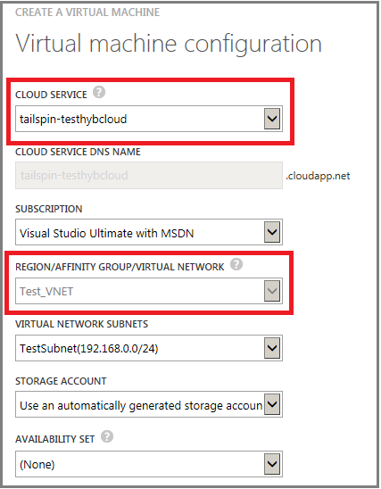

<properties
	pageTitle="Connect VMs in a cloud service | Microsoft Azure"
	description="Connect a virtual machine created with the classic deployment model to an Azure cloud service or virtual network."
	services="virtual-machines"
	documentationCenter=""
	authors="cynthn"
	manager="timlt"
	editor=""
	tags="azure-service-management"/>

<tags
	ms.service="virtual-machines"
	ms.workload="infrastructure-services"
	ms.tgt_pltfrm="vm-multiple"
	ms.devlang="na"
	ms.topic="article"
	ms.date="10/15/2015"
	ms.author="cynthn"/>

# Connect virtual machines created with the classic deployment model with a virtual network or cloud service

[AZURE.INCLUDE [learn-about-deployment-models](../../includes/learn-about-deployment-models-classic-include.md)] Resource Manager model.

Virtual machines created with the classic deployment model are always placed in a cloud service. The cloud service acts as a container and provides a unique public DNS name, a public IP address, and a set of endpoints to access the virtual machine over the Internet. The cloud service can be in a virtual network, but that's not a requirement.

If a cloud service isn't in a virtual network, it's called a *standalone* cloud service. The virtual machines in a standalone cloud service can only communicate with other virtual machines by using the other virtual machines’ public DNS names, and the traffic travels over the Internet. If a cloud service is in a virtual network, the virtual machines in that cloud service can communicate with all other virtual machines in the virtual network without sending any traffic over the Internet.

If you place your virtual machines in the same standalone cloud service, you can still use load balancing and availability sets. For details, see [Load balancing virtual machines](../articles/load-balance-virtual-machines.md) and [Manage the availability of virtual machines](../articles/manage-availability-virtual-machines.md). However, you can't organize the virtual machines on subnets or connect a standalone cloud service to your on-premises network. Here's an example:

If you place your virtual machines in a virtual network, you can decide how many cloud services you want to use for load balancing and availability sets. Additionally, you can organize the virtual machines on subnets in the same way as your on-premises network and connect the virtual network to your on-premises network. Here's an example:

Virtual networks are the recommended way to connect virtual machines in Azure. The best practice is to configure each tier of your application in a separate cloud service. However, you may need to combine some virtual machines from different application tiers into the same cloud service to remain within the maximum of 200 cloud services per subscription. To review this and other limits, see [Azure Subscription and Service Limits, Quotas, and Constraints](../azure-subscription-service-limits.md).

## Connect VMs in a virtual network

To connect virtual machines in a virtual network:

1.	Create the virtual network in the [Azure Preview Portal](../articles/virtual-network/virtual-networks-create-vnet-classic-pportal.md).
2.	Create the set of cloud services for your deployment to reflect your design for availability sets and load balancing. In the portal, click **New > Compute > Cloud Service > Custom Create** for each cloud service.
3.	To create each new virtual machine, click **New > Compute > Virtual Machine > From Gallery**. Choose the correct cloud service and virtual network for the VM. If the cloud service is already joined to a virtual network, its name will already be selected for you.

## Connect VMs in a standalone cloud service

To connect virtual machines in a standalone cloud service:

1.	Create the cloud service in the [Azure Portal](http://manage.windowsazure.com). Click **New > Compute > Cloud Service > Custom Create**. Or, you can create the cloud service for your deployment when you create your first virtual machine.
2.	When you create the virtual machines, choose the name of cloud service created in the previous step.

##Resources
[Load balancing virtual machines](../articles/load-balance-virtual-machines.md)

[Manage the availability of virtual machines](../articles/manage-availability-virtual-machines.md)

[Virtual Network Configuration Tasks](../documentation/services/virtual-machines/)

After you create a virtual machine, it's a good idea to add a data disk so your services and workloads have a location to store data. See one of the following:

[How to Attach a Data Disk to a Linux Virtual Machine](../articles/virtual-machines/virtual-machines-linux-how-to-attach-disk.md)

[How to Attach a Data Disk to a Windows Virtual Machine](../articles/virtual-machines/storage-windows-attach-disk.md)