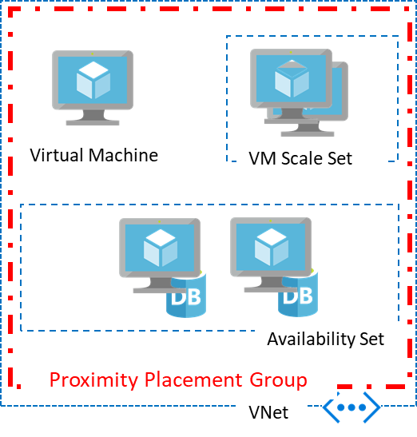

# Proximity placement groups

**Applies to:** :heavy_check_mark: Linux VMs :heavy_check_mark: Windows VMs :heavy_check_mark: Flexible scale sets :heavy_check_mark: Uniform scale sets

Placing VMs in a single region reduces the physical distance between the instances. Placing them within a single availability zone will also bring them physically closer together. However, as the Azure footprint grows, a single availability zone may span multiple physical data centers, which may result in a network latency impacting your application. 

To get VMs as close as possible, achieving the lowest possible latency, you should deploy them within a proximity placement group.

A proximity placement group is a logical grouping used to make sure that Azure compute resources are physically located close to each other. Proximity placement groups are useful for workloads where low latency is a requirement.

- Low latency between stand-alone VMs.
- Low Latency between VMs in a single availability set or a virtual machine scale set. 
- Low latency between stand-alone VMs, VMs in multiple Availability Sets, or multiple scale sets. You can have multiple compute resources in a single placement group to bring together a multi-tiered application. 
- Low latency between multiple application tiers using different hardware types. For example, running the backend using M-series in an availability set and the front end on a D-series instance, in a scale set, in a single proximity placement group.

## Using Proximity Placement Groups 

A proximity placement group is a resource in Azure. You need to create one before using it with other resources. Once created, it could be used with virtual machines, availability sets, or virtual machine scale sets. 
You specify a proximity placement group when creating compute resources providing the proximity placement group ID. 

You can also move an existing resource into a proximity placement group. When moving a resource into a proximity placement group, you should stop (deallocate) the asset first since it will be redeployed potentially into a different data center in the region to satisfy the colocation constraint. 

In the case of availability sets and virtual machine scale sets, you should set the proximity placement group at the resource level rather than the individual virtual machines. 

A proximity placement group is a colocation constraint rather than a pinning mechanism. It is pinned to a specific data center with the deployment of the first resource to use it. Once all resources using the proximity placement group have been stopped (deallocated) or deleted, it is no longer pinned. Therefore, when using a proximity placement group with multiple VM series, it is important to specify all the required types upfront in a template when possible or follow a deployment sequence which will improve your chances for a successful deployment. If your deployment fails, restart the deployment with the VM size which has failed as the first size to be deployed.

## Proximity Placement Group Intent

Intent is an optional parameter to provide the intended [VM Sizes](../virtual-machines/sizes.md) to be part of the proximity placement group. This parameter can be added or modified while updating the proximity placement group after deallocating all the VMs from the proximity placement group. 

Additionally, an optional avaiability zone can be indicated through intent by providing the zone parameter, in case the proximity placement group must be created within a specific availability zone. Please note the following while providing zone parameter:

- The availability zone parameter can only be provided while creation of the proximity placement group and cannot be modified after that
- The availability zone can be specified only when intent is specified and not otherwise
- Only one availability zone can be specified

Proximity Placement Group creation or update will succeed only when at least one data center supports all the VM Sizes speicified in the intent. Otherwise, the creation or update would fail with "OverconstrainedAllocationRequest", indicating that the combination of VM Sizes cannot be supported within a proximity placement group. The **intent does not provide any capacity reservation or guarantee**; it only uses the provided intent VM Sizes and zone to select an appropriate data center, reducing the chances of failure arising from non-existence of the intended VM Sizes in a single data center. Therefore, **allocation failures** can still occur if there is no capacity for a VM Size at the time of deployment. 

## Best Practices while using Proximity Placement Group with Intent

1.	Ensure that you provide an availability zone for your PPG only when you provide an intent. Providing an availability zone without intent will result in an error while creating the PPG
2.	If you have provided an availability zone in the intent, ensure that the availability zone of the VMs you deploy match with what you have provided in the intent to avoid errors while deploying VMs 
3.	Creating or adding VMs of sizes different from those provided in the intent is allowed but not recommended as they may not exist in the selected datacenter and hence can result in failures at the time of VM deployment
4.	For existing PPG, it is recommended to include the sizes of the existing VMs on the PPG while updating intent, in order to avoid failure while re-deploying the VMs
5.	If you have an existing PPG with deallocated VMs, and you want to update the PPG with an intent, ensure that you include the existing VM Sizes (in the PPG) in the intent so that they are considered while selecting an appropriate data center

## Errors due to decommissioning while using Proximity Placement Group with Intent

1. It may be possible that after a PPG is created with intent and before the VMs are deployed to the PPG, planned maintenance events such as hardware decommissioning at an Azure datacenter could take place, resulting in unavailability of the combination of VM Sizes specified in the intent in a single datacenter. In such cases, an "OverconstrainedAllocationRequest" error occur even while deploying VMs of sizes specified in the intent. You can try deallocating all the resources in the PPG and start them back so that a different datacenter, which can accommodate the intent. In case there is no datacenter with the specified VM Sizes after the decommission, you may have to modify the intent as a combination of different VM Sizes, since the current selection is no longer supported
2. In rare scenarios, Azure may retire an entire VM family or a specific set of VM Sizes. In case, if you have such a VM Size in your PPG intent, you may have to modify the intent by replacing it with a different one that you want to migrate to before the retirement date for that specific VM Size. Otherwise, the intent may not be valid

## What to expect when using Proximity Placement Groups 
Proximity placement groups offer colocation in the same data center. However, because proximity placement groups represent an additional deployment constraint, allocation failures can occur. There are few use cases where you may see allocation failures when using proximity placement groups:

- When you ask for the first virtual machine in the proximity placement group, the data center is automatically selected. In some cases, a second request for a different virtual machine SKU, may fail if it doesn't exist in that data center. In this case, an **OverconstrainedAllocationRequest** error is returned. To avoid this, try changing the order in which you deploy your SKUs or have both resources deployed using a single ARM template.
- If a proximity placement group is created with intent, there is no necessity for deploying the exotic SKUs first followed by other SKUs, since the intent is used to select a datacenter that supports both SKUs while deploying, regardless of the order of deployment. 
- In the case of elastic workloads, where you add and remove VM instances, having a proximity placement group constraint on your deployment may result in a failure to satisfy the request resulting in **AllocationFailure** error.
- Stopping (deallocate) and starting your VMs as needed is another way to achieve elasticity. Since the capacity is not kept once you stop (deallocate) a VM, starting it again may result in an **AllocationFailure** error.
- VM start and redeploy operations will continue to respect the Proximity Placement Group once sucessfully configured.

## Planned maintenance and Proximity Placement Groups

Planned maintenance events, like hardware decommissioning at an Azure datacenter, could potentially affect the alignment of resources in proximity placement groups. Resources may be moved to a different data center, disrupting the collocation and latency expectations associated with the proximity placement group.

### Check the alignment status

You can do the following to check the alignment status of your proximity placement groups.

- Proximity placement group colocation status can be viewed using the portal, CLI, and PowerShell.

    -   When using PowerShell, colocation status can be obtained using Get-AzProximityPlacementGroup cmdlet by including the optional parameter ‘-ColocationStatus`.

    -   When using CLI, colocation status can be obtained using `az ppg show` by including the optional parameter ‘--include-colocation-status`.

- For each proximity placement group, a **colocation status** property
    provides the current alignment status summary of the grouped resources. 

    - **Aligned**: Resource is within the same latency envelop of the proximity placement group.

    - **Unknown**: at least one of the VM resources are deallocated. Once starting them back successfully, the status should go back to **Aligned**.

    - **Not aligned**: at least one VM resource is not aligned with the proximity placement group. The specific resources which are not aligned will also be called out separately in the membership section

- For Availability Sets, you can see information about alignment of individual VMs in the the Availability Set Overview page.

- For scale sets, information about alignment of individual instances can be seen in the **Instances** tab of the **Overview** page for the scale set. 

### Re-align resources 

If a proximity placement group is `Not Aligned`, you can stop\deallocate and then restart the affected resources. If the VM is in an availability set or a scale set, all VMs in the availability set or scale set must be stopped\deallocated first before restarting them.

If there is an allocation failure due to deployment constraints, you may have to stop\deallocate all resources in the affected proximity placement group (including the aligned resources) first and then restart them to restore alignment.

## Best practices 
- For the lowest latency, use proximity placement groups together with accelerated networking. For more information, see [Create a Linux virtual machine with Accelerated Networking](../virtual-network/create-vm-accelerated-networking-cli.md) or [Create a Windows virtual machine with Accelerated Networking](../virtual-network/create-vm-accelerated-networking-powershell.md).
- Deploy all VM sizes in a single template. In order to avoid landing on hardware that doesn't support all the VM SKUs and sizes you require, include all of the application tiers in a single template so that they will all be deployed at the same time.
- If you are scripting your deployment using PowerShell, CLI or the SDK, you may get an allocation error `OverconstrainedAllocationRequest`. In this case, you should stop/deallocate all the existing VMs, and change the sequence in the deployment script to begin with the VM SKU/sizes that failed. 
- When reusing an existing placement group from which VMs were deleted, wait for the deletion to fully complete before adding VMs to it.
- If latency is your first priority, put VMs in a proximity placement group and the entire solution in an availability zone. But, if resiliency is your top priority, spread your instances across multiple availability zones (a single proximity placement group cannot span zones).

## Next steps

- Deploy a VM to a proximity placement group using the [Azure CLI](./linux/proximity-placement-groups.md) or [PowerShell](./windows/proximity-placement-groups.md).
- Learn how to [test network latency](../virtual-network/virtual-network-test-latency.md).
- Learn how to [optimize network throughput](../virtual-network/virtual-network-optimize-network-bandwidth.md).
- Learn how to [use proximity placement groups with SAP applications](./workloads/sap/sap-proximity-placement-scenarios.md).
