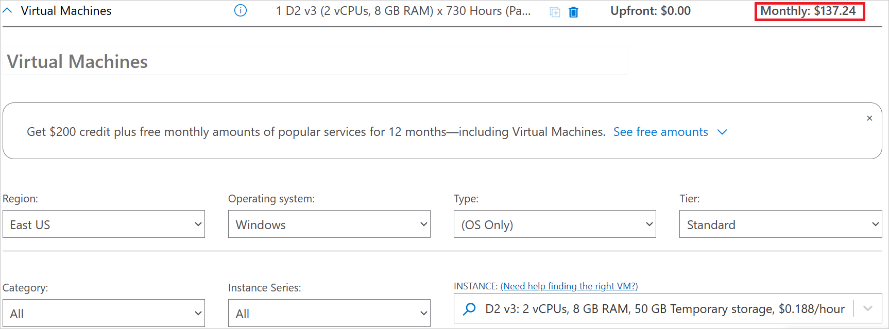
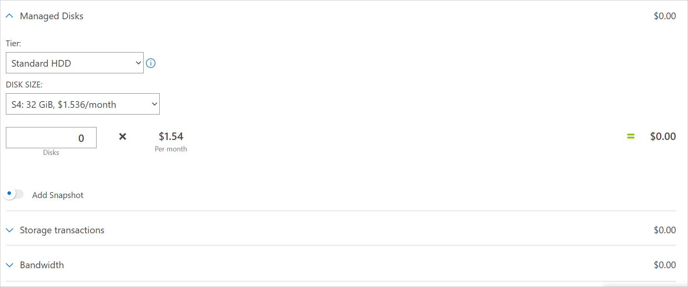
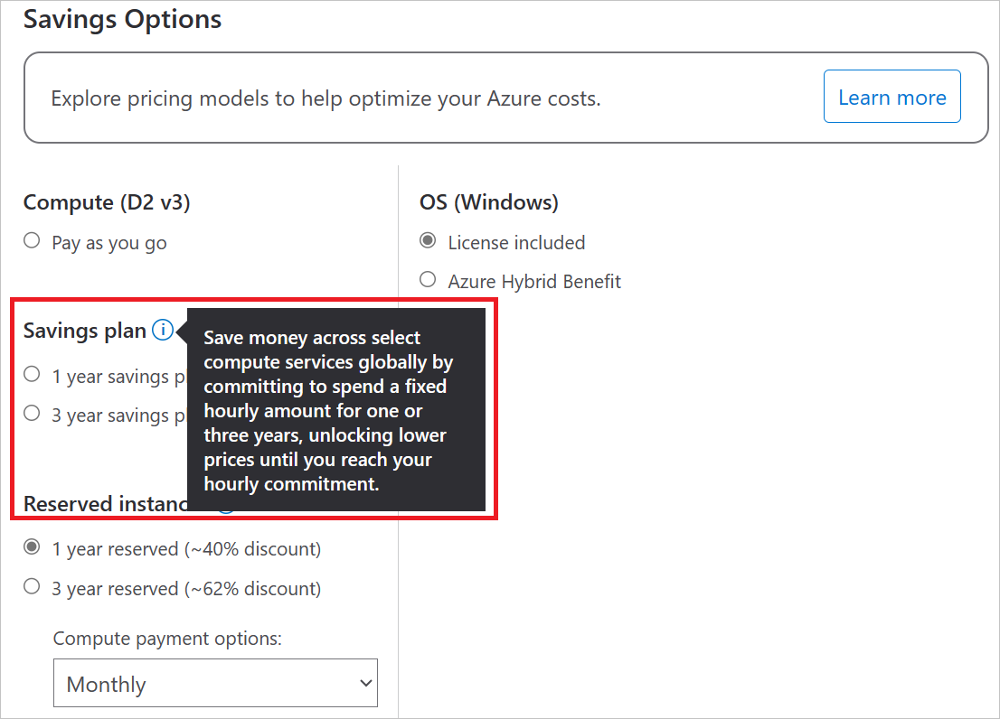
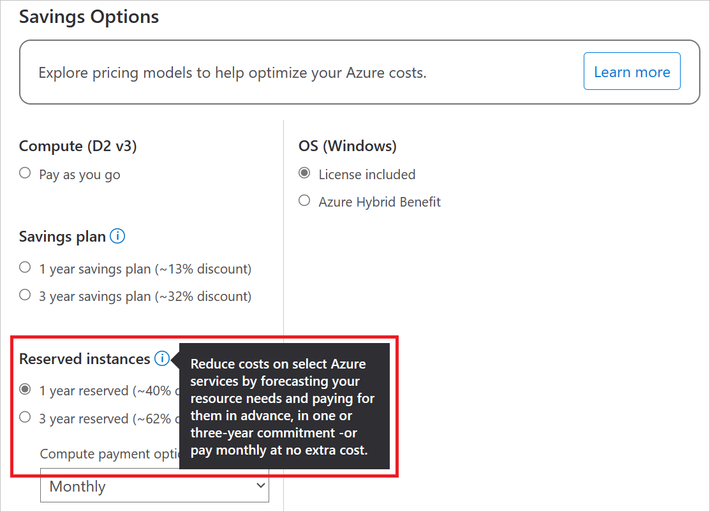
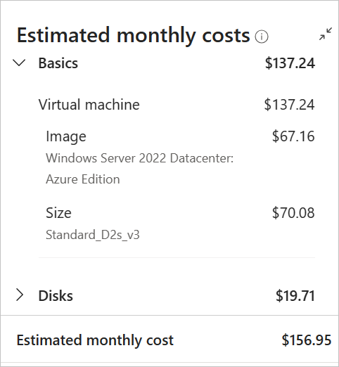

# Plan to manage costs for virtual machines

This article describes how you plan for and manage costs for virtual machines. Before you deploy the service, you can use the [Azure pricing calculator](https://azure.microsoft.com/pricing/calculator/) to estimate costs for virtual machines. Later, as you deploy Azure resources, review the estimated costs.

If you'd like to learn how to monitor costs for virtual machines, see [Monitor costs for virtual machines](cost-optimization-monitor-costs.md). If you'd like to review the best practices for virtual machine cost optimization, see [Best practices for virtual machine cost optimization](cost-optimization-best-practices.md).

In this article, you'll:
* Learn how to estimate costs before using virtual machines
* Gain an understanding of the billing model for virtual machines
* Learn how to review costs of virtual machine deployments in the Azure portal

## Prerequisites

Cost analysis in Cost Management supports most Azure account types but not all of them. To view the full list of supported account types, see [Understand Cost Management data](../cost-management-billing/costs/understand-cost-mgt-data.md?WT.mc_id=costmanagementcontent_docsacmhorizontal_-inproduct-learn). To view cost data, you need at least read access for an Azure account. For information about assigning access to Microsoft Cost Management data, see [Assign access to data](../cost-management/assign-access-acm-data.md?WT.mc_id=costmanagementcontent_docsacmhorizontal_-inproduct-learn).

## Estimate costs before using virtual machines

Use the [Azure pricing calculator](https://azure.microsoft.com/pricing/calculator/) to estimate costs before you add virtual machines.

1. On the **Virtual Machines** tile under the **Products** tab, select **Add to estimate** and scroll down to the **Your Estimate** section.

1. Select options from the drop-downs. There are various options available to choose from. The options that have the largest impact on your estimate total are your virtual machine's operating system, the operating system license if applicable, the [VM size](sizes.md) you select under **INSTANCE**, the number of instances you choose, and the amount of time your month your instances to run.

   Notice that the total estimate changes as you select different options. The estimate appears in the upper corner and the bottom of the **Your Estimate** section.

   

1. Below the **Savings Options** section, there are choices for optional, additional resources you can deploy with your virtual machine, including **Managed Disks**, **Storage transactions**, and **Bandwidth**. For optimal performance, we recommend pairing your virtual machines with [managed disks](https://azure.microsoft.com/pricing/details/managed-disks/), but make sure to review the additional cost incurred by these resources.

   

As you add new resources to your workspace, return to this calculator and add the same resource here to update your cost estimates.

For more information, see [Azure Virtual Machines pricing for Windows](https://azure.microsoft.com/pricing/details/virtual-machines/windows/) or [Linux](https://azure.microsoft.com/pricing/details/virtual-machines/linux/).

## Understand the full billing model for virtual machines

Virtual machines run on Azure infrastructure that accrues costs when you deploy new resources. It's important to understand that there could be other infrastructure costs that might accrue.

### How you're charged for virtual machines

When you create or use virtual machines resources, you might get charged for the following meters:

- **Virtual machines** - You're charged for it based on the number of hours per VM.
    - The price also changes based on your [VM size](sizes.md).
    - The price also changes based on the region where your virtual machine is located.
    - As virtual machine instances go through different states, they're [billed differently](states-billing.md).
- **Storage** - Pricing changes based on multiple factors, including disk types, transactions, and configurations.
    - For more information about Disk Storage billing, see [Understand Azure Disk Storage billing](disks-understand-billing.md).
- **Virtual network** - You're charged for it based on the number of GBs of data transferred.
- **Bandwidth** - You're charged for it based on the number of GBs of data transferred.
- **Azure Monitor** - You're charged for it based on the number of GBs of data ingested.
- **Azure Bastion** - You're charged for it based on the number of GBs of data transferred.
- **Azure DNS** - You're charged for it based on the number of DNS zones hosted in Azure and the number of DNS queries received.
- **Load balancer, if used** - You're charged for it based on the number of rulesets, hours used, and GB of data processed.

Any premium software from the Azure Marketplace comes with its own billing meters.

At the end of your billing cycle, the charges for each meter are summed. Your bill or invoice shows a section for all virtual machines costs. There's a separate line item for each meter.

### Other costs that might accrue with virtual machines

When you create resources for virtual machines, resources for other Azure services are also created. They include:

- [Virtual Network](https://azure.microsoft.com/pricing/details/virtual-network/)
- Virtual Network Interface Card (NIC)
    - NICs don't incur any costs by themselves. However, your [VM size](sizes.md) limits how many NICs you can deploy, so play accordingly.
- [A private IP and sometimes a public IP](https://azure.microsoft.com/pricing/details/ip-addresses/)
- Network Security Group (NSG)
    - NSGs don't incur any costs.
- [OS disk and, optionally, additional disks](https://azure.microsoft.com/pricing/details/managed-disks/)
- In some cases, a [load balancer](https://azure.microsoft.com/pricing/details/load-balancer/)

For more information, see the [Parts of a VM and how they're billed section of the virtual machines documentation overview](overview.md#parts-of-a-vm-and-how-theyre-billed).

### Costs might accrue after resource deletion

After you delete virtual machines resources, the following resources might continue to exist. They continue to accrue costs until you delete them.

- Any disks deployed other than the OS and local disks
    - By default, the OS disk is deleted with the VM, but it can be [set not to during the VM's creation](delete.md)
- Virtual network
    - Your virtual NIC and public IP, if applicable, can be set to delete along with your virtual machine
- Bandwidth
- Load balancer

If your OS disk isn't deleted with your VM, it likely incurs [P10 disk costs](https://azure.microsoft.com/pricing/details/managed-disks/) even in a stopped state. The OS disk size is smaller by default for some images and incurs lower costs accordingly.

For virtual networks, one virtual network is billed per subscription and per region. Virtual networks can't span regions or subscriptions. Setting up private endpoints in vNet setups may also incur charges.

Bandwidth is charged by usage; the more data transferred, the more you're charged.

### Using a savings plan with virtual machines

You can choose to spend a fixed hourly amount for your virtual machines, unlocking lower prices until you reach your hourly commitment. These savings plans are available in one- and three-year options.

### Using Azure Prepayment with virtual machines

You can pay for virtual machines charges with your Azure Prepayment credit. However, you can't use Azure Prepayment credit to pay for charges for third party products and services including those from the Azure Marketplace.

When you prepay for virtual machines, you're purchasing [reserved instances](../cost-management-billing/reservations/save-compute-costs-reservations.md?toc=%2Fazure%2Fvirtual-machines%2Ftoc.json). Committing to a reserved VM instance can save you money. The reservation discount is applied automatically to the number of running virtual machines that match the reservation scope and attributes. Reserved instances are available in one- and three-year plans.

For more information, see [Save costs with Azure Reserved VM Instances](prepay-reserved-vm-instances.md).

## Review estimated costs in the Azure portal

As you create resources for virtual machines, you see estimated costs.

To create a virtual machine and view the estimated price:

1. Sign in to the [Azure portal](https://portal.azure.com).

1. Enter *virtual machines* in the search.

1. Under **Services**, select **Virtual machines**.

1. In the **Virtual machines** page, select **Create** and then **Azure virtual machine**. The **Create a virtual machine** page opens.

1. On the right side, you see a summary of the estimated costs. Adjust the options in the creation settings to see how the price changes and review the estimated costs.

   

1. Finish creating the resource.

If your Azure subscription has a spending limit, Azure prevents you from spending over your credit amount. As you create and use Azure resources, your credits are used. If you reach your credit limit, the resources that you deployed are disabled for the rest of that billing period. You can't change your credit limit, but you can remove it. For more information about spending limits, see [Azure spending limit](../cost-management-billing/manage/spending-limit.md?WT.mc_id=costmanagementcontent_docsacmhorizontal_-inproduct-learn).

## Next steps

In this article, you learned about estimating costs of virtual machines, the virtual machine billing model, and reviewing virtual machine costs in the Azure portal.

For more information on virtual machine cost optimization, see the following articles:

- Learn how to [monitor costs for virtual machines](cost-optimization-monitor-costs.md).
- Review the [virtual machine cost optimization best practices](cost-optimization-best-practices.md).
- Learn [how to optimize your cloud investment with Microsoft Cost Management](../cost-management-billing/costs/cost-mgt-best-practices.md?WT.mc_id=costmanagementcontent_docsacmhorizontal_-inproduct-learn).
- Learn more about managing costs with [cost analysis](../cost-management-billing/costs/quick-acm-cost-analysis.md?WT.mc_id=costmanagementcontent_docsacmhorizontal_-inproduct-learn).
- Learn about how to [prevent unexpected costs](../cost-management-billing/understand/analyze-unexpected-charges.md?WT.mc_id=costmanagementcontent_docsacmhorizontal_-inproduct-learn).
- Take the [Cost Management](/training/paths/control-spending-manage-bills?WT.mc_id=costmanagementcontent_docsacmhorizontal_-inproduct-learn) guided learning course.
- Learn how to create [Linux](linux/quick-create-portal.md) and [Windows](windows/quick-create-portal.md) virtual machines.
- Take the [Microsoft Azure Well-Architected Framework - Cost Optimization training](/training/modules/azure-well-architected-cost-optimization/).
- Review the [Well-Architected Framework cost optimization design principles](/azure/well-architected/cost-optimization/principles) and how they apply to [virtual machines](/azure/well-architected/service-guides/virtual-machines-review#cost-optimization).
