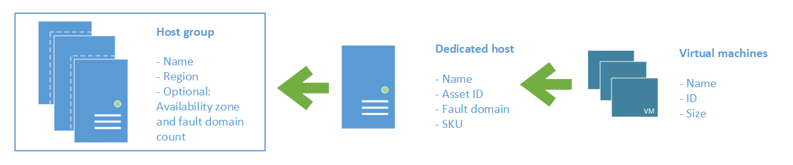
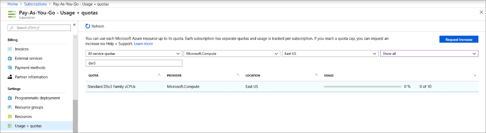

# Azure Dedicated Hosts

**Applies to:** :heavy_check_mark: Linux VMs :heavy_check_mark: Windows VMs :heavy_check_mark: Uniform scale sets

Azure Dedicated Host is a service that provides physical servers - able to host one or more virtual machines - dedicated to one Azure subscription. Dedicated hosts are the same physical servers used in our data centers, provided as a resource. You can provision dedicated hosts within a region, availability zone, and fault domain. Then, you can place VMs directly into your provisioned hosts, in whatever configuration best meets your needs.

## Benefits

Reserving the entire host provides the following benefits:

-   Hardware isolation at the physical server level. No other VMs will be placed on your hosts. Dedicated hosts are deployed in the same data centers and share the same network and underlying storage infrastructure as other, non-isolated hosts.
-   Control over maintenance events initiated by the Azure platform. While the majority of maintenance events have little to no impact on your virtual machines, there are some sensitive workloads where each second of pause can have an impact. With dedicated hosts, you can opt in to a maintenance window to reduce the impact to your service.
-   With the Azure hybrid benefit, you can bring your own licenses for Windows and SQL to Azure. Using the hybrid benefits provides you with additional benefits. For more information, see [Azure Hybrid Benefit](https://azure.microsoft.com/pricing/hybrid-benefit/).

## Groups, hosts, and VMs

A **host group** is a resource that represents a collection of dedicated hosts. You create a host group in a region and an availability zone, and add hosts to it.

A **host** is a resource, mapped to a physical server in an Azure data center. The physical server is allocated when the host is created. A host is created within a host group. A host has a SKU describing which VM sizes can be created. Each host can host multiple VMs, of different sizes, as long as they are from the same size series.

## High Availability considerations

For high availability, you should deploy multiple VMs, spread across multiple hosts (minimum of 2). With Azure Dedicated Hosts, you have several options to provision your infrastructure to shape your fault isolation boundaries.

### Use Availability Zones for fault isolation

Availability zones are unique physical locations within an Azure region. Each zone is made up of one or more datacenters equipped with independent power, cooling, and networking. A host group is created in a single availability zone. Once created, all hosts will be placed within that zone. To achieve high availability across zones, you need to create multiple host groups (one per zone) and spread your hosts accordingly.

If you assign a host group to an availability zone, all VMs created on that host must be created in the same zone.

### Use Fault Domains for fault isolation

A host can be created in a specific fault domain. Just like VM in a scale set or availability set, hosts in different fault domains will be placed on different physical racks in the data center. When you create a host group, you are required to specify the fault domain count. When creating hosts within the host group, you assign fault domain for each host. The VMs do not require any fault domain assignment.

Fault domains are not the same as colocation. Having the same fault domain for two hosts does not mean they are in proximity with each other.

Fault domains are scoped to the host group. You should not make any assumption on anti-affinity between two host groups (unless they are in different availability zones).

VMs deployed to hosts with different fault domains, will have their underlying managed disks services on multiple storage stamps, to increase the fault isolation protection.

### Using Availability Zones and Fault Domains

You can use both capabilities together to achieve even more fault isolation. In this case, you will specify the availability zone and fault domain count in for each host group, assign a fault domain to each of your hosts in the group, and assign an availability zone to each of your VMs

The [Resource Manager sample template](https://github.com/Azure/azure-quickstart-templates/blob/master/quickstarts/microsoft.compute/vm-dedicated-hosts/README.md) uses zones and fault domains to spread hosts for maximum resiliency in a region.

## Manual vs. automatic placement

When creating a VM in Azure, you can select which dedicated host to use. You can also use the option to automatically place your VMs on existing hosts, within a host group.

When creating a new host group, make sure the setting for automatic VM placement is selected. When creating your VM, select the host group and let Azure pick the best host for your VM.

Host groups that are enabled for automatic placement do not require all the VMs to be automatically placed. You will still be able to explicitly pick a host, even when automatic placement is selected for the host group.

### Limitations

Known issues and limitations when using automatic VM placement:

- You will not be able to redeploy your VM.
- You will not be able to use DCv2, Lsv2, NVasv4, NVsv3, Msv2, or M-series VMs with dedicated hosts

## Virtual machine scale set support

Virtual machine scale sets let you treat a group of virtual machines as a single resource, and apply  availability, management, scaling and orchestration policies as a group. Your existing dedicated hosts can also be used for virtual machine scale sets.

When creating a virtual machine scale set you can specify an existing host group to have all of the VM instances created on dedicated hosts.

The following requirements apply when creating a virtual machine scale set in a dedicated host group:

- Automatic VM placement needs to be enabled.
- The availability setting of your host group should match your scale set.
	- A regional host group (created without specifying an availability zone) should be used for regional scale sets.
	- The host group and the scale set must be using the same availability zone.
	- The fault domain count for the host group level should match the fault domain count for your scale set. The Azure portal lets you specify *max spreading* for your scale set, which sets the fault domain count of 1.
- Dedicated hosts should be created first, with sufficient capacity, and the same settings for scale set zones and fault domains.
- The supported VM sizes for your dedicated hosts should match the one used for your scale set.

Not all scale-set orchestration and optimizations settings are supported by dedicated hosts. Apply the following settings to your scale set:
- Overprovisioning is not recommended, and it is disabled by default. You can enable overprovisioning, but the scale set allocation will fail if the host group does not have capacity for all of the VMs, including the overprovisioned instances.
- Use the ScaleSetVM orchestration mode
- Do not use proximity placement groups for co-location

## Maintenance control

The infrastructure supporting your virtual machines may occasionally be updated to improve reliability, performance, security, and to launch new features. The Azure platform tries to minimize the impact of platform maintenance whenever possible, but customers with *maintenance sensitive* workloads can't tolerate even few seconds that the VM needs to be frozen or disconnected for maintenance.

**Maintenance Control** provides customers with an option to skip regular platform updates scheduled on their dedicated hosts, then apply it at the time of their choice within a 35-day rolling window. Within the maintenance window, you can apply maintenance directly at the host level, in any order. Once the maintenance window is over, Microsoft will move forward and apply the pending maintenance to the hosts in an order which may not follow the user defined fault domains.

For more information, see [Managing platform updates with Maintenance Control](./maintenance-configurations.md).

## Capacity considerations

Once a dedicated host is provisioned, Azure assigns it to physical server. This guarantees the availability of the capacity when you need to provision your VM. Azure uses the entire capacity in the region (or zone) to pick a physical server for your host. It also means that customers can expect to be able to grow their dedicated host footprint without the concern of running out of space in the cluster.

## Quotas

There are two types of quota that are consumed when you deploy a dedicated host.

1. Dedicated host vCPU quota. The default quota limit is 3000 vCPUs, per region.
1. VM size family quota. For example, a **Pay-as-you-go** subscription may only have a quota of 10 vCPUs available for the Dsv3 size series, in the East US region. To deploy a Dsv3 dedicated host, you would need to request a quota increase to at least 64 vCPUs before you can deploy the dedicated host.

To request a quota increase, create a support request in the [Azure portal](https://portal.azure.com/#blade/Microsoft_Azure_Support/HelpAndSupportBlade/newsupportrequest).

Provisioning a dedicated host will consume both dedicated host vCPU and the VM family vCPU quota, but it will not consume the regional vCPU. VMs placed on a dedicated host will not count against VM family vCPU quota. Should a VM be moved off a dedicated host into a multi-tenant environment, the VM will consume VM family vCPU quota.

For more information, see [Virtual machine vCPU quotas](./windows/quotas.md).

Free trial and MSDN subscriptions do not have quota for Azure Dedicated Hosts.

## Pricing

Users are charged per dedicated host, regardless how many VMs are deployed. In your monthly statement you will see a new billable resource type of hosts. The VMs on a dedicated host will still be shown in your statement, but will carry a price of 0.

The host price is set based on VM family, type (hardware size), and region. A host price is relative to the largest VM size supported on the host.

Software licensing, storage and network usage are billed separately from the host and VMs. There is no change to those billable items.

For more information, see [Azure Dedicated Host pricing](https://aka.ms/ADHPricing).

You can also save on costs with a [Reserved Instance of Azure Dedicated Hosts](prepay-dedicated-hosts-reserved-instances.md).

## Sizes and hardware generations

A SKU is defined for a host and it represents the VM size series and type. You can mix multiple VMs of different sizes within a single host as long as they are of the same size series.

The *type* is the hardware generation. Different hardware types for the same VM series will be from different CPU vendors and have different CPU generations and number of cores.

The sizes and hardware types vary by region. Refer to the host [pricing page](https://aka.ms/ADHPricing) to learn more.

> [!NOTE]
> Once a Dedicated host is provisoned, you can't change the size or type. If you need a different size of type, you will need to create a new host.

## Host life cycle

Azure monitors and manages the health status of your hosts. The following states will be returned when you query your host:

| Health State   | Description       |
|----------|----------------|
| Host Available     | There are no known issues with your host.   |
| Host Under Investigation  | We’re having some issues with the host which we’re looking into. This is a transitional state required for Azure to try and identify the scope and root cause for the issue identified. Virtual machines running on the host may be impacted. |
| Host Pending Deallocate   | Azure can’t restore the host back to a healthy state and ask you to redeploy your virtual machines out of this host. If `autoReplaceOnFailure` is enabled, your virtual machines are *service healed* to healthy hardware. Otherwise, your virtual machine may be running on a host that is about to fail.|
| Host deallocated  | All virtual machines have been removed from the host. You are no longer being charged for this host since the hardware was taken out of rotation.   |

## Next steps

- To deploy a dedicated host, see [Deploy VMs and scale sets to dedicated hosts](./dedicated-hosts-how-to.md).

- There is a [sample template](https://github.com/Azure/azure-quickstart-templates/blob/master/quickstarts/microsoft.compute/vm-dedicated-hosts/README.md) that uses both zones and fault domains for maximum resiliency in a region.

- You can also save on costs with a [Reserved Instance of Azure Dedicated Hosts](prepay-dedicated-hosts-reserved-instances.md).
