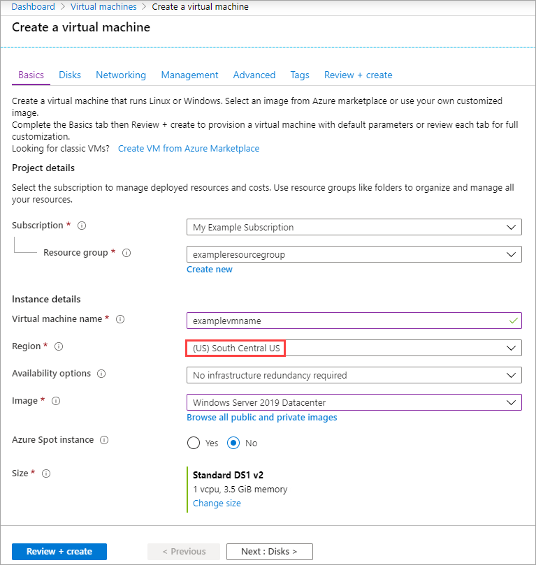
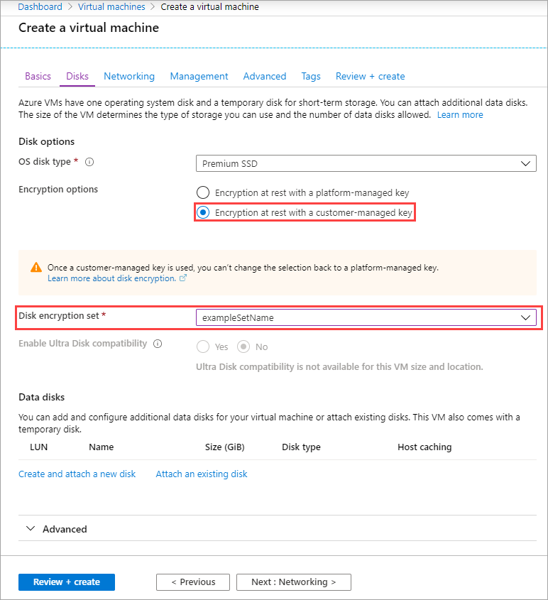
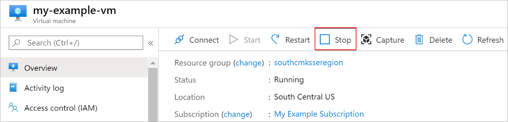
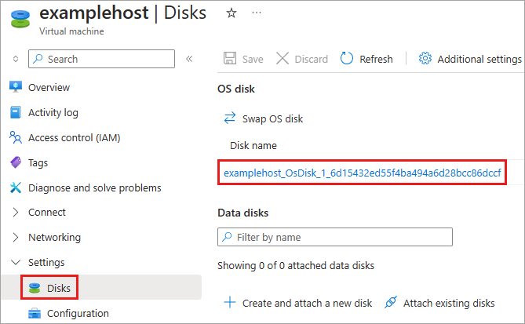
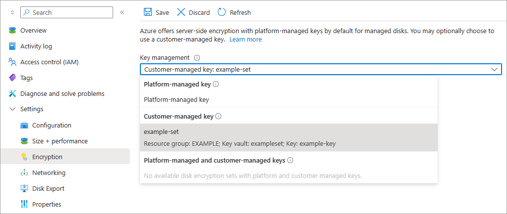

# Use the Azure portal to enable server-side encryption with customer-managed keys for managed disks

Azure Disk Storage allows you to manage your own keys when using server-side encryption (SSE) for managed disks, if you choose. For conceptual information on SSE with customer managed keys, as well as other managed disk encryption types, see the **Customer-managed keys** section of our disk encryption article:

- For Linux: [Customer-managed keys](./disk-encryption.md#customer-managed-keys)
- For Windows: [Customer-managed keys](./disk-encryption.md#customer-managed-keys)

## Restrictions

For now, customer-managed keys have the following restrictions:

- If this feature is enabled for your disk, you cannot disable it.
    If you need to work around this, you must copy all the data to an entirely different managed disk that isn't using customer-managed keys:

    - For Linux: [Copy a managed disk](./linux/disks-upload-vhd-to-managed-disk-cli.md#copy-a-managed-disk)

    - For Windows: [Copy a managed disk](./windows/disks-upload-vhd-to-managed-disk-powershell.md#copy-a-managed-disk)

- Only [software and HSM RSA keys](../key-vault/keys/about-keys.md) of sizes 2,048-bit, 3,072-bit and 4,096-bit are supported, no other keys or sizes.
    - [HSM](../key-vault/keys/hsm-protected-keys.md) keys require the **premium** tier of Azure Key vaults.
[!INCLUDE [virtual-machines-managed-disks-customer-managed-keys-restrictions](../../includes/virtual-machines-managed-disks-customer-managed-keys-restrictions.md)]

The following sections cover how to enable and use customer-managed keys for managed disks:

[!INCLUDE [virtual-machines-disks-encryption-create-key-vault-portal](../../includes/virtual-machines-disks-encryption-create-key-vault-portal.md)]

## Deploy a VM

Now that you've created and set up your key vault and the disk encryption set, you can deploy a VM using the encryption.
The VM deployment process is similar to the standard deployment process, the only differences are that you need to deploy the VM in the same region as your other resources and you opt to use a customer managed key.

1. Search for **Virtual Machines** and select **+ Add** to create a VM.
1. On the **Basic** blade, select the same region as your disk encryption set and Azure Key Vault.
1. Fill in the other values on the **Basic** blade as you like.

    

1. On the **Disks** blade, select **Encryption at rest with a customer-managed key**.
1. Select your disk encryption set in the **Disk encryption set** drop-down.
1. Make the remaining selections as you like.

    

## Enable on an existing disk

> [!CAUTION]
> Enabling disk encryption on any disks attached to a VM will require that you stop the VM.
    
1. Navigate to a VM that is in the same region as one of your disk encryption sets.
1. Open the VM and select **Stop**.

    

1. After the VM has finished stopping, select **Disks** and then select the disk you want to encrypt.

    

1. Select **Encryption** and select **Encryption at rest with a customer-managed key** and then select your disk encryption set in the drop-down list.
1. Select **Save**.

    

1. Repeat this process for any other disks attached to the VM you'd like to encrypt.
1. When your disks finish switching over to customer-managed keys, if there are no there no other attached disks you'd like to encrypt, you may start your VM.

> [!IMPORTANT]
> Customer-managed keys rely on managed identities for Azure resources, a feature of Azure Active Directory (Azure AD). When you configure customer-managed keys, a managed identity is automatically assigned to your resources under the covers. If you subsequently move the subscription, resource group, or managed disk from one Azure AD directory to another, the managed identity associated with the managed disks is not transferred to the new tenant, so customer-managed keys may no longer work. For more information, see [Transferring a subscription between Azure AD directories](../active-directory/managed-identities-azure-resources/known-issues.md#transferring-a-subscription-between-azure-ad-directories).

## Next steps

- [Explore the Azure Resource Manager templates for creating encrypted disks with customer-managed keys](https://github.com/ramankumarlive/manageddiskscmkpreview)
- [What is Azure Key Vault?](../key-vault/general/overview.md)
- [Replicate machines with customer-managed keys enabled disks](../site-recovery/azure-to-azure-how-to-enable-replication-cmk-disks.md)
- [Set up disaster recovery of VMware VMs to Azure with PowerShell](../site-recovery/vmware-azure-disaster-recovery-powershell.md#replicate-vmware-vms)
- [Set up disaster recovery to Azure for Hyper-V VMs using PowerShell and Azure Resource Manager](../site-recovery/hyper-v-azure-powershell-resource-manager.md#step-7-enable-vm-protection)