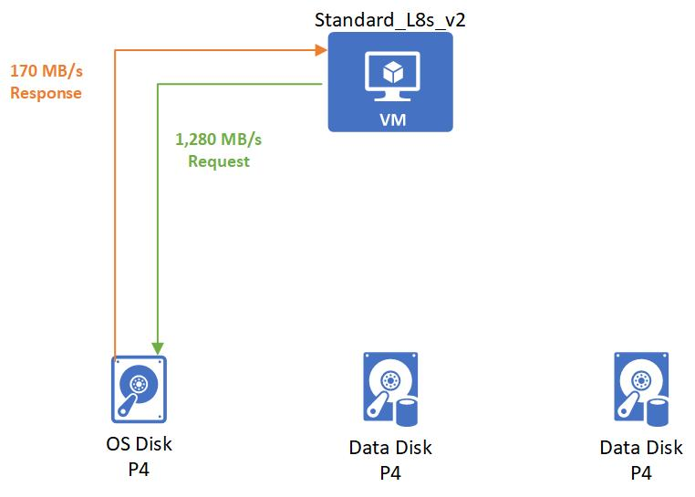

# Disk bursting metric examples

The following examples show how bursting works with various VM and disk combinations. To make the examples easy to follow, we will focus on MB/s, but the same logic is applied independently to IOPS.

### Non-burstable virtual machine with burstable disks
**VM and disk combination:** 
- Standard_D8as_v4 
    - Uncached MB/s: 192
- P4 OS Disk
    - Provisioned MB/s: 25
    - Max burst MB/s: 170 
- 2 P10 Data Disks 
    - Provisioned MB/s: 100
    - Max burst MB/s: 170

 When the VM boots up it retrieves data from the OS disk. Since the OS disk is part of a VM that is booting, the OS disk will be full of bursting credits. These credits will allow the OS disk burst its startup at 170 MB/s second.

After the boot up is complete, an application is then run on the VM and has a non-critical workload. This workload requires 15 MB/S that gets spread evenly across all the disks.

Then the application needs to process a batched job that requires 192 MB/s. 2 MB/s are used by the OS disk and the rest are evenly split between the data disks.

### Burstable virtual machine with non-burstable disks
**VM and disk combination:** 
- Standard_L8s_v2 
    - Uncached MB/s: 160
    - Max burst MB/s: 1,280
- P50 OS Disk
    - Provisioned MB/s: 250 
- 2 P10 Data Disks 
    - Provisioned MB/s: 250

 After the initial boot up, an application is run on the VM and has a non-critical workload. This workload requires 30 MB/s that gets spread evenly across all the disks.

Then the application needs to process a batched job that requires 600 MB/s. The Standard_L8s_v2 bursts to meet this demand and then requests to the disks get evenly spread out to P50 disks.

### Burstable virtual machine with burstable disks
**VM and disk combination:** 
- Standard_L8s_v2 
    - Uncached MB/s: 160
    - Max burst MB/s: 1,280
- P4 OS Disk
    - Provisioned MB/s: 25
    - Max burst MB/s: 170 
- 2 P4 Data Disks 
    - Provisioned MB/s: 25
    - Max burst MB/s: 170 

When the VM starts, it will burst to request its burst limit of 1,280 MB/s from the OS disk and the OS disk will respond with its burst performance of 170 MB/s.

After startup, you start an application that has a non-critical workload. This application requires 15 MB/s that gets spread evenly across all the disks.

Then the application needs to process a batched job that requires 360 MB/s. The Standard_L8s_v2 bursts to meet this demand and then requests. Only 20 MB/s are needed by the OS disk. The remaining 340 MB/s are handled by the bursting P4 data disks.

