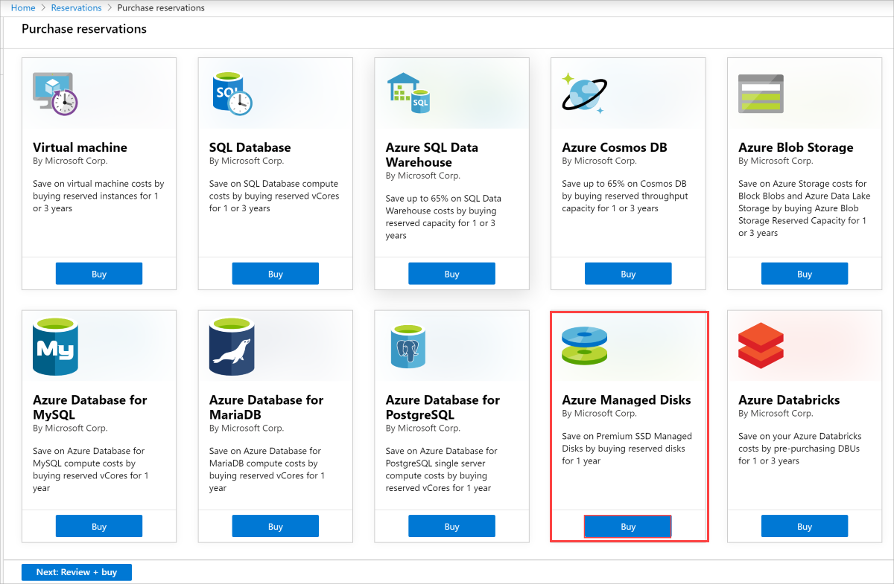
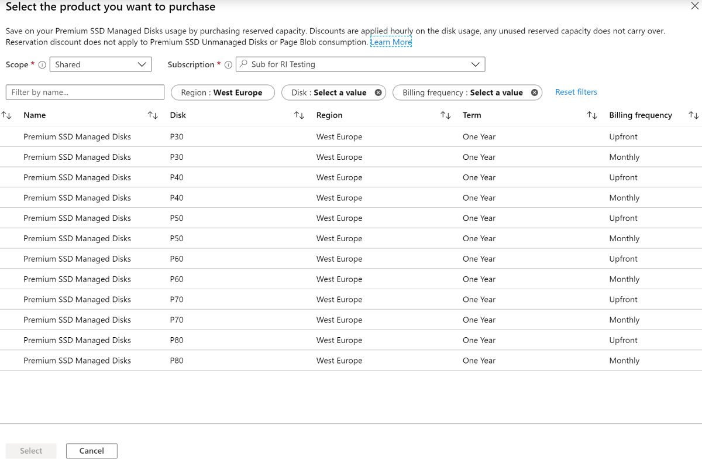
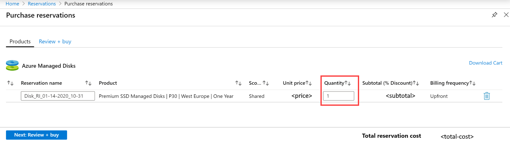

# Reduce costs with Azure Disks Reservation

**Applies to:** :heavy_check_mark: Linux VMs :heavy_check_mark: Windows VMs :heavy_check_mark: Flexible scale sets :heavy_check_mark: Uniform scale sets

Save on your Azure Disk Storage usage with reserved capacity. Azure Disk Storage reservations combined with Azure Reserved Virtual Machine Instances let you lower your total virtual machine (VM) costs. The reservation discount is applied automatically to the matching disks in the selected reservation scope. Because of this automatic application, you don't need to assign a reservation to a managed disk to get the discounts.

Discounts are applied hourly depending on the disk usage. Unused reserved capacity doesn't carry over. Azure Disk Storage reservation discounts don't apply to unmanaged disks, ultra disks, or page blob consumption.

## Determine your storage needs

Before you purchase a reservation, determine your storage needs. Currently, Azure Disk Storage reservations are available only for select Azure premium SSD SKUs. The SKU of a premium SSD determines the disk's size and performance.

When determining your storage needs, don't think of disks based on just capacity. For example, you can't have a reservation for a P40 disk and use that to pay for two smaller P30 disks. When purchasing a reservation, you're only purchasing a reservation for the total number of disks per SKU.

A disk reservation is made per disk SKU. As a result, the reservation consumption is based on the unit of the disk SKUs instead of the provided size.

For example, assume you reserve one P40 disk that has 2 TiB of provisioned storage capacity. Also assume you allocate only two P30 disks. The P40 reservation in that case doesn't account for P30 consumption, and you pay the pay-as-you-go rate on the P30 disks.
 
 
[!INCLUDE [disk-storage-premium-ssd-sizes](../../includes/disk-storage-premium-ssd-sizes.md)]

## Purchase considerations

We recommend the following practices when considering disk reservation purchase:

- Analyze your usage information to help determine which reservations you should purchase. Make sure you track the usage in disk SKUs instead of provisioned or used disk capacity.
- Examine your disk reservation along with your VM reservation. We highly recommend making reservations for both VM usage and disk usage for maximum savings. You can start with determining the right VM reservation and then evaluate the disk reservation. Generally, you'll have a standard configuration for each of your workloads. For example, a SQL Server server might have two P40 data disks and one P30 operating system disk.
  
  This kind of pattern can help you determine the reserved amount you might purchase. This approach can simplify the evaluation process and ensure that you have an aligned plan for both your VM and disks. The plan contains considerations like subscriptions or regions.

## Purchase restrictions

Reservation discounts are currently unavailable for the following:

- Unmanaged disks or page blobs
- Ultra Disks
- Standard solid-state drives (SSDs) or standard hard-disk drives (HDDs)
- Premium SSD SKUs smaller than P30: P1, P2, P3, P4, P6, P10, P15, and P20 SSD SKUs
- Disks in Azure Government, Azure Germany, or Microsoft Azure operated by 21Vianet regions

In rare circumstances, Azure limits the purchase of new reservations to a subset of disk SKUs because of low capacity in a region.

## Buy a disk reservation

You can purchase Azure Disk Storage reservations through the [Azure portal](https://portal.azure.com/). You can pay for the reservation either up front or with monthly payments. For more information about purchasing with monthly payments, see [Purchase reservations with monthly payments](../cost-management-billing/reservations/prepare-buy-reservation.md#buy-reservations-with-monthly-payments).

Follow these steps to purchase reserved capacity:

1. Go to the [Purchase reservations](https://portal.azure.com/#blade/Microsoft_Azure_Reservations/CreateBlade/referrer/Browse_AddCommand) pane in the Azure portal.

1. Select **Azure Managed Disks** to purchase a reservation.

     

1. Specify the required values described in the following table:

   |Element  |Description  |
   |---------|---------|
   |**Scope**   |  How many subscriptions can use the billing benefit associated with the reservation. This value also specifies how the reservation is applied to specific subscriptions.    If you select **Shared**, the reservation discount is applied to Azure Storage capacity in every subscription within your billing context. The billing context is based on how you signed up for Azure. For enterprise customers, the shared scope is the enrollment and includes all subscriptions within the enrollment. For pay-as-you-go customers, the shared scope includes all individual subscriptions with pay-as-you-go rates created by the account administrator.   If you select **Management group**, the reservation discount is applied to Azure Storage capacity in every subscription that is part of the management group and the billing scope.     If you select **Single subscription**, the reservation discount is applied to Azure Storage capacity in the selected subscription.    If you select **Single resource group**, the reservation discount is applied to Azure Storage capacity in the selected subscription and in that subscription's selected resource group.    You can change the reservation scope after you purchase the reservation.  |
   |**Subscription**  | The subscription you use to pay for the Azure Storage reservation. The payment method on the selected subscription is used in charging the costs. The subscription must be one of the following types: <ul><li> Enterprise Agreement (offer numbers MS-AZR-0017P and MS-AZR-0148P). For an Enterprise subscription, the charges are deducted from the enrollment's Azure Prepayment (previously called monetary commitment) balance or charged as overage.</li> <li>Individual subscription with pay-as-you-go rates (offer numbers MS-AZR-0003P and MS-AZR-0023P). For an individual subscription with pay-as-you-go rates, the charges are billed to the credit card or invoice payment method on the subscription.</li></ul>    |
   | **Disks** | The SKU you want to create. |
   | **Region** | The region where the reservation is in effect. |
   | **Billing frequency** | How often the account is billed for the reservation. Options include **Monthly** and **Upfront**. |

    

1. After you specify the values for your reservation, the Azure portal displays the cost. The portal also shows the discount percentage over pay-as-you-go billing. Select **Next** to continue to the **Purchase reservations** pane.

1. On the **Purchase reservations** pane, you can name your reservation and select the total quantity of reservations you want to make. The number of reservations maps to the number of disks. For example, if you want to reserve a hundred disks, enter the **Quantity** value **100**.

1. Review the total cost of the reservation.

    

After you purchase a reservation, it's automatically applied to any existing Disk Storage resources that match the reservation terms. If you haven't created any Disk Storage resources yet, the reservation applies whenever you create a resource that matches the reservation terms. In either case, the reservation term begins immediately after a successful purchase.

## Cancel, exchange, or refund reservations

You can cancel, exchange, or refund reservations within certain limitations. For more information, see [Self-service exchanges and refunds for Azure Reservations](../cost-management-billing/reservations/exchange-and-refund-azure-reservations.md).

## Expiration of a reservation

When a reservation expires, any Azure Disk Storage capacity that you use under that reservation is billed at the [pay-as-you-go rate](https://azure.microsoft.com/pricing/details/managed-disks/). Reservations don't renew automatically.

You'll receive an email notification 30 days before the expiration of the reservation and again on the expiration date. To continue taking advantage of the cost savings that a reservation provides, renew it no later than the expiration date.

## Need help? Contact us

If you have questions or need help, [create a support request](https://go.microsoft.com/fwlink/?linkid=2083458).

## Next steps

- [What are Azure Reservations?](../cost-management-billing/reservations/save-compute-costs-reservations.md)
- [Understand how your reservation discount is applied to Azure Disk Storage](../cost-management-billing/reservations/understand-disk-reservations.md)