# Use Azure Storage Explorer to manage Azure managed disks

**Applies to:** :heavy_check_mark: Linux VMs :heavy_check_mark: Windows VMs :heavy_check_mark: Flexible scale sets :heavy_check_mark: Uniform scale sets

Azure Storage Explorer contains a rich set of features that allows you to:

- Upload, download, and copy managed disks.
- Create snapshots from operating system or data disk virtual hard disk.
- Migrate data from on-premises to Azure.
- Migrate data across Azure regions.

## Prerequisites

To complete this article, you'll need:

- An Azure subscription.
- At least one Azure managed disk.
- The latest version of [Azure Storage Explorer](https://azure.microsoft.com/features/storage-explorer/).

If you don't have an Azure subscription, create a [free account](https://azure.microsoft.com/free/?WT.mc_id=A261C142F) before you begin.

## Connect to an Azure subscription

If your Storage Explorer isn't connected to Azure, you can't use it to manage resources. Follow the steps in this section to connect Storage Explorer to your Azure account. Afterward, you can use it to manage your disks.

1. Open Azure Storage Explorer and select the **Connect** icon in the toolbar.

    [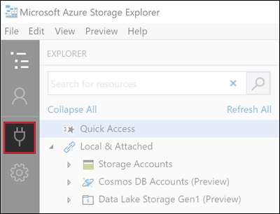](media/disks-upload-vhd-to-managed-disk-storage-explorer/plug-in-icon-lrg.png#lightbox)

1. In the **Connect to Azure Storage** dialog box, select **Subscription**.

    [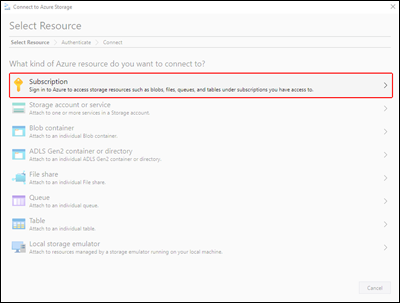](media/disks-upload-vhd-to-managed-disk-storage-explorer/connect-to-azure-lrg.png#lightbox)

1. Select the appropriate environment and select **Next**. You can also select **Manage custom environments** to configure and add a custom environment.

    [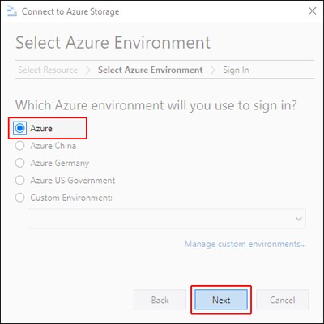](media/disks-upload-vhd-to-managed-disk-storage-explorer/choose-environment-lrg.png#lightbox)

1. In the **Sign in** dialog box, enter your Azure credentials.

    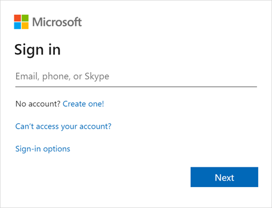

1. Select your subscription from the list and then select **Open Explorer**.

    [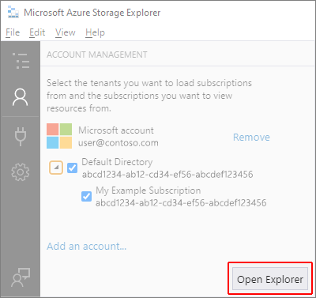](media/disks-upload-vhd-to-managed-disk-storage-explorer/select-subscription-lrg.png#lightbox)

## Upload an on-premises VHD

You can upload an on-premises virtual hard disk (VHD) file to Azure and use it to create an image. Follow the steps in this section to upload your source file.

1. In the **Explorer** pane, expand **Disks** and select the resource group to which you'll upload your disk.

    [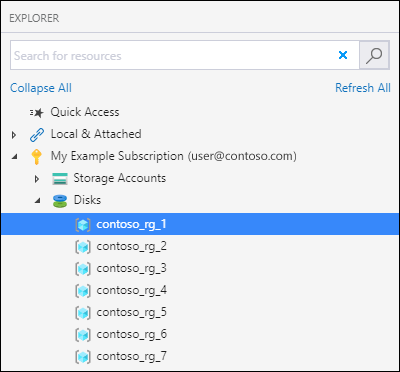](media/disks-upload-vhd-to-managed-disk-storage-explorer/select-rg1-lrg.png#lightbox)

1. In the resource group details pane, select **Upload**.

    

1. In the **Upload VHD** dialog box, specify your VHD source file, the name of the disk, the operating system type, the region to which you want to upload the disk, and the account type. If the region supports availability zones, you can select a zone of your choice. Select **Create** to begin uploading your disk.

    [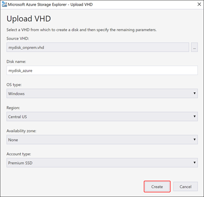](media/disks-upload-vhd-to-managed-disk-storage-explorer/upload-vhd-dialog-lrg.png#lightbox)

1. The status of the upload will now display in **Activities**.

    [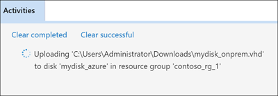](media/disks-upload-vhd-to-managed-disk-storage-explorer/activity-uploading-lrg.png#lightbox)

If the upload has finished and you don't see the disk in the **Activities** pane, select **Refresh**.

## Download a managed disk

Follow the steps in this section to download a managed disk to an on-premises VHD. A disk's state must be **Unattached** before it can be downloaded.

1. In the **Explorer** pane, expand **Disks** and select the resource group from which you'll download your disk.

    

1. In the resource group details pane, select the disk you want to download.
1. Select **Download** and then choose where you would like to save the disk.

    [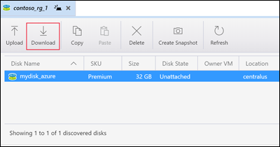](media/disks-upload-vhd-to-managed-disk-storage-explorer/download-button-lrg.png#lightbox)

1. Select **Save** the begin the download. The download status will display in **Activities**.

    [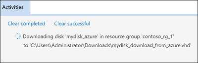](media/disks-upload-vhd-to-managed-disk-storage-explorer/activity-downloading-lrg.png#lightbox)

## Copy a managed disk

With Storage Explorer, you can copy a manged disk within or across regions. To copy a disk:

1. In the **Explorer** pane, expand the **Disks** dropdown and select the resource group that contains the disk you want to copy.

    

1. In the resource group details pane, select the disk you'd like to copy and select **Copy**.

    [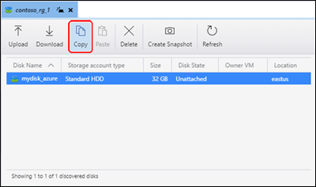](media/disks-upload-vhd-to-managed-disk-storage-explorer/copy-button-lrg.png#lightbox)

1. In the **Explorer** pane, expand **Disks** and select the resource group in which you'd like to paste the disk.

    [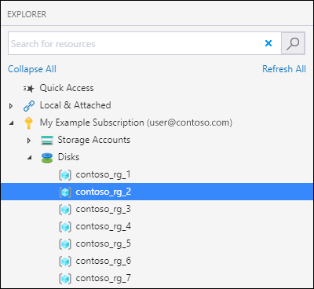](media/disks-upload-vhd-to-managed-disk-storage-explorer/select-rg2-lrg.png#lightbox)

1. Select **Paste** in the resource group details pane.

    [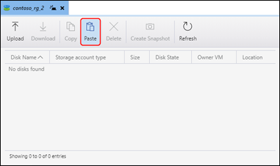](media/disks-upload-vhd-to-managed-disk-storage-explorer/paste-button-lrg.png#lightbox)

1. In the **Paste Disk** dialog box, fill in the values. You can also specify an availability zone in supported regions.

    [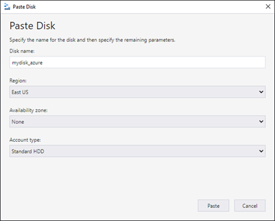](media/disks-upload-vhd-to-managed-disk-storage-explorer/paste-disk-dialog-lrg.png#lightbox)

1. Select **Paste** to begin the disk copy. The status is displayed in **Activities**.

    [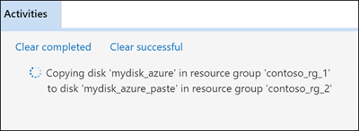](media/disks-upload-vhd-to-managed-disk-storage-explorer/activity-copying-lrg.png#lightbox)

## Create a snapshot

1. In the **Explorer** pane, expand **Disks** and select the resource group that contains the disk you want to snapshot.

    

1. In the resource group details pane, select the disk you'd like to snapshot and select **Create Snapshot**.

    [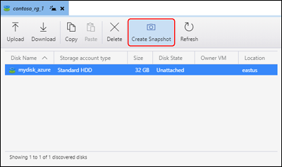](media/disks-upload-vhd-to-managed-disk-storage-explorer/create-snapshot-button-lrg.png#lightbox)

1. In **Create Snapshot**, specify the name of the snapshot and the resource group in which you'll create it. Select **Create**.

    [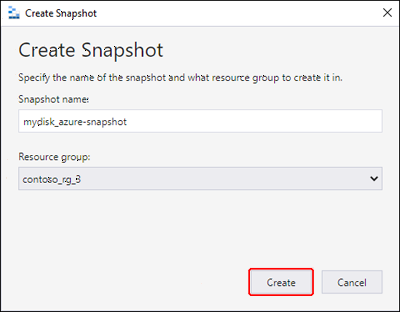](media/disks-upload-vhd-to-managed-disk-storage-explorer/create-snapshot-dialog-lrg.png#lightbox)

1. After the snapshot has been created, you can select **Open in Portal** in **Activities** to view the snapshot in the Azure portal.

    [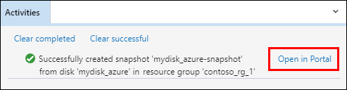](media/disks-upload-vhd-to-managed-disk-storage-explorer/open-in-portal-lrg.png#lightbox)

## Next steps

- [Create a virtual machine from a VHD by using the Azure portal](./windows/create-vm-specialized-portal.md)
- [Attach a managed data disk to a Windows virtual machine by using the Azure portal](./windows/attach-managed-disk-portal.md)