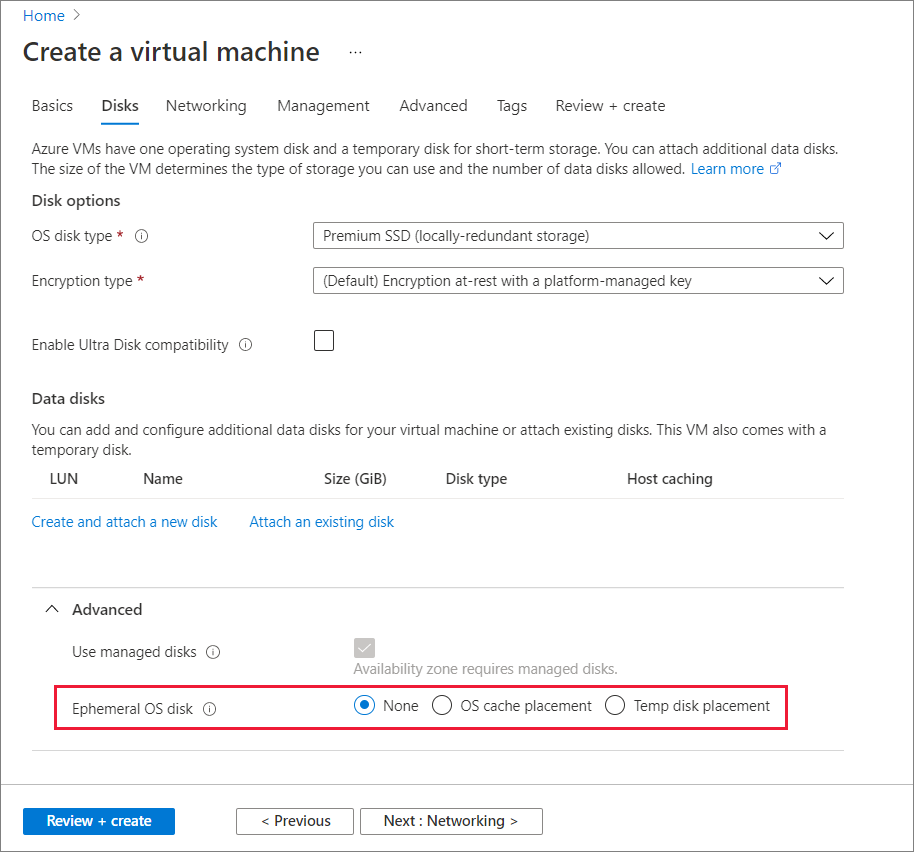

# How to deploy Ephemeral OS disks for Azure VMs

**Applies to:** :heavy_check_mark: Linux VMs :heavy_check_mark: Windows VMs :heavy_check_mark: Flexible scale sets :heavy_check_mark: Uniform scale sets

This article shows you how to create a virtual machine or virtual machine scale sets with Ephemeral OS disks through Portal, ARM template deployment, CLI and PowerShell.

## Portal

In the Azure portal, you can choose to use ephemeral disks when deploying a virtual machine or virtual machine scale sets by opening the **Advanced** section of the **Disks** tab. For choosing placement of Ephemeral OS disk, select **OS cache placement** or **Temp disk placement**.


 

If the option for using an ephemeral disk or OS cache placement or Temp disk placement is greyed out, you might have selected a VM size that doesn't have a cache/temp size larger than the OS image or that doesn't support Premium storage. Go back to the **Basics** page and try choosing another VM size.

## Scale set template deployment

The process to create a scale set that uses an ephemeral OS disk is to add the `diffDiskSettings` property to the 
`Microsoft.Compute/virtualMachineScaleSets/virtualMachineProfile` resource type in the template. Also, the caching policy must be set to `ReadOnly` for the ephemeral OS disk. placement can be changed to `CacheDisk` for OS cache disk placement.

```json
{ 
  "type": "Microsoft.Compute/virtualMachineScaleSets", 
  "name": "myScaleSet", 
  "location": "East US 2", 
  "apiVersion": "2019-12-01", 
  "sku": { 
    "name": "Standard_DS2_v2", 
    "capacity": "2" 
  }, 
  "properties": { 
    "upgradePolicy": { 
      "mode": "Automatic" 
    }, 
    "virtualMachineProfile": { 
       "storageProfile": { 
        "osDisk": { 
          "diffDiskSettings": { 
            "option": "Local" ,
            "placement": "ResourceDisk"
          }, 
          "caching": "ReadOnly", 
          "createOption": "FromImage" 
        }, 
        "imageReference":  { 
          "publisher": "publisherName", 
          "offer": "offerName", 
          "sku": "skuName", 
          "version": "imageVersion" 
        } 
      }, 
      "osProfile": { 
        "computerNamePrefix": "myvmss", 
        "adminUsername": "azureuser", 
        "adminPassword": "P@ssw0rd!" 
      } 
    } 
  } 
}  
```

> [!NOTE]
> Replace all the other values accordingly.

## VM template deployment 
You can deploy a VM with an ephemeral OS disk using a template. The process to create a VM that uses ephemeral OS disks is to add the `diffDiskSettings` property to Microsoft.Compute/virtualMachines resource type in the template. Also, the caching policy must be set to `ReadOnly` for the ephemeral OS disk. placement option can be changed to `CacheDisk` for OS cache disk placement.

```json
{ 
  "type": "Microsoft.Compute/virtualMachines", 
  "name": "myVirtualMachine", 
  "location": "East US 2", 
  "apiVersion": "2019-12-01", 
  "properties": { 
       "storageProfile": { 
            "osDisk": { 
              "diffDiskSettings": { 
                "option": "Local" ,
                "placement": "ResourceDisk"
              }, 
              "caching": "ReadOnly", 
              "createOption": "FromImage" 
            }, 
            "imageReference": { 
                "publisher": "MicrosoftWindowsServer", 
                "offer": "WindowsServer", 
                "sku": "2016-Datacenter-smalldisk", 
                "version": "latest" 
            }, 
            "hardwareProfile": { 
                 "vmSize": "Standard_DS2_v2" 
             } 
      }, 
      "osProfile": { 
        "computerNamePrefix": "myvirtualmachine", 
        "adminUsername": "azureuser", 
        "adminPassword": "P@ssw0rd!" 
      } 
    } 
 } 
```

## CLI

To use an ephemeral disk for a CLI VM deployment, set the `--ephemeral-os-disk` parameter in [az vm create](/cli/azure/vm#az-vm-create) to `true` and the `--ephemeral-os-disk-placement` parameter to `ResourceDisk` for temp disk placement or `CacheDisk` for cache disk placement and the `--os-disk-caching` parameter to `ReadOnly`.

```azurecli-interactive
az vm create \
  --resource-group myResourceGroup \
  --name myVM \
  --image imageName \
  --ephemeral-os-disk true \
  --ephemeral-os-disk-placement ResourceDisk \
  --os-disk-caching ReadOnly \
  --admin-username azureuser \
  --generate-ssh-keys
```

> [!NOTE]
> Replace `myVM`, `myResourceGroup`, `imageName` and `azureuser` accordingly.

For scale sets, you use the same `--ephemeral-os-disk true` parameter for [az-vmss-create](/cli/azure/vmss#az-vmss-create) and set the `--os-disk-caching` parameter to `ReadOnly` and the `--ephemeral-os-disk-placement` parameter to `ResourceDisk` for temp disk placement or `CacheDisk` for cache disk placement.

## Reimage a VM using REST
You can reimage a Virtual Machine instance with ephemeral OS disk using REST API as described below and via Azure portal by going to Overview pane of the VM. For scale sets, reimaging is already available through PowerShell, CLI, and the portal.

```
POST https://management.azure.com/subscriptions/{sub-
id}/resourceGroups/{rgName}/providers/Microsoft.Compute/VirtualMachines/{vmName}/reimage?api-version=2019-12-01" 
```

## PowerShell
To use an ephemeral disk for a PowerShell VM deployment, use [Set-AzVMOSDisk](/powershell/module/az.compute/set-azvmosdisk) in your VM configuration. Set the `-DiffDiskSetting` to `Local` and `-Caching` to `ReadOnly` and  `-DiffDiskPlacement` to `ResourceDisk`.     
```powershell
Set-AzVMOSDisk -DiffDiskSetting Local -DiffDiskPlacement ResourceDisk -Caching ReadOnly

```
To use an ephemeral disk on cache disk for a PowerShell VM deployment, use [Set-AzVMOSDisk](/powershell/module/az.compute/set-azvmosdisk) in your VM configuration. Set the `-DiffDiskSetting` to `Local` , `-Caching` to `ReadOnly` and  `-DiffDiskPlacement` to `CacheDisk`.     
```PowerShell
Set-AzVMOSDisk -DiffDiskSetting Local -DiffDiskPlacement CacheDisk -Caching ReadOnly
```
For scale set deployments, use the [Set-AzVmssStorageProfile](/powershell/module/az.compute/set-azvmssstorageprofile) cmdlet in your configuration. Set the `-DiffDiskSetting` to `Local` , `-Caching` to `ReadOnly` and  `-DiffDiskPlacement` to `ResourceDisk` or `CacheDisk`.
```PowerShell
Set-AzVmssStorageProfile -DiffDiskSetting Local -DiffDiskPlacement ResourceDisk -OsDiskCaching ReadOnly
```

## Next steps
For more information on [Ephemeral OS disk](ephemeral-os-disks.md).
