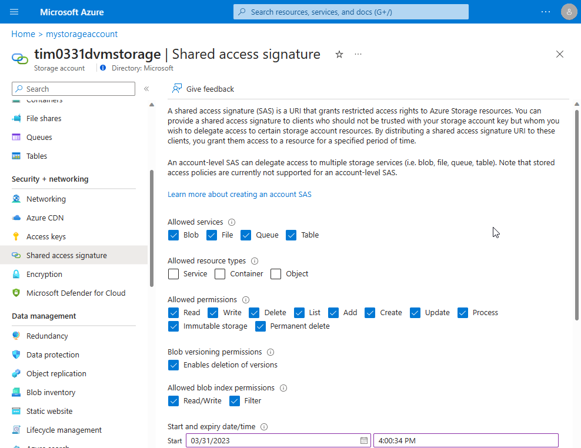
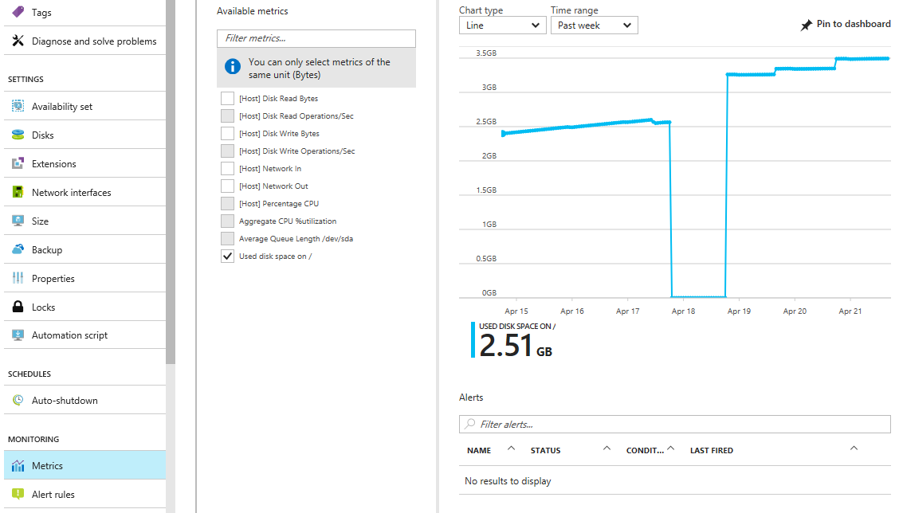
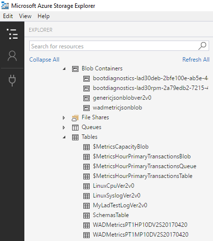

# Use Linux Diagnostic Extension to monitor metrics and logs

This document describes version 3.0 and newer of the Linux Diagnostic Extension.

> [!IMPORTANT]
> For information about version 2.3 and older, see [this document](../linux/classic/diagnostic-extension-v2.md).

## Introduction

The Linux Diagnostic Extension helps a user monitor the health of a Linux VM running on Microsoft Azure. It has the following capabilities:

* Collects system performance metrics from the VM and stores them in a specific table in a designated storage account.
* Retrieves log events from syslog and stores them in a specific table in the designated storage account.
* Enables users to customize the data metrics that are collected and uploaded.
* Enables users to customize the syslog facilities and severity levels of events that are collected and uploaded.
* Enables users to upload specified log files to a designated storage table.
* Supports sending metrics and log events to arbitrary EventHub endpoints and JSON-formatted blobs in the designated storage account.

This extension works with both Azure deployment models.

## Installing the extension in your VM

You can enable this extension by using the Azure PowerShell cmdlets, Azure CLI scripts, ARM templates, or the Azure portal. For more information, see [Extensions Features](features-linux.md).

These installation instructions and a [downloadable sample configuration](https://raw.githubusercontent.com/Azure/azure-linux-extensions/master/Diagnostic/tests/lad_2_3_compatible_portal_pub_settings.json) configure LAD 3.0 to:

* capture and store the same metrics as were provided by LAD 2.3;
* capture a useful set of file system metrics, new to LAD 3.0;
* capture the default syslog collection enabled by LAD 2.3;
* enable the Azure portal experience for charting and alerting on VM metrics.

The downloadable configuration is just an example; modify it to suit your own needs.

### Prerequisites

* **Azure Linux Agent version 2.2.0 or later**. Most Azure VM Linux gallery images include version 2.2.7 or later. Run `/usr/sbin/waagent -version` to confirm the version installed on the VM. If the VM is running an older version of the guest agent, follow [these instructions](https://docs.microsoft.com/azure/virtual-machines/linux/update-agent) to update it.
* **Azure CLI**. [Set up the Azure CLI](https://docs.microsoft.com/cli/azure/install-azure-cli) environment on your machine.
* The wget command, if you don't already have it: Run `sudo apt-get install wget`.
* An existing Azure subscription and an existing storage account within it to store the data.
* List of supported Linux distributions is on https://github.com/Azure/azure-linux-extensions/tree/master/Diagnostic#supported-linux-distributions

### Sample installation

Fill in the correct values for the variables in the first section before running:

```bash
# Set your Azure VM diagnostic variables correctly below
my_resource_group=<your_azure_resource_group_name_containing_your_azure_linux_vm>
my_linux_vm=<your_azure_linux_vm_name>
my_diagnostic_storage_account=<your_azure_storage_account_for_storing_vm_diagnostic_data>

# Should login to Azure first before anything else
az login

# Select the subscription containing the storage account
az account set --subscription <your_azure_subscription_id>

# Download the sample Public settings. (You could also use curl or any web browser)
wget https://raw.githubusercontent.com/Azure/azure-linux-extensions/master/Diagnostic/tests/lad_2_3_compatible_portal_pub_settings.json -O portal_public_settings.json

# Build the VM resource ID. Replace storage account name and resource ID in the public settings.
my_vm_resource_id=$(az vm show -g $my_resource_group -n $my_linux_vm --query "id" -o tsv)
sed -i "s#__DIAGNOSTIC_STORAGE_ACCOUNT__#$my_diagnostic_storage_account#g" portal_public_settings.json
sed -i "s#__VM_RESOURCE_ID__#$my_vm_resource_id#g" portal_public_settings.json

# Build the protected settings (storage account SAS token)
my_diagnostic_storage_account_sastoken=$(az storage account generate-sas --account-name $my_diagnostic_storage_account --expiry 2037-12-31T23:59:00Z --permissions wlacu --resource-types co --services bt -o tsv)
my_lad_protected_settings="{'storageAccountName': '$my_diagnostic_storage_account', 'storageAccountSasToken': '$my_diagnostic_storage_account_sastoken'}"

# Finallly tell Azure to install and enable the extension
az vm extension set --publisher Microsoft.Azure.Diagnostics --name LinuxDiagnostic --version 3.0 --resource-group $my_resource_group --vm-name $my_linux_vm --protected-settings "${my_lad_protected_settings}" --settings portal_public_settings.json
```

The URL for the sample configuration, and its contents, are subject to change. Download a copy of the portal settings JSON file and customize it for your needs. Any templates or automation you construct should use your own copy, rather than downloading that URL each time.

### Updating the extension settings

After you've changed your Protected or Public settings, deploy them to the VM by running the same command. If anything changed in the settings, the updated settings are sent to the extension. LAD reloads the configuration and restarts itself.

### Migration from previous versions of the extension

The latest version of the extension is **3.0**. **Any old versions (2.x) are deprecated and may be unpublished on or after July 31, 2018**.

> [!IMPORTANT]
> This extension introduces breaking changes to the configuration of the extension. One such change was made to improve the security of the extension; as a result, backwards compatibility with 2.x could not be maintained. Also, the Extension Publisher for this extension is different than the publisher for the 2.x versions.
>
> To migrate from 2.x to this new version of the extension, you must uninstall the old extension (under the old publisher name), then install version 3 of the extension.

Recommendations:

* Install the extension with automatic minor version upgrade enabled.
  * On classic deployment model VMs, specify '3.*' as the version if you are installing the extension through Azure XPLAT CLI or Powershell.
  * On Azure Resource Manager deployment model VMs, include '"autoUpgradeMinorVersion": true' in the VM deployment template.
* Use a new/different storage account for LAD 3.0. There are several small incompatibilities between LAD 2.3 and LAD 3.0 that make sharing an account troublesome:
  * LAD 3.0 stores syslog events in a table with a different name.
  * The counterSpecifier strings for `builtin` metrics differ in LAD 3.0.

## Protected settings

This set of configuration information contains sensitive information that should be protected from public view, for example, storage credentials. These settings are transmitted to and stored by the extension in encrypted form.

```json
{
    "storageAccountName" : "the storage account to receive data",
    "storageAccountEndPoint": "the hostname suffix for the cloud for this account",
    "storageAccountSasToken": "SAS access token",
    "mdsdHttpProxy": "HTTP proxy settings",
    "sinksConfig": { ... }
}
```

Name | Value
---- | -----
storageAccountName | The name of the storage account in which data is written by the extension.
storageAccountEndPoint | (optional) The endpoint identifying the cloud in which the storage account exists. If this setting is absent, LAD defaults to the Azure public cloud, `https://core.windows.net`. To use a storage account in Azure Germany, Azure Government, or Azure China, set this value accordingly.
storageAccountSasToken | An [Account SAS token](https://azure.microsoft.com/blog/sas-update-account-sas-now-supports-all-storage-services/) for Blob and Table services (`ss='bt'`), applicable to containers and objects (`srt='co'`), which grants add, create, list, update, and write permissions (`sp='acluw'`). Do *not* include the leading question-mark (?).
mdsdHttpProxy | (optional) HTTP proxy information needed to enable the extension to connect to the specified storage account and endpoint.
sinksConfig | (optional) Details of alternative destinations to which metrics and events can be delivered. The specific details of each data sink supported by the extension are covered in the sections that follow.

To get a SAS token within a Resource Manager template, use the **listAccountSas** function. For an example template, see [List function example](../../azure-resource-manager/templates/template-functions-resource.md#list-example).

You can easily construct the required SAS token through the Azure portal.

1. Select the general-purpose storage account to which you want the extension to write
1. Select "Shared access signature" from the Settings part of the left menu
1. Make the appropriate sections as previously described
1. Click the "Generate SAS" button.



Copy the generated SAS into the storageAccountSasToken field; remove the leading question-mark ("?").

### sinksConfig

```json
"sinksConfig": {
    "sink": [
        {
            "name": "sinkname",
            "type": "sinktype",
            ...
        },
        ...
    ]
},
```

This optional section defines additional destinations to which the extension sends the information it collects. The "sink" array contains an object for each additional data sink. The "type" attribute determines the other attributes in the object.

Element | Value
------- | -----
name | A string used to refer to this sink elsewhere in the extension configuration.
type | The type of sink being defined. Determines the other values (if any) in instances of this type.

Version 3.0 of the Linux Diagnostic Extension supports two sink types: EventHub, and JsonBlob.

#### The EventHub sink

```json
"sink": [
    {
        "name": "sinkname",
        "type": "EventHub",
        "sasURL": "https SAS URL"
    },
    ...
]
```

The "sasURL" entry contains the full URL, including SAS token, for the Event Hub to which data should be published. LAD requires a SAS naming a policy that enables the Send claim. An example:

* Create an Event Hubs namespace called `contosohub`
* Create an Event Hub in the namespace called `syslogmsgs`
* Create a Shared access policy on the Event Hub named `writer` that enables the Send claim

If you created a SAS good until midnight UTC on January 1, 2018, the sasURL value might be:

```url
https://contosohub.servicebus.windows.net/syslogmsgs?sr=contosohub.servicebus.windows.net%2fsyslogmsgs&sig=xxxxxxxxxxxxxxxxxxxxxxxxx&se=1514764800&skn=writer
```

For more information about generating and retrieving information on SAS tokens for Event Hubs, see [this web page](https://docs.microsoft.com/rest/api/eventhub/generate-sas-token#powershell).

#### The JsonBlob sink

```json
"sink": [
    {
        "name": "sinkname",
        "type": "JsonBlob"
    },
    ...
]
```

Data directed to a JsonBlob sink is stored in blobs in Azure storage. Each instance of LAD creates a blob every hour for each sink name. Each blob always contains a syntactically valid JSON array of object. New entries are atomically added to the array. Blobs are stored in a container with the same name as the sink. The Azure storage rules for blob container names apply to the names of JsonBlob sinks: between 3 and 63 lower-case alphanumeric ASCII characters or dashes.

## Public settings

This structure contains various blocks of settings that control the information collected by the extension. Each setting is optional. If you specify `ladCfg`, you must also specify `StorageAccount`.

```json
{
    "ladCfg":  { ... },
    "perfCfg": { ... },
    "fileLogs": { ... },
    "StorageAccount": "the storage account to receive data",
    "mdsdHttpProxy" : ""
}
```

Element | Value
------- | -----
StorageAccount | The name of the storage account in which data is written by the extension. Must be the same name as is specified in the [Protected settings](#protected-settings).
mdsdHttpProxy | (optional) Same as in the [Protected settings](#protected-settings). The public value is overridden by the private value, if set. Place proxy settings that contain a secret, such as a password, in the [Protected settings](#protected-settings).

The remaining elements are described in detail in the following sections.

### ladCfg

```json
"ladCfg": {
    "diagnosticMonitorConfiguration": {
        "eventVolume": "Medium",
        "metrics": { ... },
        "performanceCounters": { ... },
        "syslogEvents": { ... }
    },
    "sampleRateInSeconds": 15
}
```

This optional structure controls the gathering of metrics and logs for delivery to the Azure Metrics service and to other data sinks. You must specify either `performanceCounters` or `syslogEvents` or both. You must specify the `metrics` structure.

Element | Value
------- | -----
eventVolume | (optional) Controls the number of partitions created within the storage table. Must be one of `"Large"`, `"Medium"`, or `"Small"`. If not specified, the default value is `"Medium"`.
sampleRateInSeconds | (optional) The default interval between collection of raw (unaggregated) metrics. The smallest supported sample rate is 15 seconds. If not specified, the default value is `15`.

#### metrics

```json
"metrics": {
    "resourceId": "/subscriptions/...",
    "metricAggregation" : [
        { "scheduledTransferPeriod" : "PT1H" },
        { "scheduledTransferPeriod" : "PT5M" }
    ]
}
```

Element | Value
------- | -----
resourceId | The Azure Resource Manager resource ID of the VM or of the virtual machine scale set to which the VM belongs. This setting must be also specified if any JsonBlob sink is used in the configuration.
scheduledTransferPeriod | The frequency at which aggregate metrics are to be computed and transferred to Azure Metrics, expressed as an IS 8601 time interval. The smallest transfer period is 60 seconds, that is, PT1M. You must specify at least one scheduledTransferPeriod.

Samples of the metrics specified in the performanceCounters section are collected every 15 seconds or at the sample rate explicitly defined for the counter. If multiple scheduledTransferPeriod frequencies appear (as in the example), each aggregation is computed independently.

#### performanceCounters

```json
"performanceCounters": {
    "sinks": "",
    "performanceCounterConfiguration": [
        {
            "type": "builtin",
            "class": "Processor",
            "counter": "PercentIdleTime",
            "counterSpecifier": "/builtin/Processor/PercentIdleTime",
            "condition": "IsAggregate=TRUE",
            "sampleRate": "PT15S",
            "unit": "Percent",
            "annotation": [
                {
                    "displayName" : "Aggregate CPU %idle time",
                    "locale" : "en-us"
                }
            ]
        }
    ]
}
```

This optional section controls the collection of metrics. Raw samples are aggregated for each [scheduledTransferPeriod](#metrics) to produce these values:

* mean
* minimum
* maximum
* last-collected value
* count of raw samples used to compute the aggregate

Element | Value
------- | -----
sinks | (optional) A comma-separated list of names of sinks to which LAD sends aggregated metric results. All aggregated metrics are published to each listed sink. See [sinksConfig](#sinksconfig). Example: `"EHsink1, myjsonsink"`.
type | Identifies the actual provider of the metric.
class | Together with "counter", identifies the specific metric within the provider's namespace.
counter | Together with "class", identifies the specific metric within the provider's namespace.
counterSpecifier | Identifies the specific metric within the Azure Metrics namespace.
condition | (optional) Selects a specific instance of the object to which the metric applies or selects the aggregation across all instances of that object. For more information, see the `builtin` metric definitions.
sampleRate | IS 8601 interval that sets the rate at which raw samples for this metric are collected. If not set, the collection interval is set by the value of [sampleRateInSeconds](#ladcfg). The shortest supported sample rate is 15 seconds (PT15S).
unit | Should be one of these strings: "Count", "Bytes", "Seconds", "Percent", "CountPerSecond", "BytesPerSecond", "Millisecond". Defines the unit for the metric. Consumers of the collected data expect the collected data values to match this unit. LAD ignores this field.
displayName | The label (in the language specified by the associated locale setting) to be attached to this data in Azure Metrics. LAD ignores this field.

The counterSpecifier is an arbitrary identifier. Consumers of metrics, like the Azure portal charting and alerting feature, use counterSpecifier as the "key" that identifies a metric or an instance of a metric. For `builtin` metrics, we recommend you use counterSpecifier values that begin with `/builtin/`. If you are collecting a specific instance of a metric, we recommend you attach the identifier of the instance to the counterSpecifier value. Some examples:

* `/builtin/Processor/PercentIdleTime` - Idle time averaged across all vCPUs
* `/builtin/Disk/FreeSpace(/mnt)` - Free space for the /mnt filesystem
* `/builtin/Disk/FreeSpace` - Free space averaged across all mounted filesystems

Neither LAD nor the Azure portal expects the counterSpecifier value to match any pattern. Be consistent in how you construct counterSpecifier values.

When you specify `performanceCounters`, LAD always writes data to a table in Azure storage. You can have the same data written to JSON blobs and/or Event Hubs, but you cannot disable storing data to a table. All instances of the diagnostic extension configured to use the same storage account name and endpoint add their metrics and logs to the same table. If too many VMs are writing to the same table partition, Azure can throttle writes to that partition. The eventVolume setting causes entries to be spread across 1 (Small), 10 (Medium), or 100 (Large) different partitions. Usually, "Medium" is sufficient to ensure traffic is not throttled. The Azure Metrics feature of the Azure portal uses the data in this table to produce graphs or to trigger alerts. The table name is the concatenation of these strings:

* `WADMetrics`
* The "scheduledTransferPeriod" for the aggregated values stored in the table
* `P10DV2S`
* A date, in the form "YYYYMMDD", which changes every 10 days

Examples include `WADMetricsPT1HP10DV2S20170410` and `WADMetricsPT1MP10DV2S20170609`.

#### syslogEvents

```json
"syslogEvents": {
    "sinks": "",
    "syslogEventConfiguration": {
        "facilityName1": "minSeverity",
        "facilityName2": "minSeverity",
        ...
    }
}
```

This optional section controls the collection of log events from syslog. If the section is omitted, syslog events are not captured at all.

The syslogEventConfiguration collection has one entry for each syslog facility of interest. If minSeverity is "NONE" for a particular facility, or if that facility does not appear in the element at all, no events from that facility are captured.

Element | Value
------- | -----
sinks | A comma-separated list of names of sinks to which individual log events are published. All log events matching the restrictions in syslogEventConfiguration are published to each listed sink. Example: "EHforsyslog"
facilityName | A syslog facility name (such as "LOG\_USER" or "LOG\_LOCAL0"). See the "facility" section of the [syslog man page](http://man7.org/linux/man-pages/man3/syslog.3.html) for the full list.
minSeverity | A syslog severity level (such as "LOG\_ERR" or "LOG\_INFO"). See the "level" section of the [syslog man page](http://man7.org/linux/man-pages/man3/syslog.3.html) for the full list. The extension captures events sent to the facility at or above the specified level.

When you specify `syslogEvents`, LAD always writes data to a table in Azure storage. You can have the same data written to JSON blobs and/or Event Hubs, but you cannot disable storing data to a table. The partitioning behavior for this table is the same as described for `performanceCounters`. The table name is the concatenation of these strings:

* `LinuxSyslog`
* A date, in the form "YYYYMMDD", which changes every 10 days

Examples include `LinuxSyslog20170410` and `LinuxSyslog20170609`.

### perfCfg

This optional section controls execution of arbitrary [OMI](https://github.com/Microsoft/omi) queries.

```json
"perfCfg": [
    {
        "namespace": "root/scx",
        "query": "SELECT PercentAvailableMemory, PercentUsedSwap FROM SCX_MemoryStatisticalInformation",
        "table": "LinuxOldMemory",
        "frequency": 300,
        "sinks": ""
    }
]
```

Element | Value
------- | -----
namespace | (optional) The OMI namespace within which the query should be executed. If unspecified, the default value is "root/scx", implemented by the [System Center Cross-platform Providers](https://github.com/Microsoft/SCXcore).
query | The OMI query to be executed.
table | (optional) The Azure storage table, in the designated storage account (see [Protected settings](#protected-settings)).
frequency | (optional) The number of seconds between execution of the query. Default value is 300 (5 minutes); minimum value is 15 seconds.
sinks | (optional) A comma-separated list of names of additional sinks to which raw sample metric results should be published. No aggregation of these raw samples is computed by the extension or by Azure Metrics.

Either "table" or "sinks", or both, must be specified.

### fileLogs

Controls the capture of log files. LAD captures new text lines as they are written to the file and writes them to table rows and/or any specified sinks (JsonBlob or EventHub).

```json
"fileLogs": [
    {
        "file": "/var/log/mydaemonlog",
        "table": "MyDaemonEvents",
        "sinks": ""
    }
]
```

Element | Value
------- | -----
file | The full pathname of the log file to be watched and captured. The pathname must name a single file; it cannot name a directory or contain wildcards.
table | (optional) The Azure storage table, in the designated storage account (as specified in the protected configuration), into which new lines from the "tail" of the file are written.
sinks | (optional) A comma-separated list of names of additional sinks to which log lines sent.

Either "table" or "sinks", or both, must be specified.

## Metrics supported by the builtin provider

The builtin metric provider is a source of metrics most interesting to a broad set of users. These metrics fall into five broad classes:

* Processor
* Memory
* Network
* Filesystem
* Disk

### builtin metrics for the Processor class

The Processor class of metrics provides information about processor usage in the VM. When aggregating percentages, the result is the average across all CPUs. In a two-vCPU VM, if one vCPU was 100% busy and the other was 100% idle, the reported PercentIdleTime would be 50. If each vCPU was 50% busy for the same period, the reported result would also be 50. In a four-vCPU VM, with one vCPU 100% busy and the others idle, the reported PercentIdleTime would be 75.

counter | Meaning
------- | -------
PercentIdleTime | Percentage of time during the aggregation window that processors were executing the kernel idle loop
PercentProcessorTime | Percentage of time executing a non-idle thread
PercentIOWaitTime | Percentage of time waiting for IO operations to complete
PercentInterruptTime | Percentage of time executing hardware/software interrupts and DPCs (deferred procedure calls)
PercentUserTime | Of non-idle time during the aggregation window, the percentage of time spent in user more at normal priority
PercentNiceTime | Of non-idle time, the percentage spent at lowered (nice) priority
PercentPrivilegedTime | Of non-idle time, the percentage spent in privileged (kernel) mode

The first four counters should sum to 100%. The last three counters also sum to 100%; they subdivide the sum of PercentProcessorTime, PercentIOWaitTime, and PercentInterruptTime.

To obtain a single metric aggregated across all processors, set `"condition": "IsAggregate=TRUE"`. To obtain a metric for a specific processor, such as the second logical processor of a four-vCPU VM, set `"condition": "Name=\\"1\\""`. Logical processor numbers are in the range `[0..n-1]`.

### builtin metrics for the Memory class

The Memory class of metrics provides information about memory utilization, paging, and swapping.

counter | Meaning
------- | -------
AvailableMemory | Available physical memory in MiB
PercentAvailableMemory | Available physical memory as a percent of total memory
UsedMemory | In-use physical memory (MiB)
PercentUsedMemory | In-use physical memory as a percent of total memory
PagesPerSec | Total paging (read/write)
PagesReadPerSec | Pages read from backing store (swap file, program file, mapped file, etc.)
PagesWrittenPerSec | Pages written to backing store (swap file, mapped file, etc.)
AvailableSwap | Unused swap space (MiB)
PercentAvailableSwap | Unused swap space as a percentage of total swap
UsedSwap | In-use swap space (MiB)
PercentUsedSwap | In-use swap space as a percentage of total swap

This class of metrics has only a single instance. The "condition" attribute has no useful settings and should be omitted.

### builtin metrics for the Network class

The Network class of metrics provides information about network activity on an individual network interfaces since boot. LAD does not expose bandwidth metrics, which can be retrieved from host metrics.

counter | Meaning
------- | -------
BytesTransmitted | Total bytes sent since boot
BytesReceived | Total bytes received since boot
BytesTotal | Total bytes sent or received since boot
PacketsTransmitted | Total packets sent since boot
PacketsReceived | Total packets received since boot
TotalRxErrors | Number of receive errors since boot
TotalTxErrors | Number of transmit errors since boot
TotalCollisions | Number of collisions reported by the network ports since boot

 Although this class is instanced, LAD does not support capturing Network metrics aggregated across all network devices. To obtain the metrics for a specific interface, such as eth0, set `"condition": "InstanceID=\\"eth0\\""`.

### builtin metrics for the Filesystem class

The Filesystem class of metrics provides information about filesystem usage. Absolute and percentage values are reported as they'd be displayed to an ordinary user (not root).

counter | Meaning
------- | -------
FreeSpace | Available disk space in bytes
UsedSpace | Used disk space in bytes
PercentFreeSpace | Percentage free space
PercentUsedSpace | Percentage used space
PercentFreeInodes | Percentage of unused inodes
PercentUsedInodes | Percentage of allocated (in use) inodes summed across all filesystems
BytesReadPerSecond | Bytes read per second
BytesWrittenPerSecond | Bytes written per second
BytesPerSecond | Bytes read or written per second
ReadsPerSecond | Read operations per second
WritesPerSecond | Write operations per second
TransfersPerSecond | Read or write operations per second

Aggregated values across all file systems can be obtained by setting `"condition": "IsAggregate=True"`. Values for a specific mounted file system, such as "/mnt", can be obtained by setting `"condition": 'Name="/mnt"'`. 

**NOTE**: If using the Azure Portal instead of JSON, the correct condition field form is Name='/mnt'

### builtin metrics for the Disk class

The Disk class of metrics provides information about disk device usage. These statistics apply to the entire drive. If there are multiple file systems on a device, the counters for that device are, effectively, aggregated across all of them.

counter | Meaning
------- | -------
ReadsPerSecond | Read operations per second
WritesPerSecond | Write operations per second
TransfersPerSecond | Total operations per second
AverageReadTime | Average seconds per read operation
AverageWriteTime | Average seconds per write operation
AverageTransferTime | Average seconds per operation
AverageDiskQueueLength | Average number of queued disk operations
ReadBytesPerSecond | Number of bytes read per second
WriteBytesPerSecond | Number of bytes written per second
BytesPerSecond | Number of bytes read or written per second

Aggregated values across all disks can be obtained by setting `"condition": "IsAggregate=True"`. To get information for a specific device (for example, /dev/sdf1), set `"condition": "Name=\\"/dev/sdf1\\""`.

## Installing and configuring LAD 3.0 via CLI

Assuming your protected settings are in the file PrivateConfig.json and your public configuration information is in PublicConfig.json, run this command:

```azurecli
az vm extension set *resource_group_name* *vm_name* LinuxDiagnostic Microsoft.Azure.Diagnostics '3.*' --private-config-path PrivateConfig.json --public-config-path PublicConfig.json
```

The command assumes you are using the Azure Resource Management mode (arm) of the Azure CLI. To configure LAD for classic deployment model (ASM) VMs, switch to "asm" mode (`azure config mode asm`) and omit the resource group name in the command. For more information, see the [cross-platform CLI documentation](https://docs.microsoft.com/azure/xplat-cli-connect).

## An example LAD 3.0 configuration

Based on the preceding definitions, here's a sample LAD 3.0 extension configuration with some explanation. To apply this sample to your case, you should use your own storage account name, account SAS token, and EventHubs SAS tokens.

### PrivateConfig.json

These private settings configure:

* a storage account
* a matching account SAS token
* several sinks (JsonBlob or EventHubs with SAS tokens)

```json
{
  "storageAccountName": "yourdiagstgacct",
  "storageAccountSasToken": "sv=xxxx-xx-xx&ss=bt&srt=co&sp=wlacu&st=yyyy-yy-yyT21%3A22%3A00Z&se=zzzz-zz-zzT21%3A22%3A00Z&sig=fake_signature",
  "sinksConfig": {
    "sink": [
      {
        "name": "SyslogJsonBlob",
        "type": "JsonBlob"
      },
      {
        "name": "FilelogJsonBlob",
        "type": "JsonBlob"
      },
      {
        "name": "LinuxCpuJsonBlob",
        "type": "JsonBlob"
      },
      {
        "name": "MyJsonMetricsBlob",
        "type": "JsonBlob"
      },
      {
        "name": "LinuxCpuEventHub",
        "type": "EventHub",
        "sasURL": "https://youreventhubnamespace.servicebus.windows.net/youreventhubpublisher?sr=https%3a%2f%2fyoureventhubnamespace.servicebus.windows.net%2fyoureventhubpublisher%2f&sig=fake_signature&se=1808096361&skn=yourehpolicy"
      },
      {
        "name": "MyMetricEventHub",
        "type": "EventHub",
        "sasURL": "https://youreventhubnamespace.servicebus.windows.net/youreventhubpublisher?sr=https%3a%2f%2fyoureventhubnamespace.servicebus.windows.net%2fyoureventhubpublisher%2f&sig=yourehpolicy&skn=yourehpolicy"
      },
      {
        "name": "LoggingEventHub",
        "type": "EventHub",
        "sasURL": "https://youreventhubnamespace.servicebus.windows.net/youreventhubpublisher?sr=https%3a%2f%2fyoureventhubnamespace.servicebus.windows.net%2fyoureventhubpublisher%2f&sig=yourehpolicy&se=1808096361&skn=yourehpolicy"
      }
    ]
  }
}
```

### PublicConfig.json

These public settings cause LAD to:

* Upload percent-processor-time and used-disk-space metrics to the `WADMetrics*` table
* Upload messages from syslog facility "user" and severity "info" to the `LinuxSyslog*` table
* Upload raw OMI query results (PercentProcessorTime and PercentIdleTime) to the named `LinuxCPU` table
* Upload appended lines in file `/var/log/myladtestlog` to the `MyLadTestLog` table

In each case, data is also uploaded to:

* Azure Blob storage (container name is as defined in the JsonBlob sink)
* EventHubs endpoint (as specified in the EventHubs sink)

```json
{
  "StorageAccount": "yourdiagstgacct",
  "sampleRateInSeconds": 15,
  "ladCfg": {
    "diagnosticMonitorConfiguration": {
      "performanceCounters": {
        "sinks": "MyMetricEventHub,MyJsonMetricsBlob",
        "performanceCounterConfiguration": [
          {
            "unit": "Percent",
            "type": "builtin",
            "counter": "PercentProcessorTime",
            "counterSpecifier": "/builtin/Processor/PercentProcessorTime",
            "annotation": [
              {
                "locale": "en-us",
                "displayName": "Aggregate CPU %utilization"
              }
            ],
            "condition": "IsAggregate=TRUE",
            "class": "Processor"
          },
          {
            "unit": "Bytes",
            "type": "builtin",
            "counter": "UsedSpace",
            "counterSpecifier": "/builtin/FileSystem/UsedSpace",
            "annotation": [
              {
                "locale": "en-us",
                "displayName": "Used disk space on /"
              }
            ],
            "condition": "Name=\"/\"",
            "class": "Filesystem"
          }
        ]
      },
      "metrics": {
        "metricAggregation": [
          {
            "scheduledTransferPeriod": "PT1H"
          },
          {
            "scheduledTransferPeriod": "PT1M"
          }
        ],
        "resourceId": "/subscriptions/your_azure_subscription_id/resourceGroups/your_resource_group_name/providers/Microsoft.Compute/virtualMachines/your_vm_name"
      },
      "eventVolume": "Large",
      "syslogEvents": {
        "sinks": "SyslogJsonBlob,LoggingEventHub",
        "syslogEventConfiguration": {
          "LOG_USER": "LOG_INFO"
        }
      }
    }
  },
  "perfCfg": [
    {
      "query": "SELECT PercentProcessorTime, PercentIdleTime FROM SCX_ProcessorStatisticalInformation WHERE Name='_TOTAL'",
      "table": "LinuxCpu",
      "frequency": 60,
      "sinks": "LinuxCpuJsonBlob,LinuxCpuEventHub"
    }
  ],
  "fileLogs": [
    {
      "file": "/var/log/myladtestlog",
      "table": "MyLadTestLog",
      "sinks": "FilelogJsonBlob,LoggingEventHub"
    }
  ]
}
```

The `resourceId` in the configuration must match that of the VM or the virtual machine scale set.

* Azure platform metrics charting and alerting knows the resourceId of the VM you're working on. It expects to find the data for your VM using the resourceId the lookup key.
* If you use Azure autoscale, the resourceId in the autoscale configuration must match the resourceId used by LAD.
* The resourceId is built into the names of JsonBlobs written by LAD.

## View your data

Use the Azure portal to view performance data or set alerts:



The `performanceCounters` data are always stored in an Azure Storage table. Azure Storage APIs are available for many languages and platforms.

Data sent to JsonBlob sinks is stored in blobs in the storage account named in the [Protected settings](#protected-settings). You can consume the blob data using any Azure Blob Storage APIs.

In addition, you can use these UI tools to access the data in Azure Storage:

* Visual Studio Server Explorer.
* [Microsoft Azure Storage Explorer](https://azurestorageexplorer.codeplex.com/ "Azure Storage Explorer").

This snapshot of a Microsoft Azure Storage Explorer session shows the generated Azure Storage tables and containers from a correctly configured LAD 3.0 extension on a test VM. The image doesn't match exactly with the [sample LAD 3.0 configuration](#an-example-lad-30-configuration).



See the relevant [EventHubs documentation](../../event-hubs/event-hubs-what-is-event-hubs.md) to learn how to consume messages published to an EventHubs endpoint.

## Next steps

* Create metric alerts in [Azure Monitor](../../monitoring-and-diagnostics/insights-alerts-portal.md) for the metrics you collect.
* Create [monitoring charts](../../monitoring-and-diagnostics/insights-how-to-customize-monitoring.md) for your metrics.
* Learn how to [create a virtual machine scale set](../linux/tutorial-create-vmss.md) using your metrics to control autoscaling.
