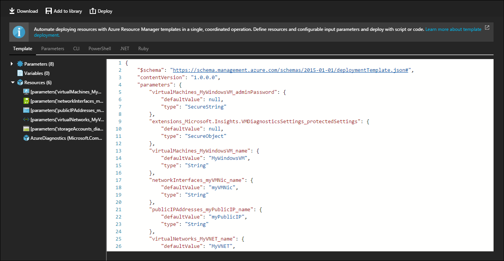

# Export resource groups that contain VM extensions

You can export Azure resource groups into a new Azure Resource Manager template that you can then redeploy. The export process interprets existing resources and creates a Resource Manager template that, when deployed, results in a similar resource group. When you're using the export option against a resource group that contains virtual machine (VM) extensions, you need to consider items such as extension compatibility and protected settings.

This article details how the resource group export process works for virtual machine extensions. It includes a list of supported extensions and details on how to handle secured data.

## Supported VM extensions

Many VM extensions are available. You can't export all extensions into a Resource Manager template by using the automation script feature. If a virtual machine extension is not supported, you need to manually place it back into the exported template.

You can export the following extensions by using the automation script feature:

> Acronis Backup, Acronis Backup Linux, BGInfo, BMC Control-M Agent Linux, BMC Control-M Agent Windows, Chef Client, Custom Script, Custom Script Extension, Custom Script for Linux, Datadog Linux Agent, Datadog Windows Agent, Docker Extension, DSC Extension, Dynatrace Linux, Dynatrace Windows, HPE Security Application Defender for Cloud, IaaS Antimalware, IaaS Diagnostics, Linux Chef Client, Linux Diagnostic, OS Patching for Linux, Puppet Agent, Site24x7 APM Insight, Site24x7 Linux Server, Site24x7 Windows Server, Trend Micro DSA, Trend Micro DSA Linux, VM Access For Linux, VM Access For Linux, VM Snapshot, VM Snapshot Linux

## Export the resource group

To export a resource group into a reusable template, complete the following steps:

1. Sign in to the Azure portal.
2. On the **Hub** menu, select **Resource Groups**.
3. Select the target resource group from the list.
4. On the **Resource group** pane, select **Export template** under the **Automation** section.



The Azure Resource Manager automation script produces a Resource Manager template, a parameters file, and several sample deployment scripts, such as PowerShell and Azure CLI scripts. At this point, you can download the exported template by using the download button, add the template to the template library, or redeploy the template by using the **Deploy** button.

## Configure protected settings

Many Azure VM extensions include a protected settings configuration that encrypts sensitive data, such as credentials and configuration strings. Protected settings are not exported with the automation script. If necessary, reinsert protected settings into the exported template.

### Step 1: Remove the template parameter

When you export a resource group, a single template parameter is created to provide a value to the exported protected settings. You can remove this parameter.

To remove the parameter, look through the list of parameters and delete the one that looks similar to this JSON example:

```json
"extensions_extensionname_protectedSettings": {
	"defaultValue": null,
	"type": "SecureObject"
}
```

### Step 2: Get properties for protected settings

Because each protected setting has a set of required properties, you need to gather a list of these properties. You can find each parameter of the protected settings configuration in the [Azure Resource Manager schema on GitHub](https://raw.githubusercontent.com/Azure/azure-resource-manager-schemas/master/schemas/2015-08-01/Microsoft.Compute.json). This schema includes only the parameter sets for the extensions that are listed in the overview section of this article.

From within the schema repository, search for the desired extension. After you find the extension's `protectedSettings` object, take note of each parameter. In the following example of the `IaasDiagnostic` extension, the required parameters are `storageAccountName`, `storageAccountKey`, and `storageAccountEndPoint`:

```json
"protectedSettings": {
	"type": "object",
	"properties": {
		"storageAccountName": {
			"type": "string"
		},
		"storageAccountKey": {
			"type": "string"
		},
		"storageAccountEndPoint": {
			"type": "string"
		}
	},
	"required": [
		"storageAccountName",
		"storageAccountKey",
		"storageAccountEndPoint"
	]
}
```

### Step 3: Re-create the protected configuration

On the exported template, search for `protectedSettings`. Replace the exported protected setting object with a new one that includes the required extension parameters and a value for each one.

In the example of the `IaasDiagnostic` extension, the new protected setting configuration would look like the following example:

```json
"protectedSettings": {
	"storageAccountName": "[parameters('storageAccountName')]",
	"storageAccountKey": "[parameters('storageAccountKey')]",
	"storageAccountEndPoint": "https://core.windows.net"
}
```

The final extension resource looks similar to the following JSON example:

```json
{
	"name": "Microsoft.Insights.VMDiagnosticsSettings",
	"type": "extensions",
	"location": "[resourceGroup().location]",
	"apiVersion": "[variables('apiVersion')]",
	"dependsOn": [
		"[concat('Microsoft.Compute/virtualMachines/', variables('vmName'))]"
	],
	"tags": {
		"displayName": "AzureDiagnostics"
	},
	"properties": {
		"publisher": "Microsoft.Azure.Diagnostics",
		"type": "IaaSDiagnostics",
		"typeHandlerVersion": "1.5",
		"autoUpgradeMinorVersion": true,
		"settings": {
			"xmlCfg": "[base64(concat(variables('wadcfgxstart'), variables('wadmetricsresourceid'), variables('vmName'), variables('wadcfgxend')))]",
			"storageAccount": "[parameters('existingdiagnosticsStorageAccountName')]"
		},
		"protectedSettings": {
			"storageAccountName": "[parameters('storageAccountName')]",
			"storageAccountKey": "[parameters('storageAccountKey')]",
			"storageAccountEndPoint": "https://core.windows.net"
		}
	}
}
```

If you're using template parameters to provide property values, you need to create them. When you're creating template parameters for protected setting values, use the `SecureString` parameter type to help secure sensitive values. For more information on using parameters, see [Authoring Azure Resource Manager templates](../../azure-resource-manager/templates/syntax.md).

In the example of the `IaasDiagnostic` extension, the following parameters would be created in the parameters section of the Resource Manager template:

```json
"storageAccountName": {
	"defaultValue": null,
	"type": "SecureString"
},
"storageAccountKey": {
	"defaultValue": null,
	"type": "SecureString"
}
```

At this point, you can deploy the template by using any template deployment method.
