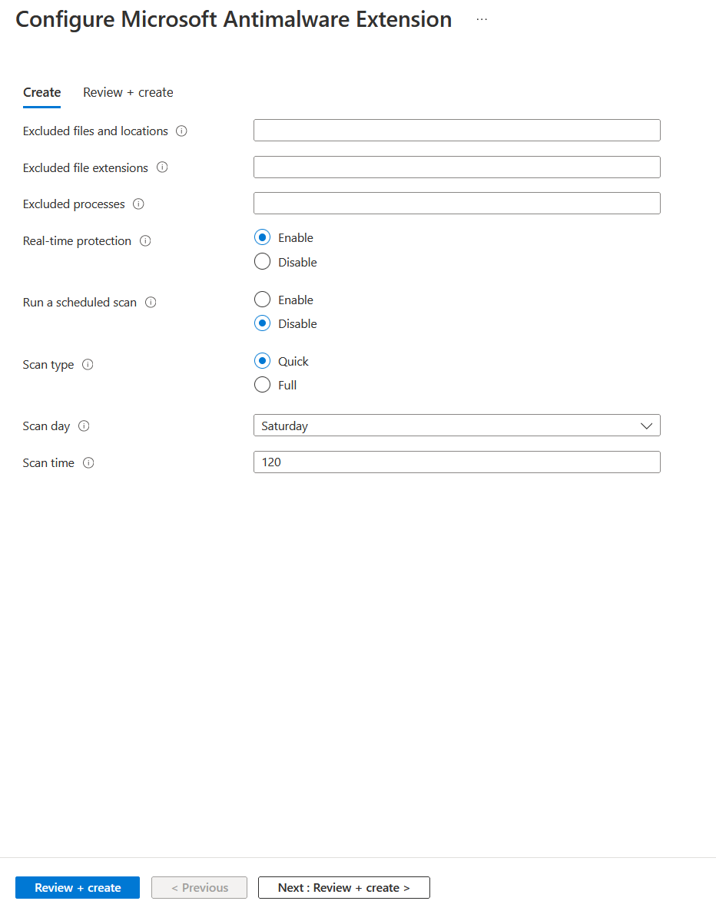

# Virtual machine extensions and features for Windows

Azure virtual machine (VM) extensions are small applications that provide post-deployment configuration and automation tasks on Azure VMs. For example, if a virtual machine requires software installation, anti-virus protection, or to run a script inside of it, a VM extension can be used. Azure VM extensions can be run with the Azure CLI, PowerShell, Azure Resource Manager templates, and the Azure portal. Extensions can be bundled with a new VM deployment, or run against any existing system.

This article provides an overview of VM extensions, prerequisites for using Azure VM extensions, and guidance on how to detect, manage, and remove VM extensions. This article provides generalized information because many VM extensions are available, each with a potentially unique configuration. Extension-specific details can be found in each document specific to the individual extension.

## Use cases and samples

Several different Azure VM extensions are available, each with a specific use case. Some examples include:

- Apply PowerShell Desired State configurations to a VM with the DSC extension for Windows. For more information, see [Azure Desired State configuration extension](dsc-overview.md).
- Configure monitoring of a VM with the Microsoft Monitoring Agent VM extension. For more information, see [Connect Azure VMs to Log Analytics](../../log-analytics/log-analytics-azure-vm-extension.md).
- Configure an Azure VM by using Chef. For more information, see [Automating Azure VM deployment with Chef](../windows/chef-automation.md).
- Configure monitoring of your Azure infrastructure with the Datadog extension. For more information, see the [Datadog blog](https://www.datadoghq.com/blog/introducing-azure-monitoring-with-one-click-datadog-deployment/).


In addition to process-specific extensions, a Custom Script extension is available for both Windows and Linux virtual machines. The Custom Script extension for Windows allows any PowerShell script to be run on a VM. Custom scripts are useful for designing Azure deployments that require configuration beyond what native Azure tooling can provide. For more information, see [Windows VM Custom Script extension](custom-script-windows.md).

## Prerequisites

To handle the extension on the VM, you need the Azure Windows Agent installed. Some individual extensions have prerequisites, such as access to resources or dependencies.

### Azure VM agent

The Azure VM agent manages interactions between an Azure VM and the Azure fabric controller. The VM agent is responsible for many functional aspects of deploying and managing Azure VMs, including running VM extensions. The Azure VM agent is preinstalled on Azure Marketplace images, and can be installed manually on supported operating systems. The Azure VM Agent for Windows is known as the Windows Guest agent.

For information on supported operating systems and installation instructions, see [Azure virtual machine agent](agent-windows.md).

#### Supported agent versions

In order to provide the best possible experience, there are minimum versions of the agent. For more information, see [this article](https://support.microsoft.com/en-us/help/4049215/extensions-and-virtual-machine-agent-minimum-version-support).

#### Supported OSes

The Windows Guest agent runs on multiple OSes, however the extensions framework has a limit for the OSes that extensions. For more information, see [this article] (https://support.microsoft.com/en-us/help/4078134/azure-extension-supported-operating-systems
).

Some extensions are not supported across all OSes and may emit *Error Code 51, 'Unsupported OS'*. Check the individual extension documentation for supportability.

#### Network access

Extension packages are downloaded from the Azure Storage extension repository, and extension status uploads are posted to Azure Storage. If you use [supported](https://support.microsoft.com/en-us/help/4049215/extensions-and-virtual-machine-agent-minimum-version-support) version of the agents, you do not need to allow access to Azure Storage in the VM region, as can use the agent to redirect the communication to the Azure fabric controller for agent communications. If you are on a non-supported version of the agent, you need to allow outbound access to Azure storage in that region from the VM.

> [!IMPORTANT]
> If you have blocked access to *168.63.129.16* using the guest firewall, then extensions fail irrespective of the above.

Agents can only be used to download extension packages and reporting status. For example, if an extension install needs to download a script from GitHub (Custom Script) or needs access to Azure Storage (Azure Backup), then additional firewall/Network Security Group ports need to be opened. Different extensions have different requirements, since they are applications in their own right. For extensions that require access to Azure Storage, you can allow access using Azure NSG Service Tags for [Storage](https://docs.microsoft.com/azure/virtual-network/security-overview#service-tags).

The Windows Guest Agent does not have proxy server support for you to redirect agent traffic requests through.

## Discover VM extensions

Many different VM extensions are available for use with Azure VMs. To see a complete list, use [Get-AzureRmVMExtensionImage](/powershell/module/azurerm.compute/get-azurermvmextensionimage). The following example lists all available extensions in the *WestUS* location:

```powershell
Get-AzureRmVmImagePublisher -Location "WestUS" | `
Get-AzureRmVMExtensionImageType | `
Get-AzureRmVMExtensionImage | Select Type, Version
```

## Run VM extensions

Azure VM extensions run on existing VMs, which is useful when you need to make configuration changes or recover connectivity on an already deployed VM. VM extensions can also be bundled with Azure Resource Manager template deployments. By using extensions with Resource Manager templates, Azure VMs can be deployed and configured without post-deployment intervention.

The following methods can be used to run an extension against an existing VM.

### PowerShell

Several PowerShell commands exist for running individual extensions. To see a list, use [Get-Command](/powershell/module/microsoft.powershell.core/get-command) and filter on *Extension*:

```powershell
Get-Command Set-AzureRM*Extension* -Module AzureRM.Compute
```

This provides output similar to the following:

```powershell
CommandType     Name                                               Version    Source
-----------     ----                                               -------    ------
Cmdlet          Set-AzureRmVMAccessExtension                       4.5.0      AzureRM.Compute
Cmdlet          Set-AzureRmVMADDomainExtension                     4.5.0      AzureRM.Compute
Cmdlet          Set-AzureRmVMAEMExtension                          4.5.0      AzureRM.Compute
Cmdlet          Set-AzureRmVMBackupExtension                       4.5.0      AzureRM.Compute
Cmdlet          Set-AzureRmVMBginfoExtension                       4.5.0      AzureRM.Compute
Cmdlet          Set-AzureRmVMChefExtension                         4.5.0      AzureRM.Compute
Cmdlet          Set-AzureRmVMCustomScriptExtension                 4.5.0      AzureRM.Compute
Cmdlet          Set-AzureRmVMDiagnosticsExtension                  4.5.0      AzureRM.Compute
Cmdlet          Set-AzureRmVMDiskEncryptionExtension               4.5.0      AzureRM.Compute
Cmdlet          Set-AzureRmVMDscExtension                          4.5.0      AzureRM.Compute
Cmdlet          Set-AzureRmVMExtension                             4.5.0      AzureRM.Compute
Cmdlet          Set-AzureRmVMSqlServerExtension                    4.5.0      AzureRM.Compute
Cmdlet          Set-AzureRmVmssDiskEncryptionExtension             4.5.0      AzureRM.Compute
```

The following example uses the Custom Script extension to download a script from a GitHub repository onto the target virtual machine and then run the script. For more information on the Custom Script extension, see [Custom Script extension overview](custom-script-windows.md).

```powershell
Set-AzureRmVMCustomScriptExtension -ResourceGroupName "myResourceGroup" `
    -VMName "myVM" -Name "myCustomScript" `
    -FileUri "https://raw.githubusercontent.com/neilpeterson/nepeters-azure-templates/master/windows-custom-script-simple/support-scripts/Create-File.ps1" `
    -Run "Create-File.ps1" -Location "West US"
```

In the following example, the VM Access extension is used to reset the administrative password of a Windows VM to a temporary password. For more information on the VM Access extension, see [Reset Remote Desktop service in a Windows VM](../windows/reset-rdp.md). Once you have run this, you should reset the password at first login:

```powershell
$cred=Get-Credential

Set-AzureRmVMAccessExtension -ResourceGroupName "myResourceGroup" -VMName "myVM" -Name "myVMAccess" `
    -Location WestUS -UserName $cred.GetNetworkCredential().Username `
    -Password $cred.GetNetworkCredential().Password -typeHandlerVersion "2.0"
```

The `Set-AzureRmVMExtension` command can be used to start any VM extension. For more information, see the [Set-AzureRmVMExtension reference](https://docs.microsoft.com/powershell/module/azurerm.compute/set-azurermvmextension).


### Azure portal

VM extensions can be applied to an existing VM through the Azure portal. Select the VM in the portal, choose **Extensions**, then select **Add**. Choose the extension you want from the list of available extensions and follow the instructions in the wizard.

The following example shows the installation of the Microsoft Antimalware extension from the Azure portal:



### Azure Resource Manager templates

VM extensions can be added to an Azure Resource Manager template and executed with the deployment of the template. When you deploy an extension with a template, you can create fully configured Azure deployments. For example, the following JSON is taken from a Resource Manager template deploys a set of load-balanced VMs and an Azure SQL database, then installs a .NET Core application on each VM. The VM extension takes care of the software installation.

For more information, see the [full Resource Manager template](https://github.com/Microsoft/dotnet-core-sample-templates/tree/master/dotnet-core-music-windows).

```json
{
    "apiVersion": "2015-06-15",
    "type": "extensions",
    "name": "config-app",
    "location": "[resourceGroup().location]",
    "dependsOn": [
    "[concat('Microsoft.Compute/virtualMachines/', variables('vmName'),copyindex())]",
    "[variables('musicstoresqlName')]"
    ],
    "tags": {
    "displayName": "config-app"
    },
    "properties": {
    "publisher": "Microsoft.Compute",
    "type": "CustomScriptExtension",
    "typeHandlerVersion": "1.9",
    "autoUpgradeMinorVersion": true,
    "settings": {
        "fileUris": [
        "https://raw.githubusercontent.com/Microsoft/dotnet-core-sample-templates/master/dotnet-core-music-windows/scripts/configure-music-app.ps1"
        ]
    },
    "protectedSettings": {
        "commandToExecute": "[concat('powershell -ExecutionPolicy Unrestricted -File configure-music-app.ps1 -user ',parameters('adminUsername'),' -password ',parameters('adminPassword'),' -sqlserver ',variables('musicstoresqlName'),'.database.windows.net')]"
    }
    }
}
```

For more information on creating Resource Manager templates, see [Authoring Azure Resource Manager templates with Windows VM extensions](../windows/template-description.md#extensions).

## Secure VM extension data

When you run a VM extension, it may be necessary to include sensitive information such as credentials, storage account names, and storage account access keys. Many VM extensions include a protected configuration that encrypts data and only decrypts it inside the target VM. Each extension has a specific protected configuration schema, and each is detailed in extension-specific documentation.

The following example shows an instance of the Custom Script extension for Windows. The command to execute includes a set of credentials. In this example, the command to execute is not encrypted:

```json
{
    "apiVersion": "2015-06-15",
    "type": "extensions",
    "name": "config-app",
    "location": "[resourceGroup().location]",
    "dependsOn": [
    "[concat('Microsoft.Compute/virtualMachines/', variables('vmName'),copyindex())]",
    "[variables('musicstoresqlName')]"
    ],
    "tags": {
    "displayName": "config-app"
    },
    "properties": {
    "publisher": "Microsoft.Compute",
    "type": "CustomScriptExtension",
    "typeHandlerVersion": "1.9",
    "autoUpgradeMinorVersion": true,
    "settings": {
        "fileUris": [
        "https://raw.githubusercontent.com/Microsoft/dotnet-core-sample-templates/master/dotnet-core-music-windows/scripts/configure-music-app.ps1"
        ],
        "commandToExecute": "[concat('powershell -ExecutionPolicy Unrestricted -File configure-music-app.ps1 -user ',parameters('adminUsername'),' -password ',parameters('adminPassword'),' -sqlserver ',variables('musicstoresqlName'),'.database.windows.net')]"
    }
    }
}
```

Moving the **command to execute** property to the **protected** configuration secures the execution string, as shown in the following example:

```json
{
    "apiVersion": "2015-06-15",
    "type": "extensions",
    "name": "config-app",
    "location": "[resourceGroup().location]",
    "dependsOn": [
    "[concat('Microsoft.Compute/virtualMachines/', variables('vmName'),copyindex())]",
    "[variables('musicstoresqlName')]"
    ],
    "tags": {
    "displayName": "config-app"
    },
    "properties": {
    "publisher": "Microsoft.Compute",
    "type": "CustomScriptExtension",
    "typeHandlerVersion": "1.9",
    "autoUpgradeMinorVersion": true,
    "settings": {
        "fileUris": [
        "https://raw.githubusercontent.com/Microsoft/dotnet-core-sample-templates/master/dotnet-core-music-windows/scripts/configure-music-app.ps1"
        ]
    },
    "protectedSettings": {
        "commandToExecute": "[concat('powershell -ExecutionPolicy Unrestricted -File configure-music-app.ps1 -user ',parameters('adminUsername'),' -password ',parameters('adminPassword'),' -sqlserver ',variables('musicstoresqlName'),'.database.windows.net')]"
    }
    }
}
```

### How do agents and extensions get updated?

The Agents and Extensions share the same update mechanism. Some updates do not require additional firewall rules.

When an update is available, it is only installed on the VM when there is a change to extensions, and other VM Model changes such as:

- Data disks
- Extensions
- Boot diagnostics container
- Guest OS secrets
- VM size
- Network profile

Publishers make updates available to regions at different times, so it is possible you can have VMs in different regions on different versions.

#### Listing Extensions Deployed to a VM

```powershell
$vm = Get-AzureRmVM -ResourceGroupName "myResourceGroup" -VMName "myVM"
$vm.Extensions | select Publisher, VirtualMachineExtensionType, TypeHandlerVersion
```

```powershell
Publisher             VirtualMachineExtensionType          TypeHandlerVersion
---------             ---------------------------          ------------------
Microsoft.Compute     CustomScriptExtension                1.9
```

#### Agent updates

The Windows Guest Agent only contains *Extension Handling code*, the *Windows Provisioning code* is separate. You can uninstall the Windows Guest Agent. You cannot disable the automatic update of the Window Guest Agent.

The *Extension Handling code* is responsible for communicating with the Azure fabric, and handling the VM extensions operations such as installs, reporting status, updating the individual extensions, and removing them. Updates contain security fixes, bug fixes, and enhancements to the *Extension Handling code*.

To check what version you are running, see [Detecting installed Windows Guest Agent](agent-windows.md#detect-the-vm-agent).

#### Extension updates

When an extension update is available, the Windows Guest Agent downloads and upgrades the extension. Automatic extension updates are either *Minor* or *Hotfix*. You can opt in or opt out of extensions *Minor* updates when you provision the extension. The following example shows how to automatically upgrade minor versions in a Resource Manager template with *autoUpgradeMinorVersion": true,'*:

```json
    "properties": {
    "publisher": "Microsoft.Compute",
    "type": "CustomScriptExtension",
    "typeHandlerVersion": "1.9",
    "autoUpgradeMinorVersion": true,
    "settings": {
        "fileUris": [
        "https://raw.githubusercontent.com/Microsoft/dotnet-core-sample-templates/master/dotnet-core-music-windows/scripts/configure-music-app.ps1"
        ]
    },
```

To get the latest minor release bug fixes, it is highly recommended that you always select auto update in your extension deployments. Hotfix updates that carry security or key bug fixes cannot be opted out.

### How to identify extension updates

#### Identifying if the extension is set with autoUpgradeMinorVersion on a VM

You can see from the VM model if the extension was provisioned with 'autoUpgradeMinorVersion'. To check, use [Get-AzureRmVm](/powershell/module/azurerm.compute/get-azurermvm) and provide the resource group and VM name as follows:

```powerShell
 $vm = Get-AzureRmVm -ResourceGroupName "myResourceGroup" -VMName "myVM"
 $vm.Extensions
```

The following example output shows that *autoUpgradeMinorVersion* is set to *true*:

```powershell
ForceUpdateTag              :
Publisher                   : Microsoft.Compute
VirtualMachineExtensionType : CustomScriptExtension
TypeHandlerVersion          : 1.9
AutoUpgradeMinorVersion     : True
```

#### Identifying when an autoUpgradeMinorVersion occurred

To see when an update to the extension occurred, review the agent logs on the VM at *C:\WindowsAzure\Logs\WaAppAgent.log*

In the following example, the VM had *Microsoft.Compute.CustomScriptExtension 1.8* installed. A hotfix was available to version *1.9*:

```powershell
[INFO]  Getting plugin locations for plugin 'Microsoft.Compute.CustomScriptExtension'. Current Version: '1.8', Requested Version: '1.9'
[INFO]  Auto-Upgrade mode. Highest public version for plugin 'Microsoft.Compute.CustomScriptExtension' with requested version: '1.9', is: '1.9'
```

## Agent permissions

To perform its tasks, the agent needs to run as *Local System*.

## Troubleshoot VM extensions

Each VM extension may have troubleshooting steps specific to the extension. For example, when you use the Custom Script extension, script execution details can be found locally on the VM where the extension was run. Any extension-specific troubleshooting steps are detailed in extension-specific documentation.

The following troubleshooting steps apply to all VM extensions.

1. To check the Windows Guest Agent Log, look at the activity when your extension was being provisioned in *C:\WindowsAzure\Logs\WaAppAgent.txt*

2. Check the actual extension logs for more details in *C:\WindowsAzure\Logs\Plugins\<extensionName>*

3. Check extension specific documentation troubleshooting sections for error codes, known issues etc.

4. Look at the system logs. Check for other operations that may have interfered with the extension, such as a long running installation of another application that required exclusive package manager access.

### Common reasons for extension failures

1. Extensions have 20 mins to run (exceptions are the CustomScript extensions, Chef, and DSC that have 90 mins). If your deployment exceeds this time, it is marked as a timeout. The cause of this can be due to low resource VMs, other VM configurations/start up tasks consuming high amounts of resource whilst the extension is trying to provision.

2. Minimum prerequisites not met. Some extensions have dependencies on VM SKUs, such as HPC images. Extensions may require certain networking access requirements, such as communicating to Azure Storage or public services. Other examples could be access to package repositories, running out of disk space, or security restrictions.

3. Exclusive package manager access. In some cases, you may encounter a long running VM configuration and extension installation conflicting, where they both need exclusive access to the package manager.

### View extension status

After a VM extension has been run against a VM, use [Get-AzureRmVM ](/powershell/module/azurerm.compute/get-azurermvm) to return extension status. *Substatuses[0]* shows that the extension provisioning succeeded, meaning that it successful deployed to the VM, but the execution of the extension inside the VM failed, *Substatuses[1]*.

```powershell
Get-AzureRmVM -ResourceGroupName "myResourceGroup" -VMName "myVM" -Status
```

The output is similar to the following example output:

```powershell
Extensions[0]           :
  Name                  : CustomScriptExtension
  Type                  : Microsoft.Compute.CustomScriptExtension
  TypeHandlerVersion    : 1.9
  Substatuses[0]        :
    Code                : ComponentStatus/StdOut/succeeded
    Level               : Info
    DisplayStatus       : Provisioning succeeded
    Message             : Windows PowerShell \nCopyright (C) Microsoft Corporation. All rights reserved.\n
  Substatuses[1]        :
    Code                : ComponentStatus/StdErr/succeeded
    Level               : Info
    DisplayStatus       : Provisioning succeeded
    Message             : The argument 'cseTest%20Scriptparam1.ps1' to the -File parameter does not exist. Provide the path to an existing '.ps1' file as an argument to the

-File parameter.
  Statuses[0]           :
    Code                : ProvisioningState/failed/-196608
    Level               : Error
    DisplayStatus       : Provisioning failed
    Message             : Finished executing command
```

Extension execution status can also be found in the Azure portal. To view the status of an extension, select the VM, choose **Extensions**, then select the desired extension.

### Rerun VM extensions

There may be cases in which a VM extension needs to be rerun. You can rerun an extension by removing it, and then rerunning the extension with an execution method of your choice. To remove an extension, use [Remove-AzureRmVMExtension](/powershell/module/AzureRM.Compute/Remove-AzureRmVMExtension) as follows:

```powershell
Remove-AzureRmVMExtension -ResourceGroupName "myResourceGroup" -VMName "myVM" -Name "myExtensionName"
```

You can also remove an extension in the Azure portal as follows:

1. Select a VM.
2. Choose **Extensions**.
3. Select the desired extension.
4. Choose **Uninstall**.

## Common VM extensions reference
| Extension name | Description | More information |
| --- | --- | --- |
| Custom Script Extension for Windows |Run scripts against an Azure virtual machine |[Custom Script Extension for Windows](custom-script-windows.md) |
| DSC Extension for Windows |PowerShell DSC (Desired State Configuration) Extension |[DSC Extension for Windows](dsc-overview.md) |
| Azure Diagnostics Extension |Manage Azure Diagnostics |[Azure Diagnostics Extension](https://azure.microsoft.com/blog/windows-azure-virtual-machine-monitoring-with-wad-extension/) |
| Azure VM Access Extension |Manage users and credentials |[VM Access Extension for Linux](https://azure.microsoft.com/blog/using-vmaccess-extension-to-reset-login-credentials-for-linux-vm/) |

## Next steps

For more information about VM extensions, see [Azure virtual machine extensions and features overview](overview.md).
