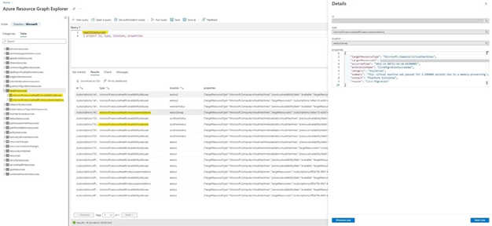
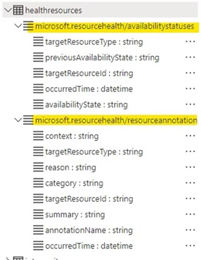
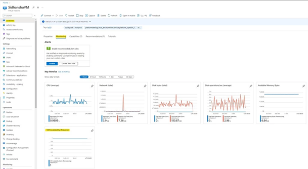

## What is Project Flash?

Flash, as the project is internally known, derives its name from our steadfast commitment to building a robust, reliable, and rapid mechanism for customers to monitor virtual machine (VM) health. Our primary objective is to ensure customers can reliably access actionable and precise telemetry, promptly receive alerts on changes, and periodically monitor data at scale. We also place strong emphasis on developing a centralized and coherent experience that customers can conveniently use to meet their unique observability requirements. It's our mission to ensure you can:

- **Consume accurate and actionable data** on VM availability disruptions (for example, VM reboots and restarts, application freezes due to network driver updates, and 30-second host OS updates), along with precise failure details (for example, platform versus user-initiated, reboot versus freeze, planned versus unplanned).
- **Analyze and alert on trends in VM availability** for quick debugging and month-over-month reporting.
- **Periodically monitor data at scale** and build custom dashboards to stay updated on the latest availability states of all resources.
- **Receive automated root cause analyses (RCAs)** detailing impacted VMs, downtime cause and duration, consequent fixes, and similar—all to enable targeted investigations and post-mortem analyses.
- **Receive instantaneous notifications** on critical changes in VM availability to quickly trigger remediation actions and prevent end-user impact.
- **Dynamically tailor and automate platform recovery policies** , based on ever-changing workload sensitivities and failover needs.

## Flash Solutions

The Flash initiative has been dedicated to developing solutions over the years that cater to the diverse monitoring needs of our customers. To help you determine the most suitable Flash monitoring solution(s) for your specific requirements, refer below:

| **Solution** | **Description** |
| --- | --- |
| Azure Resource Graph(General Availability) | For investigations at scale, centralized resource repository and history lookup, large customers want to periodically consume resource availability telemetry across all their workloads, at once, using Azure Resource Graph (ARG). |
| Event Grid System Topic (Public Preview) | To trigger time-sensitive and critical mitigations (redeploy, restart VM actions) for prevention of end-user impact, customers (e.g., Pearl Abyss, Krafton) want to receive alerts within seconds of critical changes in resource availability via Event Handlers in Event Grid. |
| Azure Monitor (Public Preview) | To track trends, aggregate platform metrics (CPU, disk etc.), and set up precise threshold-based alerts, customers want to consume an out-of-box VM Availability metric via Azure Monitor. |
| Resource Health (General Availability) | To perform instantaneous and convenient Portal UI health checks per-resource customers can quickly view the RHC blade on the portal. They can also access a 30-day historical view of health checks for that resource for quick and easy troubleshooting. |

### Azure resource graph—HealthResources

Currently generally available. It is particularly useful for conducting large-scale investigations. It offers a highly user-friendly experience for [information retrieval](https://docs.microsoft.com/en-us/azure/governance/resource-graph/samples/samples-by-table?tabs=azure-cli) with its use of [kusto query language](https://learn.microsoft.com/en-us/azure/governance/resource-graph/overview#the-query-language) (KQL). It can also serve as a central hub for resource information and allows easy retrieval of historical data.

In addition to already flowing [VM availability states](https://docs.microsoft.com/azure/service-health/resource-health-overview#health-status), we have published [VM health annotations](https://learn.microsoft.com/azure/service-health/resource-health-vm-annotation) to [Azure Resource Graph](https://learn.microsoft.com/azure/governance/resource-graph/overview) (ARG) for detailed failure attribution and downtime analysis, along with enabling a 14-day [change tracking](https://learn.microsoft.com/azure/governance/resource-graph/how-to/get-resource-changes?tabs=azure-cli) mechanism to trace historical changes in VM availability for quick debugging. With these new additions, we're excited to announce the general availability of VM availability information in the HealthResources dataset in ARG! With this offering users can:

- Efficiently query the latest snapshot of VM availability across all Azure subscriptions at once and at low latencies for periodic and fleetwide monitoring.
- Accurately assess the impact to fleetwide business SLAs and quickly trigger decisive mitigation actions, in response to disruptions and type of failure signature.
- Set up custom dashboards to supervise the comprehensive health of applications by [joining VM availability information](https://learn.microsoft.com/azure/governance/resource-graph/concepts/work-with-data) with additional [resource metadata present in ARG](https://learn.microsoft.com/azure/governance/resource-graph/samples/samples-by-table?tabs=azure-cli).
- Track relevant changes in VM availability across a rolling 14-day window, by using the [change-tracking mechanism](https://learn.microsoft.com/azure/governance/resource-graph/how-to/get-resource-changes?tabs=azure-cli) for conducting detailed investigations.

#### Sample Queries

- [Azure Resource Graph sample queries for Azure Service Health - Azure Service Health | Microsoft Learn](https://learn.microsoft.com/en-us/azure/service-health/resource-graph-samples?tabs=azure-cli#resource-health)
- [VM availability information in Azure Resource Graph - Azure Virtual Machines | Microsoft Learn](https://learn.microsoft.com/en-us/azure/virtual-machines/resource-graph-availability)
- [List of sample Azure Resource Graph queries by table - Azure Resource Graph | Microsoft Learn](https://learn.microsoft.com/en-us/azure/governance/resource-graph/samples/samples-by-table?tabs=azure-cli#healthresources)

#### Getting started

Users can query ARG via [PowerShell](https://learn.microsoft.com/azure/governance/resource-graph/first-query-powershell), [REST API](https://learn.microsoft.com/azure/governance/resource-graph/first-query-rest-api), [Azure CLI](https://learn.microsoft.com/azure/governance/resource-graph/first-query-azurecli), or even the [Azure Portal](https://portal.azure.com/). The following steps detail how data can be accessed from Azure Portal.

1. Once on the Azure Portal, navigate to Resource Graph Explorer which will look like the below image:

_Figure 1: Azure Resource Graph Explorer landing page on Azure Portal._

2. Select the Table tab and (single) click on the HealthResources table to retrieve the latest snapshot of VM availability information (availability state and health annotations).

_Figure 2: Azure Resource Graph Explorer Window depicting the latest VM availability states and VM health annotations in the HealthResources table._

There will be two types of events populated in the HealthResources table:

_Figure 3: Snapshot of the type of events present in the HealthResources table, as shown in Resource Graph Explorer on the Azure Portal._

- resourcehealth/availabilitystatuses

This event denotes the latest availability status of a VM, based on the health checks performed by the underlying Azure platform. Below are the availability states we currently emit for VMs:

- Available: The VM is up and running as expected.
- Unavailable: We've detected disruptions to the normal functioning of the VM and therefore applications will not run as expected.
- Unknown: The platform is unable to accurately detect the health of the VM. Users can usually check back in a few minutes for an updated state.

To poll the latest VM availability state, refer to the properties field which contains the below details:

#### Sample

{
 "targetResourceType": "Microsoft.Compute/virtualMachines",
 "previousAvailabilityState": "Available",
 "targetResourceId": "/subscriptions//resourceGroups//providers/Microsoft.Compute/virtualMachines/",
 "occurredTime": "2022-10-11T11:13:59.9570000Z",
 "availabilityState": "Unavailable"
 }

#### Property description

| **Field** | **Description** | [**Corresponding RHC**](https://learn.microsoft.com/azure/azure-monitor/essentials/activity-log-schema#resource-health-category) **field** |
| --- | --- | --- |
| targetResourceType | Type of resource for which health data is flowing | resourceType |
| targetResourceId | Resource Id | resourceId |
| occurredTime | Timestamp when the latest availability state is emitted by the platform | eventTimestamp |
| previousAvailabilityState | Previous availability state of the VM | previousHealthStatus |
| availabilityState | Current availability state of the VM | currentHealthStatus |

_Refer to_ [_this doc_](https://learn.microsoft.com/azure/governance/resource-graph/samples/samples-by-table?tabs=azure-cli#healthresources) _for a list of starter queries to further explore this data._

- resourcehealth/resourceannotations (NEWLY ADDED)

This event contextualizes any changes to VM availability, by detailing necessary failure attributes to help users investigate and mitigate the disruption as needed. [See the full list of VM health annotations](https://learn.microsoft.com/azure/service-health/resource-health-vm-annotation) emitted by the platform.
 These annotations can be broadly classified into three buckets:

- Downtime Annotations: These annotations are emitted when the platform detects VM availability transitioning to Unavailable. (For example, during unexpected host crashes, rebootful repair operations).
- Informational Annotations: These annotations are emitted during control plane activities with no impact to VM availability. (Such as VM allocation/Stop/Delete/Start). Usually, no additional customer action is required in response.
- Degraded Annotations: These annotations are emitted when VM availability is detected to be at risk. (For example, when [failure prediction models](https://azure.microsoft.com/blog/advancing-failure-prediction-and-mitigation-introducing-narya) predict a degraded hardware component that can cause the VM to reboot at any given time). We strongly urge users to redeploy by the deadline specified in the annotation message, to avoid any unanticipated loss of data or downtime.

To poll the associated VM health annotations for a resource, if any, refer to the properties field which contains the following details:

#### Sample

{
 "targetResourceType": "Microsoft.Compute/virtualMachines", "targetResourceId": "/subscriptions//resourceGroups//providers/Microsoft.Compute/virtualMachines/",
 "annotationName": "VirtualMachineHostRebootedForRepair",
 "occurredTime": "2022-09-25T20:21:37.5280000Z",
 "category": "Unplanned",
 "summary": "We're sorry, your virtual machine isn't available because an unexpected failure on the host server. Azure has begun the auto-recovery process and is currently rebooting the host server. No additional action is required from you at this time. The virtual machine will be back online after the reboot completes.",
 "context": "Platform Initiated",
 "reason": "Unexpected host failure"
 }

#### Property description

| **Field** | **Description** | [**Corresponding RHC**](https://learn.microsoft.com/en-us/azure/azure-monitor/essentials/activity-log-schema#resource-health-category) **field** |
| --- | --- | --- |
| targetResourceType | Type of resource for which health data is flowing | resourceType |
| targetResourceId | Resource Id | resourceId |
| occurredTime | Timestamp when the latest availability state is emitted by the platform | eventTimestamp |
| annotationName | Name of the Annotation emitted | eventName |
| reason | Brief overview of the availability impact observed by the customer | title |
| category | Denotes whether the platform activity triggering the annotation was either planned maintenance or unplanned repair. This field is not applicable to customer/VM-initiated events.Possible values: Planned | Unplanned | Not Applicable | Null | category |
| context | Denotes whether the activity triggering the annotation was due to an authorized user or process (customer-initiated), or due to the Azure platform (platform-initiated) or even activity in the guest OS that has resulted in availability impact (VM initiated).Possible values: Platform-initiated | User-initiated | VM-initiated | Not Applicable | Null | context |
| summary | Statement detailing the cause for annotation emission, along with remediation steps that can be taken by users | summary |

_Refer to_ [_this doc_](https://learn.microsoft.com/azure/governance/resource-graph/samples/samples-by-table?tabs=azure-cli#healthresources) _for a list of starter queries to further explore this data._

Looking ahead to 2024, we have multiple enhancements planned for the annotation metadata that is surfaced in the HealthResources dataset. These enrichments will give users access to richer failure attributes to decisively prepare a response to a disruption. In parallel, we aim to extend the duration of historical lookback to a minimum of 30 days so users can comprehensively track past changes in VM availability.

### Azure event grid system topic—HealthResources

To ensure seamless operation of business-critical applications, it's crucial to have real time awareness of any event that might adversely impact VM availability. This awareness enables you to swiftly take remedial actions to shield end-users from any disruption. To support you in your daily operations, we're delighted to announce the public preview of the [HealthResources event grid system topic](https://learn.microsoft.com/en-us/azure/event-grid/event-schema-health-resources?tabs=event-grid-event-schema) with newly added [VM health annotations](https://learn.microsoft.com/en-us/azure/service-health/resource-health-vm-annotation)!

This system topic provides in-depth VM [health data](https://learn.microsoft.com/en-us/azure/event-grid/event-schema-health-resources?tabs=event-grid-event-schema#event-types), giving you immediate insights into changes in VM availability states along with the necessary context. You can receive events on single-instance VMs and [Virtual Machine Scale Set](https://learn.microsoft.com/en-us/azure/virtual-machine-scale-sets/overview) VMs for the Azure subscription on which this topic has been created. Data is published to this topic by [Azure Resource Notifications](https://learn.microsoft.com/en-us/azure/event-grid/event-schema-resource-notifications) (ARN), our state-of-the-art publisher-subscriber service, equipped with robust Role-Based Access Control (RBAC) and advanced filtering capabilities. This empowers you to effortlessly subscribe to an event grid system topic and seamlessly direct relevant events utilizing the [advanced filtering](https://learn.microsoft.com/en-us/azure/event-grid/event-filtering) capabilities provided by event grid, to downstream tools in real-time. This enables you to respond and mitigate issues instantly.

#### Getting started

- Step 1: Users start by [creating a system](https://learn.microsoft.com/en-us/azure/event-grid/create-view-manage-system-topics#create-a-system-topic)topic within the Azure subscription for which they want to receive notifications.
- Step 2: Users then proceed to [create an event subscription](https://learn.microsoft.com/en-us/azure/event-grid/subscribe-through-portal#create-event-subscriptions) within the system topic in Step 1. During this step, they'll specify the [endpoint](https://learn.microsoft.com/en-us/azure/event-grid/event-handlers) (such as, Event Hubs) to which the events will be routed. Users also have the option to configure event filters to narrow down the scope of delivered events.

As you start subscribing to events from the HealthResources system topic, consider the following best practices:

- Choose an appropriate [destination or event handler](https://learn.microsoft.com/en-us/azure/event-grid/event-handlers) based on the anticipated scale and size of events.
- For fan-in scenarios where notifications from multiple system topics need to be consolidated, [event hubs](https://learn.microsoft.com/en-us/azure/event-grid/handler-event-hubs) are highly recommended as a destination. This is especially useful for real-time processing scenarios to maintain data freshness and for periodic processing for analytics, with configurable retention periods.

Looking ahead to 2024, we have plans to transition the preview into a fully-fledged general availability feature. As part of the preview, we'll emit events scoped to changes in VM availability states, with the sample [schema](https://learn.microsoft.com/azure/event-grid/event-schema) below:

#### Sample

{
 "id": "4c70abbc-4aeb-4cac-b0eb-ccf06c7cd102",
 "topic": "/subscriptions/,
 "subject": "/subscriptions//resourceGroups//providers/Microsoft.Compute/virtualMachines//providers/Microsoft.ResourceHealth/AvailabilityStatuses/current",
 "data": {
 "resourceInfo": {
 "id":"/subscriptions//resourceGroups//providers/Microsoft.Compute/virtualMachines//providers/Microsoft.ResourceHealth/AvailabilityStatuses/current",
 "properties": {
 "targetResourceId":"/subscriptions//resourceGroups//providers/Microsoft.Compute/virtualMachines/"
 "targetResourceType": "Microsoft.Compute/virtualMachines",
 "occurredTime": "2022-09-25T20:21:37.5280000Z"
 "previousAvailabilityState": "Available",
 "availabilityState": "Unavailable"
 }
 },
 "apiVersion": "2020-09-01"
 },
 "eventType": "Microsoft.ResourceNotifications.HealthResources.AvailabilityStatusesChanged",
 "dataVersion": "1",
 "metadataVersion": "1",
 "eventTime": "2022-09-25T20:21:37.5280000Z"
 }

The properties field is fully consistent with the _microsoft.resourcehealth/availabilitystatuses_ event in ARG. The event grid solution offers near-real-time alerting capabilities on the data present in ARG.

#### Demo

How to subscribe to events through Event Grid System Topics:

[Flash System Topic Demo (Final).mp4](https://microsoft.sharepoint.com/:v:/t/VMAPMs/EeMF0XrOqrNIsj7KpPx2cgcB9DTo7Ky6wfUB3mQ3XFokZQ?e=Oz1MQu)

Event Grid for degradation notifications:

[Flash Degradation Demo (Final).mp4](https://microsoft.sharepoint.com/:v:/t/VMAPMs/ESOtL_vXix9Eov9C3C4-M88Bp74-GSd9ENHpYPCnOdRzHg?e=xe0ncy)

### Azure monitor—VM availability metric

Currently in public preview. It's well-suited for tracking trends, aggregating platform metrics (such as CPU and disk usage) and configuring precise threshold-based alerts. Customers can utilize this out-of-the-box [VM availability metric](https://docs.microsoft.com/en-us/azure/azure-monitor/platform/alerts-overview) in [Azure Monitor](https://docs.microsoft.com/en-us/azure/azure-monitor/platform/alerts-overview). This metric displays the trend of VM availability over time, so users can:

- Set up [threshold-based metric alerts](https://learn.microsoft.com/azure/azure-monitor/alerts/alerts-create-new-alert-rule?tabs=metric) on dipping VM availability to quickly trigger appropriate mitigation actions.
- Correlate the VM availability metric with existing [platform metrics](https://learn.microsoft.com/azure/azure-monitor/essentials/data-platform-metrics) like memory, network, or disk for deeper insights into concerning changes that impact the overall performance of workloads.
- Easily interact with and chart metric data during any relevant time window on [Metrics Explorer](https://learn.microsoft.com/azure/azure-monitor/essentials/metrics-getting-started), for quick and easy debugging.
- Route metrics to downstream tooling like [Grafana dashboards](https://learn.microsoft.com/azure/azure-monitor/visualize/grafana-plugin), for constructing custom visualizations and dashboards.

#### Getting started

Users can either consume the metric programmatically via the [Azure Monitor REST API](https://docs.microsoft.com/rest/api/monitor/metrics) or directly from the [Azure Portal](https://portal.azure.com/). The following steps highlight metric consumption from the Azure Portal.

Once on the Azure Portal, navigate to the VM overview blade. The new metric will be displayed as VM Availability (Preview), along with other platform metrics under the Monitoring tab.

_Figure 4: View the newly added VM Availability Metric on the VM overview page on Azure Portal._

Select (single click) the VM availability metric chart on the overview page, to navigate to [Metrics Explorer](https://docs.microsoft.com/azure/azure-monitor/essentials/metrics-getting-started) for further analysis.

_Figure 5: View the newly added VM availability Metric on Metrics Explorer on Azure Portal._

#### Metric description

| **Display Name** | **VM Availability (preview)** |
| --- | --- |
| Metric Values |
- 1 during expected behavior; corresponds to VM in Available state.
- 0 when VM is impacted by rebootful disruptions; corresponds to VM in Unavailable state.
- NULL (shows a dotted or dashed line on charts) when the Azure service that is emitting the metric is down or is unaware of the exact status of the VM; corresponds to VM in Unknown state.
 |
| Aggregation | The default aggregation of the metric is Average, for prioritized investigations based on extent of downtime incurred.The other aggregations available are:
- Min, to immediately pinpoint to all the times where VM was unavailable.
- Max, to immediately pinpoint to all the instances where VM was Available.
Refer [here](https://docs.microsoft.com/en-us/azure/azure-monitor/essentials/metrics-aggregation-explained) for more details on chart range, granularity, and data aggregation. |
| Data Retention | Data for the VM availability metric will be [stored for 93 days](https://learn.microsoft.com/en-us/azure/azure-monitor/essentials/data-platform-metrics#retention-of-metrics) to assist in trend analysis and historical lookback. |
| Pricing | Please refer to the [Pricing breakdown](https://azure.microsoft.com/en-us/pricing/details/monitor/#pricing), specifically in the "Metrics" and "Alert Rules" sections. |

Looking ahead to 2024, we plan to include impact details (user vs platform initiated, planned vs unplanned) as dimensions to the metric, so users are well equipped to interpret dips, and set up much more targeted metric alerts. With the emission of dimensions in 202, we also anticipate transitioning the offering to a general availability status.

#### Useful links

- [How to filter events for Azure Event Grid - Azure Event Grid | Microsoft Learn](https://learn.microsoft.com/en-us/azure/event-grid/how-to-filter-events)
- [Event filtering for Azure Event Grid - Azure Event Grid | Microsoft Learn](https://learn.microsoft.com/en-us/azure/event-grid/event-filtering#advanced-filtering)

### Azure resource health

It offers immediate and user-friendly health checks for individual resources through the portal. Customers can quickly access the [resource health](https://learn.microsoft.com/en-us/azure/service-health/resource-health-overview) blade on the portal and also review a 30-day historical record of health checks, making it an excellent tool for fast and straightforward troubleshooting. The existing Azure resource health feature helps you to diagnose and get support for service problems that affect your Azure resources. It reports on the current and past health of your resources, showing any time ranges that each of your resources have been unavailable.

But we know that our customers and partners are particularly interested in "the why" to understand what caused the underlying technical issue, and in improving how they can receive communications about any issues—to feed into monitoring processes, to explain hiccups to other stakeholders, and ultimately to inform business decisions.

#### Introducing root causes for VM issues—in Azure resource health

We recently shipped an improvement to the resource health experience that will enhance the information we share with customers about VM failures, with additional context on the root cause that led to the issue. Now, in addition to getting a fast notification when a VM's availability is impacted, customers can expect a root cause to be added at a later point once our automated Root Cause Analysis (RCA) system identifies the failing Azure platform component that led to the VM failure. Let's walk through an example to see how this works in practice:

At time T1, a server rack goes offline due to a networking issue, causing VMs on the rack to lose connectivity. (Recent reliability improvements related to network architecture will be shared in a future [Advancing Reliability](https://www.aka.ms/AdvancingReliability) blog post—watch this space!)

At time T2, Azure's internal monitoring recognizes that it is unable to reach VMs on the rack and begins to mitigate by redeploying the impacted VMs to a new rack. During this time, an annotation is sent to resource health notifying customers that their VM is currently impacted and unavailable.

_Figure 6: A screenshot of the Azure portal "resource health" blade showing the health history of a resource._

At time T3, platform telemetry from the top of rack switch, the host machine, and internal monitoring systems, are all correlated together in our RCA engine to derive the root cause of the failure. Once computed, the RCA is then published back into resource health along with relevant architectural resiliency recommendations that customers can implement to minimize the probability of impact in the future.

_Figure 7: A screenshot of the Azure portal "health history" blade showing root cause details for an example of a VM issue._

While the initial downtime notification functionality has existed for several years, the publishing of a root cause statement is a new addition. Now, let's dive into the details of how we derive these root causes.

#### Root Cause Analysis engine

Let's take a closer look at the prior example and walk through the details of how the RCA engine works and the technology behind it. At the core of our RCA engine for VMs is [Azure Data Explorer](https://docs.microsoft.com/en-us/azure/data-explorer/data-explorer-overview) (ADX), a big data service optimized for high volume log telemetry analytics. Azure Data Explorer enables the ability to easily parse through terabytes of log telemetry from devices and services that comprise the Azure platform, join them together, and interpret the correlated information streams to derive a root cause for different failure scenarios. This ends up being a multistep data engineering process:

Phase 1: Detecting downtime

The first phase in root cause analysis is to define the trigger under which the analysis is executed. In the case of Virtual Machines, we want to determine root causes whenever a VM unexpectedly reboots, so the trigger is a VM transitioning from an up state to a down state. Identifying these transitions from platform telemetry is straightforward in most scenarios, but more complicated around certain kinds of infrastructure failure where platform telemetry might get lost due to device failure or power loss. To handle these classes of failures, other techniques are required—like tracking data loss as a possible indication of a VM health transition. Azure Data Explorer excels at this time of series analysis, and a more detailed look at techniques around this can be found in the Microsoft Tech Community: [Calculating downtime using Window functions and Time Series functions in Azure Data Explorer](https://techcommunity.microsoft.com/t5/azure-data-explorer/calculating-downtime-using-window-functions-and-time-series/ba-p/1345430).

Phase 2: Correlation analysis

Once a trigger event is defined (in this case, a VM transitioning to an unhealthy state) the next phase is correlation analysis. In this step we use the presence of the trigger event to correlate telemetry from points across the Azure platform, like:

- Azure host: the physical blade hosting VMs.
- TOR: the top of rack network switch.
- Azure Storage: the service which hosts Virtual Disks for Azure Virtual Machines.

Each of these systems has their own telemetry feeds that need to get parsed and correlated with the VM downtime trigger event. This is done through understanding the dependency graph for a VM and the underlying systems that can cause a VM to fail, and then joining all these dependent systems' health telemetry together, filtered on events that are relatively close to the VM transition in time. Azure Data Explorer's intuitive and powerful query language helps with this, with documented patterns like [time window join](https://docs.microsoft.com/en-us/azure/data-explorer/kusto/query/join-timewindow) for correlating temporal telemetry streams together. At the end of this correlation process, we have a dataset that represents VM downtime transitions with correlated platform telemetry from all the dependent systems that could cause or could have information useful in determining what led to the VM failure.

Phase 3: Root cause attribution

The next step in the process is attribution. Now that we've collected all the relevant data together in a single dataset, attribution rules get applied to interpret the information and translate it into a customer-facing root cause statement. Going back to our original example of a TOR failure, after our correlation analysis we might have many interesting pieces of information to interpret. For example, systems monitoring the Azure hosts might have logs indicating they lost connectivity to the hosts during this time. We might also have signals related to virtual disk connectivity problems, and explicit signals from the TOR device about the failure. All these pieces of information are now scanned over, and the explicit TOR failure signal is prioritized over the other signals as the root cause. This prioritization process, and the rules behind it, are constructed with domain experts and modified as the Azure platform evolves. Machine learning and anomaly detection mechanisms sit on top of these attributed root causes, to help identify opportunities to improve these classification rules as well as to detect pattern changes in the rate of these failures to feed back into [safe deployment pipelines](https://azure.microsoft.com/blog/advancing-safe-deployment-with-aiops-introducing-gandalf/).

Phase 4: RCA publishing

The last step is publishing root causes to Azure resource health, where they become visible to customers. This is done in a very simple [Azure Functions](https://azure.microsoft.com/en-us/services/functions/) application, which periodically queries the processed root cause data in Azure Data Explorer, and emits the results to the resource health backend. Because information streams can come in with various data delays, RCAs can occasionally be updated in this process to reflect better sources of information having arrived leading to a more specific root cause that what was originally published.

#### Going forward

Identifying and communicating the root cause of any issues to our customers and partners is just the beginning. Our customers may need to take these RCAs and share them with their customers and coworkers. We want to build on the work here to make it easier to identify and track resource RCAs, as well as easily share them out. In order to accomplish that, we are working on backend changes to generate unique per-resource and per-downtime tracking IDs that we can expose to you, so that you can easily match downtimes to their RCAs. We are also working on new features to make it easier to email RCAs out, and eventually subscribe to RCAs for your VMs. This will make it possible to sign up for RCAs directly in your inbox after an unavailability event with no additional action needed on your part.

### Facilitating holistic VM availability monitoring

For a holistic approach to monitoring VM availability, including scenarios of routine maintenance, live migration, service healing, and VM degradation, we recommend you utilize both [scheduled events](https://learn.microsoft.com/en-us/azure/virtual-machines/windows/scheduled-event-service) (SE) and Flash health events.

Scheduled events are designed to offer an early warning, giving up to 15-minute advance notice prior to maintenance activities. This lead time enables you to make informed decisions regarding upcoming downtime, allowing you to either avoid or prepare for it. You have the flexibility to either acknowledge these events or delay actions during this 15-minute period, depending on your readiness for the upcoming maintenance.

On the other hand, Flash Health events are focused on real-time tracking of ongoing and completed availability disruptions, including VM degradation. This feature empowers you to effectively monitor and manage downtime, supporting automated mitigation, investigations, and post-mortem analysis.

To get started on your observability journey, you can explore the suite of Azure products to which we emit high-quality VM health data to. These products include [resource health](https://learn.microsoft.com/en-us/azure/service-health/resource-health-overview), [activity logs](https://learn.microsoft.com/en-us/azure/azure-monitor/essentials/activity-log?tabs=powershell), [Azure resource graph](https://learn.microsoft.com/en-us/azure/governance/resource-graph/samples/samples-by-table?tabs=azure-cli#healthresources), [Azure monitor metrics](https://learn.microsoft.com/en-us/azure/virtual-machines/monitor-vm-reference) and [Azure event grid system topic](https://learn.microsoft.com/en-us/azure/event-grid/event-schema-health-resources?tabs=event-grid-event-schema).
