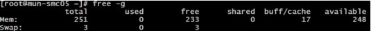
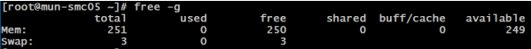

# Known issues with HB-series and N-series VMs

> [!CAUTION]
> This article references CentOS, a Linux distribution that is nearing End Of Life (EOL) status. Please consider your use and planning accordingly. For more information, see the [CentOS End Of Life guidance](~/articles/virtual-machines/workloads/centos/centos-end-of-life.md).

**Applies to:** :heavy_check_mark: Linux VMs :heavy_check_mark: Windows VMs :heavy_check_mark: Flexible scale sets :heavy_check_mark: Uniform scale sets

This article attempts to list recent common issues and their solutions when using the [HB-series](sizes-hpc.md) and [N-series](sizes-gpu.md) HPC and GPU VMs.

## Cache topology on Standard_HB120rs_v3
`lstopo` displays incorrect cache topology on the Standard_HB120rs_v3 VM size. It may display that there’s only 32 MB L3 per NUMA. However in practice, there is indeed 120 MB L3 per NUMA as expected since the same 480 MB of L3 to the entire VM is available as with the other constrained-core HBv3 VM sizes. This is a cosmetic error in displaying the correct value, which should not impact workloads.

## qp0 Access Restriction
To prevent low-level hardware access that can result in security vulnerabilities, Queue Pair 0 is not accessible to guest VMs. This should only affect actions typically associated with administration of the ConnectX InfiniBand NIC, and running some InfiniBand diagnostics like ibdiagnet, but not end-user applications.

## MOFED installation on Ubuntu
On Ubuntu-18.04 based marketplace VM images with kernels version `5.4.0-1039-azure #42` and newer, some older Mellanox OFED are incompatible causing an increase in VM boot time up to 30 minutes in some cases. This has been reported for both Mellanox OFED versions 5.2-1.0.4.0 and 5.2-2.2.0.0. The issue is resolved with Mellanox OFED 5.3-1.0.0.1.
If it is necessary to use the incompatible OFED, a solution is to use the **Canonical:UbuntuServer:18_04-lts-gen2:18.04.202101290** marketplace VM image, or older and not to update the kernel.

## Accelerated Networking on HB, HC, HBv2, HBv3, HBv4, HX, NDv2 and NDv4

[Azure Accelerated Networking](https://azure.microsoft.com/blog/maximize-your-vm-s-performance-with-accelerated-networking-now-generally-available-for-both-windows-and-linux/) is now available on the RDMA and InfiniBand capable and SR-IOV enabled VM sizes [HB](hb-series.md), [HC](hc-series.md), [HBv2](hbv2-series.md), [HBv3](hbv3-series.md), [HBv4](hbv4-series.md), [HX](hx-series.md), [NDv2](ndv2-series.md) and [NDv4](nda100-v4-series.md). This capability now allows enhanced throughout (up to 30 Gbps) and latencies over the Azure Ethernet network. Though this is separate from the RDMA capabilities over the InfiniBand network, some platform changes for this capability may impact behavior of certain MPI implementations when running jobs over InfiniBand. Specifically the InfiniBand interface on some VMs may have a slightly different name (mlx5_1 as opposed to earlier mlx5_0). This may require tweaking of the MPI command lines especially when using the UCX interface (commonly with OpenMPI and HPC-X).

The simplest solution currently is to use the latest HPC-X on the CentOS-HPC VM images where we rename the InfiniBand and Accelerated Networking interfaces accordingly or to run the [script](https://github.com/Azure/azhpc-images/blob/master/common/install_azure_persistent_rdma_naming.sh) to rename the InfiniBand interface.

More details on this are available on this [TechCommunity article](https://techcommunity.microsoft.com/t5/azure-compute/accelerated-networking-on-hb-hc-and-hbv2/ba-p/2067965) with instructions on how to address any observed issues.

## InfiniBand driver installation on non-SR-IOV VMs

Currently H16r, H16mr, and NC24r are not SR-IOV enabled. For more information on the InfiniBand stack bifurcation, see [Azure VM sizes - HPC](sizes-hpc.md#rdma-capable-instances).
InfiniBand can be configured on the SR-IOV enabled VM sizes with the OFED drivers while the non-SR-IOV VM sizes require ND drivers. This IB support is available appropriately for [CentOS, RHEL, and Ubuntu](configure.md).

## Duplicate MAC with cloud-init with Ubuntu on H-series and N-series VMs

There's a known issue with cloud-init on Ubuntu VM images as it tries to bring up the IB interface. This can happen either on VM reboot or when trying to create a VM image after generalization. The VM boot logs may show an error like so:
```output
“Starting Network Service...RuntimeError: duplicate mac found! both 'eth1' and 'ib0' have mac”.
```

This 'duplicate MAC with cloud-init on Ubuntu" is a known issue. This will be resolved in newer kernels. If this issue is encountered, the workaround is:
1) Deploy the (Ubuntu 18.04) marketplace VM image
2) Install the necessary software packages to enable IB ([instruction here](https://techcommunity.microsoft.com/t5/azure-compute/configuring-infiniband-for-ubuntu-hpc-and-gpu-vms/ba-p/1221351))
3) Edit waagent.conf to change EnableRDMA=y
4) Disable networking in cloud-init
    ```bash
    echo network: {config: disabled} | sudo tee /etc/cloud/cloud.cfg.d/99-disable-network-config.cfg
    ```
5) Edit netplan's networking configuration file generated by cloud-init to remove the MAC
    ```bash
    sudo bash -c "cat > /etc/netplan/50-cloud-init.yaml" <<'EOF'
    network:
      ethernets:
        eth0:
          dhcp4: true
      version: 2
    EOF
    ```

## DRAM on HB-series VMs

HB-series VMs can only expose 228 GB of RAM to guest VMs at this time. Similarly, 458 GB on HBv2 and 448 GB on HBv3 VMs. This is due to a known limitation of Azure hypervisor to prevent pages from being assigned to the local DRAM of AMD CCX’s (NUMA domains) reserved for the guest VM.

## GSS Proxy

GSS Proxy has a known bug in CentOS/RHEL 7.5 that can manifest as a significant performance and responsiveness penalty when used with NFS. This can be mitigated with:

```bash
sudo sed -i 's/GSS_USE_PROXY="yes"/GSS_USE_PROXY="no"/g' /etc/sysconfig/nfs
```

## Cache Cleaning

On HPC systems, it is often useful to clean up the memory after a job has finished before the next user is assigned the same node. After running applications in Linux you may find that your available memory reduces while your buffer memory increases, despite not running any applications.



Using `numactl -H` will show which NUMAnode(s) the memory is buffered with (possibly all). In Linux, users can clean the caches in three ways to return buffered or cached memory to ‘free’. You need to be root or have sudo permissions.

```bash
sudo echo 1 > /proc/sys/vm/drop_caches [frees page-cache]
sudo echo 2 > /proc/sys/vm/drop_caches [frees slab objects e.g. dentries, inodes]
sudo echo 3 > /proc/sys/vm/drop_caches [cleans page-cache and slab objects]
```



## Kernel warnings

You may ignore the following kernel warning messages when booting an HB-series VM under Linux. This is due to a known limitation of the Azure hypervisor that will be addressed over time.

```output
[  0.004000] WARNING: CPU: 4 PID: 0 at arch/x86/kernel/smpboot.c:376 topology_sane.isra.3+0x80/0x90
[  0.004000] sched: CPU #4's llc-sibling CPU #0 is not on the same node! [node: 1 != 0]. Ignoring dependency.
[  0.004000] Modules linked in:
[  0.004000] CPU: 4 PID: 0 Comm: swapper/4 Not tainted 3.10.0-957.el7.x86_64 #1
[  0.004000] Hardware name: Microsoft Corporation Virtual Machine/Virtual Machine, BIOS 090007 05/18/2018
[  0.004000] Call Trace:
[  0.004000] [<ffffffffb8361dc1>] dump_stack+0x19/0x1b
[  0.004000] [<ffffffffb7c97648>] __warn+0xd8/0x100
[  0.004000] [<ffffffffb7c976cf>] warn_slowpath_fmt+0x5f/0x80
[  0.004000] [<ffffffffb7c02b34>] ? calibrate_delay+0x3e4/0x8b0
[  0.004000] [<ffffffffb7c574c0>] topology_sane.isra.3+0x80/0x90
[  0.004000] [<ffffffffb7c57782>] set_cpu_sibling_map+0x172/0x5b0
[  0.004000] [<ffffffffb7c57ce1>] start_secondary+0x121/0x270
[  0.004000] [<ffffffffb7c000d5>] start_cpu+0x5/0x14
[  0.004000] ---[ end trace 73fc0e0825d4ca1f ]---
```


## Next steps

- Review the [HB-series overview](hb-series-overview.md) and [HC-series overview](hc-series-overview.md) to learn about optimally configuring workloads for performance and scalability.
- Read about the latest announcements, HPC workload examples, and performance results at the [Azure Compute Tech Community Blogs](https://techcommunity.microsoft.com/t5/azure-compute/bg-p/AzureCompute).
- For a higher-level architectural view of running HPC workloads, see [High Performance Computing (HPC) on Azure](/azure/architecture/topics/high-performance-computing/).
