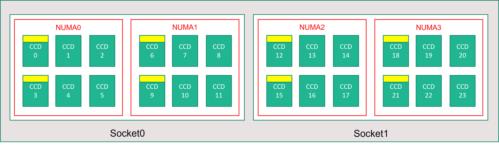
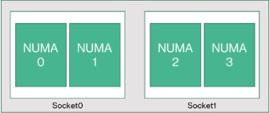
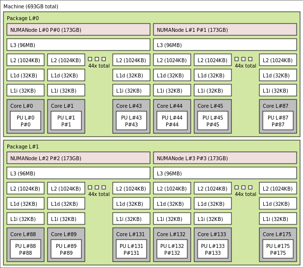
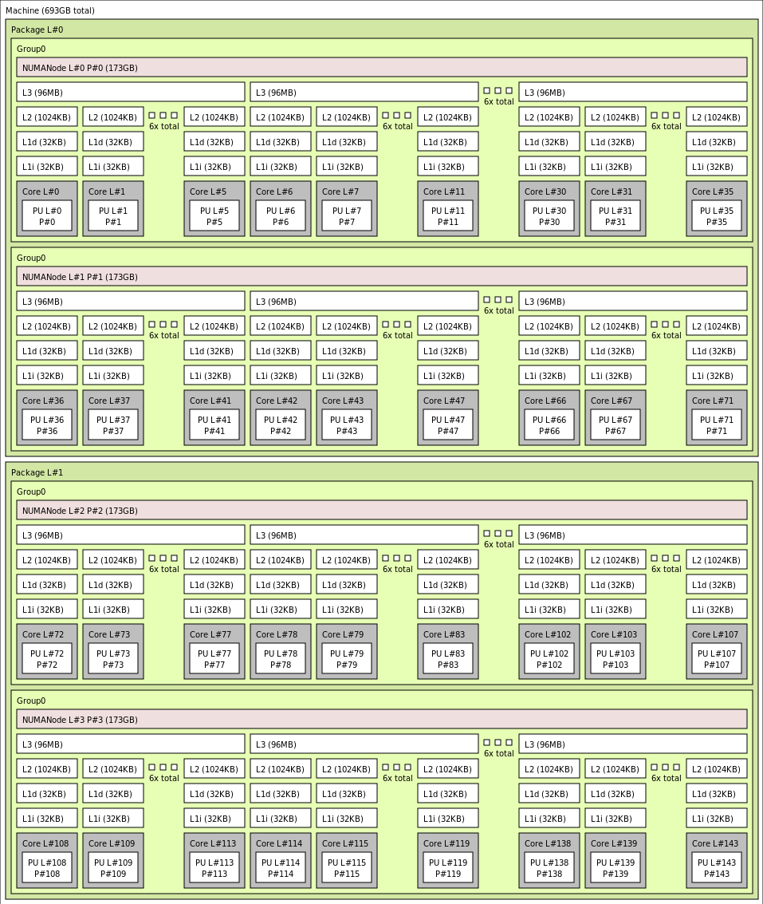
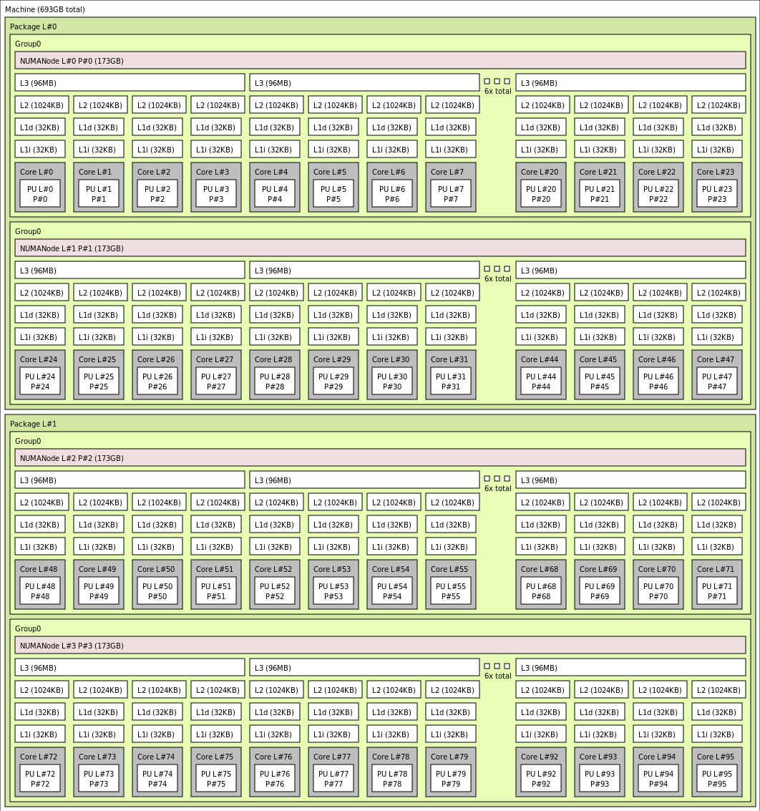
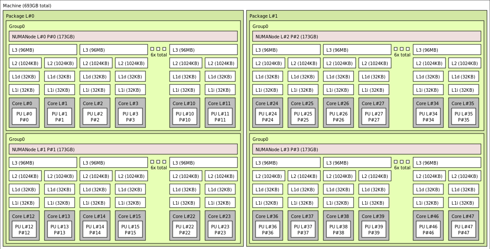
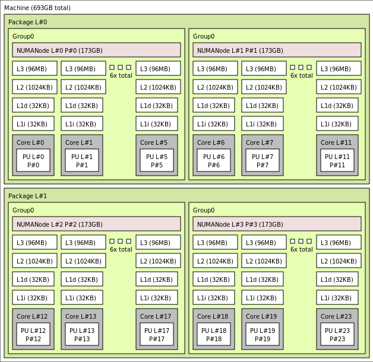

# HBv4-series virtual machine overview 

**Applies to:** :heavy_check_mark: Linux VMs :heavy_check_mark: Windows VMs :heavy_check_mark: Flexible scale sets :heavy_check_mark: Uniform scale sets

An [HBv4-series](hbv4-series.md) server features 2 * 96-core EPYC 9V33X CPUs for a total of 192 physical "Zen4" cores with AMD 3D-V Cache. Simultaneous Multithreading (SMT) is disabled on HBv4. These 192 cores are divided into 24 sections (12 per socket), each section containing 8 processor cores with uniform access to a 96 MB L3 cache. Azure HBv4 servers also run the following AMD BIOS settings: 

```bash
Nodes per Socket (NPS) = 2
L3 as NUMA = Disabled
NUMA domains within VM OS = 4
C-states = Enabled
```

As a result, the server boots with 4 NUMA domains (2 per socket) each 48-cores in size. Each NUMA has direct access to 6 channels of physical DRAM. 

To provide room for the Azure hypervisor to operate without interfering with the VM, we reserve 16 physical cores per server. 

## VM topology

The following diagram shows the topology of the server. We reserve these 16 hypervisor host cores (yellow) symmetrically across both CPU sockets, taking the first 2 cores from specific Core Complex Dies (CCDs) in each NUMA domain, with the remaining cores for the HBv4-series VM (green).



The CCD boundary is different from a NUMA boundary. On HBv4, a group of six (6) consecutive CCDs is configured as a NUMA domain, both at the host server level and within a guest VM. Thus, all HBv4 VM sizes expose 4 uniform NUMA domains that appear to an OS and application as shown below, each with different number of cores depending on the specific [HBv4 VM size](hbv4-series.md).



Each HBv4 VM size is similar in physical layout, features, and performance of a different CPU from the AMD EPYC 9V33X, as follows:

| HBv4-series VM size             | NUMA domains | Cores per NUMA domain  | Similarity with AMD EPYC         |
|---------------------------------|--------------|------------------------|----------------------------------|
Standard_HB176rs_v4               | 4            | 44                     | Dual-socket EPYC 9V33X           |
Standard_HB176-144rs_v4           | 4            | 36                     | Dual-socket EPYC 9V33X           |
Standard_HB176-96rs_v4            | 4            | 24                     | Dual-socket EPYC 9V33X           |
Standard_HB176-48rs_v4            | 4            | 12                     | Dual-socket EPYC 9V33X           |
Standard_HB176-24rs_v4            | 4            | 6                      | Dual-socket EPYC 9V33X           |

> [!NOTE]
> The constrained cores VM sizes only reduce the number of physical cores exposed to the VM. All global shared assets (RAM, memory bandwidth, L3 cache, GMI and xGMI connectivity, InfiniBand, Azure Ethernet network, local SSD) stay constant. This allows a customer to pick a VM size best tailored to a given set of workload or software licensing needs.

The virtual NUMA mapping of each HBv4 VM size is mapped to the underlying physical NUMA topology. There is no potential misleading abstraction of the hardware topology. 

The exact topology for the various [HBv4 VM size](hbv4-series.md) appears as follows using the output of [lstopo](https://linux.die.net/man/1/lstopo):

```bash
lstopo-no-graphics --no-io --no-legend --of txt
```
<br>
<details>
<summary>Click to view lstopo output for Standard_HB176rs_v4</summary>


</details>

<details>
<summary>Click to view lstopo output for Standard_HB176-144rs_v4</summary>


</details>

<details>
<summary>Click to view lstopo output for Standard_HB176-96rs_v4</summary>


</details>

<details>
<summary>Click to view lstopo output for Standard_HB176-48rs_v4</summary>


</details>

<details>
<summary>Click to view lstopo output for Standard_HB176-24rs_v4</summary>


</details>

## InfiniBand networking
HBv4 VMs also feature NVIDIA Mellanox NDR InfiniBand network adapters (ConnectX-7) operating at up to 400 Gigabits/sec. The NIC is passed through to the VM via SRIOV, enabling network traffic to bypass the hypervisor. As a result, customers load standard Mellanox OFED drivers on HBv4 VMs as they would a bare metal environment.

HBv4 VMs support Adaptive Routing, Dynamic Connected Transport (DCT, in addition to the standard RC and UD transports), and hardware-based offload of MPI collectives to the onboard processor of the ConnectX-7 adapter. These features enhance application performance, scalability, and consistency, and usage of them is recommended.

## Temporary storage
HBv4 VMs feature 3 physically local SSD devices. One device is preformatted to serve as a page file and it appeared within your VM as a generic "SSD" device.

Two other, larger SSDs are provided as unformatted block NVMe devices via NVMeDirect. As the block NVMe device bypasses the hypervisor, it has higher bandwidth, higher IOPS, and lower latency per IOP.

When paired in a striped array, the NVMe SSD provides up to 12 GB/s reads and 7 GB/s writes, and up to 186,000 IOPS (reads) and 201,000 IOPS (writes) for deep queue depths.

## Hardware specifications 

| Hardware specifications          | HBv4-series VMs              |
|----------------------------------|----------------------------------|
| Cores                            | 176, 144, 96, 48, or 24 (SMT disabled)           | 
| CPU                              | AMD EPYC 9V33X                   | 
| CPU Frequency (non-AVX)          | 2.4 GHz base, 3.7 GHz peak boost    | 
| Memory                           | 768 GB (RAM per core depends on VM size)         | 
| Local Disk                       | 2 * 1.8 TB NVMe (block), 480 GB SSD (page file) | 
| InfiniBand                       | 400 Gb/s Mellanox ConnectX-7 NDR InfiniBand | 
| Network                          | 80 Gb/s Ethernet (40 Gb/s usable) Azure second Gen SmartNIC | 

## Software specifications 

| Software specifications        | HBv4-series VMs                                            | 
|--------------------------------|-----------------------------------------------------------|
| Max MPI Job Size               | 52,800 cores (300 VMs in a single virtual machine scale set with singlePlacementGroup=true)  |
| MPI Support                    | HPC-X (2.13 or higher), Intel MPI (2021.7.0 or higher), OpenMPI (4.1.3 or higher), MVAPICH2 (2.3.7 or higher), MPICH (4.1 or higher)  |
| Additional Frameworks          | UCX, libfabric, PGAS, or other InfiniBand based runtimes                  |
| Azure Storage Support          | Standard and Premium Disks (maximum 32 disks), Azure NetApp Files, Azure Files, Azure HPC Cache, Azure Managed Lustre File System             |
| Supported and Validated OS     | AlmaLinux 8.6, 8.7, Ubuntu 20.04+            |
| Recommended OS for Performance | AlmaLinux HPC 8.7, Ubuntu-HPC 20.04+    |
| Orchestrator Support           | Azure CycleCloud, Azure Batch, AKS; [cluster configuration options](sizes-hpc.md#cluster-configuration-options)                      | 

> [!NOTE] 
> * These VMs support only Generation 2.
> * There is no official kernel level support from AMD on CentOS. Support starts at RHEL 8.6 and a derivative of RHEL which is AlmaLinux 8.6.
> * Windows Server 2012 R2 is not supported on HBv4 and other VMs with more than 64 (virtual or physical) cores. For more information, see [Supported Windows guest operating systems for Hyper-V on Windows Server](/windows-server/virtualization/hyper-v/supported-windows-guest-operating-systems-for-hyper-v-on-windows). Windows Server 2022 is required for 144 and 176 core sizes, Windows Server 2016 also works for 24, 48, and 96 core sizes, Windows Server works for only 24 and 48 core sizes.  

> [!IMPORTANT] 
> Recommended image URN: almalinux:almalinux-hpc:8_7-hpc-gen2:8.7.2023060101, To deploy this image over Azure CLI, ensure the following parameters are included **--plan 8_7-hpc-gen2 --product almalinux-hpc --publisher almalinux**. For scaling tests please use the recommended URN along with the new [HPC-X tarball](https://github.com/Azure/azhpc-images/blob/c8db6de3328a691812e58ff56acb5c0661c4d488/alma/alma-8.x/alma-8.6-hpc/install_mpis.sh#L16).

> [!NOTE]
> * NDR support is added in UCX 1.13 or later. Older UCX versions will report the above runtime error. UCX Error: Invalid active speed `[1677010492.951559] [updsb-vm-0:2754 :0]       ib_iface.c:1549 UCX ERROR Invalid active_speed on mlx5_ib0:1: 128`.
> * Ibstat shows low speed (SDR): Older Mellanox OFED (MOFED) versions do not support NDR and it may report slower IB speeds. Please use MOFED versions MOFED 5.6-1.0.3.3 or above.

## Next steps

- Read about the latest announcements, HPC workload examples, and performance results at the [Azure Compute Tech Community Blogs](https://techcommunity.microsoft.com/t5/azure-compute/bg-p/AzureCompute).
- For a higher level architectural view of running HPC workloads, see [High Performance Computing (HPC) on Azure](/azure/architecture/topics/high-performance-computing/).


