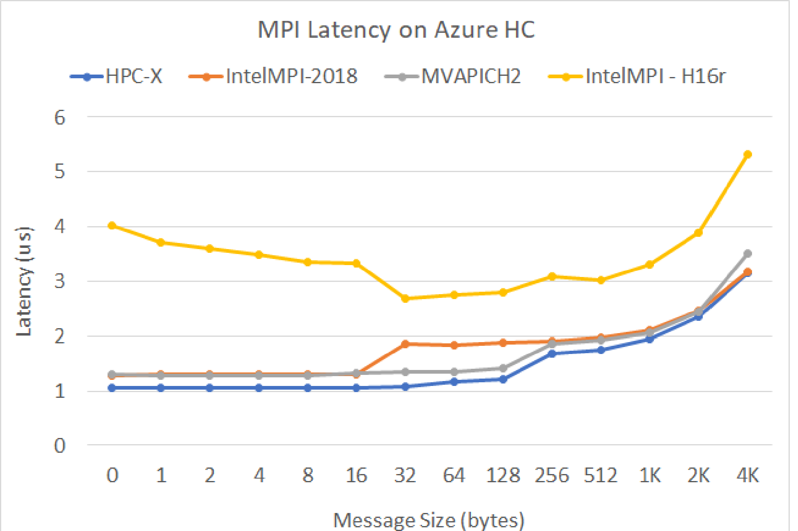
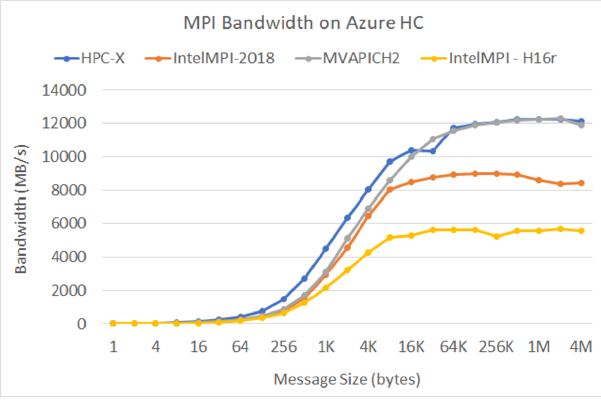

# HC-series virtual machine sizes

**Applies to:** :heavy_check_mark: Linux VMs :heavy_check_mark: Windows VMs :heavy_check_mark: Flexible scale sets :heavy_check_mark: Uniform scale sets

Several performance tests have been run on HC-series sizes. The following are some of the results of this performance testing.

| Workload                                        | HB                    |
|-------------------------------------------------|-----------------------|
| STREAM Triad                                    | 190 GB/s (Intel MLC AVX-512)  |
| High-Performance Linpack (HPL)                  | 3520 GigaFLOPS (Rpeak), 2970 GigaFLOPS (Rmax) |
| RDMA latency & bandwidth                        | 1.05 microseconds, 96.8 Gb/s   |
| FIO on local NVMe SSD                           | 1.3 GB/s reads, 900 MB/s writes |  
| IOR on 4 Azure Premium SSD (P30 Managed Disks, RAID0)**  | 780 MB/s reads, 780 MB/writes |

## MPI latency

MPI latency test from the OSU microbenchmark suite is run. Sample scripts are on [GitHub](https://github.com/Azure/azhpc-images/blob/04ddb645314a6b2b02e9edb1ea52f079241f1297/tests/run-tests.sh)

```bash
./bin/mpirun_rsh -np 2 -hostfile ~/hostfile MV2_CPU_MAPPING=[INSERT CORE #] ./osu_latency 
```



## MPI bandwidth

MPI bandwidth test from the OSU microbenchmark suite is run. Sample scripts are on [GitHub](https://github.com/Azure/azhpc-images/blob/04ddb645314a6b2b02e9edb1ea52f079241f1297/tests/run-tests.sh)

```bash
./mvapich2-2.3.install/bin/mpirun_rsh -np 2 -hostfile ~/hostfile MV2_CPU_MAPPING=[INSERT CORE #] ./mvapich2-2.3/osu_benchmarks/mpi/pt2pt/osu_bw
```




## Mellanox Perftest

The [Mellanox Perftest package](https://community.mellanox.com/s/article/perftest-package) has many InfiniBand tests such as latency (ib_send_lat) and bandwidth (ib_send_bw). An example command is below.

```console
numactl --physcpubind=[INSERT CORE #]  ib_send_lat -a
```

## Next steps

- Read about the latest announcements, HPC workload examples, and performance results at the [Azure Compute Tech Community Blogs](https://techcommunity.microsoft.com/t5/azure-compute/bg-p/AzureCompute).
- For a higher-level architectural view of running HPC workloads, see [High Performance Computing (HPC) on Azure](/azure/architecture/topics/high-performance-computing/).
