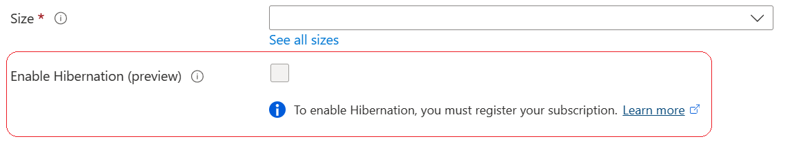

# Troubleshooting VM hibernation

> [!IMPORTANT]
> Azure Virtual Machines - Hibernation is currently in PREVIEW.
> See the [Supplemental Terms of Use for Microsoft Azure Previews](https://azure.microsoft.com/support/legal/preview-supplemental-terms/) for legal terms that apply to Azure features that are in beta, preview, or otherwise not yet released into general availability.

Hibernating a virtual machine allows you to persist the VM state to the OS disk. This article describes how to troubleshoot issues with the hibernation feature, issues creating hibernation enabled VMs, and issues with hibernating a VM.

## Subscription not registered to use hibernation
If you receive the error "Your subscription isn't registered to use Hibernate" and the box is greyed out in the Azure portal, make sure you have [register for the Hibernation preview.](hibernate-resume.md)




## Unable to create a VM with hibernation enabled
If you're unable to create a VM with hibernation enabled, ensure that you're using a VM size, OS version that supports Hibernation. Refer to the supported VM sizes, OS versions section in the user guide and the limitations section for more details. Here are some common error codes that you might observe:

| ResultCode | Error Message | Action |
|--|--|--|
| OperationNotAllowed | The referenced os disk should support hibernation for a VM with hibernation capability. | Validate that the OS disk has hibernation support enabled. |
| OperationNotAllowed | The referenced platform image should support hibernation for a VM with hibernation capability. | Use a platform image that supports hibernation. |
| OperationNotAllowed | The referenced shared gallery image should support hibernation for a VM with hibernation capability. | Validate that the Shared Gallery Image Definition has hibernation support enabled |
| OperationNotAllowed | Hibernation capability isn't supported for Spot VMs. |  |
| OperationNotAllowed | User VM Image isn't supported for a VM with Hibernation capability. | Use a platform image or Shared Gallery Image if you want to use the hibernation feature |
| OperationNotAllowed | Referencing a Dedicated Host isn't supported for a VM with Hibernation capability. |  |
| OperationNotAllowed | Referencing a Capacity Reservation Group isn't supported for a VM with Hibernation capability. |  |
| OperationNotAllowed | Hibernation can't be enabled on Virtual Machine since the OS Disk Size ({0} bytes) should at least be greater than the VM memory ({1} bytes). | Ensure the OS disk has enough space to be able to persist the RAM contents once the VM is hibernated |
| OperationNotAllowed | Hibernation can't be enabled on Virtual Machines created in an Availability Set. | Hibernation is only supported for standalone VMs & Virtual Machine Scale Sets Flex VMs |


## Unable to hibernate a VM

If you're unable to hibernate a VM, first check whether hibernation is enabled on the VM. For example, using the GET VM API, you can check if hibernation is enabled on the VM

```
    "properties": {
        "vmId": "XXX",
        "hardwareProfile": {
            "vmSize": "Standard_D4s_v5"
        },
        "additionalCapabilities": {
            "hibernationEnabled": true
        },
```
If hibernation is enabled on the VM, check if hibernation is successfully enabled in the guest OS. 

### [Linux](#tab/troubleshootLinuxCantHiber)

On Linux, you can check the extension status if you used the extension to enable hibernation in the guest OS.

:::image type="content" source="./media/hibernate-resume/provisioning-success-linux.png" alt-text="Screenshot of the status and status message reporting that provisioning has succeeded for a Linux VM.":::

### [Windows](#tab/troubleshootWindowsCantHiber)

On Windows, you can check the status of the Hibernation extension to see if the extension was able to successfully configure the guest OS for hibernation.

:::image type="content" source="./media/hibernate-resume/provisioning-success-windows.png" alt-text="Screenshot of the status and status message reporting that provisioning has succeeded for a Windows VM.":::

The VM instance view would have the final output of the extension:
```
"extensions": [
    {
      "name": "AzureHibernateExtension",
      "type": "Microsoft.CPlat.Core.WindowsHibernateExtension",
      "typeHandlerVersion": "1.0.2",
      "statuses": [
        {
          "code": "ProvisioningState/succeeded",
          "level": "Info",
          "displayStatus": "Provisioning succeeded",
          "message": "Enabling hibernate succeeded. Response from the powercfg command: \tThe hiberfile size has been set to: 17178693632 bytes.\r\n"
        }
      ]
    },
```

Additionally, confirm that hibernate is enabled as a sleep state inside the guest. The expected output for the guest should look like this.

```
C:\Users\vmadmin>powercfg /a
    The following sleep states are available on this system:
        Hibernate
        Fast Startup

    The following sleep states are not available on this system:
        Standby (S1)
            The system firmware does not support this standby state.

        Standby (S2)
            The system firmware does not support this standby state.

        Standby (S3)
            The system firmware does not support this standby state.

        Standby (S0 Low Power Idle)
            The system firmware does not support this standby state.

        Hybrid Sleep
            Standby (S3) isn't available.


```
If 'Hibernate' isn't listed as a supported sleep state, there should be a reason associated with it, which should help determine why hibernate isn't supported. This occurs if guest hibernate hasn't been configured for the VM.

```
C:\Users\vmadmin>powercfg /a
    The following sleep states are not available on this system:
        Standby (S1)
            The system firmware does not support this standby state.

        Standby (S2)
            The system firmware does not support this standby state.

        Standby (S3)
            The system firmware does not support this standby state.

        Hibernate
            Hibernation hasn't been enabled.

        Standby (S0 Low Power Idle)
            The system firmware does not support this standby state.

        Hybrid Sleep
        Standby (S3) is not available.
            Hibernation is not available.

        Fast Startup
            Hibernation is not available.

```

If the extension or the guest sleep state reports an error, you'd need to update the guest configurations as per the error descriptions to resolve the issue. After fixing all the issues, you can validate that hibernation has been enabled successfully inside the guest by running  the 'powercfg /a' command - which should return Hibernate as one of the sleep states.
Also validate that the AzureHibernateExtension returns to a Succeeded state. If the extension is still in a failed state, then update the extension state by triggering [reapply VM API](/rest/api/compute/virtual-machines/reapply?tabs=HTTP)

>[!NOTE]
>If the extension remains in a failed state, you can't hibernate the VM

Commonly seen issues where the extension fails

| Issue | Action |
|--|--|
| Page file is in temp disk. Move it to OS disk to enable hibernation. | Move page file to the C: drive and trigger reapply on the VM to rerun the extension |
| Windows failed to configure hibernation due to insufficient space for the hiberfile | Ensure that C: drive has sufficient space. You can try expanding your OS disk, your C: partition size to overcome this issue. Once you have sufficient space, trigger the Reapply operation so that the extension can retry enabling hibernation in the guest and succeeds. |
| Extension error message: “A device attached to the system isn't functioning” | Ensure that C: drive has sufficient space. You can try expanding your OS disk, your C: partition size to overcome this issue. Once you have sufficient space, trigger the Reapply operation so that the extension can retry enabling hibernation in the guest and succeeds. |
| Hibernation is no longer supported after Virtualization Based Security (VBS) was enabled inside the guest | Enable Virtualization in the guest to get VBS capabilities along with the ability to hibernate the guest. [Enable virtualization in the guest OS.](/virtualization/hyper-v-on-windows/quick-start/enable-hyper-v#enable-hyper-v-using-powershell) |
| Enabling hibernate failed. Response from the powercfg command. Exit Code: 1. Error message: Hibernation failed with the following error: The request isn't supported. The following items are preventing hibernation on this system. The current Device Guard configuration disables hibernation. An internal system component disabled hibernation. Hypervisor | Enable Virtualization in the guest to get VBS capabilities along with the ability to hibernate the guest. To enable virtualization in the guest, refer to [this document](/virtualization/hyper-v-on-windows/quick-start/enable-hyper-v#enable-hyper-v-using-powershell) |

---

## Guest VMs unable to hibernate

### [Windows](#tab/troubleshootWindowsGuestCantHiber)
If a hibernate operation succeeds, the following events are seen in the guest: 
```
Guest responds to the hibernate operation (note that the following event is logged on the guest on resume)

    Log Name:      System
    Source:        Kernel-Power
    Event ID:      42
    Level:         Information
    Description:
    The system is entering sleep

```

If the guest fails to hibernate, then all or some of these events are missing.
Commonly seen issues: 

| Issue | Action |
|--|--|
| Guest fails to hibernate because Hyper-V Guest Shutdown Service is disabled. | [Ensure that Hyper-V Guest Shutdown Service isn't disabled.](/virtualization/hyper-v-on-windows/reference/integration-services#hyper-v-guest-shutdown-service) Enabling this service should resolve the issue. |
| Guest fails to hibernate because HVCI (Memory integrity) is enabled. | If Memory Integrity is enabled in the guest and you are trying to hibernate the VM, then ensure your guest is running the minimum OS build required to support hibernation with Memory Integrity. <br /> <br /> Win 11 22H2 – Minimum OS Build - 22621.2134 <br /> Win 11 21H1 - Minimum OS Build - 22000.2295 <br /> Win 10 22H2 - Minimum OS Build - 19045.3324 |

Logs needed for troubleshooting:

If you encounter an issue outside of these known scenarios, the following logs can help Azure troubleshoot the issue: 
1. Event logs on the guest: Microsoft-Windows-Kernel-Power, Microsoft-Windows-Kernel-General, Microsoft-Windows-Kernel-Boot.
1. On bug check, a guest crash dump is helpful.


### [Linux](#tab/troubleshootLinuxGuestCantHiber)
on Linux, you can check the extension status if you used the extension to enable hibernation in the guest OS.

:::image type="content" source="./media/hibernate-resume/provisioning-success-linux.png" alt-text="Screenshot of the status and status message reporting that provisioning has succeeded on a Linux VM.":::

If you used the hibernation-setup-tool to configure the guest for hibernation, you can check if the tool executed successfully through this command:

```
systemctl status hibernation-setup-tool 
```

A successful status should return "Inactive (dead)”, and the log messages should say "Swap file for VM hibernation set up successfully"

Example:
```
azureuser@:~$ systemctl status hibernation-setup-tool
● hibernation-setup-tool.service - Hibernation Setup Tool
   Loaded: loaded (/lib/systemd/system/hibernation-setup-tool.service; enabled; vendor preset: enabled)
   Active: inactive (dead) since Wed 2021-08-25 22:44:29 UTC; 17min ago
  Process: 1131 ExecStart=/usr/sbin/hibernation-setup-tool (code=exited, status=0/SUCCESS)
 Main PID: 1131 (code=exited, status=0/SUCCESS)

linuxhib2 hibernation-setup-tool[1131]: INFO: update-grub2 finished successfully.
linuxhib2 hibernation-setup-tool[1131]: INFO: udev rule to hibernate with systemd set up in /etc/udev/rules.d/99-vm-hibernation.rules.  Telling udev about it.
…
…
linuxhib2 hibernation-setup-tool[1131]: INFO: systemctl finished successfully.
linuxhib2 hibernation-setup-tool[1131]: INFO: Swap file for VM hibernation set up successfully

```
If the guest OS isn't configured for hibernation, take the appropriate action to resolve the issue. For example, if the guest failed to configure hibernation due to insufficient space, resize the OS disk to resolve the issue.    

---

## Common error codes
| ResultCode | errorDetails | Action |
|--|--|--|
| InternalOperationError | The fabric operation failed. | This is usually a transient issue. Retry the Hibernate operation after 5mins. |
| OperationNotAllowed | Operation 'HibernateAndDeallocate' isn't allowed on VM 'Z0000ZYH000' since VM has extension 'AzureHibernateExtension' in failed state | Customer issue. Confirm that VM creation with hibernation enabled  succeeded, and that the extension is in a healthy state |
| OperationNotAllowed | The Hibernate-Deallocate Operation can only be triggered on a VM that is successfully provisioned and is running. | Customer error. Ensure that the VM is successfully running before attempting to Hibernate-Deallocate the VM. |
| OperationNotAllowed | The Hibernate-Deallocate Operation can only be triggered on a VM that is enabled for hibernation. Enable the property additionalCapabilities.hibernationEnabled during VM creation, or after stopping and deallocating the VM. | Customer error. |
| VMHibernateFailed | Hibernating the VM 'hiber_vm_res_5' failed due to an internal error. Retry later. | Retry after 5mins. If it continues to fail after multiple retries, check if the guest is correctly configured to support hibernation or contact Azure support. |
| VMHibernateNotSupported | The VM 'Z0000ZYJ000' doesn't support hibernation. Ensure that the VM is correctly configured to support hibernation. | Hibernating a VM immediately after boot isn't supported. Retry hibernating the VM after a few minutes. |

## Azure extensions disabled on Debian images
Azure extensions are currently disabled by default for Debian images (more details here: https://lists.debian.org/debian-cloud/2023/07/msg00037.html). If you wish to enable hibernation for Debian based VMs through the LinuxHibernationExtension, then you can re-enable support for VM extensions via cloud-init custom data:

```bash
#!/bin/sh
sed -i -e 's/^Extensions\.Enabled =.* $/Extensions.Enabled=y/" /etc/waagent.conf
```

:::image type="content" source="./media/hibernate-resume/debian-image-enable-extensions-via-cloud-init.png" alt-text="Screenshot of the cloud init input field for new Linux VMs.":::

Alternatively, you can enable hibernation on the guest by [installing the hibernation-setup-tool](hibernate-resume.md#option-2-hibernation-setup-tool).

## Unable to resume a VM
Starting a hibernated VM is similar to starting a stopped VM. For errors and troubleshooting steps related to starting a VM, refer to this guide

In addition to commonly seen issues while starting VMs, certain issues are specific to starting a hibernated VM. These are described below- 

| ResultCode | errorDetails |
|--|--|--|
| OverconstrainedResumeFromHibernatedStateAllocationRequest | Allocation failed. VM(s) with the following constraints can't be allocated, because the condition is too restrictive. Remove some constraints and try again. Constraints applied are: Networking Constraints (such as Accelerated Networking or IPv6), Resuming from hibernated state (retry starting the VM after some time or alternatively stop-deallocate the VM and try starting the VM again). |
| AllocationFailed | VM allocation failed from hibernated state due to insufficient capacity. Try again later or alternatively stop-deallocate the VM and try starting the VM. |

## Windows guest resume status through VM instance view
For Windows VMs, when you start a VM from a hibernated state, you can use the VM instance view to get more details on whether the guest successfully resumed from its previous hibernated state or if it failed to resume and instead did a cold boot. 

VM instance view output when the guest successfully resumes: 
```
{
  "computerName": "myVM",
  "osName": "Windows 11 Enterprise",
  "osVersion": "10.0.22000.1817",
  "vmAgent": {
    "vmAgentVersion": "2.7.41491.1083",
    "statuses": [
      {
        "code": "ProvisioningState/succeeded",
        "level": "Info",
        "displayStatus": "Ready",
        "message": "GuestAgent is running and processing the extensions.",
        "time": "2023-04-25T04:41:17.296+00:00"
      }
    ],
    "extensionHandlers": [
      {
        "type": "Microsoft.CPlat.Core.RunCommandWindows",
        "typeHandlerVersion": "1.1.15",
        "status": {
          "code": "ProvisioningState/succeeded",
          "level": "Info",
          "displayStatus": "Ready"
        }
      },
      {
        "type": "Microsoft.CPlat.Core.WindowsHibernateExtension",
        "typeHandlerVersion": "1.0.3",
        "status": {
          "code": "ProvisioningState/succeeded",
          "level": "Info",
          "displayStatus": "Ready"
        }
      }
    ]
  },  
  "extensions": [
    {
      "name": "AzureHibernateExtension",
      "type": "Microsoft.CPlat.Core.WindowsHibernateExtension",
      "typeHandlerVersion": "1.0.3",
      "substatuses": [
        {
          "code": "ComponentStatus/VMBootState/Resume/succeeded",
          "level": "Info",
          "displayStatus": "Provisioning succeeded",
          "message": "Last guest resume was successful."
        }
      ],
      "statuses": [
        {
          "code": "ProvisioningState/succeeded",
          "level": "Info",
          "displayStatus": "Provisioning succeeded",
          "message": "Enabling hibernate succeeded. Response from the powercfg command: \tThe hiberfile size has been set to: XX bytes.\r\n"
        }
      ]
    }
  ],
  "statuses": [
    {
      "code": "ProvisioningState/succeeded",
      "level": "Info",
      "displayStatus": "Provisioning succeeded",
      "time": "2023-04-25T04:41:17.8996086+00:00"
    },
    {
      "code": "PowerState/running",
      "level": "Info",
      "displayStatus": "VM running"
    }
  ]
}


```
If the Windows guest fails to resume from its previous state and cold boots, then the VM instance view response is:
```
  "extensions": [
    {
      "name": "AzureHibernateExtension",
      "type": "Microsoft.CPlat.Core.WindowsHibernateExtension",
      "typeHandlerVersion": "1.0.3",
      "substatuses": [
        {
          "code": "ComponentStatus/VMBootState/Start/succeeded",
          "level": "Info",
          "displayStatus": "Provisioning succeeded",
          "message": "VM booted."
        }
      ],
      "statuses": [
        {
          "code": "ProvisioningState/succeeded",
          "level": "Info",
          "displayStatus": "Provisioning succeeded",
          "message": "Enabling hibernate succeeded. Response from the powercfg command: \tThe hiberfile size has been set to: XX bytes.\r\n"
        }
      ]
    }
  ],
  "statuses": [
    {
      "code": "ProvisioningState/succeeded",
      "level": "Info",
      "displayStatus": "Provisioning succeeded",
      "time": "2023-04-19T17:18:18.7774088+00:00"
    },
    {
      "code": "PowerState/running",
      "level": "Info",
      "displayStatus": "VM running"
    }
  ]
}

```

## Windows guest events while resuming
If a guest successfully resumes, the following guest events are available: 
```
Log Name:      System
    Source:        Kernel-Power
    Event ID:      107
    Level:         Information
    Description:
    The system has resumed from sleep. 

```
If the guest fails to resume, all or some of these events are missing. To troubleshoot why the guest failed to resume, the following logs are needed: 
- Event logs on the guest: Microsoft-Windows-Kernel-Power, Microsoft-Windows-Kernel-General, Microsoft-Windows-Kernel-Boot.
- On bugcheck, a guest crash dump is needed.
